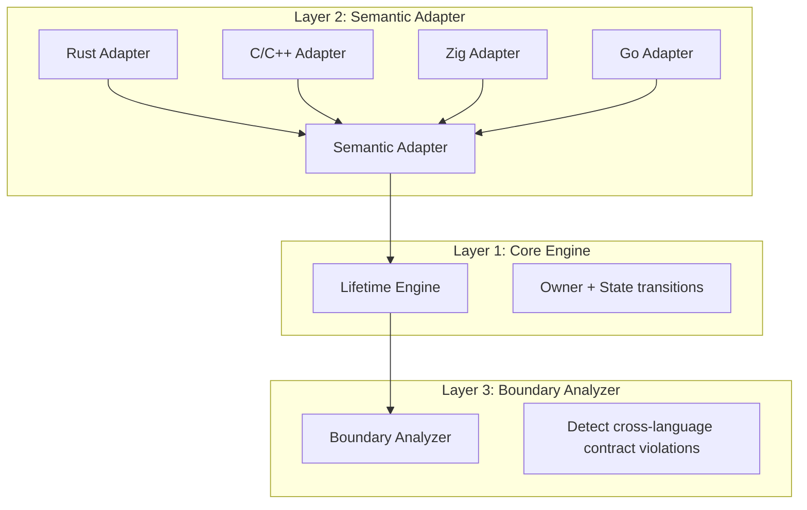
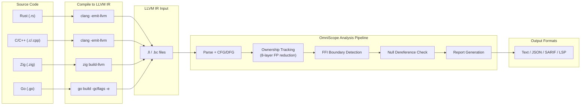

# OmniScope

**Cross-Language FFI & Memory Safety Static Analyzer for C/C++**

OmniScope analyzes LLVM IR to detect memory safety issues, FFI boundary violations, and ownership contract breaches across C/C++/Rust/Zig/Go.

## Quick Start

```bash
# Build
zig build

# Analyze an LLVM IR file
./zig-out/bin/OmniScope target.ll

# Output formats: text (default), json, sarif
./zig-out/bin/OmniScope target.ll --format json --output report.json
```

### Requirements

| Tool | Version | Install |
|------|---------|---------|
| Zig | 0.15.2+ | [zvm](https://www.zvm.app) |
| LLVM | 18+ (21 recommended) | `brew install llvm@21` / apt |

### Make Targets

```bash
make build          # Compile
make test-all       # Run all tests (unit + integration + regression + stress)
make benchmark      # Corpus detection rate metrics
make baseline-check # Real-world project regression guard
```

## Architecture

### System Overview (3-Layer Design)



**Core insight**: Despite language differences, all FFI operations reduce to a small set of actions:

| Action | Meaning |
|--------|---------|
| `alloc` | Allocate resource |
| `free` | Release resource |
| `borrow` | Temporary borrow |
| `transfer` | Ownership transfer |
| `retain` | Increment refcount |
| `release` | Decrement refcount |
| `escape` | Escape to unknown scope |

### Data Flow



### 8-Layer C++ FP Reduction System

| Layer | Technique | Target |
|-------|-----------|--------|
| L1 | STL Internal Function Filter | `_ZNSt*` template expansions |
| L2 | C++ Special Member Function Filter | ctor/dtor/copy/move-assign |
| L3 | RAII Smart Pointer Detection | `unique_ptr::C1` / `shared_ptr::C1` |
| L4 | RAII Function Set | Skip entire functions with smart ptrs |
| L5 | C++ ABI Runtime Filter | `__cxa_*` exception/guard/atexit |
| L6 | Meyers Singleton Detection | `__cxa_guard_acquire` pattern |
| L7 | C++ Operator FFI Filter | `_Znwm`/`_ZdlPv` skip in FFI reporting |
| **L8** | **RC Container Detection** | `Ref()`/`Unref()`/CordRep patterns |

## Real-World Validation (v0.1.4)

> **5 production projects, 5,180 functions analyzed, zero regressions.**

| Project | Language | Functions | Issues | Leaks | Time |
|---------|----------|-----------|--------|-------|------|
| [SQLite 3.47.2](corpus/real_world/BASELINE.md#project-sqlite-3472-amalgamation) | C | 3,237 | **8** | **0** | 5.8s |
| [libcurl 8.14.0](corpus/real_world/BASELINE.md#project-libcurl-8140) | C | 68 | **1** | **0** | 0.05s |
| [libuv 1.50.0](corpus/real_world/BASELINE.md#project-libuv-1500) | C | 145 | **1** | **0** | 0.07s |
| [jsoncpp 1.9.5](corpus/real_world/BASELINE.md#project-jsoncpp-195) | C++ | 1,537 | **3** | **0** | 1.4s |
| [abseil-cpp 2024](corpus/real_world/BASELINE.md#project--5-abseil-cpp-202407220) | C++ | 193 | **0** | **0** | 0.37s |
| [ripgrep 14.1.1](corpus/real_world/BASELINE.md#project-6-ripgrep-1411-rust) | **Rust** | 75 | **0** ✅ | **0** ✅ | 0.04s |

**Key results**: jsoncpp 40→3 issues (-92.5%), leaks 37→0 (-100%). abseil-cpp Cord RC leaks 9→0 (-100%). ripgrep (Rust): 0 issues — clean production project.

### Corpus Benchmark

| Metric | Value |
|--------|-------|
| Precision | **82.9%** |
| Recall | **93.2%** |
| F1 Score | **87.7%** |

See full details: [`docs/BENCHMARK.md`](docs/BENCHMARK.md), [`FINAL_EVALUATION_REPORT.md`](corpus/real_world/FINAL_EVALUATION_REPORT.md)

## Detection Capabilities

### Issue Types

| Type | Severity | Example |
|------|----------|---------|
| Memory Leak | MEDIUM | `malloc()` without `free()` |
| Use After Free | HIGH | Dereference after free |
| Double Free | HIGH | Same resource freed twice |
| Null Dereference | MEDIUM | Unchecked nullable allocation |
| Format String | MEDIUM | User-controlled `%s` in printf |
| Command Injection | CRITICAL | `system()` with user input |
| Cross-Language Violation | HIGH | Rust Box freed by C free() |

### Supported Languages & Boundaries

| Boundary | Status | Notes |
|----------|--------|-------|
| C → C | ✅ Stable | Full libc/POSIX registry |
| Rust ↔ C | ✅ **Stable (v0.1.4)** | `into_raw`/`from_raw`, `Box`, `CString` |
| Zig ↔ C | ✅ Stable | `Allocator.alloc` pattern |
| Go → C | ⚠️ Experimental | cgo `C.malloc`/`C.CString` |
| **C++ → C** | **✅ Stable (v0.1.4)** | Itanium ABI, 7-Layer FP reduction |
| Swift → C | 🔜 Planned | `retain`/`release` |

## Project Structure

```
src/
├── pass/analysis/
│   ├── pointer_ownership.zig   # Core: ownership tracking + 8-layer FP reduction
│   └── ffi_boundary.zig       # FFI boundary detection + semantic registry
├── lifetime/                   # Resource state machine (owner + state transitions)
├── registry/                   # 166-function semantic registry (6 layers)
├── pipeline/                   # Pass orchestration (15 analysis passes)
└── output/                     # CLI / JSON / SARIF / LSP formatters
```

## Documentation

| Document | Description |
|----------|-------------|
| [Architecture](docs/architecture.md) | System design & module relationships |
| [Developer Guide](docs/en/developer_guide.zig) | Coding conventions & contribution guide |
| [API Reference](docs/en/api_reference.md) | Public API documentation |
| [User Guide](docs/en/user_guide.md) | Usage tutorial & examples |
| [Benchmark Spec](docs/BENCHMARK.md) | Test methodology & phase-gated targets |
| [Baseline](corpus/real_world/BASELINE.md) | Regression rules for 5 real-world projects |
| [Final Report](corpus/real_world/FINAL_EVALUATION_REPORT.md) | English evaluation (cross-project comparison) |
| [最终测评报告](corpus/real_world/FINAL_EVALUATION_REPORT_ZH.md) | Chinese evaluation |
| [Task Plan](plan/task/tasks.md) | Development roadmap (Priority 1–9) |

## CI/CD

```yaml
# GitHub Actions — upload SARIF to Code Scanning
- uses: softprops/action-gh-release@v2
  with:
    body_path: RELEASE_NOTES.md   # Release notes (clean)
    files: dist/OmniScope-*
```

Releases are automated via [`.github/workflows/release.yml`](.github/workflows/release.yml): build Linux + macOS binaries, read [`RELEASE_NOTES.md`](RELEASE_NOTES.md).

## Limitations

1. Requires LLVM IR input (compile with `clang -emit-llvm`)
2. Debug info recommended for source-level locations (`-g` flag)
3. Indirect calls via function pointers use heuristic resolution
4. Primarily intra-procedural analysis (inter-procedural for ownership transfer)

## License

Apache 2.0
