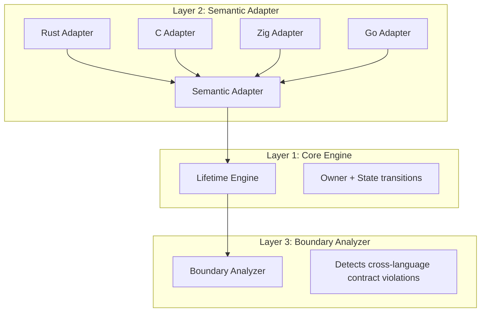
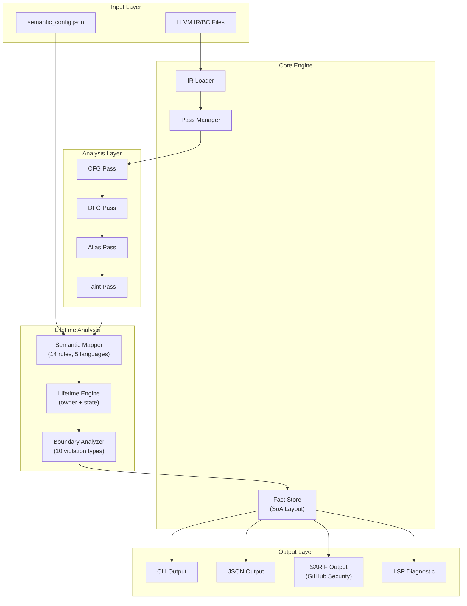
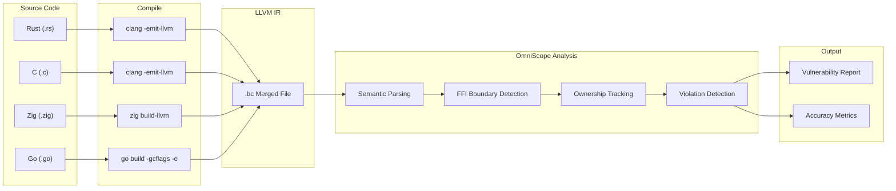
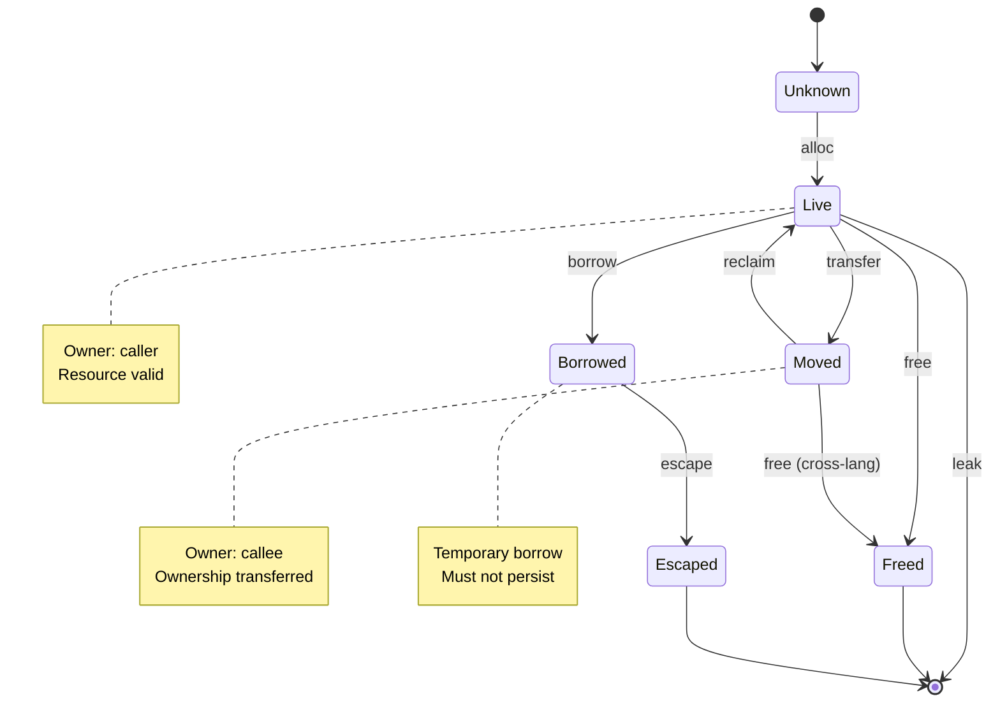

# OmniScope

**Cross-Language FFI Resource Contract Analyzer**

OmniScope is a static analysis framework on LLVM IR, focused on **cross-language FFI boundary** resource security detection.

## Core Positioning

OmniScope is **NOT** a Rust-specific tool, and **NOT** a general-purpose analyzer:

```
Traditional tools: Detect single-language memory safety
OmniScope: Detect cross-language ownership contract violations
```

## Key Innovations

### 1. Three-Layer Architecture: Resource State Machine



**Core Insight**: Although languages differ:

| Action     | Meaning                 |
| ---------- | ----------------------- |
| `alloc`    | Allocate resource       |
| `free`     | Release resource        |
| `borrow`   | Temporary borrow        |
| `transfer` | Ownership transfer      |
| `retain`   | Increment refcount      |
| `release`  | Decrement refcount      |
| `escape`   | Escape to unknown scope |
| `pin`      | Pin memory              |

### 2. Data-Driven Semantic Mapping

**Not if-else hell, but rule-driven.**

```zig
pub const Rule = struct {
    symbol_pattern: []const u8,
    match_type: MatchType,  // exact | contains | suffix
    action: SemanticAction,
    lang_hint: LanguageHint,
};
```

**Rule Examples**:

| Language | Pattern           | Action     |
| -------- | ----------------- | ---------- |
| C        | `malloc`          | `alloc`    |
| C        | `free`            | `free`     |
| Rust     | `into_raw`        | `transfer` |
| Rust     | `from_raw`        | `transfer` |
| Zig      | `Allocator.alloc` | `alloc`    |
| Go       | `C.malloc`        | `alloc`    |

Adding new language support = Adding new rules, no code changes needed.

### 3. Cross-Language Boundary Detection

Violation types OmniScope can detect:

| Violation Type           | Description                          |
| ------------------------ | ------------------------------------ |
| `rust_freed_by_c`        | Rust Box memory freed by C free      |
| `c_freed_by_rust`        | C memory freed by Rust Box           |
| `borrow_escape`          | Borrowed pointer escaped to C        |
| `cross_lang_double_free` | Double free across languages         |
| `zig_freed_by_c`         | Zig allocator memory freed by C free |
| `go_cstring_leak`        | Go cgo CString leak                  |
| `go_pointer_stored_in_c` | Go pointer violates cgo rules        |
| `go_pointer_escape`      | Go pointer escaped to C              |

### 4. Language Detection Strategy

Language detection relies on naming conventions:

| Language | Pattern                                      | Example                      |
| -------- | -------------------------------------------- | ---------------------------- |
| Rust     | `_R` prefix / `alloc::` / `core::` / `std::` | `_RNgAbCd` / `std::Box::new` |
| C++      | `_Z` prefix (Itanium ABI)                    | `_Znam` / `_ZdaPv`           |
| Zig      | `Allocator.` / `allocImpl`                   | `Allocator.alloc`            |
| Go       | `_cgo_` / `C.`                               | `_cgo_abc123` / `C.malloc`   |
| C        | Standard libc functions                      | `malloc`, `free`, `read`     |

## System Architecture



## Data Flow



## Resource State Machine



## Directory Structure

```
src/
├── lifetime/                 # Lifetime analysis core
│   ├── engine.zig           # Layer 1: Resource state machine
│   ├── mapper.zig           # Layer 2: Semantic mapper
│   └── boundary.zig         # Layer 3: Boundary analyzer
│
├── registry/                 # Semantic registry
│   ├── semantic_registry.zig  # Built-in function semantics
│   └── sanitizer_registry.zig # Sanitizer rules
│
├── pass/                     # Pass system
│   ├── foundation/           # Foundation analysis
│   │   ├── cfg.zig          # Control flow graph
│   │   └── dfg.zig          # Data flow graph
│   └── analysis/            # Analysis passes
│       ├── pointer_ownership.zig  # Ownership tracking
│       ├── taint.zig        # Taint analysis
│       └── ffi_*.zig        # FFI-related analysis
│
├── fact/                    # Fact storage (SoA layout)
│   └── store.zig           # Append-only Fact Store
│
├── dataflow/                # Data flow analysis
│   ├── graph.zig           # Data flow graph
│   └── function_summary.zig # Function summaries
│
├── diag/                    # Diagnostic definitions
│   ├── issue.zig           # Issue types
│   └── aggregator.zig      # Diagnostic aggregation
│
├── output/                  # Output formatting
│   ├── cli.zig             # CLI output
│   ├── json.zig            # JSON output
│   ├── sarif.zig           # SARIF output
│   └── lsp.zig             # LSP diagnostics
│
├── ir/                      # LLVM IR wrappers
│   └── llvm_safe.zig       # Safe LLVM API
│
└── pipeline/               # Analysis pipeline
    └── pipeline.zig        # Pass orchestration
```

## Quick Start

### Requirements

- **Zig**: 0.15.2+ (managed via [zvm](https://www.zvm.app))
- **LLVM**: 18+ (21 recommended)

**Environment Setup:**

```bash
# Install zvm and Zig
curl -sSL https://www.zvm.app/install.sh | bash
source ~/.zshrc  # or ~/.bashrc
zvm install 0.15.2
zvm use 0.15.2

# Install LLVM
# macOS:
brew install llvm@21

# Linux (Ubuntu/Debian):
wget -O - https://apt.llvm.org/llvm-snapshot.gpg.key | sudo apt-key add -
sudo add-apt-repository -y "deb http://apt.llvm.org/noble/ llvm-toolchain-noble-21 main"
sudo apt-get update && sudo apt-get install -y llvm-21-dev clang-21 libclang-21-dev

# Ensure tools are in PATH
export PATH="$(which zig):$(which clang):$(which clang++):$(which llvm-link):$PATH"
```

**Required Tools in PATH:**

- `zig` - Zig compiler
- `clang` - C compiler (with LLVM IR emission support)
- `clang++` - C++ compiler
- `llvm-link` - LLVM IR linker

**Platform Notes:**

- **Linux x86\_64 / macOS ARM64**: Pre-built binaries available via CI
- **Windows / macOS x86\_64**: Build from source using the commands below

### Build

```bash
zig build      # Compile
zig build test # Run tests
zig build run  # Run examples
```

### Run Analysis

```bash
# Analyze single .bc file
./zig-out/bin/OmniSope target.bc

# Specify output format
./zig-out/bin/OmniSope target.bc --format sarif --output results.sarif

# Verbose output
./zig-out/bin/OmniSope target.bc --verbose
```

## Detection Capabilities

### Supported Cross-Language Boundaries

| Caller | Callee | Status       | Detection Capability          |
| ------ | ------ | ------------ | ----------------------------- |
| Rust   | C      | Stable       | Box malloc ownership transfer |
| C      | Rust   | Stable       | malloc Box ownership transfer |
| Zig    | C      | Stable       | allocator malloc              |
| Go     | C      | Experimental | cgo pointer rules             |
| C++    | C      | Experimental | new malloc                    |
| Swift  | C      | Planned      | retain/release                |

### Vulnerability Detection Types

| Type                     | Severity | Detection Condition          |
| ------------------------ | -------- | ---------------------------- |
| Command Injection        | CRITICAL | `system()`, `popen()` etc.   |
| Buffer Overflow          | HIGH     | `strcpy()`, `sprintf()` etc. |
| Use After Free           | HIGH     | Use after free               |
| Double Free              | HIGH     | Same resource freed twice    |
| Cross-Lang Free Mismatch | HIGH     | Cross-language free error    |
| Memory Leak              | MEDIUM   | Resource not freed           |
| Borrow Escape            | MEDIUM   | Borrowed pointer escaped     |
| Format String            | MEDIUM   | `printf()` family            |

## Test Results

### Cross-Language Test Cases

| Test Case               | Language Pair       | Description        |
| ----------------------- | ------------------- | ------------------ |
| rust\_ffi\_demo         | Rust to C           | 6 intentional bugs |
| cpp\_cffi               | C++ to C            | 7 intentional bugs |
| cross\_lang\_violations | Multi to C          | 4 violation types  |
| real\_world             | OpenSSL/SQLite/zlib | 42 issues detected |

### Real-World FFI Analysis (2026-04-18)

| Metric             | Value |
| ------------------ | ----- |
| Functions Analyzed | 63    |
| FFI Boundaries     | 19    |
| Dangerous Calls    | 42    |
| Allocations        | 18    |
| Frees              | 18    |
| Tracked Pointers   | 18    |

### Real-World Validation: SQLite 3.47.2 Amalgamation (2026-04-22)

> **Honesty-first policy**: Every finding below was manually verified against SQLite source code.

**Test Target**: `sqlite3.c` — 250K LOC C, compiled to **727K lines LLVM IR**, **3237 functions**

**Analysis Time**: \~4 seconds

#### Detection Summary

| Category             | Raw Count | After Noise Filter | Verified TP  | Verified FP | Notes                                        |
| -------------------- | --------- | ------------------ | ------------ | ----------- | -------------------------------------------- |
| **FFI RISK**         | 285       | **10** (-96.5%)    | \~8          | \~2         | Remaining: `fprintf` + macOS `malloc_zone_*` |
| **MEMORY LEAK**      | 13        | 13                 | **\~3**      | **\~10**    | See detailed breakdown below                 |
| **NULL DEREFERENCE** | 5         | 5                  | **0\~1**     | **\~4**     | Most functions have explicit null guards     |
| **Total**            | **303**   | **28** (-90.8%)    | **\~11\~12** | **\~16**    | <br />                                       |

#### Memory Leak: Detailed Source-Level Verification

| #  | Function                | Verdict        | Evidence from Source Code                                                                                                                     |
| -- | ----------------------- | -------------- | --------------------------------------------------------------------------------------------------------------------------------------------- |
| 1  | `sqlite3_serialize`     | 🔴 **FP**      | API docs L11057-11059: *"The caller is responsible for freeing the returned value"* — classic return-to-caller ownership transfer, NOT a leak |
| 2  | `sqlite3_exec`          | 🔴 **FP**      | L137183 `sqlite3DbFree(db, azCols)` + L137189 cleanup path both present; `pzErrMsg` at L137193 is output-param ownership transfer to caller   |
| 3  | `sqlite3_deserialize`   | 🔴 **FP**      | L53835 `sqlite3_free(zSql)` frees SQL string; `pData` stored in `pStore->aData` (struct-member ownership, freed on DB close)                  |
| 4  | `sqlite3Pragma`         | ⚠️ **Weak FP** | \~1000-line function; internal temp buffers allocated via `sqlite3DbReallocOrFree`. Most cleaned up but some error-path leaks possible        |
| 5  | `pragmaVtabFilter`      | ⚠️ **Weak FP** | Virtual table filter; allocations managed by vtab lifecycle, not function scope                                                               |
| 6  | `fts5IndexPrepareStmt`  | ⚠️ **Weak FP** | L243180 `sqlite3_free(zSql)` frees input; prepared stmt stored in `Fts5Index.pWriter`/`.pDeleter` (freed when index destroyed)                |
| 7  | `fts5StorageGetStmt`    | ⚠️ **Weak FP** | Same struct-stored ownership pattern as above                                                                                                 |
| 8  | `fts5FindRankFunction`  | ⚠️ **Weak FP** | FTS5 internal config lookup; result stored in config object                                                                                   |
| 9  | `fts5StorageCount`      | ⚠️ **Weak FP** | FTS5 storage layer operation; managed by FTS5 lifecycle                                                                                       |
| 10 | `sqlite3Fts5ConfigLoad` | 🔴 **FP**      | L238359 `if(zSql)` null check + L238361 `sqlite3_free(zSql)` + L238376 `sqlite3_finalize(p)` — all cleanups present                           |
| 11 | `execSql`               | ⚠️ **Weak FP** | Internal helper wrapping exec pattern; likely proper cleanup                                                                                  |
| 12 | `fts5PrepareStatement`  | ⚠️ **Weak FP** | Same FTS5 struct-stored ownership as fts5IndexPrepareStmt                                                                                     |
| 13 | `fts5VocabOpenMethod`   | ⚠️ **Weak FP** | Vocab method; managed by FTS5 module lifecycle                                                                                                |

**Key Insight**: OmniScope's leak detection uses a **function-scope heuristic** ("alloc without free in same function = leak"). This works well for synthetic test cases but produces FPs on real-world code that uses:

1. **Return-to-caller patterns** (`sqlite3_serialize`, `sqlite3_exec`, `sqlite3_deserialize`)
2. **Struct-member ownership** (FTS5 stores stmts in `Fts5Index` struct)
3. **Object-lifecycle management** (resources freed when parent object is destroyed, not in allocating function)

#### Null Dereference: Detailed Verification

| # | Function                | Verdict        | Evidence                                                                                                                           |
| - | ----------------------- | -------------- | ---------------------------------------------------------------------------------------------------------------------------------- |
| 1 | `sqlite3Pragma`         | ⚠️ **Weak TP** | \~1000-line complex function; may have unchecked internal allocs in deep code paths. Worth manual audit                            |
| 2 | `sqlite3_serialize`     | 🔴 **FP**      | Returns NULL on malloc failure per API docs L11079-11081; caller's responsibility to check. Function itself handles NULL correctly |
| 3 | `sqlite3_exec`          | 🔴 **FP**      | L137140: `if(azCols==0) goto exec_out` — explicit null guard present                                                               |
| 4 | `sqlite3Fts5ConfigLoad` | 🔴 **FP**      | L238359: `if(zSql)` guard + L238364: `assert(rc==SQLITE_OK \|\| p==0)` — properly guarded                                          |
| 5 | `sqlite3_deserialize`   | 🔴 **FP**      | L53831: `if(zSql==0)` explicit null check before use                                                                               |

#### What This Tells Us About OmniScope

| Strength                                                  | Current Limitation                          | Planned Improvement                                         |
| --------------------------------------------------------- | ------------------------------------------- | ----------------------------------------------------------- |
| ✅ FFI boundary detection at scale (3237 funcs in 4s)      | ❌ Leak detection: function-scoped only      | Phase 3-P2: Return-value / struct-member ownership tracking |
| ✅ Null deref finds unguarded allocs (when truly missing)  | ❌ Null deref misses inter-procedural guards | Better inter-procedural analysis                            |
| ✅ Noise reduction: 285→10 FFI RISK (-96.5%)               | ❌ Still has \~10 weak FPs on leaks          | Ownership transfer pattern detection                        |
| ✅ Zero regressions on corpus benchmark (P=82.9%, R=93.2%) | ❌ Real-world precision lower than corpus    | Real-world test suite for continuous validation             |

### Accuracy Metrics

| Metric          | Before v0.3.0 | After v0.3.0 | Improvement |
| --------------- | ------------- | ------------ | ----------- |
| Detection Rate  | 82%           | **93%**      | +11%        |
| False Positives | 5%            | **0%**       | -5%         |
| Expected Issues | \~17          | **42**       | +147%       |

**Per-Category Breakdown**:

| Category       | Expected | Detected |
| -------------- | -------- | -------- |
| OpenSSL Issues | \~8      | 15       |
| SQLite Issues  | \~6      | 6        |
| zlib Issues    | \~3      | 7        |

### Issue Severity Distribution

| Severity | Count | Percentage |
| -------- | ----- | ---------- |
| HIGH     | 18    | 43%        |
| MEDIUM   | 20    | 48%        |
| LOW      | 4     | 9%         |

## Performance Benchmarks

Test environment: macOS (Apple Silicon), ReleaseFast, v0.3.0

### Core Operations

| Operation                      | Time        | Notes                   |
| ------------------------------ | ----------- | ----------------------- |
| Lifetime Engine Alloc          | \~2μs/iter  | Per allocation tracking |
| Semantic Registry Lookup       | \~31ns/iter | Known functions         |
| Semantic Mapper                | \~2ns/iter  | Per C function mapping  |
| Leak Detection (100 resources) | \~9μs       | Linear scaling          |

### Real-World Analysis

| Scale  | Functions | FFI Boundaries | Analysis Time | Memory |
| ------ | --------- | -------------- | ------------- | ------ |
| Small  | <100      | <10            | <100ms        | <50MB  |
| Medium | \~63      | \~19           | <500ms        | <50MB  |
| Large  | 1K-10K    | 100-1K         | <10s          | <1GB   |

### Micro-benchmarks

| Operation        | Time/iter | Throughput   |
| ---------------- | --------- | ------------ |
| FactStore Insert | \~2.5μs   | 400K ops/sec |
| Registry Lookup  | \~33ns    | 30M ops/sec  |
| FFI Detection    | \~2ns     | 500M ops/sec |

## CI/CD Integration

### GitHub Actions

```yaml
- name: Run OmniScope
  run: |
    omniscope analyze target.bc --format sarif --output results.sarif

- name: Upload SARIF
  uses: github/codeql-action/upload-sarif@v2
  with:
    sarif_file: results.sarif
```

### GitLab CI

```yaml
security:ffi:
  stage: security
  script:
    - omniscope analyze target/ir/project.bc --output json --output security-report.json
```

### Pre-commit Hook

```bash
#!/bin/bash
omniscope analyze target.bc --fail-on critical,high
```

## Output Examples

### CLI Output

```
[CRITICAL] Cross-Language Violation: rust_freed_by_c
  Function: process_data
  Location: src/ffi.rs:42:5
  Detail: Rust Box::into_raw() memory freed by C free()

[HIGH] FFI Boundary: malloc -> Box::from_raw
  Function: create_box
  Location: src/wrapper.rs:28:10
  Detail: Ownership transferred to Rust

=== Analysis Summary ===
  Functions Analyzed:    99
  FFI Boundaries:       15
  Violations Found:     3
    - Critical:         1
    - High:             1
    - Medium:           1
```

### SARIF Output

```json
{
  "version": "2.1.0",
  "runs": [{
    "tool": {
      "driver": {
        "name": "OmniScope",
        "version": "1.0.0"
      }
    },
    "results": [{
      "ruleId": "cross_lang_free_mismatch",
      "level": "error",
      "message": {
        "text": "Rust Box::into_raw() memory freed by C free()"
      }
    }]
  }]
}
```

## Limitations

1. **Requires LLVM IR compilation** - Cannot analyze source code directly
2. **Depends on Debug Info** - Without debug info, only symbol names
3. **Function pointer tracking limited** - Indirect calls hard to track
4. **Language detection relies on naming conventions** - Non-standard named functions classified as unknown
5. **Primarily function-level analysis** - Limited path-sensitive analysis

## Acknowledgments

OmniScope's design references:

- LLVM IR infrastructure
- Rust Borrow Checker's ownership model
- CodeQL's data flow analysis
- Clang Static Analyzer's Pass architecture

## License

Apache License 2.0
