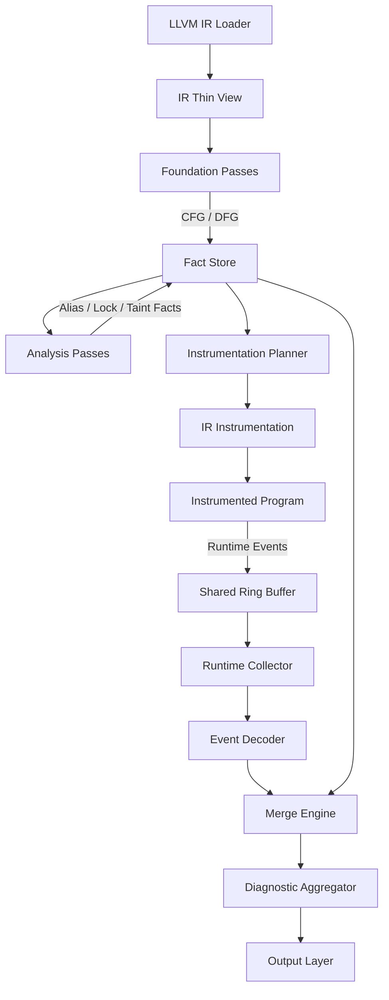
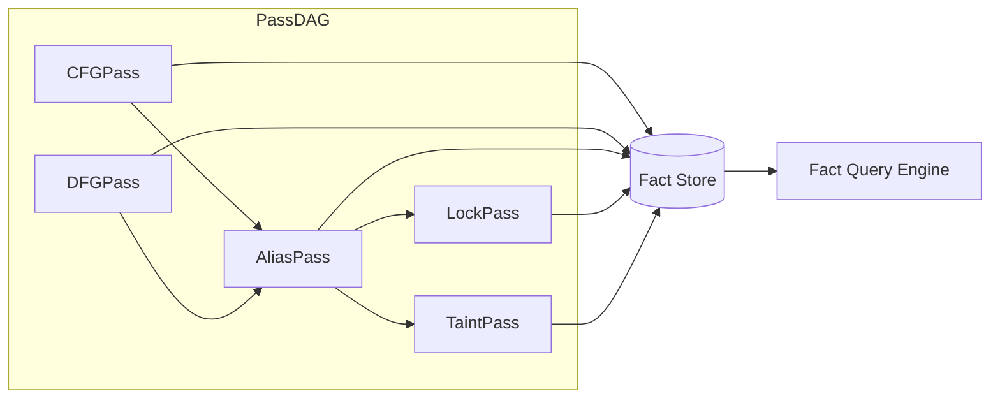

# OmniScope

A universal LLVM analysis framework built with Zig, featuring a fact graph core and static-guided runtime verification engine.

## Overview

OmniScope is a production-grade code detection framework designed for analyzing LLVM Intermediate Representation (IR). It combines static analysis with runtime verification through a fact graph architecture, enabling efficient detection of bugs, security vulnerabilities, and performance issues.

## Key Features

- **Fact Graph Core**: Unified data structure for inter-pass communication
- **Zero-Cost Abstractions**: Comptime pass interface with no runtime overhead
- **SoA Memory Layout**: Structure of Arrays for cache-friendly fact storage
- **Static-Guided Runtime**: Static analysis guides instrumentation for efficient runtime verification
- **Plugin System**: Extensible C-compatible ABI for custom analysis passes
- **Lock-Free Runtime**: Efficient event collection using ring buffers

## Architecture



## Pass System



## Project Structure

```
OmniSope/
├── build.zig              # Build configuration
├── Makefile               # Build automation
├── README.md              # This file
│
├── src/
│   ├── main.zig           # CLI entry point
│   ├── root.zig           # Library public API
│   │
│   ├── ir/                # IR layer (thin wrappers)
│   │   ├── llvm_c.zig     # LLVM-C API bindings
│   │   ├── view.zig       # Pointer-based IR views
│   │   └── location.zig   # Source location handling
│   │
│   ├── pass/              # Pass system
│   │   ├── pass.zig       # Comptime Pass interface
│   │   ├── manager.zig    # Pass manager
│   │   ├── foundation/    # Foundation passes
│   │   │   ├── cfg.zig    # Control flow graph
│   │   │   └── dfg.zig    # Data flow graph
│   │   ├── analysis/      # Analysis passes
│   │   └── instrumentation/ # Instrumentation passes
│   │
│   ├── fact/              # Fact system
│   │   ├── fact.zig       # Fact types
│   │   ├── store.zig      # SoA fact storage
│   │   └── query.zig      # Query engine
│   │
│   ├── runtime/           # Runtime subsystem
│   │   ├── rt_lib/        # Runtime library
│   │   │   ├── probes.zig # Probe functions
│   │   │   └── ring_buffer.zig # Lock-free ring buffer
│   │   ├── collector.zig  # Event collector
│   │   └── decoder.zig   # Event decoder
│   │
│   ├── diag/              # Diagnostics
│   │   ├── diag.zig       # Diagnostic types
│   │   └── aggregator.zig # Diagnostic aggregation
│   │
│   ├── plugin/            # Plugin system
│   │   ├── abi.zig        # Plugin ABI
│   │   └── host.zig       # Plugin host
│   │
│   └── output/            # Output adapters
│       ├── cli.zig        # CLI output
│       ├── sarif.zig      # SARIF format
│       └── lsp.zig        # LSP integration
│
└── plan/                  # Design documents
    ├── improve.md         # Architecture specification
    ├── plan.md            # Initial plan
    └── zig_coding_guide.md # Coding guidelines
```

## Building

### Prerequisites

- Zig 0.15.2 or later
- LLVM development libraries (for LLVM-C API)

### Build Commands

```bash
# Build the project
make build

# Run tests
make test

# Check for compilation errors
make check

# Format code
make fmt

# Clean build artifacts
make clean
```

### Build Options

```bash
# Enable Link Time Optimization
zig build -Denable-lto=true

# Build in release mode
zig build -Doptimize=ReleaseFast

# Build for specific target
zig build -Dtarget=x86_64-linux-gnu
```

## Usage

### Command Line Interface

```bash
# Analyze a bitcode file
./zig-out/bin/OmniSope input.bc

# Enable specific passes
./zig-out/bin/OmniSope --passes=cfg,dfg,alias input.bc

# Output SARIF format
./zig-out/bin/OmniSope --output=sarif results.json input.bc
```

### Library Usage

```zig
const std = @import("std");
const OmniScope = @import("OmniScope");

pub fn main() !void {
    var gpa = std.heap.GeneralPurposeAllocator(.{}){};
    defer _ = gpa.deinit();
    const allocator = gpa.allocator();

    // Initialize fact store
    var store = OmniScope.fact.FactStore.init(allocator);
    defer store.deinit();

    // Insert facts
    try store.insert(.cfg_edge, 1, 2, 0);

    // Query facts
    var engine = OmniScope.fact.QueryEngine.init(&store);
    const facts = try engine.queryByKind(.cfg_edge, allocator);
    defer allocator.free(facts);
}
```

## Pass Development

### Creating a Custom Pass

```zig
const std = @import("std");
const Pass = OmniScope.pass.Pass;
const PassContext = OmniScope.pass.PassContext;
const DiagnosticWriter = OmniScope.pass.DiagnosticWriter;

pub const MyPass = struct {
    pub const name = "my-pass";
    pub const kind = OmniScope.pass.PassKind.analysis;
    pub const deps = &[_][]const u8{"cfg"};

    pub fn run(ctx: *PassContext, diag: *DiagnosticWriter) !void {
        // Pass implementation
    }
};

const ValidatedPass = Pass(MyPass);
```

## Design Principles

1. **IR Layer Minimalism**: The IR layer remains extremely thin, wrapping only LLVM-C pointers without caching or computation
2. **Fact Graph as Single Source of Truth**: All passes communicate through the fact graph, ensuring consistency
3. **Static-Guided Runtime**: Runtime instrumentation is guided by static analysis results for efficiency
4. **Zero-Cost Abstractions**: Comptime features enable abstractions with no runtime overhead
5. **Append-Only Fact Storage**: Enables parallel access and efficient querying

## Testing

```bash
# Run all tests
make test

# Run specific test
zig test src/fact/store.zig

# Run with fuzzing
zig build test --fuzz
```

## Contributing

Please follow the coding guidelines in `plan/zig_coding_guide.md`:

- All comments must be in English
- Single file limit: 1000 lines
- Run `make fmt` after changes
- Ensure `make check` shows 0 errors
- Write meaningful tests to detect hidden bugs

## License

[Specify your license here]

## Acknowledgments

Built with Zig and LLVM. Architecture inspired by modern static analysis tools and dataflow analysis techniques.
