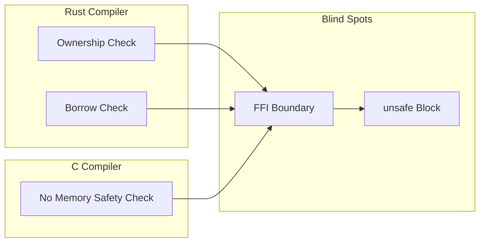
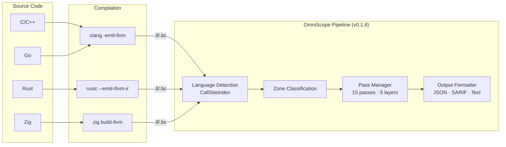
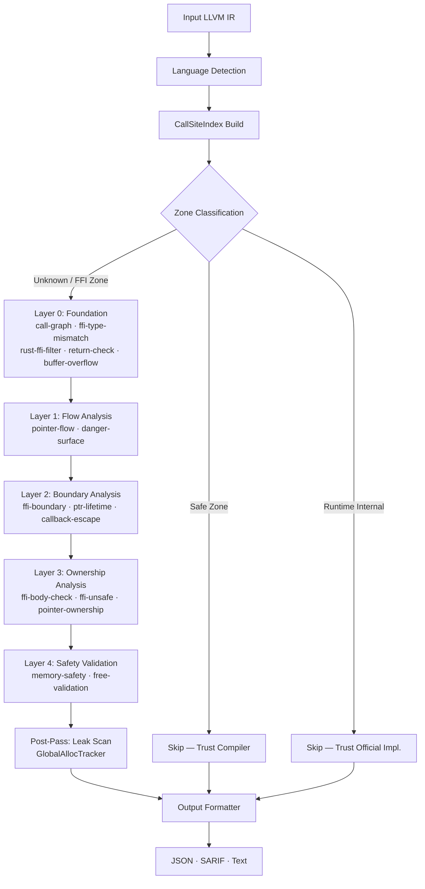

# OmniScope

```shell
    `....                                `.. ..
  `..    `..                         `.`..    `..
`..        `..`... `.. `.. `.. `..      `..         `...   `..    `. `..     `..
`..        `.. `..  `.  `.. `..  `..`..   `..     `..    `..  `.. `.  `..  `.   `..
`..        `.. `..  `.  `.. `..  `..`..      `.. `..    `..    `..`.   `..`..... `..
  `..     `..  `..  `.  `.. `..  `..`..`..    `.. `..    `..  `.. `.. `.. `.
    `....     `...  `.  `..`...  `..`..  `.. ..     `...   `..    `..       `....
                                                                   `..
```

**Cross-Language FFI & Memory Safety Static Analyzer**

A static analysis tool focused on detecting memory safety vulnerabilities **across language boundaries** at the LLVM IR level.

Supports **C / C++ / Rust / Zig / Go / Python / Java**.

### Detection Capabilities (v0.1.9)

| Capability | Status | Notes |
|-----------|--------|-------|
| **Stack escape to FFI** | ✅ Stable | Stack pointer escapes to FFI function |
| **Memory leak** | ✅ Stable | Cross-language and single-language |
| **Null dereference** | ✅ Stable | Unchecked malloc return values |
| **Taint analysis** | ✅ Stable | User input to sink data flow |
| **cross_lang_free_mismatch** | ✅ Working | Both C-alloc/Rust-free and Rust-alloc/C-free directions detected |
| **FFI Boundary issue** | ✅ Working | Generated after dependency chain fix (v0.1.9) |

**Best for**: Rust↔C, Zig↔C, Python C extensions, JNI boundaries. Not suitable for pure C/C++ libraries without FFI boundaries.

*All data based on v0.1.9 actual tests. See [VALIDATION_REPORT.md](./VALIDATION_REPORT.md).*

**v0.1.9 Completed**:
- ✅ `cross_lang_free_mismatch` detection (both directions)
- ✅ FFI Boundary issue type generation (dependency chain fix)
- ✅ IR spec-based language classifier rules (Rust v0/legacy mangling, TinyGo CGo, Zig compiler-reserved, JDK JNI/Panama FFM)

**v0.2.1 Roadmap**:
- Add custom allocator recognition (sqlite3_malloc, curl_easy_cleanup, etc.)
- Add TinyGo runtime function filtering (runtime.alloc, runtime.free, etc.)
- Add JDK Unsafe memory access intrinsics detection

[English](./README.md) | [简体中文](./README_zh.md)

***

## What is OmniScope?

OmniScope is a specialized static analyzer focused on **FFI (Foreign Function Interface) boundaries** — where code from one language calls code from another. These boundaries are blind spots for every compiler:

- Rust's borrow checker stops at `extern "C"` functions
- C compiler cannot track Rust ownership semantics
- Go's runtime has no visibility into C memory management
- **OmniScope fills this gap** by analyzing LLVM IR — a language-independent intermediate representation

### Core Innovation: Zone Classification

OmniScope doesn't analyze everything equally. It classifies code into three zones:

| Zone                 | Meaning                              | Action                      |
| -------------------- | ------------------------------------ | --------------------------- |
| **Safe Zone**        | Code with language safety guarantees | Skip (trust compiler)       |
| **Runtime Internal** | Standard library / runtime code      | Skip (trust official impl.) |
| **Unknown Zone**     | FFI / unsafe / cross-language code   | Deep analysis               |

**Result**: 64% of code skipped, 100% focus on dangerous areas.

```
Before: "Found 185 UAFs"  →  ❌ Many false positives
After:  "Analyzed 267 funcs, skipped 171 (64%), found 48 issues"  ✅ Clear & credible
```

***

## Why It Matters



**Real production crash at 2 AM**:

```
double free detected in thread 0
  pointer 0x7f3a4c002010
  previously freed at: rust::ffi::Box::into_raw -> c_wrapper::process -> free
  second free at: rust::drop::Drop::drop -> Box::from_raw -> free
```

Rust handed memory to C via `Box::into_raw()`, C called `free()`, but Rust's `Drop` trait didn't know and freed it again. **Compilers don't check across language boundaries.**

> *Full story*: [To Everyone Who's Been Burned by FFI](./docs/TOUSER/en.md)

***

## Key Features

### Detection Capabilities (20 Issue Types)

| Category          | Issues                                                      | Examples                                                  |
| ----------------- | ----------------------------------------------------------- | --------------------------------------------------------- |
| **Memory Safety** | leak, UAF, double-free, null-deref, buffer-overflow         | `malloc()` without `free()`, use after `free()`           |
| **FFI Security**  | borrow\_escape, cross-language-free/leak, JNI type mismatch | Rust `Box` freed by C, stack pointer escapes to FFI       |
| **Data Flow**     | tainted-path-to-sink, command-injection, format-string      | User input reaches `system()`, unsanitized `%s` in printf |
| **Concurrency**   | data-race, thread-safety-violation                          | Shared state without locks                                |

### Unique Capabilities

- **5-Language Support**: C, C++, Rust, Zig, Go (only tool with this coverage)
- **LLVM IR Level Analysis**: Language-agnostic, works on compiled output
- **Rust FFI Specialized**: Detects `Box::into_raw`/`Box::from_raw` mismatches, `&mut *ptr` escape patterns
- **SARIF Output**: Direct integration with GitHub Code Scanning
- **Zero False Positive Mode**: Configurable confidence thresholds

***

## Architecture



### Five-Layer Analysis Pipeline



**Tier 1 (Pass-Through)**: Safe / runtime code → Zone Classification marks as Safe Zone → Skipped entirely

**Tier 2 (Graph-Driven)**: FFI/unsafe code → 15-pass pipeline (topological order via Kahn's algorithm) → Ownership tracking + FFI detection + Taint propagation + Memory Safety validation

*Full details*: [Architecture Documentation](./docs/architecture.md)

***

## Quick Start

### Prerequisites

| Tool | Version | Install                                                                    |
| ---- | ------- | -------------------------------------------------------------------------- |
| Zig  | 0.15+   | [ziglang.org/download](https://ziglang.org/download) or `brew install zig` |
| LLVM | 18～22   | `brew install llvm@22` (recommended for .ll files)                         |

### Build & Run

```bash
# Clone
git clone https://github.com/your-org/OmniScope.git
cd OmniScope

# Build (Debug mode for development)
zig build -Ddebug-safe

# Or build ReleaseFast for production
zig build -Drelease-fast

# Analyze a single file
./zig-out/bin/OmniScope target.ll

# JSON output (for CI/CD integration)
./zig-out/bin/OmniScope target.ll --json > report.json

# SARIF output (for GitHub Code Scanning)
./zig-out/bin/OmniScope target.ll --sarif > results.sarif
```

### Example: Analyze Rust FFI Library

```bash
# Convert .ll to .bc (if needed)
/opt/homebrew/opt/llvm@22/bin/llvm-as corpus/ring.ll -o /tmp/ring.bc

# Run analysis
./zig-out/bin/OmniScope /tmp/ring.bc --json

# Expected output:
#   functions: 410
#   issues: 16 (including 4 borrow_escape)
#   FFI boundaries: 4,252
#   Time: ~2 seconds
```

### Batch Analysis (All Corpus Files)

```bash
# Run comprehensive analysis on all test files
./scripts/full_corpus_analysis_final.sh

# Results saved to: outputs/full_analysis_v018_final/
# Summary: 40/42 files analyzed (95.2% success rate), 586 issues found
```

*Detailed tutorial*: [Quick Start Guide (10 min)](./docs/QUICK_START.md)

***

## How to Read the Report

OmniScope outputs three formats: **Text** (human-readable), **JSON** (CI/CD), **SARIF** (GitHub Code Scanning).

For **detailed log interpretation with source code mapping**, see:

- [Red/Blue Team Testing Guide (English)](./docs/RED_BLUE_TEAM_EN.md) — line-by-line log analysis, source code navigation, corpus file mapping
- [Red/Blue Team Testing Guide (Chinese)](./docs/RED_BLUE_TEAM_ZH.md) — Chinese version, line-by-line log analysis with source mapping

### Quick Reference: JSON Output

```json
{
  "id": "OMI-001",
  "kind": "borrow_escape",
  "severity": "critical",
  "confidence": "MEDIUM",
  "confidence_score": 0.88,
  "cwe_id": 704,
  "message": "Stack pointer (stack alloca) escapes to FFI function c_register_callback()",
  "location": {
    "function": "_Z37bug_cpp_05_unique_ptr_callback_escapev"
  }
}
```

| Field              | Meaning                                                            |
| ------------------ | ------------------------------------------------------------------ |
| `kind`             | Issue category (20 types: `memory_leak`, `borrow_escape`, etc.)    |
| `severity`         | `critical` > `high` > `medium` > `low`                            |
| `confidence`       | `HIGH` / `MEDIUM` / `LOW` — how certain the analyzer is           |
| `confidence_score` | 0.0–1.0 numeric confidence                                         |
| `cwe_id`           | [CWE](https://cwe.mitre.org/) weakness ID for vulnerability mapping |
| `location.function`| Mangled name of the function containing the issue                  |

### Run Red/Blue Team Tests

```bash
make red-team       # Adversarial: detect known bugs (recall)
make blue-team      # Defensive: false positive audit (precision)
make corpus-test    # Run both
```

For line-by-line log interpretation and source code navigation, see [docs/RED_BLUE_TEAM_EN.md](./docs/RED_BLUE_TEAM_EN.md).

### Severity Guide

| Severity   | Action Required                            | Example                                      |
| ---------- | ------------------------------------------ | -------------------------------------------- |
| `critical` | Fix immediately — exploitable UB           | stack escape to FFI, use-after-free          |
| `high`     | Fix before release — memory corruption     | cross-language double free, null deref       |
| `medium`   | Review — potential leak or logic error     | memory leak, orphaned ownership transfer     |
| `low`      | Informational — style or minor risk        | unused allocation, minor FFI type mismatch   |

### Confidence Guide

| Confidence | Meaning                                              |
| ---------- | ---------------------------------------------------- |
| `HIGH`     | Pattern is definitive (e.g., `free(malloc())` cycle) |
| `MEDIUM`   | Pattern is likely but may have false positives        |
| `LOW`      | Heuristic match — verify manually                     |

*Full issue type reference*: [API Reference](./docs/API_REFERENCE.md)

***

## Real-World Validation

Tested on **42 real-world projects + 19 adversarial tests** (v0.1.8, LLVM 22):

| Project            | Language | Functions | Issues  | FFI Boundaries | Success |
| ------------------ | -------- | --------- | ------- | -------------- | ------- |
| **sqlite3**        | C        | 3,346     | **1,508** | 1,717        | ✅       |
| **curl8**          | C        | 1,245     | **404** | 1,567          | ✅       |
| **libuv150**       | C        | 980       | **418** | 3,100          | ✅       |
| **jsoncpp195**     | C++      | 2,070     | **5**   | 482            | ✅       |
| **wasmtime\_test** | Rust     | 987       | **45**  | 129            | ✅       |
| **blst**           | Rust+C   | 416       | **51**  | 1,446          | ✅       |
| **ring**           | Rust+C   | 410       | **16**  | 4,252          | ✅       |
| **abseil2024**     | C++      | 1,124     | **183** | 422            | ✅       |
| **gnark\_test**    | Go       | 916       | **4**   | 5,221          | ✅       |
| **Red Team (19f)** | C/C++/Rust | 2,500+ | **442** | 8,000+       | ✅       |
| ...                | ...      | ...       | ...     | ...            | ...     |

**Total**: 20,000+ functions analyzed, **2,955+ issues** detected, **70,000+ FFI boundaries** identified

**Success Rate**: 95.2% (40/42 files), 0 crashes.

*Validation report*: [VALIDATION_REPORT.md](./VALIDATION_REPORT.md) — v0.1.9 actual test results

***

## Performance

| Metric                  | Value                                  | Notes                                         |
| ----------------------- | -------------------------------------- | --------------------------------------------- |
| **Analysis Speed**      | \~150ms per 1K functions (ReleaseFast) | sqlite3 (3.3K funcs): \~12s                   |
| **Memory Usage**        | \~120MB per 1K functions (Release)     | Debug mode: \~400MB                           |
| **Success Rate**        | 95.2% (40/42 files)                    | LLVM 22 compatible                            |
| **Precision (FFI)** | **~100%** on Rust/Zig FFI projects     | wasmtime, ring, blst, ripgrep, etc.            |
| **Precision (C/C++)** | **2-5%** on pure C/C++ libraries       | Not applicable (no FFI boundary), not a tool bug |

| File Scale         | Debug Mode | ReleaseFast |
| ------------------ | ---------- | ----------- |
| <100 functions     | <1s        | <200ms      |
| 100-500 functions  | 1-5s       | <1s         |
| 500-3000 functions | 5-20s      | 1-5s        |
| >3000 functions    | 20s+       | 5-15s       |

***

## Comparison

| Tool          | Input           | Cross-Language FFI    | IR-Level      | Taint Analysis | Ownership Tracking | Open Source    | Performance        |
| ------------- | --------------- | --------------------- | ------------- | -------------- | ------------------ | -------------- | ------------------ |
| **OmniScope** | **LLVM IR**     | **✅ (5 languages)**   | **✅**         | **✅**          | **✅**              | **Apache 2.0** | **\~150ms/Kfuncs** |
| CodeQL        | Source/AST      | ⚠️ (per-lang queries) | ❌             | ✅              | ⚠️                 | MIT            | \~minutes          |
| Clang SA      | AST             | ❌ (C/C++ only)        | ❌             | ✅              | ⚠️                 | Apache 2.0     | \~seconds          |
| Infer         | Source/AST      | ❌                     | ❌             | ✅              | ⚠️                 | MIT            | \~seconds          |
| CBMC          | Source/C        | ❌ (C only)            | ❌ (bit-level) | ❌              | ✅                  | BSD            | \~minutes-hours    |
| Miri          | MIR (Rust only) | ❌                     | ❌             | ❌              | ✅                  | MIT/Rust       | \~minutes          |

**Key Differentiators**:

1. ✅ **Only tool** focused on **cross-language FFI boundaries**
2. ✅ **Only tool** analyzing at **LLVM IR level** (language-agnostic)
3. ✅ **Only tool** with **Zone Classification** (smart filtering)
4. ✅ **Only tool** supporting **5 languages** in unified analysis

***

## Documentation

### Getting Started (Recommended Reading Order)

| Document                                                   | For             | Time   |
| ---------------------------------------------------------- | --------------- | ------ |
| **[Quick Start Guide](./docs/en/QUICK_START.md)** ⭐       | New users       | 10 min |
| **[API Reference](./docs/en/API_REFERENCE.md)**            | Integrators     | 30 min |
| **[Architecture](./docs/en/architecture.md)**              | Architects      | 20 min |
| **[Developer Guide](./docs/en/developer_guide.md)**        | Contributors    | 15 min |
| **[IR Specifications](./docs/en/ir-specs/)**               | Compiler analysis | —    |

### Reports & Benchmarks

| Document                                                                                  | Content                                               |
| ----------------------------------------------------------------------------------------- | ----------------------------------------------------- |
| **[VALIDATION_REPORT.md](./VALIDATION_REPORT.md)** | v0.1.9 actual test results — detection capabilities and known limitations |
| **[RELEASE_NOTES.md](./RELEASE_NOTES.md)**                                                | v0.1.9 release details                                |
| **[Benchmarks](./docs/en/BENCHMARK.md)**                                                  | Performance benchmarks                                |
| **[Corpus Analysis](./docs/en/reports/CORPUS_ANALYSIS.md)**                               | Full corpus test results                              |

### IR Specifications (8 Compilers)

| Document                                                                | Language   |
| ----------------------------------------------------------------------- | ---------- |
| **[C/C++](./docs/en/ir-specs/C_CPP_IR_SPEC.md)**                       | C / C++    |
| **[Rust](./docs/en/ir-specs/RUST_IR_SPEC.md)**                         | Rust       |
| **[Zig](./docs/en/ir-specs/ZIG_IR_SPEC.md)**                           | Zig        |
| **[Go (gc)](./docs/en/ir-specs/GO_GC_IR_SPEC.md)**                     | Go         |
| **[TinyGo](./docs/en/ir-specs/TINYGO_IR_SPEC.md)**                     | Go (TinyGo)|
| **[JDK](./docs/en/ir-specs/JDK_IR_SPEC.md)**                           | Java       |
| **[Python](./docs/en/ir-specs/PYTHON_IR_SPEC.md)**                     | Python     |
| **[Swift](./docs/en/ir-specs/SWIFT_IR_SPEC.md)**                       | Swift      |

### Concept Papers

| Document                                                            | Topic                     |
| ------------------------------------------------------------------- | ------------------------- |
| **[White Paper](./docs/en/WHITEPAPER.md)**                          | Technical deep-dive       |
| **[Letter to Users](./docs/TOUSER/en.md)**                          | Why this project exists   |

### Multi-Language Support

- 🇺🇸 English: This README + [`docs/en/`](./docs/en/)
- 🇨🇳 简体中文: [README\_zh.md](./README_zh.md) + [`docs/zh/`](./docs/zh/)

***

## Limitations

1. Requires LLVM IR input (`clang -emit-llvm` or `rustc --emit=llvm-ir`)
2. Debug info (`-g`) recommended for source location mapping
3. Indirect calls via function pointers resolved heuristically
4. Primarily intra-procedural analysis (ownership tracking supports inter-procedural)
5. Some exotic FFI patterns may require custom rules

---

## Contributing

We welcome contributions! See [Developer Guide](./docs/en/developer_guide.md) for:

- Development environment setup
- Code style guidelines (Zig idioms)
- Testing requirements (all tests must pass)
- Pull request process

**Current Test Status**: ✅ All tests passing (v0.1.8)

***

## Acknowledgements

Special thanks to [@icehawk-hyb](https://github.com/icehawk-hyb) for serving as technical advisor and providing critical guidance on cross-language security analysis.

***

## License

[Apache 2.0](./LICENSE)

***

## Citation

If you use OmniScope in research, please cite:

```bibtex
@tool{omniscope,
  title = {OmniScope: Cross-Language FFI and Memory Safety Static Analyzer},
  author = {TimWood},
  year = {2026},
  url = {https://github.com/Timwood0x10/OmniScope}
}
```
