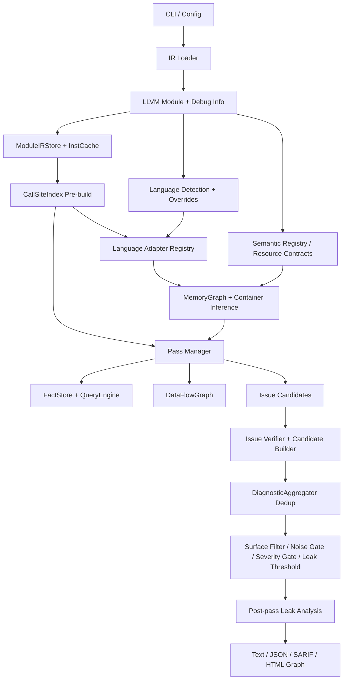

# OmniScope

```shell
    `....                                `.. ..
  `..    `..                         `.`..    `..
`..        `..`... `.. `.. `.. `..      `..         `...   `..    `. `..     `..
`..        `.. `..  `.  `.. `..  `..`..   `..     `..    `..  `.. `.  `..  `.   `..
`..        `.. `..  `.  `.. `..  `..`..      `.. `..    `..    `..`.   `..`..... `..
  `..     `..  `..  `.  `.. `..  `..`..`..    `.. `..    `..  `.. `.. `.. `.
    `....     `...  `.  `..`...  `..`..  `.. ..     `...   `..    `..       `....
                                                                   `..
```

OmniScope is a LLVM IR (`.ll` / `.bc`) static analyzer for memory, ownership, resource, and FFI-boundary risks across C, C++, Rust, Zig, Go, Java, Python, and C#. Reports are review evidence, not proof of a confirmed vulnerability.

The Rust version is under development. It will explore different approaches to solving the same cross-language security analysis problem.

Current version: `0.2.0`.

[中文 README](./README_zh.md) | [User story](./docs/touser/en/ToUser.md) | [English docs](./docs/en/README.md) | [中文文档](./docs/zh/README.md) | [Release Notes](./RELEASE_NOTES.md)

## Architecture

```mermaid
flowchart LR
    Input[".ll / .bc files"] --> Load[Load LLVM Module]
    Load --> Pre["Pre-pass: Language Detect + CallSiteIndex + Adapter + Container Inference"]
    Pre --> Phase1["Phase 1 Foundation: CFG → DFG → Alias → CallGraph"]
    Phase1 --> Phase2["Phase 2 Classification: Surface + Semantic + Danger"]
    Phase2 --> Phase3["Phase 3 FFI: Boundary + Type + ABI + Body + Detector"]
    Phase3 --> Phase4["Phase 4 Issue: Lifetime + Ownership + Memory + Free + Overflow"]
    Phase4 --> Phase5["Phase 5 Runtime: Rust-FFI + JNI + GC + Callback + Lock + Error"]
    Phase5 --> Phase6["Phase 6 Cross-lang: DataFlow + Taint"]
    Phase6 --> Post["Post-pass: Leak Scan + Dedup + Confidence Filter"]
    Post --> Report[Text / JSON / SARIF / HTML]
```





## Pass Responsibilities

| Pass group | Passes | Responsibility |
|---|---|---|
| Foundation | `cfg`, `dfg`, `alias`, `call-graph` | Build control-flow, data-flow, alias facts, and call relationships. |
| Classification | `surface-classifier`, `semantic-resolver`, `danger-surface` | Classify user/runtime/FFI surfaces and semantic risk zones. |
| Flow and lifetime | `taint-propagation`, `ptr-lifetime`, `pointer-ownership`, `cross-lang-dataflow` | Track pointer/resource movement, lifetime, ownership, and boundary flow. |
| FFI boundary | `ffi-detector`, `ffi-boundary`, `ffi-type-mismatch`, `abi-compat-checker`, `ffi-body-check` | Detect FFI calls/exports and ABI/type/body mismatches. |
| FFI safety | `ffi-analysis-wrapper`, `ffi-unsafe`, `layout-mismatch`, `string-safety-ffi`, `unwind-boundary` | Flag unsafe APIs, layout/string/unwind hazards, and ownership violations. |
| Memory/resource | `malloc-check`, `free-validation`, `memory-safety`, `return-check`, `buffer-overflow`, `integer-overflow` | Detect allocation, free, return, overflow, and use-after-free style issues. |
| Runtime-specific | `rust-ffi-auditor`, `jni-leak-detector`, `gc-safety`, `callback-escape`, `callback-lifecycle`, `lock`, `error-propagation-tracer` | Apply language/runtime rules for Rust FFI, JNI, GC, callbacks, locks, and errors. |

The pass manager resolves dependencies, runs passes in topological order, records optional performance stats, and degrades gracefully if a pass fails.

## CLI

```bash
zig build -Doptimize=ReleaseFast
./zig-out/bin/OmniScope input.bc
./zig-out/bin/OmniScope input.bc --json -o report.json
./zig-out/bin/OmniScope input.bc --sarif -o report.sarif
./zig-out/bin/OmniScope rust.bc c.bc
```

| Command / option | Meaning |
|---|---|
| `<input.ll/bc> [...]` | Analyze one file; two or more files enable multi-file cross-language matching. |
| `--json`, `--sarif`, `-o/--output <file>` | Select machine-readable output and optional destination file. |
| `--visualize` / `--viz` | Generate an HTML issue graph under `output/<input>/`. |
| `--focus-user-code`, `--no-focus-user-code`, `--include-stdlib` | Control stdlib/compiler noise filtering. |
| `--ffi-only`, `--boundary-only`, `--show-surface <list>` | Limit reports to FFI/boundary/surface classes. Surfaces: `boundary`, `ffi`, `reachable`, `internal`, `runtime`. |
| `--min-severity <low|medium|high|critical>` | Drop issues below the requested severity. |
| `--leak-threshold <0.0-1.0>`, `--no-zig-tracking` | Tune leak confidence and Zig allocator tracking. |
| `--lang <name=lang>`, `--lang-prefix <prefix=lang>`, `--lang-suffix <suffix=lang>`, `--source-lang <file:lang>`, `--default-lang <lang>` | Override language detection. Languages: `c`, `cpp`, `rust`, `zig`, `go`, `java`, `python`, `csharp`. |
| `--report-surfaces` | Add FFI-visible export surfaces to JSON output. |
| `--perf-stats`, `--perf-json <path>` | Print/export per-pass timing and memory stats. |
| `--config <file>`, `--init-config` | Load a JSON config or generate `omniscope.json`. Auto-discovery checks `./omniscope.json` and `~/.config/omniscope/config.json`. |
| `-v/--verbose`, `-d/--debug`, `-q/--quiet`, `--debug-resource-contract` | Control logs and resource-contract debugging. |
| `-h/--help`, `--version` | Print help or version. |

## User-Facing Notes

The `docs/touser/` documents explain the problem OmniScope targets: compilers and most analyzers reason inside one language, while FFI bugs often live in the handoff between runtimes. Start here:

- [English: To Everyone Who's Been Burned by FFI](./docs/touser/en/ToUser.md)
- [中文：写给每一个被 FFI 坑过的人](./docs/touser/zh/ToUser.md)

## Build and Verify

```bash
zig build
zig build test
make baseline-check
make corpus-check
```

Requires Zig >= `0.15.2` and LLVM 22.

## License

[Apache 2.0](./LICENSE)

## Acknowledgements

Special thanks to [@icehawk-hyb](https://github.com/icehawk-hyb) for serving as technical advisor and providing critical guidance on cross-language security analysis.

## Citation
If you use OmniScope in research, please cite:

```shell
@tool{omniscope,
  title = {OmniScope: Cross-Language FFI and Memory Safety Static Analyzer},
  author = {TimWood},
  year = {2026},
  url = {https://github.com/Timwood0x10/OmniScope}
}
```
