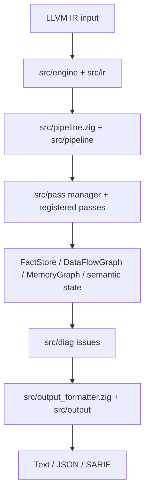

# OmniScope

```shell
    `....                                `.. ..
  `..    `..                         `.`..    `..
`..        `..`... `.. `.. `.. `..      `..         `...   `..    `. `..     `..
`..        `.. `..  `.  `.. `..  `..`..   `..     `..    `..  `.. `.  `..  `.   `..
`..        `.. `..  `.  `.. `..  `..`..      `.. `..    `..    `..`.   `..`..... `..
  `..     `..  `..  `.  `.. `..  `..`..`..    `.. `..    `..  `.. `.. `.. `.
    `....     `...  `.  `..`...  `..`..  `.. ..     `...   `..    `..       `....
                                                                   `..
```

OmniScope analyzes LLVM IR (`.ll` / `.bc`) and reports possible memory, ownership, resource, and FFI-boundary issues. It is useful when source-level tools stop at a language boundary and you still need to ask: where did this pointer or resource come from, where did it go, and which side is responsible for releasing it?

It is not a proof tool. Treat reports as review evidence, not as confirmed vulnerabilities.

Current version label: `0.2.0`.

[中文 README](./README_zh.md) | [English docs](./docs/en/README.md) | [中文文档](./docs/zh/README.md)

## When It Helps

- You already have LLVM IR and want to review FFI, unsafe, pointer, callback, or resource-boundary behavior.
- You need JSON or SARIF output for audit or CI review.
- You want to compare release candidates against test baselines.
- You are investigating why a finding appeared and which pass produced it.

It is a poor fit for proving a whole program safe, replacing compilers/sanitizers, or finding every source-level bug in single-language code.

## How It Works



The core idea is simple: load IR once, build shared facts and graphs, let passes add evidence, then format the final issue list. The details are in:

- [docs/en/architecture.md](./docs/en/architecture.md): runtime flow.
- [docs/en/modules.md](./docs/en/modules.md): problem-driven module guide.
- [docs/en/passes.md](./docs/en/passes.md): pass behavior notes.

## Build And Run

`build.zig` defaults to LLVM 22:

- macOS: `/opt/homebrew/opt/llvm`
- Linux: `/usr/lib/llvm-22`

```bash
zig build -Doptimize=ReleaseFast
./zig-out/bin/OmniScope path/to/input.bc --json
./zig-out/bin/OmniScope path/to/input.bc --sarif -o results.sarif
```

Useful options are defined in `src/config/main_config.zig`:

```bash
./zig-out/bin/OmniScope input.bc --boundary-only --min-severity high --json
./zig-out/bin/OmniScope input.bc --lang-prefix sqlite3_=c --default-lang rust
```

## 0.2.0 Release Check

Version strings are aligned to `0.2.0` in `VERSION`, `build.zig.zon`, CLI `--version`, JSON, and SARIF output.

This worktree should not be tagged as a final `0.2.0` release until tests are green and baseline documents are updated. Current release-readiness checks should start with:

- `zig build`
- `zig build test`
- `tests/BASELINE.md`
- `tests/integration/inline_ir_matrix.zig`

## License

[Apache 2.0](./LICENSE)
