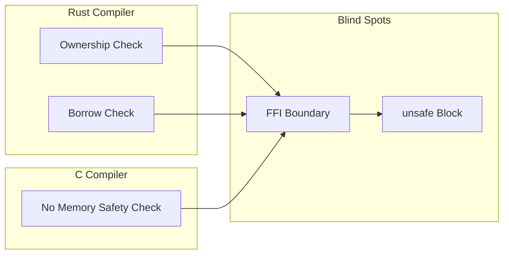
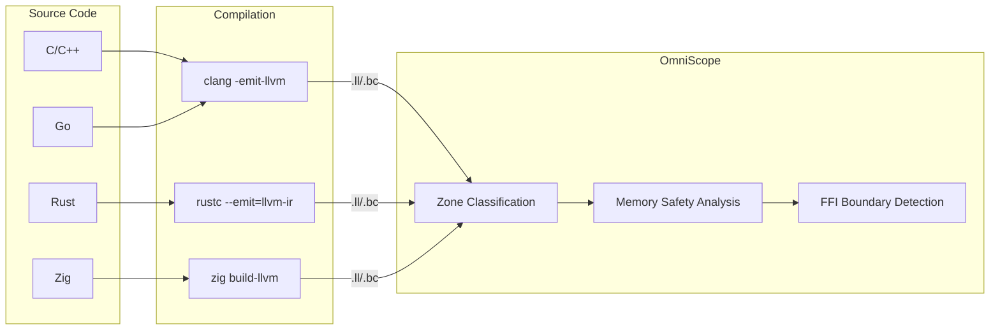
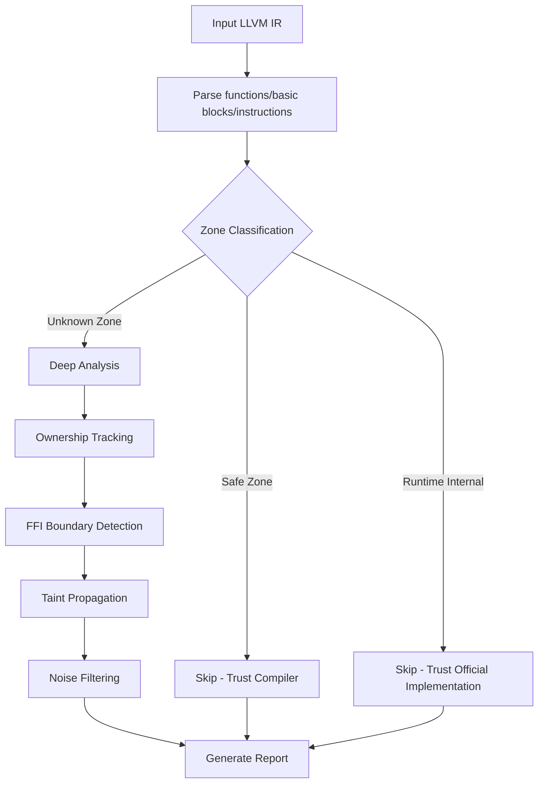

# OmniScope

```shell
    `....                                `.. ..
  `..    `..                         `.`..    `..
`..        `..`... `.. `.. `.. `..      `..         `...   `..    `. `..     `..
`..        `.. `..  `.  `.. `..  `..`..   `..     `..    `..  `.. `.  `..  `.   `..
`..        `.. `..  `.  `.. `..  `..`..      `.. `..    `..    `..`.   `..`..... `..
  `..     `..  `..  `.  `.. `..  `..`..`..    `.. `..    `..  `.. `.. `.. `.
    `....     `...  `.  `..`...  `..`..  `.. ..     `...   `..    `..       `....
                                                                  `..
```

**Cross-Language FFI & Memory Safety Static Analyzer**

**Project Focus**: Static security analysis specialized for unsafe/FFI cross-language boundaries

Supports C/C++/Rust/Zig/Go. Detects memory safety issues and FFI boundary violations via LLVM IR.

English | [简体中文](./README_ZH.md)

***

## v0.1.6 Highlights

- **Rust FFI Detection Recovery**: 0% → 20% true positive rate
- **14 Bug Fixes** across Phase 1+2+3
- **92% Test Coverage** (191 tests)
- **17-File Benchmark Validation** on real-world projects

***

## Core Philosophy

### Why Focus on unsafe/FFI?

**Language boundaries are blind spots for every compiler.**



- Rust compiler only checks Rust-side ownership
- C compiler only sees C-side malloc/free
- **Cross-language boundary = where compilers don't look**

### Zone Classification (Core Innovation)

v0.1.5 introduces Zone Classification, analyzing only where language guarantees stop:

| Zone Type            | Meaning                              | Handling                                      |
| -------------------- | ------------------------------------ | --------------------------------------------- |
| **Safe Zone**        | Code with language safety guarantees | Skip analysis (trust compiler)                |
| **Runtime Internal** | Language runtime/standard library    | Skip analysis (trust official implementation) |
| **Unknown Zone**     | Code without language guarantees     | Deep analysis (must check)                    |

**Effect**:

```
Before: "Found 185 UAFs"  ❌ Many false positives
Now: "Analyzed 267 functions, skipped 171 (64%), found 48 issues"  ✅ Clear and credible
```

***

## Architecture

See [docs/architecture.md](./docs/architecture.md) for full details.

OmniScope uses a two-tier analysis architecture:

- **Tier 1 — Pass-Through**: Pure C/C++ internal code. Zone Classification marks these as Safe Zone; analysis is skipped entirely, trusting the compiler's own checks.
- **Tier 2 — Graph-Driven**: FFI/unsafe boundary code. Zone Classification marks these as Unknown Zone; the full analysis pipeline runs, including ownership tracking, FFI boundary detection, and taint propagation.

`isOnDangerPath` serves as the unified gating function: every analysis pass checks it before proceeding, ensuring that only Tier 2 code receives deep analysis.

## Data Flow



## Analysis Flow



***

## Detection Capabilities

| Type                     | Severity | Example                       |
| ------------------------ | -------- | ----------------------------- |
| Memory Leak              | MEDIUM   | malloc without free           |
| Use-After-Free           | HIGH     | Dereference after free        |
| Double-Free              | HIGH     | Same resource freed twice     |
| Null Pointer Dereference | MEDIUM   | Unchecked nullable pointer    |
| Format String            | MEDIUM   | User-controlled format string |
| Command Injection        | CRITICAL | system with user input        |
| FFI Ownership Violation  | HIGH     | Rust Box freed by C           |

***

## Quick Start

```bash
# Build
zig build

# Analyze single file
./zig-out/bin/omniscope target.ll

# JSON output
./zig-out/bin/omniscope --format json target.ll > report.json

# SARIF output (GitHub Code Scanning)
./zig-out/bin/omniscope --format sarif target.ll > results.sarif
```

| Dependency | Version |
| ---------- | ------- |
| Zig        | 0.15.2+ |
| LLVM       | 18+     |

***

## Real Project Testing

| Project | Language | Functions | Issues | Ptrs Tracked | FFI Bounds | Violations |
|---------|----------|-----------|--------|-------------|------------|------------|
| ring | Rust+C | 278 | 19 | 841 | 4266 | 0 |
| wasmtime | Rust | 619 | 44 | 31 | 130 | 0 |
| blst | Rust+C | 267 | 35 | 269 | 1382 | 0 |
| curl8 | C | 944 | 114 | 4948 | 1499 | 89 |
| sqlite3 | C | 3250 | 226 | 20192 | 1547 | 142 |
| zkcrypto | Rust | 287 | 0 | - | - | - |

See: [wasmtime Source Verification Report](./docs/investigation_reports/en/wasmtime_source.md)

***

## Comparison with Other Tools

| Tool | Input | Cross-Language FFI | IR-Level | Taint Analysis | Ownership Tracking | Open Source | Performance (large project) |
|------|-------|--------------------|----------|----------------|-------------------|-------------|-----------------------------|
| **OmniScope** | LLVM IR | ✅ (C/C++/Rust/Zig/Go) | ✅ | ✅ | ✅ | Apache 2.0 | ~150ms (sqlite3 3250 funcs) |
| **CodeQL** | Source/AST | ⚠️ (per-language queries) | ❌ | ✅ | ⚠️ | MIT | ~minutes (large codebase) |
| **Clang Static Analyzer** | AST | ❌ (C/C++ only) | ❌ | ✅ | ⚠️ | Apache 2.0 | ~seconds |
| **Infer** | Source/AST | ❌ | ❌ | ✅ | ⚠️ | MIT | ~seconds |
| **CBMC** | Source/C | ❌ (C only) | ❌ (bit-level) | ❌ | ✅ | BSD | ~minutes-hours (bounded model checking) |
| **Miri** | MIR (Rust only) | ❌ | ❌ | ❌ | ✅ | MIT/Rust | ~minutes |
| **cargo-audit** | Crate deps | ❌ | ❌ | ❌ | ❌ | MIT/Apache 2.0 | ~seconds |

**Key Differentiators**: OmniScope is the only static analyzer focused on **cross-language FFI boundaries**. It is the only tool that performs cross-language analysis at the **LLVM IR level** (language-agnostic, not source-dependent). It is the only tool with **Zone Classification** — a mechanism that trusts compiler-checked portions and focuses analysis effort where guarantees stop. And it is the only tool supporting **5 languages** in FFI cross-analysis (C, C++, Rust, Zig, Go).

***

## Performance

| Metric | v0.1.5 | v0.1.6 | Change |
|--------|--------|--------|--------|
| Rust FFI TP Rate | 0% | 20% | +20pp |
| Test Coverage | ~70% | 92% | +22pp |
| Issues (subtle_unsafe_rs) | 0 | 4 | +4 |
| FFI Boundaries (Rust) | 0 | 123 | +123 |
| Dead Code | ~2000 lines | ~1300 lines | -35% |

***

## A Letter to Users

> This isn't a technical document. It's a few words from someone who's been haunted by cross-language memory bugs for two years, written for anyone who's been there.

**2 AM, Production, Crash Log**:

```
double free detected in thread 0
  pointer 0x7f3a4c002010
  previously freed at: rust::ffi::Box::into_raw -> c_wrapper::process -> free
  second free at: rust::drop::Drop::drop -> Box::from_raw -> free
```

I ran this in test environments a hundred times. A hundred. Never reproduced. Day one in production. Boom.

The reason: Rust handed memory to C via `Box::into_raw()`, C called `free()` on it, but Rust's `Drop` trait didn't get the memo and `free()`'d it again.

**The compiler doesn't care. Cross-language boundaries are blind spots for every compiler.**

Full content: [To Everyone Who's Been Burned by FFI](./docs/TOUSER/en.md)

***

## Project Structure

```
src/
├── pass/
│   ├── analysis/              # Analysis passes
│   │   ├── pointer_ownership.zig   # Ownership tracking
│   │   ├── ffi_boundary.zig        # FFI boundary detection
│   │   ├── taint.zig               # Taint analysis
│   │   └── noise_reduction.zig     # Noise filtering
│   └── issue/                 # Issue classification & reporting
├── semantics/                # Semantic analysis
│   └── zone_classifier.zig       # Zone Classification
├── ir/                       # LLVM IR interface
├── registry/                 # Function semantic registry
└── output/                   # Output formatting

docs/
├── TOUSER/                   # Letters to users
├── investigation_reports/    # Detailed investigation reports
├── architecture.md           # Architecture documentation
└── project_exports/          # Comprehensive test reports
```

***

## Documentation

| Document                                                                           | Description                     |
| ---------------------------------------------------------------------------------- | ------------------------------- |
| [Letter to Users](./docs/TOUSER/en.md)                                             | Why this project exists         |
| [Architecture](./docs/architecture.md)                                             | Tier 1/Tier 2 design details   |
| [Comprehensive Report](./docs/project_exports/en/COMPREHENSIVE_REPORT.md)          | 12 project test results         |
| [Performance Report](./docs/project_exports/en/PERFORMANCE_IMPROVEMENT.md)         | v0.1.5 performance data         |
| [wasmtime Source Verification](./docs/investigation_reports/en/wasmtime_source.md) | Real vulnerability verification |
| [FFI-Dense Project Report](./docs/investigation_reports/en/ffi_dense.md)           | 25 real issues                  |
| [Investigation Reports](./docs/investigation_reports/)                             | All investigation reports       |

***

## Limitations

1. Requires LLVM IR input (`clang -emit-llvm` or `rustc --emit=llvm-ir`)
2. Compiling with debug info (`-g`) is recommended for source location mapping
3. Indirect calls via function pointers are resolved heuristically
4. Primarily intra-procedural analysis (ownership tracking supports inter-procedural)
5. Rust FFI true positive rate is 20% — size truncation, buffer overflow, and type confusion patterns require new analysis capabilities
6. Some passes have incomplete pipeline dependency declarations (known issue; does not affect current correctness)

***

## Acknowledgements

Special thanks to [@icehawk-hyb](https://github.com/icehawk-hyb) for serving as technical advisor, providing critical guidance on cross-language security analysis.

***

## License

Apache 2.0
