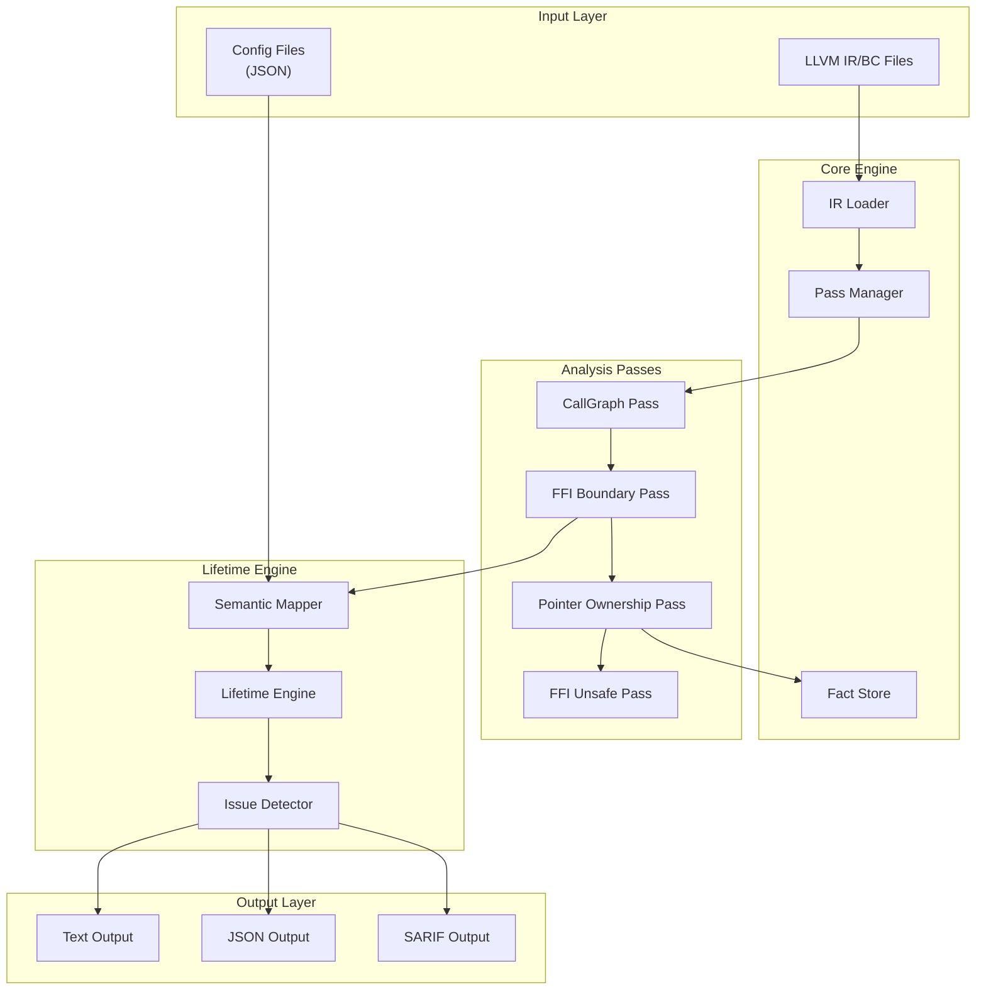
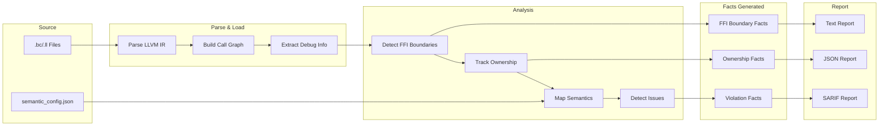
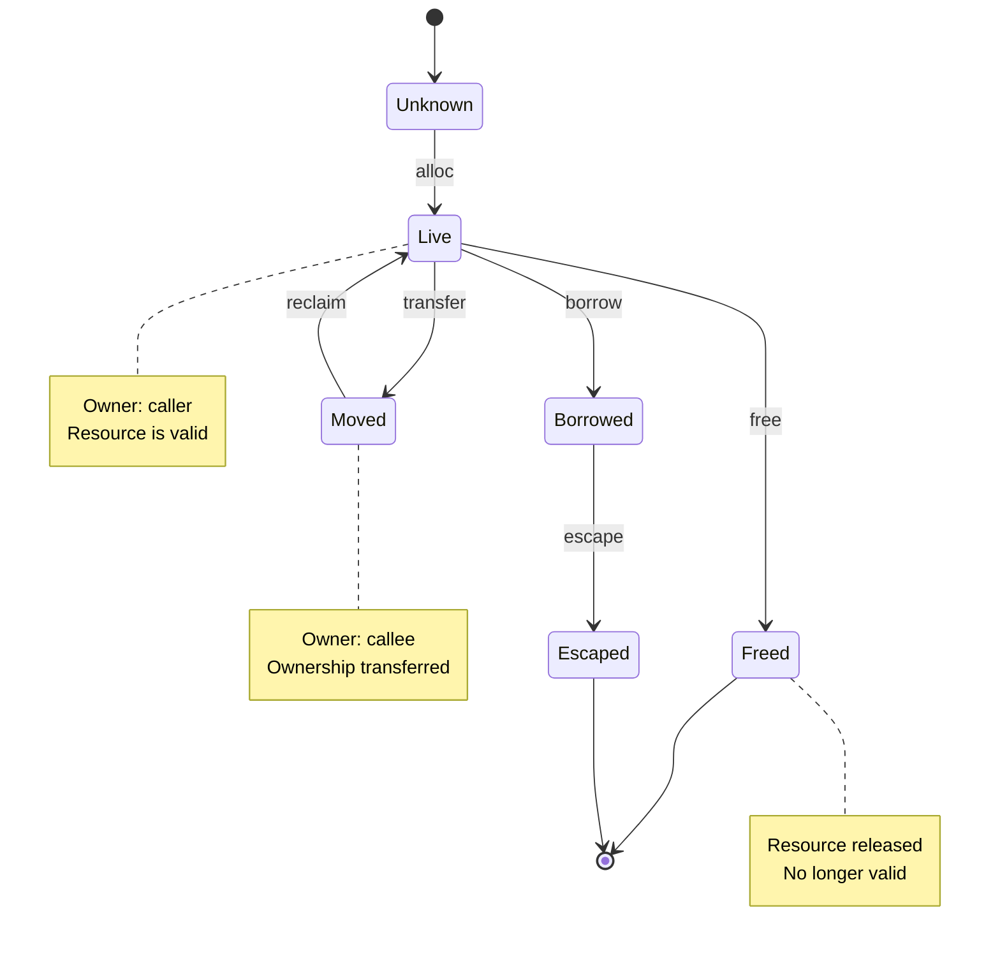
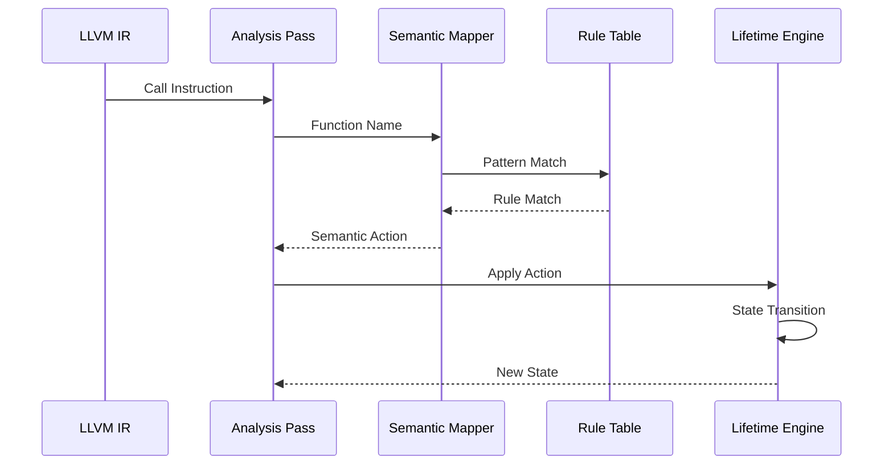

# OmniScope

**Cross-Language FFI/Unsafe Boundary Analyzer**

> Core features implemented, under active testing. Not production-ready.

OmniScope is a static analysis tool based on LLVM IR, focused on security vulnerability detection across language FFI boundaries.

## Key Innovations

### 1. Resource Lifetime Engine

**Not a Rust-specific borrow checker, but a universal resource lifetime analysis.**

Traditional tools:

- Focus on single-language memory safety
- Cannot track ownership transfer across language boundaries

OmniScope's solution:

```
Resource Lifetime = Who owns + Is valid + Has escaped

Owner: unknown | caller | callee | shared | system
State: unknown | live | moved | borrowed | freed | escaped | invalid
Action: alloc | free | borrow | transfer | reclaim | escape
```

This enables analysis of:

- Rust ↔ C ownership transfer
- Zig ↔ C allocator semantics
- Go ↔ C cgo memory management
- C++ ↔ C RAII boundaries

### 2. Semantic Registry

**Data-driven function semantic mapping, not if-else hell.**

```zig
pub const Rule = struct {
    symbol_pattern: []const u8,  // Function name pattern
    action: SemanticAction,       // Semantic action
    arg_index: ?u8,               // Resource argument index
    returns_resource: bool,       // Whether returns resource
};
```

Adding new language support = adding new rules, no code changes needed.

### 3. Precise Source Location

Extract exact filename, line, and column through LLVM Debug Info:

```
[CRITICAL] FFI RISK: dangerous_process -> _system
  Location: /path/to/dangerous.c:54:5
  Kind: command_exec
  Detail: Execute shell command - command injection risk
```

### 4. Cross-Language FFI Boundary Detection

| Caller | Callee | Support         |
| ------ | ------ | --------------- |
| Rust   | C      | ✅ Beta          |
| C++    | C      | ✅ Beta          |
| Go     | C      | ⚠️ Experimental |
| Zig    | C      | ⚠️ Experimental |
| C      | C      | ✅ Supported     |

## Detected Vulnerabilities

| Type               | Condition                                 | Severity |
| ------------------ | ----------------------------------------- | -------- |
| Command Injection  | `system()`, `popen()`, etc.               | CRITICAL |
| Buffer Overflow    | `strcpy()`, `strcat()`, `sprintf()`, etc. | HIGH     |
| Double Free        | Same resource freed twice                 | HIGH     |
| Use After Free     | Use after free                            | HIGH     |
| Memory Leak        | Resource not freed                        | MEDIUM   |
| Format String      | `printf()` family vulnerabilities         | MEDIUM   |
| Ownership Mismatch | Inconsistent ownership across boundaries  | HIGH     |
| Borrow Escape      | Borrow escaped to unknown scope           | MEDIUM   |

## Quick Start

### Prerequisites

- Zig 0.15+
- LLVM 18+ (macOS: `brew install llvm`)

### Build

```bash
make build    # Build project
make check    # Type check
make test     # Run tests
```

### Run Analysis

```bash
# Analyze single LLVM IR file
./zig-out/bin/OmniSope target.bc

# Analyze cross-language FFI
./zig-out/bin/OmniSope combined.bc
```

### Run All Test Examples

```bash
make run      # Build and run all FFI tests
```

## Architecture

### System Architecture



### Data Flow



### Lifetime Engine Flow



### Semantic Mapping Flow



## Directory Structure

```
src/
├── lifetime/           # Resource Lifetime Engine
│   ├── engine.zig      # Core engine
│   └── mapper.zig      # Semantic mapping
├── registry/           # Semantic Registry
│   ├── semantic_registry.zig  # Built-in semantics
│   └── config_loader.zig      # Config file loading
├── pass/               # Pass system
│   └── analysis/       # Analysis passes
├── fact/               # Fact storage
├── diag/               # Issue definitions
└── ir/                 # LLVM wrappers
```

## Usage Examples

### 1. Rust → C FFI

```bash
make rust-run
```

Expected detections:

- `system()` command injection (CRITICAL)
- `strcpy()` buffer overflow (HIGH)
- `malloc()` ownership transfer (MEDIUM)

### 2. C++ → C FFI

```bash
make cpp-run
```

Detects when C++ calls C functions:

- Ownership transfer across boundaries
- Dangerous C function calls

### 3. Go → C FFI

```bash
make go-run
```

Detects memory safety issues when Go calls C via cgo.

### 4. Zig → C FFI

```bash
make zig-run
```

Detects allocator semantics issues when Zig calls C functions.

## Custom Wrapper Configuration

Add project-specific wrapper function semantics via JSON config:

```json
{
  "functions": [
    {
      "pattern": "run_command",
      "match_type": "exact",
      "kind": "command_exec",
      "severity": "critical",
      "requires_taint_check": true,
      "description": "Execute shell command wrapper"
    }
  ]
}
```

## Output Example

```
========================================
Test 1: Rust → C FFI
========================================

[CRITICAL] FFI RISK: dangerous_process -> _system
  Location: /path/to/dangerous.c:54:5
  Kind: command_exec
  Detail: Execute shell command - command injection risk

[HIGH] FFI RISK: dangerous_copy -> __strcpy_chk
  Location: /path/to/dangerous.c:84:5
  Kind: unchecked_copy
  Detail: Unchecked string copy - buffer overflow risk

[MEDIUM] RISKY LIBC CALL: dangerous_alloc -> malloc
  Location: /path/to/dangerous.c:107:20
  Kind: allocator
  Detail: Allocate memory - returns ownership, check for null
  Warning: This function TRANSFERS ownership
  Warning: Result requires NULL check

FFI Analysis Summary:
  Functions analyzed: 99
  FFI Boundaries: 62
  Dangerous calls: 12
  Semantic Registry: 18 functions known

PointerOwnership: Found 1 allocations, 1 frees, 1 tracked pointers
PointerOwnership: 1 cross-FFI ownership transfers detected
```

## Test Coverage

| Example         | Languages | Bugs Detected      | Detection Rate |
| --------------- | --------- | ------------------ | -------------- |
| rust\_ffi\_demo | Rust → C  | 6 intentional bugs | 6/6 (100%)     |
| cpp\_cffi       | C++ → C   | 7 intentional bugs | 7/7 (100%)     |
| go\_cffi        | Go → C    | 9 intentional bugs | 8/9 (89%)      |
| zig\_cffi       | Zig → C   | 8 intentional bugs | 7/8 (88%)      |

> **Note**: These are preliminary results from controlled test cases. Real-world accuracy may vary. We are actively collecting more test data to establish reliable precision/recall metrics.

See [examples/TEST\_RESULTS.md](examples/TEST_RESULTS.md) for details.

## Limitations

1. **Requires compiled LLVM IR** - Cannot analyze source code directly
2. **Primarily intra-procedural** - Limited inter-procedural data flow
3. **Depends on Debug Info** - Only symbol names without debug info
4. **Dynamic features** - Function pointers and virtual calls are hard to track

## Performance Benchmarks

```bash
make bench    # Run performance benchmarks
```

| Scale  | Functions | Target Time | Target Memory |
| ------ | --------- | ----------- | ------------- |
| Small  | \~100     | < 100ms     | < 50MB        |
| Medium | \~1K      | < 1s        | < 200MB       |
| Large  | \~10K     | < 10s       | < 1GB         |

Current benchmark results (ReleaseFast, M1 Pro):

- FactStore Insert: \~2.5μs/iter (100K facts)
- Registry Lookup: \~33ns/iter (known function)
- FFI Detection: \~2ns/iter

See [bench/README.md](bench/README.md) for details.

## License

MIT License
