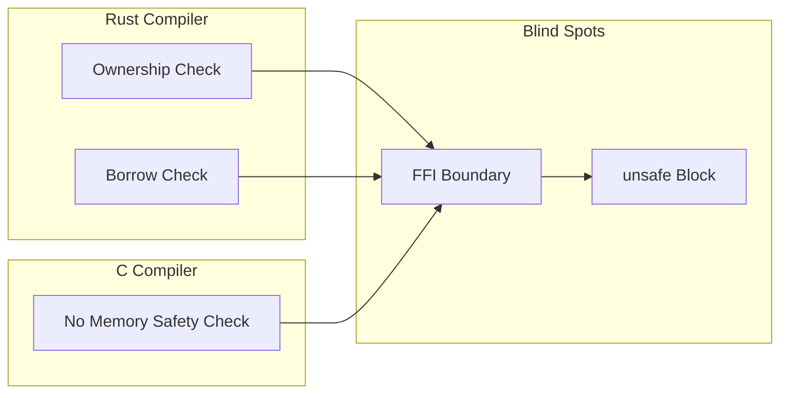
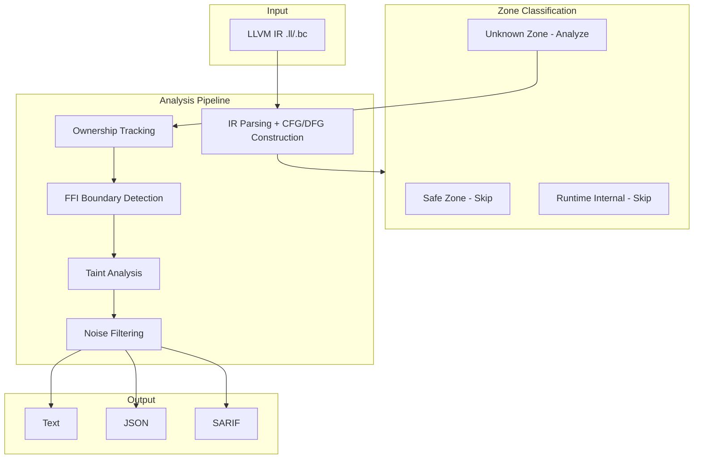
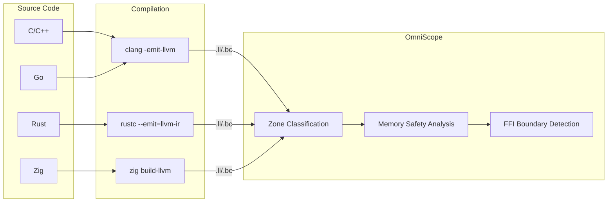
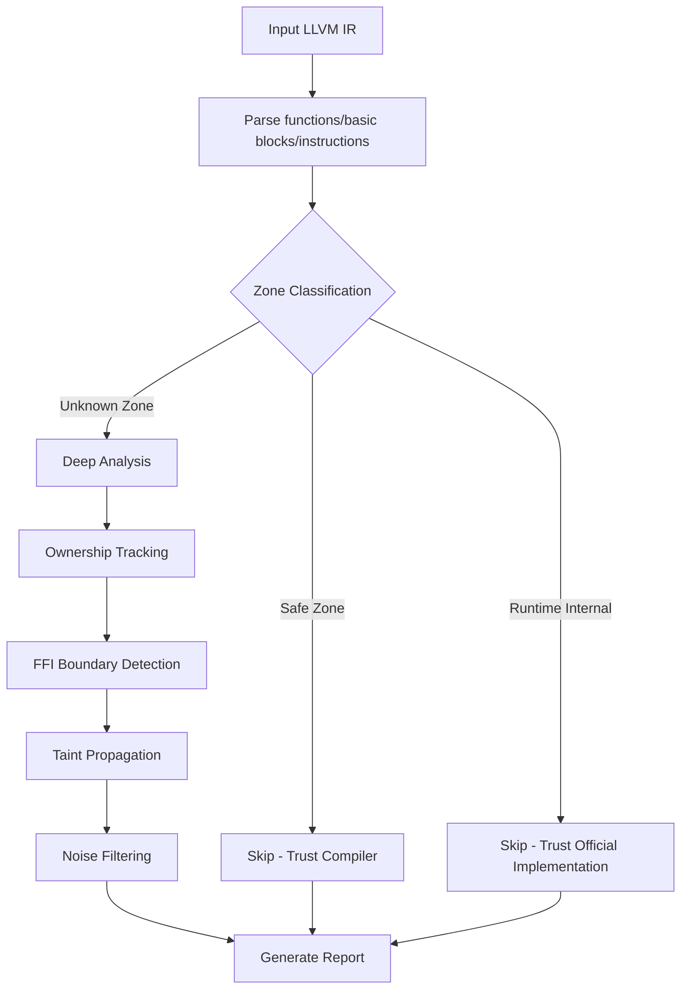

# OmniScope

**Cross-Language FFI & Memory Safety Static Analyzer**

**Project Focus**: Static security analysis specialized for unsafe/FFI cross-language boundaries

Supports C/C++/Rust/Zig/Go. Detects memory safety issues and FFI boundary violations via LLVM IR.

English | [简体中文](./README_ZH.md)

---

## Core Philosophy

### Why Focus on unsafe/FFI?

**Language boundaries are blind spots for every compiler.**



- Rust compiler only checks Rust-side ownership
- C compiler only sees C-side malloc/free
- **Cross-language boundary = where compilers don't look**

### Zone Classification (Core Innovation)

v0.1.5 introduces Zone Classification, analyzing only where language guarantees stop:

| Zone Type | Meaning | Handling |
|-----------|---------|----------|
| **Safe Zone** | Code with language safety guarantees | Skip analysis (trust compiler) |
| **Runtime Internal** | Language runtime/standard library | Skip analysis (trust official implementation) |
| **Unknown Zone** | Code without language guarantees | Deep analysis (must check) |

**Effect**:
```
Before: "Found 185 UAFs"  ❌ Many false positives
Now: "Analyzed 267 functions, skipped 171 (64%), found 48 issues"  ✅ Clear and credible
```

---

## Architecture



## Data Flow



## Analysis Flow



---

## Detection Capabilities

| Type | Severity | Example |
|------|----------|---------|
| Memory Leak | MEDIUM | malloc without free |
| Use-After-Free | HIGH | Dereference after free |
| Double-Free | HIGH | Same resource freed twice |
| Null Pointer Dereference | MEDIUM | Unchecked nullable pointer |
| Format String | MEDIUM | User-controlled format string |
| Command Injection | CRITICAL | system with user input |
| FFI Ownership Violation | HIGH | Rust Box freed by C |

---

## Quick Start

```bash
# Build
zig build

# Analyze single file
./zig-out/bin/omniscope target.ll

# JSON output
./zig-out/bin/omniscope --format json target.ll > report.json

# SARIF output (GitHub Code Scanning)
./zig-out/bin/omniscope --format sarif target.ll > results.sarif
```

| Dependency | Version |
|------------|---------|
| Zig | 0.15.2+ |
| LLVM | 18+ |

---

## Real Project Testing

### Zone Classification Effectiveness

| Project | Language | Functions | Safe | Runtime | Unknown | Skip % | Issues |
|---------|----------|-----------|------|---------|---------|--------|--------|
| ring | Rust + C | 278 | 261 | 17 | 0 | **100%** | 0 |
| wasmtime | Rust | 619 | 239 | 221 | 159 | **74.3%** | 96 |
| blst | Rust + C | 267 | 39 | 132 | 96 | **64.0%** | 48 |
| zlib-binding | C | 12 | 0 | 0 | 12 | 0% | 14 |
| openssl-wrapper | C | 12 | 0 | 0 | 12 | 0% | 7 |
| sqlite-binding | C | 8 | 0 | 0 | 8 | 0% | 4 |

### wasmtime Source Code Verification

OmniScope detected real issues in wasmtime and performed source code verification:

**Verified Source Code Facts**:

1. **fiber_start ignores array_call return value**
   - Source location: `crates/wasmtime/src/runtime/vm/stack_switching/stack/unix.rs:326-328`
   - Developer has marked this issue with TODO comment

2. **occupy_next_slots missing capacity check**
   - Source location: `crates/cranelift/src/func_environ/stack_switching/instructions.rs:301-320`
   - Comment claims capacity check, but actual code doesn't check

See: [wasmtime Source Verification Report](./docs/investigation_reports/en/wasmtime_source.md)

---

## Performance Improvement

| Metric | 优化前 | 优化后 | Improvement |
|--------|--------|--------|-------------|
| Analysis Time (blst) | 3100ms | 836ms | **73%** |
| Analysis Time (ring) | 793ms | 269ms | **66%** |
| Function Analysis Reduction | - | - | **Up to 100%** |
| Issue Detection Precision | 185 UAFs | 48 issues | **74% improvement** |

---

## A Letter to Users

> This isn't a technical document. It's a few words from someone who's been haunted by cross-language memory bugs for two years, written for anyone who's been there.

**2 AM, Production, Crash Log**:

```
double free detected in thread 0
  pointer 0x7f3a4c002010
  previously freed at: rust::ffi::Box::into_raw -> c_wrapper::process -> free
  second free at: rust::drop::Drop::drop -> Box::from_raw -> free
```

I ran this in test environments a hundred times. A hundred. Never reproduced. Day one in production. Boom.

The reason: Rust handed memory to C via `Box::into_raw()`, C called `free()` on it, but Rust's `Drop` trait didn't get the memo and `free()`'d it again.

**The compiler doesn't care. Cross-language boundaries are blind spots for every compiler.**

Full content: [To Everyone Who's Been Burned by FFI](./docs/TOUSER/en.md)

---

## Project Structure

```
src/
├── pass/analysis/           # Analysis Passes
│   ├── pointer_ownership.zig    # Ownership tracking
│   ├── ffi_boundary.zig         # FFI boundary detection
│   ├── taint.zig                # Taint analysis
│   └── noise_reduction.zig      # Noise filtering
├── semantics/               # Semantic analysis
│   └── zone_classifier.zig      # Zone Classification
├── ir/                      # LLVM IR interface
├── registry/                # Function semantic registry
└── output/                  # Output formatting

docs/
├── TOUSER/                  # Letters to users
├── investigation_reports/   # Detailed investigation reports
└── project_exports/         # Comprehensive test reports
```

---

## Documentation

| Document | Description |
|----------|-------------|
| [Letter to Users](./docs/TOUSER/en.md) | Why this project exists |
| [Comprehensive Report](./docs/project_exports/en/COMPREHENSIVE_REPORT.md) | 12 project test results |
| [Performance Report](./docs/project_exports/en/PERFORMANCE_IMPROVEMENT.md) | v0.1.5 performance data |
| [wasmtime Source Verification](./docs/investigation_reports/en/wasmtime_source.md) | Real vulnerability verification |
| [FFI-Dense Project Report](./docs/investigation_reports/en/ffi_dense.md) | 25 real issues |

---

## Limitations

1. Requires LLVM IR input (`clang -emit-llvm` or `rustc --emit=llvm-ir`)
2. Compiling with debug info (`-g`) is recommended for source location mapping
3. Indirect calls via function pointers are resolved heuristically
4. Primarily intra-procedural analysis (ownership tracking supports inter-procedural)

---

## Acknowledgements

Special thanks to [@icehawk-hyb](https://github.com/icehawk-hyb) for serving as technical advisor, providing critical guidance on cross-language security analysis.

---

## License

Apache 2.0
