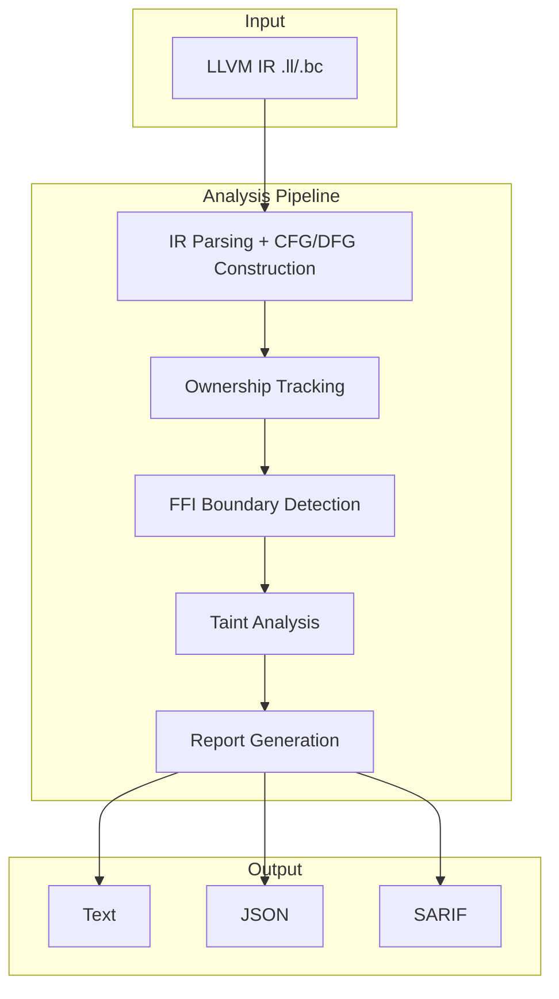
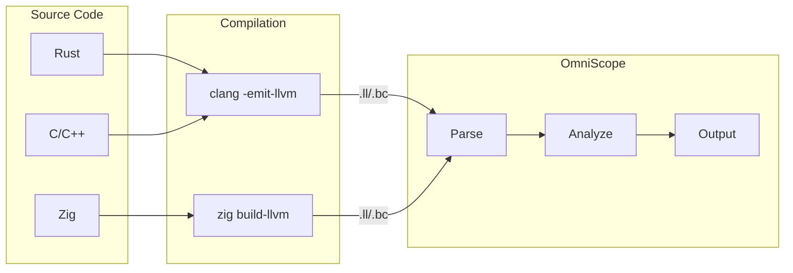
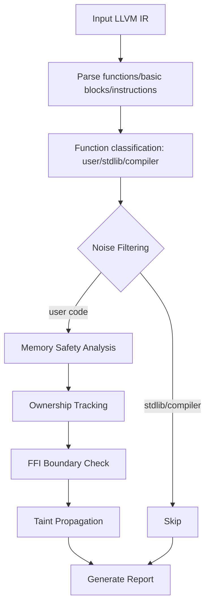
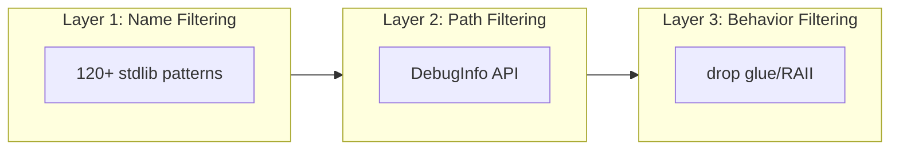

# OmniScope

**Cross-Language FFI & Memory Safety Static Analyzer**

Supports C/C++/Rust/Zig. Analyzes memory safety issues and FFI boundary violations via LLVM IR.

## Overview

OmniScope is a static analysis tool focused on cross-language boundaries. By analyzing LLVM IR, it detects:

- **Memory safety issues**: memory leaks, use-after-free, double-free, null pointer dereference
- **FFI boundary violations**: ownership confusion and type mismatches across language boundaries
- **Security vulnerabilities**: format string vulnerabilities, command injection

Key features:

| Feature | Description |
|---------|-------------|
| Cross-language | Unified analysis of C/C++/Rust/Zig mixed codebases |
| Low false positive | Three-layer noise filtering, Rust project FP rate < 1% |
| Non-intrusive | Only requires LLVM IR, no source code modification needed |
| Multi-format output | Text, JSON, SARIF (GitHub Code Scanning compatible) |

## Acknowledgements

Special thanks to [@icehawk-hyb](https://github.com/icehawk-hyb) for serving as technical advisor, providing critical guidance on cross-language security analysis.

## Quick Start

```bash
zig build
./zig-out/bin/omniscope target.ll
./zig-out/bin/omniscope --format json target.ll > report.json
```

| Dependency | Version |
|------------|---------|
| Zig | 0.15.2+ |
| LLVM | 18+ |

## Architecture



## Data Flow



## Core Detection Mechanisms

### Analysis Flow



### Ownership Tracking

Tracks each pointer's lifecycle via a resource state machine:

| State | Description | Transition |
|-------|-------------|------------|
| `Allocated` | Allocated, uninitialized | malloc/alloc |
| `Owned` | Ownership held | store/initialize |
| `Borrowed` | Borrowed reference | pass-by-reference/address-of |
| `Freed` | Released | free/dealloc |
| `Escaped` | Escaped to unknown context | stored in global/returned |

Detection rules:
- `Freed` → `Owned`/`Borrowed` = **Use-after-free**
- `Freed` → `Freed` = **Double-free**
- `Owned` → function end ≠ `Freed` = **Memory leak**

### FFI Boundary Detection

Ownership contract verification at cross-language call boundaries:

| Boundary | Detection |
|----------|-----------|
| Rust → C | `Box::into_raw` must be freed by C side |
| C → Rust | `Box::from_raw` must correspond to `into_raw` |
| Zig → C | Allocator-managed memory must not be passed to C free |
| C++ → C | unique_ptr managed resources must not cross boundaries |

### Taint Analysis

Data flow tracking from dangerous sources to dangerous sinks:

**Taint sources** (35+):
- User input: `argv`, `getenv`, `read`, `fgets`
- Network data: `recv`, `accept`, `curl_easy_recv`
- Dynamic loading: `dlsym`, `mmap`

**Dangerous sinks**:
- Memory operations: `memcpy`, `strcpy` (buffer overflow)
- Formatting: `printf`, `sprintf` (format string)
- Command execution: `system`, `popen` (command injection)

## Noise Filtering



| Layer | Technique | Effect |
|-------|-----------|--------|
| Name filtering | Match stdlib function name patterns | Filters 80% stdlib false positives |
| Path filtering | LLVM DebugInfo source path detection | Precise identification of /rustc/, zig/lib/std/ |
| Behavior filtering | Recognize drop glue, RAII patterns | Filters destructor false positives |

## Detection Capabilities

| Type | Severity | Example |
|------|----------|---------|
| Memory leak | MEDIUM | malloc without free |
| Use-after-free | HIGH | Dereference after free |
| Double-free | HIGH | Same resource freed twice |
| Null pointer dereference | MEDIUM | Unchecked nullable pointer |
| Format string | MEDIUM | User-controlled format string |
| Command injection | CRITICAL | system with user input |
| FFI ownership violation | HIGH | Rust Box freed by C |

## Benchmark Results

### Open Source Project Testing

| Project | Language | Functions | Issues | Notes |
|---------|----------|-----------|--------|-------|
| wasmtime | Rust | 987 | 9 | WebAssembly runtime |
| ripgrep | Rust | 75 | 0 | Text search tool |
| abseil-cpp | C++ | 193 | 0 | Google base library |
| SQLite | C | 3346 | 37 | Database engine |
| libcurl | C | 68 | 29 | Networking library |
| libuv | C | 145 | 30 | Async I/O library |

### Noise Filtering Effectiveness

| Project | Before | After | Reduction |
|---------|--------|-------|-----------|
| wasmtime | 4023 | 9 | 99.8% |
| ripgrep | 3 | 0 | 100% |
| abseil-cpp | 5 | 0 | 100% |

### Test Suite Results

| Metric | Result |
|--------|--------|
| Unit tests | All passed |
| Integration tests | 5/5 passed |
| Stability tests | 15/15 passed |
| Stress tests | 16/16 passed |

## Project Structure

```
src/
├── pass/analysis/    # Analysis passes
│   ├── pointer_ownership.zig  # Ownership tracking
│   ├── ffi_boundary.zig       # FFI boundary detection
│   ├── taint.zig              # Taint analysis
│   └── noise_reduction.zig    # Noise filtering
├── ir/               # LLVM IR interface
├── registry/         # Function semantic registry
└── output/           # Output formatting
```

## Limitations

1. Requires LLVM IR input (`clang -emit-llvm` or `zig build-llvm`)
2. Compiling with debug info (`-g`) is recommended for source location mapping
3. Indirect calls via function pointers are resolved heuristically
4. Primarily intra-procedural analysis (ownership tracking supports inter-procedural)

## Documentation

| Document | Description |
|----------|-------------|
| [CHANGELOG.md](CHANGELOG.md) | Changelog |
| [RELEASE_NOTES.md](RELEASE_NOTES.md) | Release notes |
| [BASELINE.md](corpus/real_world/BASELINE.md) | Test benchmarks |

## License

Apache 2.0
