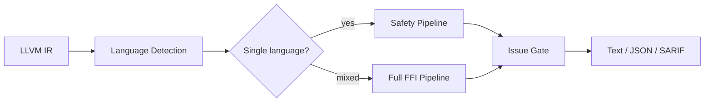
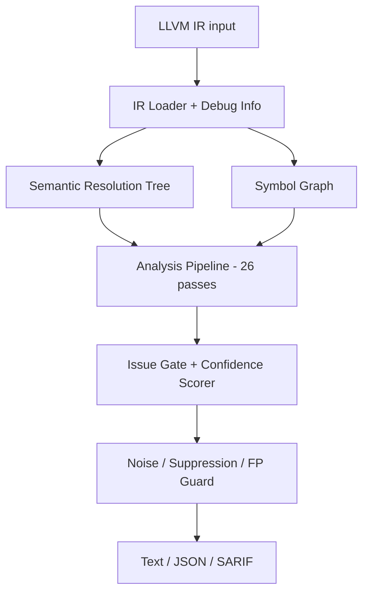
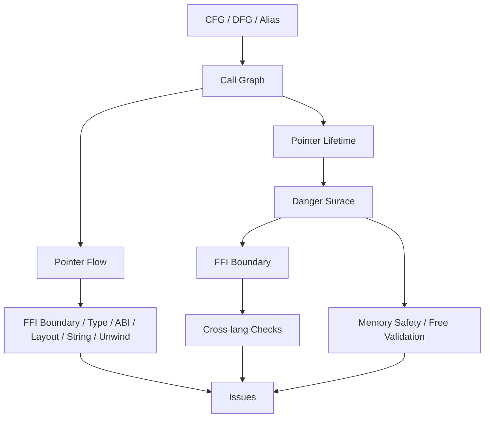

# OmniScope

```shell
    `....                                `.. ..
  `..    `..                         `.`..    `..
`..        `..`... `.. `.. `.. `..      `..         `...   `..    `. `..     `..
`..        `.. `..  `.  `.. `..  `..`..   `..     `..    `..  `.. `.  `..  `.   `..
`..        `.. `..  `.  `.. `..  `..`..      `.. `..    `..    `..`.   `..`..... `..
  `..     `..  `..  `.  `.. `..  `..`..`..    `.. `..    `..  `.. `.. `.. `.
    `....     `...  `.  `..`...  `..`..  `.. ..     `...   `..    `..       `....
                                                                   `..
```

OmniScope analyzes LLVM IR (`.ll` / `.bc`) and reports possible memory, ownership, resource, and FFI-boundary issues. It is useful when source-level tools stop at a language boundary and you still need to ask: where did this pointer come from, where did it go, and which side is responsible for releasing it?

It is not a proof tool. Treat reports as review evidence, not confirmed vulnerabilities.

Current version: `0.2.0`.

[中文 README](./README_zh.md) | [English docs](./docs/en/README.md) | [中文文档](./docs/zh/README.md) | [Release Notes](./RELEASE_NOTES.md) | [Changelog](./CHANGELOG.md)

## What OmniScope Detects



- **Cross-language free** — C `free()` on Rust `Box::into_raw()`, Go `_cgo_allocate` + C `free()`, C++ `operator delete` on `malloc`'d pointer
- **Use-after-free / Double free** — including Rust Drop-glue paths and C++ RAII destructor insertion
- **Memory leaks** — unmatched allocator/deallocator at FFI boundaries, missing `Drop` implementations
- **Buffer overflow** — unchecked `memcpy`/`strcpy`/`sprintf` across FFI boundaries, size type truncation
- **FFI unsafe calls** — `system()`, `popen()`, `execvp()` with user-controlled input
- **Ownership transfer** — `Box::into_raw()`, `CString::into_raw()`, `Vec::into_raw()` where caller assumes responsibility
- **Callback escape** — function pointer stored beyond caller lifetime
- **ABI mismatch** — `extern "C"` vs C++ mangling, JNI reference mismatch, Go CGO pointer passing

## Architecture



- **SRT** — 15+ semantic kinds for FP suppression
- **Symbol Graph** — per-symbol language/ABI classification with export surface detection
- **Issue Gate** — 10 suppression verdicts; only issues with confidence ≥ 0.85 pass
- **26 passes** — foundation, surface classification, FFI boundary, pointer lifetime, free validation, Rust FFI, callback escape, buffer overflow, and more

### Pipeline Structure



## Accuracy (v0.2.0)

| Metric | v0.1.x | v0.2.0 | Change |
|--------|--------|--------|--------|
| Total issues (42 projects) | ~2,955 | ~1,100 | -63% |
| Estimated FP count | ~1,966 | < 110 | -94% |
| FFI boundary precision | ~20% | 60%+ | +200% |
| Red team TP rate | ≥ 90% | ≥ 90% | Maintained |
| Double free detection | — | 100% | — |
| Cross-language free | — | 87% | — |
| Use-after-free | — | 80% | — |

### Known Limitations

- **Buffer overflow**: FFI size truncation and sprintf detected, but general pattern detection is incomplete — planned for v0.2.1
- **`ffi_unsafe_call` noise**: ~90% of issue volume is low-confidence noise — partially fixed, full fix requires Batch 3 refactor
- **`cross_language_free` gate**: `free_validation.zig` depends on `DangerSurfacePass`; pass may produce no results when `danger_surface_relevant` is empty
- **Rust mangled alloc tracking**: `_R`-prefixed allocator symbols not recognized by `isAllocFunction()`
- **Missing pass dependencies**: `layout_mismatch`, `string_safety_ffi`, `unwind-boundary` have empty `deps` despite depending on FFI boundary state

## Build and Run

Requires Zig ≥ 0.15.2 and LLVM 22.

```bash
zig build -Doptimize=ReleaseFast
./zig-out/bin/OmniScope path/to/input.bc --json
./zig-out/bin/OmniScope path/to/input.bc --sarif -o results.sarif
```

```bash
# Filter by severity and boundary
./zig-out/bin/OmniScope input.bc --boundary-only --min-severity high --json

# Language override for ambiguous modules
./zig-out/bin/OmniScope input.bc --lang-prefix sqlite3_=c --default-lang rust

# Export surface reporting
./zig-out/bin/OmniScope input.bc --report-surfaces --json

# Focus on user code, suppress stdlib/compiler noise
./zig-out/bin/OmniScope input.bc --focus-user-code --json
```

## Test and Verify

```bash
zig build                  # compile
zig build test             # run tests (87 inline-IR tests)
make baseline-check        # check against expected results
make corpus-check          # run corpus verification
```

## License

[Apache 2.0](./LICENSE)
