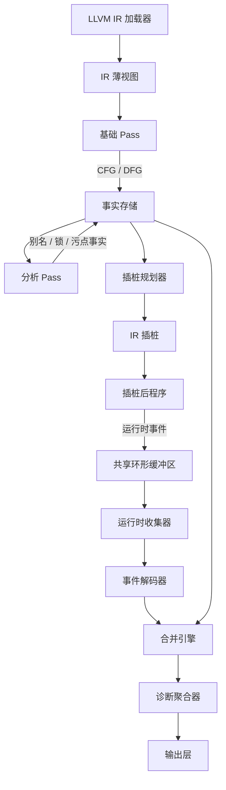
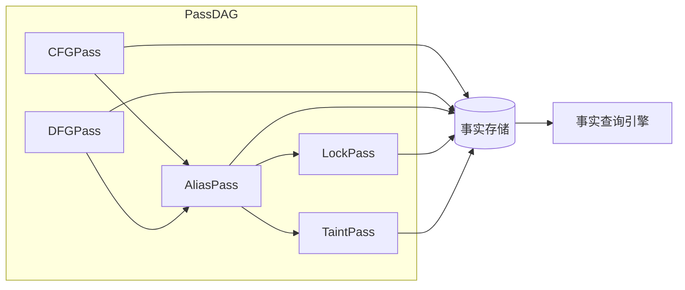

# OmniScope

基于 Zig 构建的通用 LLVM 分析框架，具有事实图核心和静态引导运行时验证引擎。

## 概述

OmniScope 是一个生产级代码检测框架，专为分析 LLVM 中间表示（IR）而设计。它通过事实图架构将静态分析与运行时验证相结合，能够高效地检测错误、安全漏洞和性能问题。

## 核心特性

- **事实图核心**: 用于进程间通信的统一数据结构
- **零成本抽象**: 通过编译时 pass 接口实现无运行时开销
- **SoA 内存布局**: 结构数组布局实现缓存友好的事实存储
- **静态引导运行时**: 静态分析指导插桩，实现高效的运行时验证
- **插件系统**: 可扩展的 C 兼容 ABI，支持自定义分析 pass
- **无锁运行时**: 使用环形缓冲区实现高效事件收集

## 架构



## Pass 系统



## 项目结构

```
OmniSope/
├── build.zig              # 构建配置
├── Makefile               # 构建自动化
├── README.md              # 英文说明文档
├── README_zh.md           # 中文说明文档
│
├── src/
│   ├── main.zig           # CLI 入口点
│   ├── root.zig           # 库公共 API
│   │
│   ├── ir/                # IR 层（薄包装器）
│   │   ├── llvm_c.zig     # LLVM-C API 绑定
│   │   ├── view.zig       # 基于指针的 IR 视图
│   │   └── location.zig   # 源代码位置处理
│   │
│   ├── pass/              # Pass 系统
│   │   ├── pass.zig       # 编译时 Pass 接口
│   │   ├── manager.zig    # Pass 管理器
│   │   ├── foundation/    # 基础 pass
│   │   │   ├── cfg.zig    # 控制流图
│   │   │   └── dfg.zig    # 数据流图
│   │   ├── analysis/      # 分析 pass
│   │   └── instrumentation/ # 插桩 pass
│   │
│   ├── fact/              # 事实系统
│   │   ├── fact.zig       # 事实类型
│   │   ├── store.zig      # SoA 事实存储
│   │   └── query.zig      # 查询引擎
│   │
│   ├── runtime/           # 运行时子系统
│   │   ├── rt_lib/        # 运行时库
│   │   │   ├── probes.zig # 探针函数
│   │   │   └── ring_buffer.zig # 无锁环形缓冲区
│   │   ├── collector.zig  # 事件收集器
│   │   └── decoder.zig   # 事件解码器
│   │
│   ├── diag/              # 诊断
│   │   ├── diag.zig       # 诊断类型
│   │   └── aggregator.zig # 诊断聚合
│   │
│   ├── plugin/            # 插件系统
│   │   ├── abi.zig        # 插件 ABI
│   │   └── host.zig       # 插件宿主
│   │
│   └── output/            # 输出适配器
│       ├── cli.zig        # CLI 输出
│       ├── sarif.zig      # SARIF 格式
│       └── lsp.zig        # LSP 集成
│
├── docs/                  # 文档目录
│   ├── user_guide.md      # 用户指南（英文）
│   ├── user_guide_zh.md   # 用户指南（中文）
│   ├── developer_guide.md # 开发者指南（英文）
│   ├── developer_guide_zh.md # 开发者指南（中文）
│   ├── api_reference.md   # API 参考（英文）
│   └── api_reference_zh.md # API 参考（中文）
│
└── plan/                  # 设计文档
    ├── improve.md         # 架构规范
    ├── plan.md            # 初始计划
    └── zig_coding_guide.md # 编码指南
```

## 构建项目

### 前置要求

- Zig 0.15.2 或更高版本
- LLVM 开发库（用于 LLVM-C API）

### 构建命令

```bash
# 构建项目
make build

# 运行测试
make test

# 检查编译错误
make check

# 格式化代码
make fmt

# 清理构建产物
make clean
```

### 构建选项

```bash
# 启用链接时优化
zig build -Denable-lto=true

# 以发布模式构建
zig build -Doptimize=ReleaseFast

# 为特定目标构建
zig build -Dtarget=x86_64-linux-gnu

# 指定 LLVM 路径
zig build -Dllvm-path=/custom/path/to/llvm
```

## 使用方法

### 命令行界面

```bash
# 分析位码文件
./zig-out/bin/OmniSope input.bc

# 启用特定 pass
./zig-out/bin/OmniSope --passes=cfg,dfg,alias input.bc

# 输出 SARIF 格式
./zig-out/bin/OmniSope --output=sarif results.json input.bc

# 运行演示
make demo

# 运行集成测试
make integration-test

# 运行端到端测试
make e2e-test
```

### 库使用示例

```zig
const std = @import("std");
const OmniScope = @import("OmniScope");

pub fn main() !void {
    var gpa = std.heap.GeneralPurposeAllocator(.{}){};
    defer _ = gpa.deinit();
    const allocator = gpa.allocator();

    // 初始化事实存储
    var store = OmniScope.fact.FactStore.init(allocator);
    defer store.deinit();

    // 插入事实
    try store.insert(.cfg_edge, 1, 2, 0);

    // 查询事实
    var engine = OmniScope.fact.QueryEngine.init(&store);
    const facts = try engine.queryByKind(.cfg_edge, allocator);
    defer allocator.free(facts);
}
```

## Pass 开发

### 创建自定义 Pass

```zig
const std = @import("std");
const Pass = OmniScope.pass.Pass;
const PassContext = OmniScope.pass.PassContext;
const DiagnosticWriter = OmniScope.pass.DiagnosticWriter;

pub const MyPass = struct {
    pub const name = "my-pass";
    pub const kind = OmniScope.pass.PassKind.analysis;
    pub const deps = &[_][]const u8{"cfg"};

    pub fn run(ctx: *PassContext, diag: *DiagnosticWriter) !void {
        // Pass 实现代码
    }
};

const ValidatedPass = Pass(MyPass);
```

## 设计原则

1. **IR 层最小化**: IR 层保持极简，仅包装 LLVM-C 指针，不进行缓存或计算
2. **事实图作为单一真相源**: 所有 pass 通过事实图通信，确保一致性
3. **静态引导运行时**: 运行时插桩由静态分析结果引导，提高效率
4. **零成本抽象**: 使用编译时特性实现无运行时开销的抽象
5. **仅追加事实存储**: 支持并行访问和高效查询

## 测试

```bash
# 运行所有测试
make test

# 运行特定测试
zig test src/fact/store.zig

# 使用模糊测试
zig build test --fuzz
```

## 贡献指南

请遵循以下贡献指南：

- 所有注释必须使用英文
- 单文件限制：1000 行
- 修改后运行 `make fmt`
- 确保 `make check` 显示 0 错误
- 编写有意义的测试以检测隐藏的 bug

## 文档

详细文档请参见 `docs/` 目录：

- **用户指南**: 如何安装、配置和使用 OmniScope
- **开发者指南**: 如何贡献代码、开发新 pass 和插件
- **API 参考**: 完整的 API 文档和示例

## 当前状态

- ✅ 事实存储系统（SoA 布局）
- ✅ Pass 系统（编译时验证）
- ✅ IR 层（最小化 LLVM 包装器）
- ✅ 诊断系统（多种输出格式）
- ✅ 广泛的测试套件
- ✅ 可配置的构建系统
- ⚠️ 插桩系统（规划器存在，需要集成）
- ⚠️ 运行时系统（探针和环形缓冲区已定义）
- ⚠️ 合并系统（概念性，需要实现）
- ❌ 基础 pass（CFG、DFG）
- ❌ 分析 pass（别名、锁、污点）
- ❌ 插件宿主系统
- ❌ 完整的管道集成

## 已知问题

- LLVM 链接问题：测试因未定义的 LLVM 符号而失败
- 硬编码的 LLVM 路径：构建配置硬编码了 LLVM 路径，限制了可移植性
- 缺少 LLVM 版本抽象：没有处理不同 LLVM 版本的机制

## 许可证

[在此处指定您的许可证]

## 致谢

使用 Zig 和 LLVM 构建。架构灵感来自现代静态分析工具和数据流分析技术。

## 相关资源

- [Zig 编程语言](https://ziglang.org/)
- [LLVM 项目](https://llvm.org/)
- [项目架构文档](plan/improve.md)
- [Bug 报告](plan/bugs_report.md)