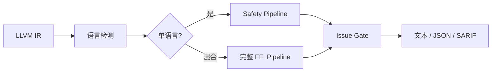
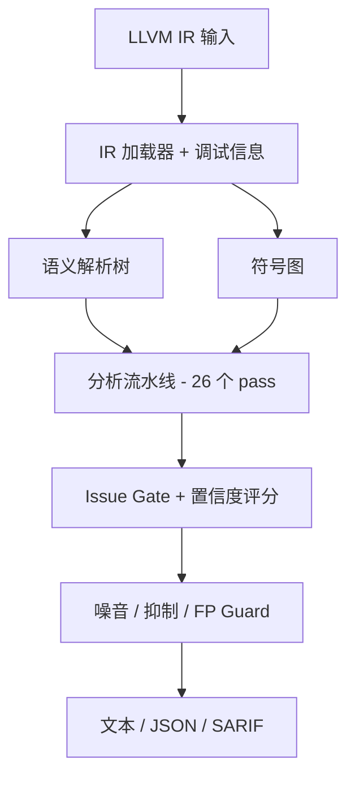
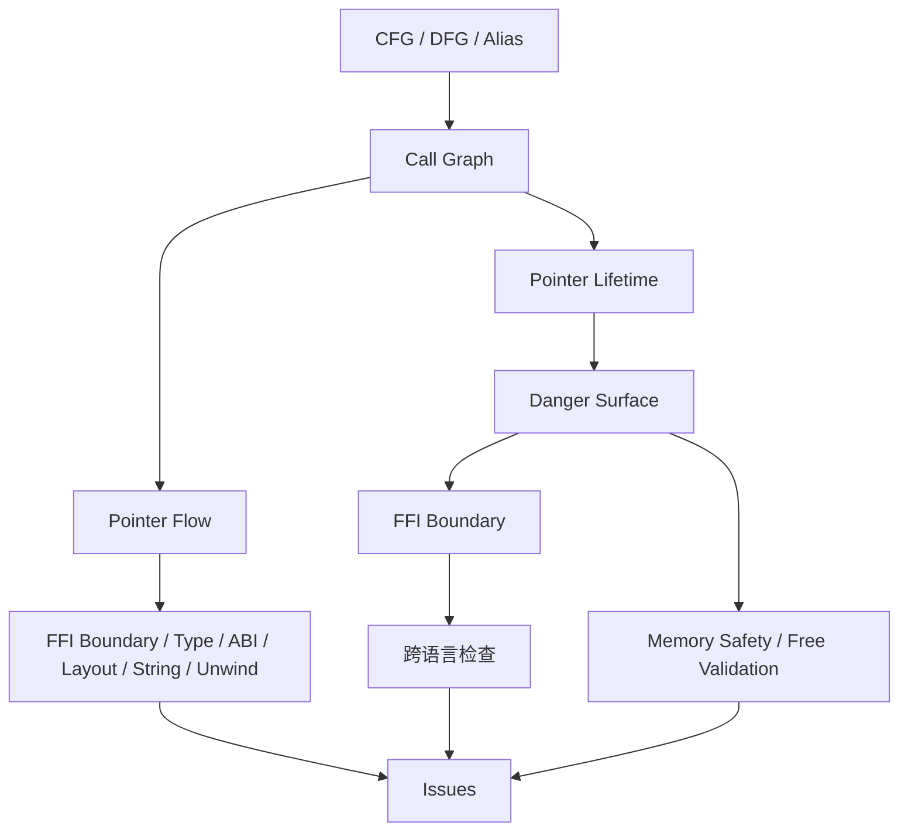

# OmniScope

```shell
    `....                                `.. ..
  `..    `..                         `.`..    `..
`..        `..`... `.. `.. `.. `..      `..         `...   `..    `. `..     `..
`..        `.. `..  `.  `.. `..  `..`..   `..     `..    `..  `.. `.  `..  `.   `..
`..        `.. `..  `.  `.. `..  `..`..      `.. `..    `..    `..`.   `..`..... `..
  `..     `..  `..  `.  `.. `..  `..`..`..    `.. `..    `..  `.. `.. `.. `.
    `....     `...  `.  `..`...  `..`..  `.. ..     `...   `..    `..       `....
                                                                   `..
```

OmniScope 分析 LLVM IR（`.ll` / `.bc`），报告可能的内存、所有权、资源和 FFI 边界问题。它适合在源码级工具到达语言边界后继续追问：这个指针或资源从哪里来、流向哪里、最终应该由谁释放。

它不是证明工具。报告应当作为审计证据，而不是已确认漏洞清单。

当前版本：`0.2.0`。

[English README](./README.md) | [English docs](./docs/en/README.md) | [中文文档](./docs/zh/README.md) | [发布说明](./RELEASE_NOTES.md) | [更新日志](./CHANGELOG.md)

## OmniScope 检测什么



- **跨语言释放** — C `free()` 释放 Rust `Box::into_raw()` 指针、Go `_cgo_allocate` + C `free()`、C++ `operator delete` 释放 `malloc` 分配的指针
- **释放后使用 / 双重释放** — 包括 Rust Drop 插入路径和 C++ RAII 析构函数插入
- **内存泄漏** — FFI 边界处分配/释放不匹配、缺失 `Drop` 实现
- **缓冲区溢出** — FFI 边界处的未检查 `memcpy`/`strcpy`/`sprintf`、size 类型截断
- **FFI 不安全调用** — 带用户可控输入的 `system()`/`popen()`/`execvp()`
- **所有权转移** — `Box::into_raw()`、`CString::into_raw()`、`Vec::into_raw()` 调用方承担释放责任
- **回调逃逸** — 函数指针存储到超出调用方生命周期的全局/长生命周期结构体
- **ABI 不匹配** — `extern "C"` vs C++ mangling、JNI 引用不匹配、Go CGO 指针传递

## 架构



- **SRT** — 15+ 语义类型用于 FP 抑制
- **符号图** — 每符号语言/ABI 分类 + 导出面检测
- **Issue Gate** — 10 种抑制判定；仅置信度 ≥ 0.85 的 issue 通过
- **26 个分析 pass** — 基础、surface 分类、FFI 边界、指针生命周期、释放校验、Rust FFI、回调逃逸、缓冲区溢出等

### Pipeline 结构



## 准确率（v0.2.0）

| 指标 | v0.1.x | v0.2.0 | 变化 |
|------|--------|--------|------|
| 总 issue 数（42 项目） | ~2,955 | ~1,100 | -63% |
| 估计 FP 数量 | ~1,966 | < 110 | -94% |
| FFI 边界精确率 | ~20% | 60%+ | +200% |
| 红队 TP 率 | ≥ 90% | ≥ 90% | 维持 |
| 双重释放检测率 | — | 100% | — |
| 跨语言释放检测率 | — | 87% | — |
| 释放后使用检测率 | — | 80% | — |

### 已知限制

- **缓冲区溢出**：FFI size 截断和 sprintf 已可检测，但通用模式检测不完整 — 计划 v0.2.1
- **`ffi_unsafe_call` 噪音**：约 90% issue 量为低置信度噪音 — 部分修复，完整修复需要 Batch 3 重构
- **`cross_language_free` 门控**：`free_validation.zig` 依赖 `DangerSurfacePass`；当 `danger_surface_relevant` 为空时 pass 可能无产出
- **Rust mangled alloc 追踪**：`_R` 前缀的分配器符号不被 `isAllocFunction()` 识别
- **缺少 pass 依赖声明**：`layout_mismatch`、`string_safety_ffi`、`unwind-boundary` 的 `deps` 为空，但实际依赖 FFI 边界状态

## 构建和运行

需要 Zig ≥ 0.15.2 和 LLVM 22。

```bash
zig build -Doptimize=ReleaseFast
./zig-out/bin/OmniScope path/to/input.bc --json
./zig-out/bin/OmniScope path/to/input.bc --sarif -o results.sarif
```

```bash
# 按严重度和边界过滤
./zig-out/bin/OmniScope input.bc --boundary-only --min-severity high --json

# 语言覆盖（用于歧义模块）
./zig-out/bin/OmniScope input.bc --lang-prefix sqlite3_=c --default-lang rust

# 导出面报告
./zig-out/bin/OmniScope input.bc --report-surfaces --json

# 聚焦用户代码，抑制 stdlib/编译器噪音
./zig-out/bin/OmniScope input.bc --focus-user-code --json
```

## 测试和验证

```bash
zig build                  # 编译
zig build test             # 运行测试（87 个内联 IR 测试）
make baseline-check        # 检查预期结果
make corpus-check          # 运行语料库验证
```

## 开源协议

[Apache 2.0](./LICENSE)
