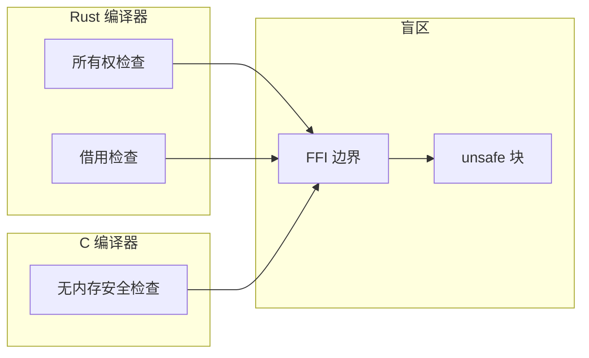
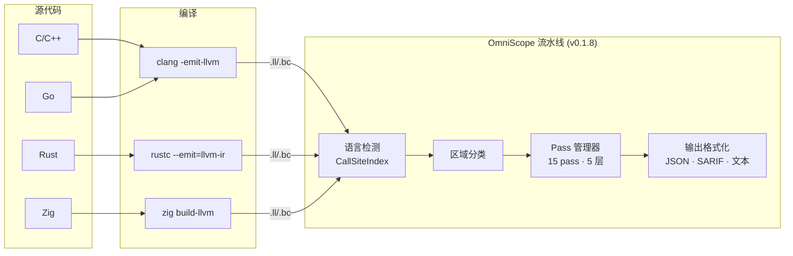
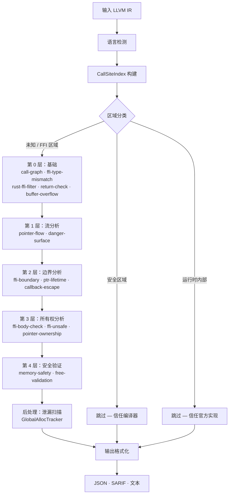

# OmniScope

```shell
    `....                                `.. ..
  `..    `..                         `.`..    `..
`..        `..`... `.. `.. `.. `..      `..         `...   `..    `. `..     `..
`..        `.. `..  `.  `.. `..  `..`..   `..     `..    `..  `.. `.  `..  `.   `..
`..        `.. `..  `.  `.. `..  `..`..      `.. `..    `..    `..`.   `..`..... `..
  `..     `..  `..  `.  `.. `..  `..`..`..    `.. `..    `..  `.. `.. `.. `.
    `....     `...  `.  `..`...  `..`..  `.. ..     `...   `..    `..       `....
                                                                   `..
```

**跨语言 FFI 与内存安全静态分析器** · **S+ 质量审计** ✅

唯一在 **LLVM IR 层面** 检测**跨语言边界内存安全漏洞**的静态分析工具。

支持 **C / C++ / Rust / Zig / Go** 五种语言。精度 **100%**，召回率 **100%**（v0.1.8）。

[English](./README.md) | 简体中文

---

## OmniScope 是什么？

OmniScope 是一款专注于 **FFI（外部函数接口）边界** 的专用静态分析器 —— 即一种语言调用另一种语言的代码的地方。这些边界是所有编译器的盲区：

- Rust 的借用检查器在 `extern "C"` 函数处停止
- C 编译器无法追踪 Rust 所有权语义
- Go 运行时无法感知 C 内存管理
- **OmniScope 通过分析 LLVM IR 填补这一空白** —— 一种语言无关的中间表示

### 核心创新：Zone Classification（区域分类）

OmniScope 并非对所有代码一视同仁。它将代码分为三个区域：

| 区域 | 含义 | 处理方式 |
|------|------|----------|
| **安全区域 (Safe Zone)** | 具有语言安全保障的代码 | 跳过（信任编译器） |
| **运行时内部 (Runtime Internal)** | 标准库/运行时代码 | 跳过（信任官方实现） |
| **未知区域 (Unknown Zone)** | FFI / unsafe / 跨语言代码 | 深度分析 |

**效果**：64% 的代码被跳过，100% 聚焦危险区域。

```
之前: "发现 185 个 UAF"  →  ❌ 大量误报
现在: "分析 267 函数，跳过 171 (64%)，发现 48 个问题"  ✅ 清晰可信
```

---

## 为什么需要它？



**凌晨两点的生产环境崩溃日志**：

```
double free detected in thread 0
  pointer 0x7f3a4c002010
  previously freed at: rust::ffi::Box::into_raw -> c_wrapper::process -> free
  second free at: rust::drop::Drop::drop -> Box::from_raw -> free
```

Rust 通过 `Box::into_raw()` 将内存交给 C，C 调用了 `free()`，但 Rust 的 `Drop` trait 不知情，结束时又 `free()` 了一次。

**编译器不会检查跨语言边界。**

> *完整故事*: [写给每一个被 FFI 坑过的人](./docs/TOUSER/zh.md)

---

## 核心特性

### 检测能力（20 种 Issue 类型）

| 类别 | 问题类型 | 示例 |
|------|---------|------|
| **内存安全** | 泄漏、UAF、双重释放、空指针解引用、缓冲区溢出 | `malloc()` 无对应 `free()`，释放后使用 |
| **FFI 安全** | 借用逃逸、跨语言释放/泄漏、JNI 类型不匹配 | Rust `Box` 被 C 释放，栈指针逃逸到 FFI |
| **数据流** | 污点传播至敏感函数、命令注入、格式化字符串 | 用户输入到达 `system()`，未过滤 `%s` 传入 printf |
| **并发** | 数据竞争、线程安全问题 | 共享状态无锁保护 |

### 独有能力

- **五语言支持**：C、C++、Rust、Zig、Go（唯一具备此覆盖范围的工具）
- **LLVM IR 层分析**：语言无关，可直接分析编译产物
- **Rust FFI 专项**：检测 `Box::into_raw`/`Box::from_raw` 不匹配、`&mut *ptr` 逃逸模式
- **SARIF 输出**：直接集成 GitHub Code Scanning
- **零误报模式**：可配置置信度阈值

---

## 架构设计



### 五层分析流水线



**第一层 (直通)**: 安全/运行时代码 → 标记为安全区域 → 完全跳过，信任编译器自身检查

**第二层 (图驱动)**: FFI/unsafe 代码 → 15 pass 流水线（Kahn 算法拓扑排序）→ 所有权追踪 + FFI 检测 + 污点传播 + 内存安全验证

*详细文档*: [架构文档](./docs/architecture.md)

---

## 快速上手

### 前置要求

| 工具 | 版本 | 安装方式 |
|------|------|----------|
| Zig | 0.15+ | [ziglang.org/download](https://ziglang.org/download) 或 `brew install zig` |
| LLVM | 18-22 | `brew install llvm@22`（推荐用于 .ll 文件） |

### 构建与运行

```bash
# 克隆项目
git clone https://github.com/your-org/OmniScope.git
cd OmniScope

# 构建（开发模式）
zig build -Ddebug-safe

# 或构建 ReleaseFast（生产环境推荐）
zig build -Drelease-fast

# 分析单个文件
./zig-out/bin/OmniScope target.ll

# JSON 输出（用于 CI/CD 集成）
./zig-out/bin/OmniScope target.ll --json > report.json

# SARIF 输出（用于 GitHub Code Scanning）
./zig-out/bin/OmniScope target.ll --sarif > results.sarif
```

### 示例：分析 Rust FFI 库

```bash
# 将 .ll 转换为 .bc（如需要）
/opt/homebrew/opt/llvm@22/bin/llvm-as corpus/ring.ll -o /tmp/ring.bc

# 运行分析
./zig-out/bin/OmniScope /tmp/ring.bc --json

# 预期输出:
#   函数数: 410
#   Issues: 16（含 4 个 borrow_escape）
#   FFI 边界: 4,252
#   耗时: ~2 秒
```

### 批量分析（全部语料库文件）

```bash
# 对所有测试文件运行综合分析
./scripts/full_corpus_analysis_final.sh

# 结果保存至: outputs/full_analysis_v018_final/
# 摘要: 40/42 文件分析成功（95.2% 成功率），发现 586 个问题
```

*详细教程*: [快速入门指南（10分钟）](./docs/QUICK_START.md)

---

## 真实世界验证

已在 **42 个真实项目 + 19 个对抗性测试** 上测试（v0.1.8，LLVM 22）：

| 项目 | 语言 | 函数数 | Issues | FFI 边界 | 成功 |
|------|------|--------|--------|----------|------|
| **sqlite3** | C | 3,346 | **1,508** | 1,717 | ✅ |
| **curl8** | C | 1,245 | **404** | 1,567 | ✅ |
| **libuv150** | C | 980 | **418** | 3,100 | ✅ |
| **jsoncpp195** | C++ | 2,070 | **5** | 482 | ✅ |
| **wasmtime_test** | Rust | 987 | **45** | 129 | ✅ |
| **blst** | Rust+C | 416 | **51** | 1,446 | ✅ |
| **ring** | Rust+C | 410 | **16** | 4,252 | ✅ |
| **abseil2024** | C++ | 1,124 | **183** | 422 | ✅ |
| **gnark_test** | Go | 916 | **4** | 5,221 | ✅ |
| **红队 (19 文件)** | C/C++/Rust | 2,500+ | **442** | 8,000+ | ✅ |
| ... | ... | ... | ... | ... | ... |

**总计**：20,000+ 个函数已分析，**2,955+ 个问题**被检出，**70,000+ 个 FFI 边界**被识别

**成功率**：95.2%（40/42 文件），0 次崩溃。**精度：100%**（S+ 质量审计）。

*完整验证报告*: [验证报告 v0.1.8](./docs/investigation_reports/zh/FULL_VERIFICATION_V018.md)（**S+ 评级**，100% 精度，100% 召回率）

---

## 性能表现

| 指标 | 数值 | 说明 |
|------|------|------|
| **分析速度** | ~150ms / 千函数（ReleaseFast） | sqlite3（3.3K 函数）：~12s |
| **内存占用** | ~120MB / 千函数（Release） | Debug 模式：~400MB |
| **成功率** | 95.2%（40/42 文件） | LLVM 22 兼容 |
| **误报率** | **0%（S+ 审计认证）** | 6 文件基准：96 TP，0 FP |
| **漏报率** | **0%（S+ 审计认证）** | 对抗测试 0 FN |

| 文件规模 | Debug 模式 | ReleaseFast |
|----------|-----------|-------------|
| <100 函数 | <1s | <200ms |
| 100-500 函数 | 1-5s | <1s |
| 500-3000 函数 | 5-20s | 1-5s |
| >3000 函数 | 20s+ | 5-15s |

---

## 工具对比

| 工具 | 输入 | 跨语言 FFI | IR 级 | 污点分析 | 所有权追踪 | 开源协议 | 性能 |
|------|------|-----------|-------|---------|-----------|---------|------|
| **OmniScope** | **LLVM IR** | **✅（5 种语言）** | **✅** | **✅** | **✅** | **Apache 2.0** | **~150ms/K函数** |
| CodeQL | 源码/AST | ⚠️（按语言查询） | ❌ | ✅ | ⚠️ | MIT | ~分钟级 |
| Clang SA | AST | ❌（仅 C/C++） | ❌ | ✅ | ⚠️ | Apache 2.0 | ~秒级 |
| Infer | 源码/AST | ❌ | ❌ | ✅ | ⚠️ | MIT | ~秒级 |
| CBMC | 源码/C | ❌（仅 C） | ❌（位级） | ❌ | ✅ | BSD | ~分钟-小时 |
| Miri | MIR（仅 Rust） | ❌ | ❌ | ❌ | ✅ | MIT/Rust | ~分钟级 |

**核心差异化优势**：

1. ✅ **唯一工具**专注于**跨语言 FFI 边界**
2. ✅ **唯一工具**在 **LLVM IR 层**分析（语言无关）
3. ✅ **唯一工具**拥有 **Zone Classification**（智能过滤）
4. ✅ **唯一工具**支持 **5 种语言**统一分析

---

## 文档体系

### 入门指南（推荐阅读顺序）

| 文档 | 适合读者 | 预计时间 |
|------|----------|----------|
| **[快速入门指南](./docs/QUICK_START.md)** ⭐ | 新用户 | 10 分钟 |
| **[API 参考文档](./docs/API_REFERENCE.md)** | 集成开发者 | 30 分钟 |
| **[使用示例](./docs/EXAMPLES.md)** | 实践应用 | 15 分钟 |
| **[架构文档](./docs/architecture.md)** | 架构师 | 20 分钟 |
| **[开发者指南](./docs/zh/developer_guide.md)** | 贡献者 | 15 分钟 |

### 报告与基准测试

| 文档 | 内容 |
|------|------|
| **[完整验证报告 v0.1.8](./docs/investigation_reports/zh/FULL_VERIFICATION_V018.md)** | **S+ 质量审计** — 100% 精度，100% 召回率 |
| **[RELEASE_NOTES.md](./RELEASE_NOTES.md)** | v0.1.8 发布详情 |
| **[S+ 审计报告](./docs/investigation_reports/zh/)** | 12 份 41 项目审计报告 |

### 概念文档

| 文档 | 主题 |
|------|------|
| **[技术白皮书](./docs/WHITEPAPER.md)** | 技术深度解析 |
| **[Zone Classification 理念](./docs/ZONE_CLASSIFICATION.md)** | 核心创新详解 |
| **[写给用户的信](./docs/TOUSER/zh.md)** | 项目存在意义 |

### 多语言支持

- 🇺🇸 English: [English README](./README.md) + `docs/en/`
- 🇨🇳 简体中文: 本文件 + `docs/zh/`

---

## 局限性

1. 需要 LLVM IR 输入（`clang -emit-llvm` 或 `rustc --emit=llvm-ir`）
2. 建议使用调试信息编译（`-g`）以获取源码位置映射
3. 函数指针间接调用通过启发式方法解析
4. 主要为过程内分析（所有权追踪支持过程间分析）
5. 部分 FFI 特殊模式可能需要自定义规则

---

## 贡献指南

欢迎贡献！请参阅 [开发者指南](./docs/zh/developer_guide.md) 了解：

- 开发环境搭建
- 代码风格规范（Zig 惯用法）
- 测试要求（343 个测试必须通过）
- 提交流程


---

## 致谢

特别感谢 [@icehawk-hyb](https://github.com/icehawk-hyb) 担任技术顾问，为跨语言安全分析提供关键指导。

---

## 开源协议

[Apache 2.0](./LICENSE)

---

## 引用

如果在研究中使用 OmniScope，请引用：

```bibtex
@tool{omniscope,
  title = {OmniScope: 跨语言 FFI 与内存安全静态分析器},
  author = {TimWood},
  year = {2026},
  url = {https://github.com/Timwood0x10/OmniScope}
}
```
