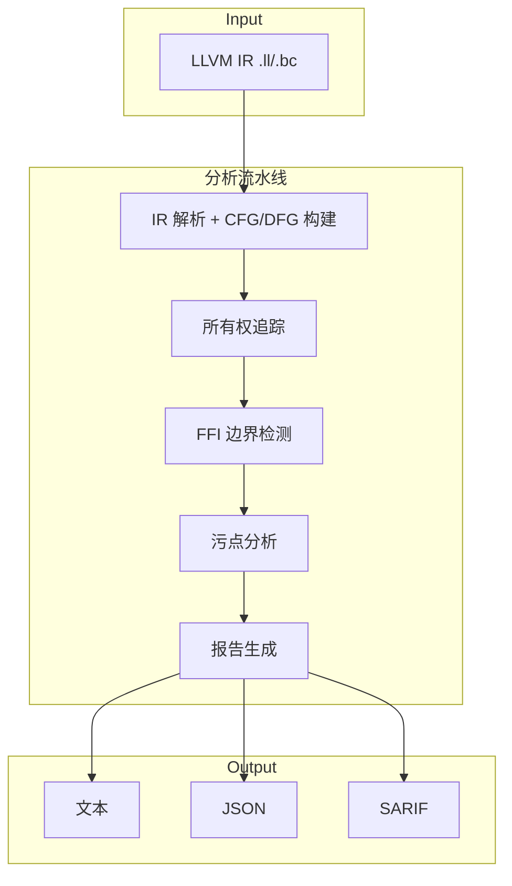
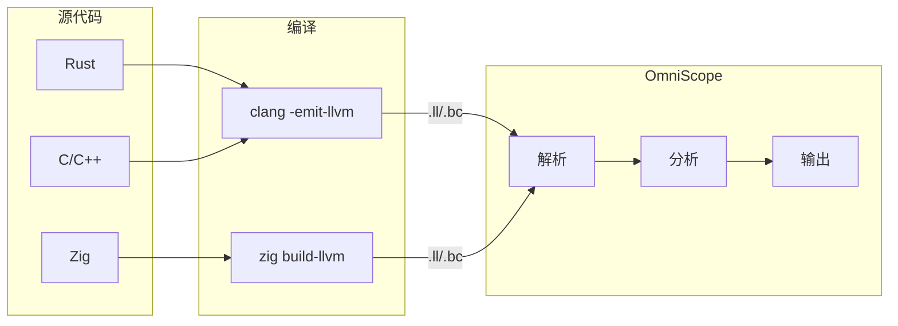
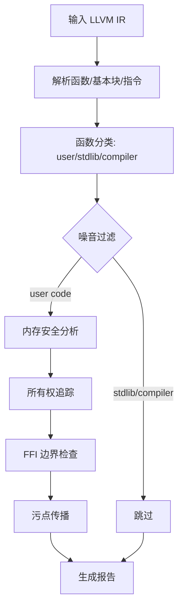
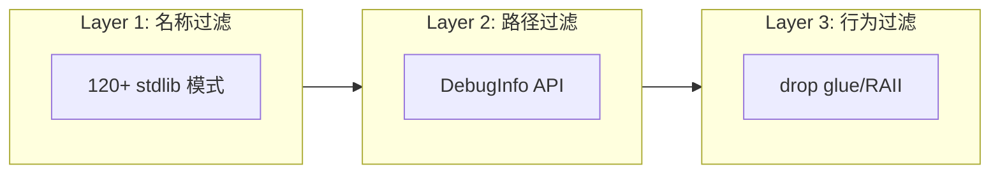

# OmniScope

**跨语言 FFI 与内存安全静态分析器**

支持 C/C++/Rust/Zig，基于 LLVM IR 分析内存安全问题和 FFI 边界违规。

## 简介

OmniScope 是一款专注于跨语言边界的静态分析工具。通过分析 LLVM IR，检测：

- **内存安全问题**：内存泄漏、释放后使用、双重释放、空指针解引用
- **FFI 边界违规**：跨语言调用时的所有权混乱、类型不匹配
- **安全漏洞**：格式化字符串漏洞、命令注入

核心特点：

| 特点 | 说明 |
|------|------|
| 跨语言 | 统一分析 C/C++/Rust/Zig 混合代码 |
| 低误报 | 三层噪音过滤，Rust 项目误报率 < 1% |
| 无侵入 | 仅需 LLVM IR，无需修改源码 |
| 多格式输出 | 文本、JSON、SARIF（支持 GitHub Code Scanning） |

## 致谢

特别感谢 [@icehawk-hyb](https://github.com/icehawk-hyb) 以技术顾问的形式参与项目，在跨语言安全分析方向提供了关键指导。

## 快速开始

```bash
zig build
./zig-out/bin/omniscope target.ll
./zig-out/bin/omniscope --format json target.ll > report.json
```

| 依赖 | 版本 |
|------|------|
| Zig | 0.15.2+ |
| LLVM | 18+ |

## 架构



## 数据流



## 核心检测机制

### 分析流程



### 所有权追踪

基于资源状态机追踪每个指针的生命周期：

| 状态 | 说明 | 转换条件 |
|------|------|----------|
| `Allocated` | 已分配未初始化 | malloc/alloc |
| `Owned` | 拥有所有权 | store/初始化 |
| `Borrowed` | 借用引用 | 传参/取地址 |
| `Freed` | 已释放 | free/dealloc |
| `Escaped` | 逃逸未知 | 存入全局/返回 |

检测规则：
- `Freed` → `Owned`/`Borrowed` = **释放后使用**
- `Freed` → `Freed` = **双重释放**
- `Owned` → 函数结束 ≠ `Freed` = **内存泄漏**

### FFI 边界检测

跨语言调用时的所有权契约验证：

| 边界 | 检测内容 |
|------|----------|
| Rust → C | `Box::into_raw` 后必须由 C 侧 free |
| C → Rust | `Box::from_raw` 必须对应 `into_raw` |
| Zig → C | Allocator 管理的内存不可传给 C free |
| C++ → C | unique_ptr 管理的资源不可跨边界传递 |

### 污点分析

从危险源到危险汇的数据流追踪：

**污点源**（35+）：
- 用户输入：`argv`、`getenv`、`read`、`fgets`
- 网络数据：`recv`、`accept`、`curl_easy_recv`
- 动态加载：`dlsym`、`mmap`

**危险汇**：
- 内存操作：`memcpy`、`strcpy`（缓冲区溢出）
- 格式化：`printf`、`sprintf`（格式化字符串）
- 命令执行：`system`、`popen`（命令注入）

## 噪音过滤



| 层级 | 技术 | 效果 |
|------|------|------|
| 名称过滤 | 匹配 stdlib 函数名模式 | 过滤 80% 标准库误报 |
| 路径过滤 | LLVM DebugInfo 检测源码路径 | 精确识别 /rustc/、zig/lib/std/ |
| 行为过滤 | 识别 drop glue、RAII 模式 | 过滤析构函数误报 |

## 检测能力

| 类型 | 严重度 | 示例 |
|------|--------|------|
| 内存泄漏 | MEDIUM | malloc 无 free |
| 释放后使用 | HIGH | 释放后解引用 |
| 双重释放 | HIGH | 同一资源释放两次 |
| 空指针解引用 | MEDIUM | 未检查可空指针 |
| 格式化字符串 | MEDIUM | 用户控制的格式串 |
| 命令注入 | CRITICAL | system 含用户输入 |
| FFI 所有权违规 | HIGH | Rust Box 被 C free |

## 实测数据

### 开源项目测试

| 项目 | 语言 | 函数数 | 问题数 | 说明 |
|------|------|--------|--------|------|
| wasmtime | Rust | 987 | 9 | WebAssembly 运行时 |
| ripgrep | Rust | 75 | 0 | 文本搜索工具 |
| abseil-cpp | C++ | 193 | 0 | Google 基础库 |
| SQLite | C | 3346 | 37 | 数据库引擎 |
| libcurl | C | 68 | 29 | 网络库 |
| libuv | C | 145 | 30 | 异步 I/O 库 |

### 噪音过滤效果

| 项目 | 过滤前 | 过滤后 | 降低率 |
|------|--------|--------|--------|
| wasmtime | 4023 | 9 | 99.8% |
| ripgrep | 3 | 0 | 100% |
| abseil-cpp | 5 | 0 | 100% |

### 测试套件结果

| 指标 | 值 |
|------|-----|
| 单元测试 | 全部通过 |
| 集成测试 | 5/5 通过 |
| 稳定性测试 | 15/15 通过 |
| 压力测试 | 16/16 通过 |

## 项目结构

```
src/
├── pass/analysis/    # 分析 passes
│   ├── pointer_ownership.zig  # 所有权追踪
│   ├── ffi_boundary.zig       # FFI 边界检测
│   ├── taint.zig              # 污点分析
│   └── noise_reduction.zig    # 噪音过滤
├── ir/               # LLVM IR 接口
├── registry/         # 函数语义注册表
└── output/           # 输出格式化
```

## 限制

1. 需要 LLVM IR 输入（`clang -emit-llvm` 或 `zig build-llvm`）
2. 推荐带调试信息编译（`-g`）以获取源码位置
3. 函数指针调用使用启发式解析
4. 主要为过程内分析（所有权追踪支持过程间）

## 文档

| 文档 | 说明 |
|------|------|
| [CHANGELOG.md](CHANGELOG.md) | 变更日志 |
| [RELEASE_NOTES.md](RELEASE_NOTES.md) | 发布说明 |
| [BASELINE.md](corpus/real_world/BASELINE.md) | 测试基准 |

## 许可证

Apache 2.0
