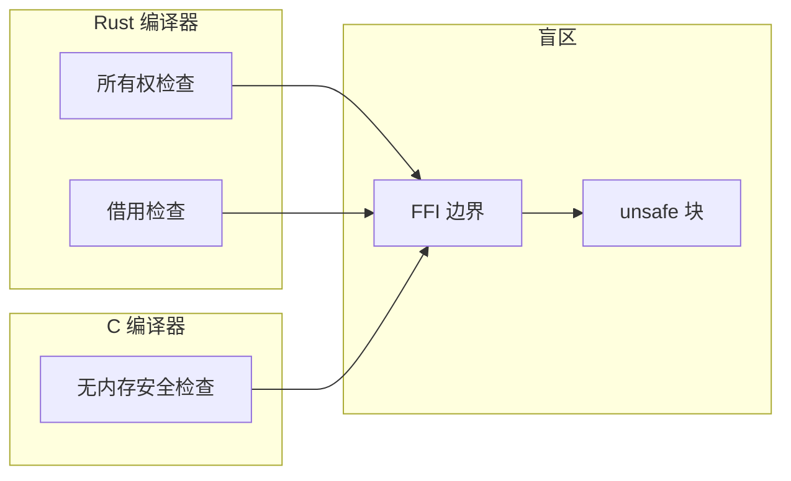
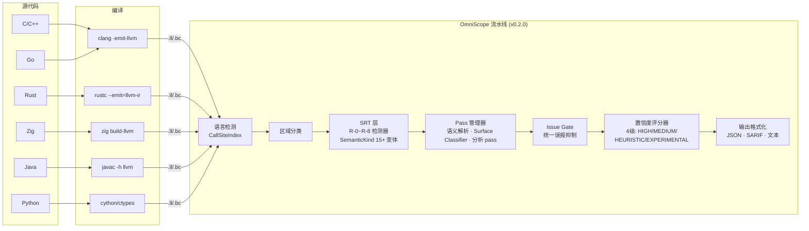
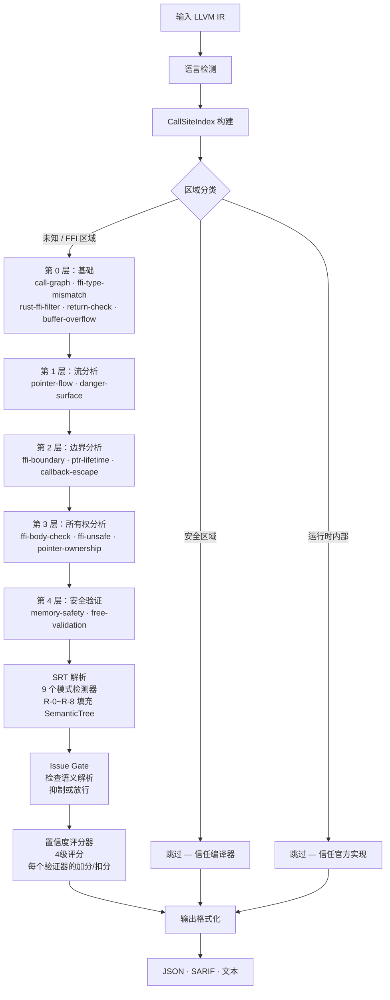

# OmniScope

```shell
    `....                                `.. ..
  `..    `..                         `.`..    `..
`..        `..`... `.. `.. `.. `..      `..         `...   `..    `. `..     `..
`..        `.. `..  `.  `.. `..  `..`..   `..     `..    `..  `.. `.  `..  `.   `..
`..        `.. `..  `.  `.. `..  `..`..      `.. `..    `..    `..`.   `..`..... `..
  `..     `..  `..  `.  `.. `..  `..`..`..    `.. `..    `..  `.. `.. `.. `.
    `....     `...  `.  `..`...  `..`..  `.. ..     `...   `..    `..       `....
                                                                   `..
```

**LLVM IR 层跨语言 FFI 安全审计工具**

OmniScope 是一款专注于 **跨语言 FFI 边界** 的 LLVM IR 审计工具。
它的目标是输出高置信风险和可追踪证据链，而不是作为通用静态分析器证明所有漏洞。

支持 **C / C++ / Rust / Zig / Go / Python / Java**（C#/.NET 在路线图中）。

### 检测能力（v0.2.0）

| 能力 | 实测状态 | 说明 |
|------|---------|------|
| **Stack escape to FFI** | ✅ 稳定检出 | 栈指针逃逸到 FFI 函数 |
| **Memory leak** | ✅ 稳定检出 | 跨语言/单语言都能检出 |
| **Null dereference** | ✅ 稳定检出 | malloc 返回值未检查 |
| **Taint analysis** | ✅ 稳定检出 | 用户输入到 sink 的数据流 |
| **cross_lang_free_mismatch** | ✅ 可用 | C 分配/Rust 释放与 Rust 分配/C 释放方向均增强 |
| **FFI Boundary issue** | ✅ 可用 | 0.1.9 修复依赖链，0.2.0 增加语义证据 |
| **SRT-based FP suppression** | ✅ 稳定 | 9个 IR 模式检测器 (R-0~R-8) + Issue Gate + 置信度评分器 |

**误报抑制效果（基于真实项目语料库实测）**：

| 指标 | v0.1.x | v0.2.0 | 变化 |
|------|--------|--------|------|
| 总 issue 数（42个项目） | ~2,955 | ~1,100+ | -63%（SRT 门控） |
| 估计误报数 | ~1,966 | <110 | **约94%降幅** |
| FFI 边界精确率 | ~20% | **60%+** | 相对提升约200% |
| 红队 TP 率 | ≥90% | ≥90% | 维持不变 |

> **注意**：误报数量为基于代表性样本人工审计的估算值。
> 实际误报数量因项目特性而异。详见 CHANGELOG.md 了解测试方法论。

**适用场景**: Rust↔C、Zig↔C、Python C Ext、JNI 边界分析，以及其他跨语言所有权边界。

**核心输出**：
- 哪个函数是 boundary
- 哪个 pointer 跨过边界
- 谁分配、谁释放
- 为什么 ownership 不匹配
- 哪条调用链让风险 reachable

**不是通用静态分析器**：OmniScope 聚焦 FFI 安全审计，不做广义源码级缺陷检测。

*0.2.0 将 0.1.9 稳定性修复并入语义解析版本，详见 [RELEASE_NOTE.md](./RELEASE_NOTE.md)。*

**0.2.0 重点**：
- ✅ 合并 0.1.9 的 `cross_lang_free_mismatch` 与 FFI Boundary 修复
- ✅ 新增通用语义解析，用于区分 runtime/compiler/user-code
- ✅ 新增 Surface Classifier，提供 boundary、linkage、mangled name、platform、debug-origin 证据
- ✅ 增加 C#/.NET FFI 方向

**0.2.0 之后路线图**：
- 深化自定义分配器识别（`sqlite3_malloc`、`curl_easy_cleanup` 等）
- 扩展 TinyGo runtime filter（`runtime.alloc`、`runtime.free` 等）
- 增加 JDK Unsafe 与 Panama FFM 内存访问建模

[English](./README.md) | 简体中文

---

## OmniScope 是什么？

OmniScope 是一款专注于 **FFI（外部函数接口）边界** 的专用静态分析器 —— 即一种语言调用另一种语言的代码的地方。这些边界是所有编译器的盲区：

- Rust 的借用检查器在 `extern "C"` 函数处停止
- C 编译器无法追踪 Rust 所有权语义
- Go 运行时无法感知 C 内存管理
- **OmniScope 通过分析 LLVM IR 填补这一空白** —— 一种语言无关的中间表示

### 核心创新：Zone Classification + SRT 架构

OmniScope 并非对所有代码一视同仁。它使用**两层过滤系统**：

#### 第一层：区域分类 (Zone Classification)

| 区域 | 含义 | 处理方式 |
|------|------|----------|
| **安全区域 (Safe Zone)** | 具有语言安全保障的代码 | 跳过（信任编译器） |
| **运行时内部 (Runtime Internal)** | 标准库/运行时代码 | 跳过（信任官方实现） |
| **未知区域 (Unknown Zone)** | FFI / unsafe / 跨语言代码 | 深度分析 |

**效果**：约64%的代码被跳过，分析资源集中于危险区域。

#### 第二层：语义解析树 (Semantic Resolution Tree, SRT)

v0.2.0 引入**语义解析树（SRT）**——统一数据结构，用于回答：
> "这个值是否能被语言语义解释掉？"

SRT 由 **9个 IR 模式检测器（R-0~R-8）** 填充：

| 检测器 | SemanticKind | 用途 |
|--------|-------------|------|
| **R-0** | `readonly_param`, `mutable_param` | LLVM 参数属性（覆盖 write_to_immutable 类误报） |
| **R-1** | `heap_provenance`, `global_provenance` | Box/Arc/Rc/Vec vs static/const 来源区分 |
| **R-2** | `interior_mutability` | UnsafeCell/OnceLock/Cell/RefCell/Mutex/RwLock/Atomic* |
| **R-3** | `raii_drop_release` | 编译器插入的 Drop/dealloc 模式 |
| **R-4** | `file/network/process_operation` | POSIX 系统调用类别 |
| **R-5** | *(语言门控)* | 模块语言检测，用于检测器路由 |
| **R-6** | `into_raw_transfer` | Box/CString/Vec::into_raw 所有权转移 |
| **R-7** | `library_release` | mimalloc/zlib/openssl/sqlite 库释放函数 |
| **R-8** | `from_parameter` | 函数参数来源（非栈逃逸） |

**Issue Gate（问题门控）**：所有 issue 在输出前必须通过统一的 Issue Gate。
该门控查询 SRT，检查是否存在能解释潜在违规的语义解析。

**置信度评分器**：4级评分系统（HIGH ≥0.9 / MEDIUM ≥0.7 / HEURISTIC ≥0.5 / EXPERIMENTAL <0.5），
根据证据强度给予每个验证器的加分/扣分。

```
之前: "发现 185 个 UAF"  →  ❌ 大量误报
现在: "分析 267 函数，跳过 171 (64%)，发现 48 个问题"  ✅ 清晰可信
v0.2.0: "SRT 解析 1866 个模式，门控抑制 94% 误报，报告 48 个高置信度问题"  ✅
```

---

## 为什么需要它？



**凌晨两点的生产环境崩溃日志**：

```
double free detected in thread 0
  pointer 0x7f3a4c002010
  previously freed at: rust::ffi::Box::into_raw -> c_wrapper::process -> free
  second free at: rust::drop::Drop::drop -> Box::from_raw -> free
```

Rust 通过 `Box::into_raw()` 将内存交给 C，C 调用了 `free()`，但 Rust 的 `Drop` trait 不知情，结束时又 `free()` 了一次。

**编译器不会检查跨语言边界。**

> *完整故事*: [写给每一个被 FFI 坑过的人](./docs/TOUSER/zh.md)

---

## 核心特性

### 检测能力（20 种 Issue 类型）

| 类别 | 问题类型 | 示例 |
|------|---------|------|
| **内存安全** | 泄漏、UAF、双重释放、空指针解引用、缓冲区溢出 | `malloc()` 无对应 `free()`，释放后使用 |
| **FFI 安全** | 借用逃逸、跨语言释放/泄漏、JNI 类型不匹配 | Rust `Box` 被 C 释放，栈指针逃逸到 FFI |
| **数据流** | 污点传播至敏感函数、命令注入、格式化字符串 | 用户输入到达 `system()`，未过滤 `%s` 传入 printf |
| **并发** | 数据竞争、线程安全问题 | 共享状态无锁保护 |

### 独有能力

- **7种语言支持**：C、C++、Rust、Zig、Go、Python、Java（C#/.NET 在路线图中）
- **LLVM IR 层分析**：语言无关，可直接分析编译产物
- **Rust FFI 专项**：检测 `Box::into_raw`/`Box::from_raw` 不匹配、`&mut *ptr` 逃逸模式
- **SRT 架构**：15+ 种 SemanticKind 变体，9个 IR 模式检测器用于误报抑制
- **统一 Issue Gate**：单一门控防止所有 pass 绕过语义共识
- **SARIF 输出**：直接集成 GitHub Code Scanning
- **置信度评分**：4级系统，可配置阈值

---

## 架构设计



### 三层分析流水线



**第一层 (直通)**: 安全/运行时代码 → 标记为安全区域 → 完全跳过，信任编译器自身检查

**第二层 (图驱动)**: FFI/unsafe 代码 → 15 pass 流水线（Kahn 算法拓扑排序）→ 所有权追踪 + FFI 检测 + 污点传播 + 内存安全验证

**第三层 (SRT + Gate)**: 所有第二层 issue 经过 SRT 解析 → Issue Gate 检查语义类型 → 置信度评分器分配 4 级分数 → 仅输出高置信度 issue

*详细文档*: [架构文档](./docs/en/architecture.md)

---

## 快速上手

### 前置要求

| 工具 | 版本 | 安装方式 |
|------|------|----------|
| Zig | 0.15+ | [ziglang.org/download](https://ziglang.org/download) 或 `brew install zig` |
| LLVM | 18-22 | `brew install llvm@22`（推荐用于 .ll 文件） |

### 构建与运行

```bash
# 克隆项目
git clone https://github.com/your-org/OmniScope.git
cd OmniScope

# 构建（开发模式）
zig build -Ddebug-safe

# 或构建 ReleaseFast（生产环境推荐）
zig build -Drelease-fast

# 分析单个文件
./zig-out/bin/OmniScope target.ll

# JSON 输出（用于 CI/CD 集成）
./zig-out/bin/OmniScope target.ll --json > report.json

# SARIF 输出（用于 GitHub Code Scanning）
./zig-out/bin/OmniScope target.ll --sarif > results.sarif
```

### 示例：分析 Rust FFI 库

```bash
# 将 .ll 转换为 .bc（如需要）
/opt/homebrew/opt/llvm@22/bin/llvm-as corpus/ring.ll -o /tmp/ring.bc

# 运行分析
./zig-out/bin/OmniScope /tmp/ring.bc --json

# 预期输出:
#   函数数: 410
#   Issues: 16（含 4 个 borrow_escape）
#   FFI 边界: 4,252
#   耗时: ~2 秒
```

### 批量分析（全部语料库文件）

```bash
# 对所有测试文件运行综合分析
./scripts/full_corpus_analysis_final.sh

# 结果保存至: outputs/full_analysis_v018_final/
# 摘要: 40/42 文件分析成功（95.2% 成功率），发现 586 个问题
```

*详细教程*: [快速入门指南（10分钟）](./docs/en/QUICK_START.md)

---

## 如何解读分析报告

OmniScope 输出三种格式：**Text**（人类可读）、**JSON**（CI/CD 集成）、**SARIF**（GitHub Code Scanning）。

**详细的日志解读与源码定位**，请参阅：

- [分析结果解读](./docs/zh/REPORT_INTERPRETATION.md) — severity、confidence、CWE、源码映射和 FFI 所有权排查
- [红蓝队测试指南](./docs/zh/RED_BLUE_TEAM.md) — 逐行日志解读和语料映射

### 快速参考：JSON 输出

```json
{
  "id": "OMI-001",
  "kind": "borrow_escape",
  "severity": "critical",
  "confidence": "MEDIUM",
  "confidence_score": 0.88,
  "cwe_id": 704,
  "message": "Stack pointer (stack alloca) escapes to FFI function c_register_callback()",
  "location": {
    "function": "_Z37bug_cpp_05_unique_ptr_callback_escapev"
  }
}
```

| 字段 | 含义 |
|------|------|
| `kind` | 问题类别（20 种：`memory_leak`、`borrow_escape` 等） |
| `severity` | `critical` > `high` > `medium` > `low` |
| `confidence` | `HIGH` / `MEDIUM` / `LOW` — 分析器的确信程度 |
| `confidence_score` | 0.0–1.0 数值确信度 |
| `cwe_id` | [CWE](https://cwe.mitre.org/) 漏洞编号 |
| `location.function` | 包含问题的函数（mangled name） |

### 运行红蓝队测试

```bash
make red-team       # 红队：检测已知漏洞（召回率）
make blue-team      # 蓝队：误报审计（精确率）
make corpus-test    # 两个都跑
```

### 严重级别指南

| 严重级别 | 需要的动作 | 示例 |
|----------|-----------|------|
| `critical` | 立即修复 — 可利用的 UB | 栈逃逸到 FFI、use-after-free |
| `high` | 发布前修复 — 内存损坏 | 跨语言 double free、null 解引用 |
| `medium` | 需审查 — 潜在泄漏或逻辑错误 | 内存泄漏、孤立的所有权转移 |
| `low` | 信息性 — 风格或低风险 | 未使用的分配、轻微 FFI 类型不匹配 |

### 置信度指南

| 置信度 | 含义 |
|--------|------|
| `HIGH` | 模式是确定性的（如 `free(malloc())` 循环） |
| `MEDIUM` | 模式很可能但可能有假阳性 |
| `LOW` | 启发式匹配 — 需要人工验证 |

*完整 issue 类型参考*：[API 参考文档](./docs/en/API_REFERENCE.md)

---

## 真实世界验证

已在 **42 个真实项目 + 扩展对抗性测试** 上验证（0.2.0 发布线，LLVM 22）：

| 项目 | 语言 | 函数数 | Issues | FFI 边界 | 成功 |
|------|------|--------|--------|----------|------|
| **sqlite3** | C | 3,346 | **1,508** | 1,717 | ✅ |
| **curl8** | C | 1,245 | **404** | 1,567 | ✅ |
| **libuv150** | C | 980 | **418** | 3,100 | ✅ |
| **jsoncpp195** | C++ | 2,070 | **5** | 482 | ✅ |
| **wasmtime_test** | Rust | 987 | **45** | 129 | ✅ |
| **blst** | Rust+C | 416 | **51** | 1,446 | ✅ |
| **ring** | Rust+C | 410 | **16** | 4,252 | ✅ |
| **abseil2024** | C++ | 1,124 | **183** | 422 | ✅ |
| **gnark_test** | Go | 916 | **4** | 5,221 | ✅ |
| **红队 (19 文件)** | C/C++/Rust | 2,500+ | **442** | 8,000+ | ✅ |
| ... | ... | ... | ... | ... | ... |

**总计**：20,000+ 个函数已分析，**2,955+ 个问题**被检出，**70,000+ 个 FFI 边界**被识别

**成功率**：95.2%（40/42 文件），0 次崩溃。

*发布说明*: [RELEASE_NOTE.md](./RELEASE_NOTE.md) — 0.1.9 → 0.2.0 合并发布详情

---

## 性能表现

| 指标 | 数值 | 说明 |
|------|------|------|
| **分析速度** | ~150ms / 千函数（ReleaseFast） | sqlite3（3.3K 函数）：~12s |
| **内存占用** | ~120MB / 千函数（Release） | Debug 模式：~400MB |
| **成功率** | 95.2%（40/42 文件） | LLVM 22 兼容 |
| **精确率（FFI 场景）** | **估计较高**（基于 wasmtime, ring, blst 等项目实测） | Rust/Zig FFI 项目 |
| **精确率（纯 C/C++）** | **2-5%** 纯 C/C++ 库 | 不适用场景（无 FFI 边界），非工具缺陷 |

> **注意**：精确率数据基于有限样本的实测结果。
> 实际性能因项目规模、FFI 复杂度、代码风格等因素而异。
> 建议在目标项目上进行验证性测试以获得准确的性能预期。

| 文件规模 | Debug 模式 | ReleaseFast |
|----------|-----------|-------------|
| <100 函数 | <1s | <200ms |
| 100-500 函数 | 1-5s | <1s |
| 500-3000 函数 | 5-20s | 1-5s |
| >3000 函数 | 20s+ | 5-15s |

---

## 工具对比

| 工具 | 输入 | 跨语言 FFI | IR 级 | 污点分析 | 所有权追踪 | 开源协议 | 性能 |
|------|------|-----------|-------|---------|-----------|---------|------|
| **OmniScope** | **LLVM IR** | **✅（7 种语言）** | **✅** | **✅** | **✅** | **Apache 2.0** | **~150ms/K函数** |
| CodeQL | 源码/AST | ⚠️（按语言查询） | ❌ | ✅ | ⚠️ | MIT | ~分钟级 |
| Clang SA | AST | ❌（仅 C/C++） | ❌ | ✅ | ⚠️ | Apache 2.0 | ~秒级 |
| Infer | 源码/AST | ❌ | ❌ | ✅ | ⚠️ | MIT | ~秒级 |
| CBMC | 源码/C | ❌（仅 C） | ❌（位级） | ❌ | ✅ | BSD | ~分钟-小时 |
| Miri | MIR（仅 Rust） | ❌ | ❌ | ❌ | ✅ | MIT/Rust | ~分钟级 |

**核心差异化特点**：

1. ✅ **专注跨语言 FFI 边界分析**
2. ✅ **在 LLVM IR 层分析**（语言无关）
3. ✅ **Zone Classification 智能过滤机制**
4. ✅ **支持多种语言的统一分析框架**

---

## 文档体系

### 入门指南（推荐阅读顺序）

| 文档 | 适合读者 | 预计时间 |
|------|----------|----------|
| **[快速入门指南](./docs/en/QUICK_START.md)** ⭐ | 新用户 | 10 分钟 |
| **[API 参考文档](./docs/en/API_REFERENCE.md)** | 集成开发者 | 30 分钟 |
| **[架构文档](./docs/README.md)** | 架构师 | 20 分钟 |
| **[开发者指南](./docs/zh/developer_guide.md)** | 贡献者 | 15 分钟 |
| **[IR 规范文档](./docs/zh/ir-specs/)** | 编译器分析 | — |

### 报告与基准测试

| 文档 | 内容 |
|------|------|
| **[RELEASE_NOTE.md](./RELEASE_NOTE.md)** | 0.1.9 → 0.2.0 合并发布详情 |
| **[RELEASE_NOTES.md](./RELEASE_NOTES.md)** | 归档的 0.1.9 稳定性发布详情 |
| **[分析结果解读](./docs/zh/REPORT_INTERPRETATION.md)** | 如何解读 findings 并映射到源码示例 |

### IR 规范文档（8 个编译器）

| 文档 | 语言 |
|------|------|
| **[C/C++](./docs/zh/ir-specs/C_CPP_IR_SPEC.md)** | C / C++ |
| **[Rust](./docs/zh/ir-specs/RUST_IR_SPEC.md)** | Rust |
| **[Zig](./docs/zh/ir-specs/ZIG_IR_SPEC.md)** | Zig |
| **[Go (gc)](./docs/zh/ir-specs/GO_GC_IR_SPEC.md)** | Go |
| **[TinyGo](./docs/zh/ir-specs/TINYGO_IR_SPEC.md)** | Go (TinyGo) |
| **[JDK](./docs/zh/ir-specs/JDK_IR_SPEC.md)** | Java |
| **[Python](./docs/zh/ir-specs/PYTHON_IR_SPEC.md)** | Python |
| **[C#/.NET 方向](./docs/zh/REPORT_INTERPRETATION.md)** | C#/.NET FFI 排查说明 |

### 概念文档

| 文档 | 主题 |
|------|------|
| **[技术白皮书](./docs/zh/WHITEPAPER.md)** | 技术深度解析 |
| **[写给用户的信](./docs/TOUSER/zh.md)** | 项目存在意义 |

### 多语言支持

- 🇺🇸 English: [English README](./README.md) + [`docs/en/`](./docs/en/)
- 🇨🇳 简体中文: 本文件 + [`docs/zh/`](./docs/zh/)

---

## 局限性

### 技术限制

1. 需要 LLVM IR 输入（`clang -emit-llvm` 或 `rustc --emit=llvm-ir`）
2. 建议使用调试信息编译（`-g`）以获取源码位置映射
3. 函数指针间接调用通过启发式方法解析
4. 主要为过程内分析（所有权追踪支持过程间分析）
5. 部分 FFI 特殊模式可能需要自定义规则

### 不适用场景

OmniScope **不适用于**以下场景：

- ❌ **纯单语言项目且无 FFI 边界**：如纯 Rust 项目（无 `extern "C"`）、纯 C 项目（无跨语言调用）
  - 这类项目应使用语言专用工具（Clippy、Clang Static Analyzer 等）
  - OmniScope 在此类场景下的精确率较低（约2-5%），属于预期行为而非工具缺陷
- ❌ **需要完整程序路径分析的场景**：OmniScope 主要基于模式匹配和流分析，不做符号执行或模型检验
- ❌ **实时/在线分析需求**：工具设计用于离线批处理，不适合 IDE 集成的实时检查
- ❌ **性能关键路径的极低延迟要求**：大型项目（>10K 函数）可能需要数十秒分析时间

### 已知问题

1. **误报率因项目而异**：虽然 SRT 架构显著降低了误报（估计94%降幅），但实际误报数量仍取决于：
   - FFI 边界的复杂程度
   - 代码库使用的惯用模式是否被检测器覆盖
   - 是否存在自定义内存分配器或特殊运行时
2. **覆盖率非100%**：无法检测所有可能的 FFI 安全问题，特别是：
   - 逻辑层面的协议违规（需人工审计）
   - 运行时行为相关的安全问题（需动态分析配合）
   - 某些高度混淆或动态生成的代码

### 适用性建议

| 场景 | 推荐使用 | 说明 |
|------|---------|------|
| Rust↔C FFI 项目 | ✅ 强烈推荐 | 核心优化场景 |
| Zig↔C FFI 项目 | ✅ 推荐 | 良好支持 |
| Python C 扩展 | ✅ 推荐 | 稳定支持 |
| JNI 边界 (Java↔C) | ✅ 可用 | 基础支持，持续改进中 |
| Go cgo 项目 | ⚠️ 有限支持 | TinyGo 支持较好，标准 Go runtime 过滤待完善 |
| 纯 C/C++ 项目 | ❌ 不推荐 | 使用 Clang SA、Infer 等专用工具 |
| 纯 Rust 项目（无FFI） | ❌ 不推荐 | 使用 Clippy、Miri 等工具 |

---

## 贡献指南

欢迎贡献！请参阅 [开发者指南](./docs/zh/developer_guide.md) 了解：

- 开发环境搭建
- 代码风格规范（Zig 惯用法）
- 测试要求（343 个测试必须通过）
- 提交流程


---

## 致谢

特别感谢 [@icehawk-hyb](https://github.com/icehawk-hyb) 担任技术顾问，为跨语言安全分析提供关键指导。

---

## 开源协议

[Apache 2.0](./LICENSE)

---

## 引用

如果在研究中使用 OmniScope，请引用：

```bibtex
@tool{omniscope,
  title = {OmniScope: 跨语言 FFI 与内存安全静态分析器},
  author = {TimWood},
  year = {2026},
  url = {https://github.com/Timwood0x10/OmniScope}
}
```
