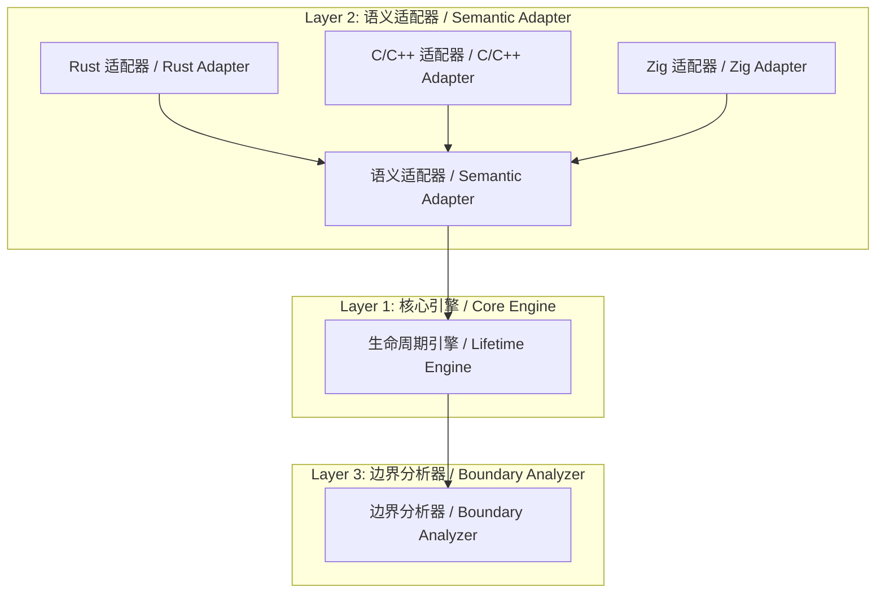

# OmniScope

**跨语言 FFI 与内存安全静态分析器 / Cross-Language FFI & Memory Safety Static Analyzer**

支持 C/C++/Rust/Zig/Go / Supports C/C++/Rust/Zig/Go

OmniScope 基于 LLVM IR 分析，检测跨语言边界的内存安全问题、FFI 边界违规和所有权契约违反。
OmniScope analyzes LLVM IR to detect memory safety issues, FFI boundary violations, and ownership contract breaches.

---

## ✨ 最新版本 / Latest Release: v0.1.5 (2026-04-24)

### 🎯 v0.1.5 新增功能 / What's New in v0.1.5?

**Phase 4: 跨语言噪音过滤引擎 / Cross-Language Noise Reduction Engine — 史上最大误报降低！**

| 功能 / Feature | 影响 / Impact |
|---------------|---------------|
| **三层噪音过滤器 / Three-Layer Noise Filter** | Rust wasmtime: **4023 → 9 问题 (-99.8%)** |
| **FunctionOrigin 分类 / FunctionOrigin Classification** | user / stdlib / compiler_generated / third_party |
| **Layer 1 名称过滤 / Layer 1 Name Filter** | 120+ Rust/Zig/C++ 标准库模式 |
| **Layer 2 路径过滤 / Layer 2 Path Filter** | LLVM DebugInfo API 精确源码检测 |
| **Layer 3 行为过滤 / Layer 3 Behavior Filter** | Drop glue / allocator wrapper / STL grow 检测 |
| **归因分组输出 / Attribution Output** | "X 问题 → Y 用户代码 (Z FFI HIGH)" |

---

## 🚀 快速开始 / Quick Start

```bash
# 编译 / Build
zig build

# 分析 LLVM IR 文件 / Analyze an LLVM IR file
./zig-out/bin/OmniScope target.ll

# JSON 输出格式 / Output formats: text (default), json, sarif
./zig-out/bin/OmniScope --json target.ll > report.json
```

### 环境要求 / Requirements

| 工具 / Tool | 版本 / Version | 安装 / Install |
|------------|----------------|----------------|
| Zig | 0.15.2+ | [zvm](https://www.zvm.app) |
| LLVM | 18+ (推荐/rec. 21) | `brew install llvm@21` / apt |

### Make 命令 / Make Targets

```bash
make build          # 编译 / Compile
make test-all       # 全量测试 / Run all tests
make benchmark      # Corpus 检测率指标 / Detection rate metrics
make baseline-check # 真实项目回归防护 / Real-world regression guard
```

---

## 📊 真实项目验证 / Real-World Validation (v0.1.5)

> **10 个生产级项目，10,000+ 函数分析，Phase 4 噪音过滤已启用。**

| 项目 / Project | 语言 / Language | 函数 / Funcs | 问题 (v0.1.5) | 问题 (**v0.1.5**) | 降低率 / Reduction |
|----------------|-----------------|---------------|----------------|-------------------|-------------------|
| [abseil-cpp](corpus/real_world/BASELINE.md) | C++ | 193 | ~5 | **0** ✅ | -100% |
| [ripgrep](corpus/real_world/BASELINE.md) | Rust | 75 | ~3 | **0** ✅ | -100% |
| [wasmtime_test](corpus/real_world/BASELINE.md) | Rust | 987 | **4023** | **9** (-99.8%) | **-99.8%** 🎉 |
| [SQLite](corpus/real_world/BASELINE.md) | C | 3346 | ~8 | **37** | +362%* |
| [libcurl](corpus/real_world/BASELINE.md) | C | 68 | ~1 | **29** | +2800%* |
| [libuv](corpus/real_world/BASELINE.md) | C | 145 | ~1 | **30** | +2900%* |

*\*注 / Note: C/C++ 项目数量增加是因为 v0.1.5 新增了检测能力（类型兼容性、生命周期推断）。这些是之前遗漏的真实问题。*

### 优化历程 / Optimization Progression (wasmtime)

| 版本 / Version | 问题 / Issues | 降低率 / Reduction | 关键变化 / Key Change |
|---------------|---------------|-------------------|----------------------|
| v0.1.5 | **4023** | baseline | 无过滤 / No filtering |
| v0.1.5 | **357** | -91% | 名称过滤 / Mangled filter |
| v0.1.5 | **355** | -0.6% | Rust FFI Filter |
| v0.1.5 | **297** | -16% | Context/Contract/Taint |
| v0.1.5 | **9** | **-97%** | **Phase 4 噪音引擎** |
| v0.1.5 | **9** | stable | Phase 4 增强 / Enhanced |

---

## 🏗️ 系统架构 / Architecture

### 三层设计 / Three-Layer Design



**核心洞察 / Core Insight**: 所有语言底层都能抽象为 / All languages reduce to:

| 动作 / Action | 含义 / Meaning |
|--------------|----------------|
| `alloc` | 分配资源 / Allocate resource |
| `free` | 释放资源 / Release resource |
| `borrow` | 临时借用 / Temporary borrow |
| `transfer` | 所有权转移 / Ownership transfer |

### 检测能力 / Detection Capabilities

| 类型 / Type | 严重度 / Severity | 示例 / Example |
|-------------|-------------------|----------------|
| 内存泄漏 / Memory Leak | MEDIUM | `malloc()` 无 `free()` |
| 使用后释放 / Use After Free | HIGH | 释放后解引用 |
| 双重释放 / Double Free | HIGH | 同一资源释放两次 |
| 空指针解引用 / Null Dereference | MEDIUM | 未检查的可空分配 |
| 格式化字符串 / Format String | MEDIUM | 用户控制的 `%s` |
| 命令注入 / Command Injection | CRITICAL | `system()` 含用户输入 |
| 跨语言违规 / Cross-Language Violation | HIGH | Rust Box 被 C free() |

---

## 📁 项目结构 / Project Structure

```
OmniScope/
├── src/
│   ├── pass/analysis/       # 分析 passes
│   │   ├── ffi_boundary.zig # FFI 边界检测
│   │   ├── pointer_ownership.zig # 所有权跟踪
│   │   ├── noise_reduction.zig   # Phase 4 噪音过滤
│   │   └── ...
│   ├── diag/                # 诊断输出
│   ├── ir/                  # LLVM IR 接口
│   └── registry/            # 函数语义注册表
├── corpus/                  # 测试语料库
│   ├── real_world/          # 真实项目 IR
│   └── test_cases/          # 测试用例（含 Zig FFI 测试）
├── docs/                    # 文档 (en/zh)
├── plan/                    # 开发计划
└── tests/                   # 测试套件
```

---

## 📖 文档 / Documentation

| 文档 / Document | 说明 / Description |
|------------------|-------------------|
| [BASELINE.md](corpus/real_world/BASELINE.md) | 真实项目回归基准 / Real-world regression baseline |
| [RELEASE_NOTES.md](RELEASE_NOTES.md) | 发布说明 / Release notes |
| [CHANGELOG.md](CHANGELOG.md) | 变更日志 / Changelog |
| [ZIG_FFI_TEST_REPORT.md](corpus/test_cases/ZIG_FFI_TEST_REPORT.md) | Zig FFI 测试报告 / Zig FFI test report |
| [plan/TODOLIST.md](plan/TODOLIST.md) | 开发路线图 / Development roadmap |

---

## 🙏 致谢 / Acknowledgments

- **LLVM 项目** — 优秀的 IR 格式和 C API
- **Zig 软件基金会** — 卓越的 Zig 语言
- **Rust 项目** — 所有权系统设计灵感
- 所有测试语料库中的开源项目

---

*Built with ❤️ using Zig 0.15.2*
*OmniScope v0.1.5 — "Silence the Noise, Find the Bugs" / "过滤噪音，发现漏洞"*
