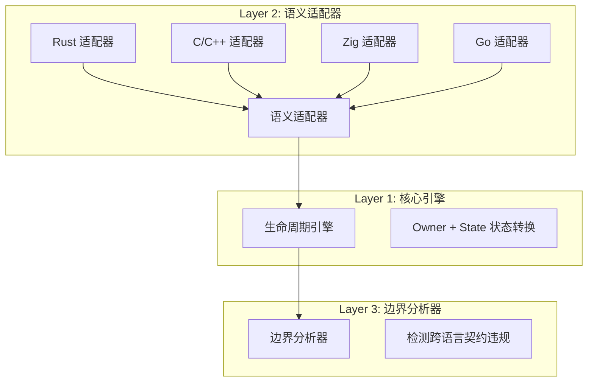
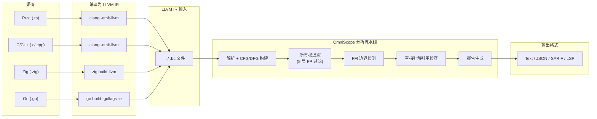

# OmniScope

**跨语言 FFI 与内存安全静态分析器（C/C++ 生产级）**

OmniScope 基于 LLVM IR 分析，检测跨语言边界（C/C++/Rust/Zig/Go）的内存安全问题、FFI 边界违规和所有权契约违反。

## 快速开始

```bash
# 编译
zig build

# 分析 LLVM IR 文件
./zig-out/bin/OmniSope target.ll

# 多种输出格式：text（默认）、json、sarif、lsp
./zig-out/bin/OmniSope target.ll --format json --output report.json
```

### 环境要求

| 工具 | 版本 | 安装方式 |
|------|------|----------|
| Zig | 0.15.2+ | [zvm](https://www.zvm.app) |
| LLVM | 18+（推荐 21）| `brew install llvm@21` / apt |

### Make 命令

```bash
make build          # 编译
make test-all       # 全量测试（单元 + 集成 + 回归 + 压力）
make benchmark      # Corpus 检测率指标
make baseline-check # 真实项目回归防护
```

## 架构

### 系统总览（三层设计）



**核心洞察**：虽然语言不同，但底层都能抽象成几类动作：

| 动作 | 含义 |
|------|------|
| `alloc` | 分配资源 |
| `free` | 释放资源 |
| `borrow` | 临时借用 |
| `transfer` | 所有权转移 |
| `retain` | 增加引用计数 |
| `release` | 减少引用计数 |
| `escape` | 逃逸到未知作用域 |

### 数据流图



### C++ 8 层误报消减系统

| 层级 | 技术 | 目标 |
|------|------|------|
| L1 | STL 内部函数过滤 | `_ZNSt*` 模板展开 |
| L2 | C++ 特殊成员函数过滤 | ctor/dtor/copy/move-assign |
| L3 | RAII 智能指针检测 | `unique_ptr::C1` / `shared_ptr::C1` |
| L4 | RAII 函数集合 | 跳过含智能指针的整个函数 |
| L5 | C++ ABI 运行时过滤 | `__cxa_*` 异常/守卫/atexit |
| L6 | Meyers 单例检测 | `__cxa_guard_acquire` 模式 |
| L7 | C++ 操作符 FFI 过滤 | `_Znwm`/`_ZdlPv` 在 FFI 报告中跳过 |
| **L8** | **引用计数容器检测** | `Ref()`/`Unref()`/CordRep 模式 |

## 真实项目验证 (v0.1.4)

> **5 个生产项目，5,180 个函数，零退化。**

| 项目 | 语言 | 函数数 | Issues | Leaks | 耗时 |
|------|------|--------|--------|-------|------|
| [SQLite 3.47.2](corpus/real_world/BASELINE.md#project-sqlite-3472-amalgamation) | C | 3,237 | **8** | **0** | 5.8s |
| [libcurl 8.14.0](corpus/real_world/BASELINE.md#project-libcurl-8140) | C | 68 | **1** | **0** | 0.05s |
| [libuv 1.50.0](corpus/real_world/BASELINE.md#project-libuv-1500) | C | 145 | **1** | **0** | 0.07s |
| [jsoncpp 1.9.5](corpus/real_world/BASELINE.md#project-jsoncpp-195) | C++ | 1,537 | **3** | **0** | 1.4s |
| [abseil-cpp 2024](corpus/real_world/BASELINE.md#project--5-abseil-cpp-202407220) | C++ | 193 | **0** | **0** | 0.37s |
| [ripgrep 14.1.1](corpus/real_world/BASELINE.md#project-6-ripgrep-1411-rust) | **Rust** | 75 | **0** ✅ | **0** ✅ | 0.04s |

**关键成果**: jsoncpp 40→3 issues (-92.5%), leaks 37→0 (-100%)。abseil-cpp Cord 引用计数泄漏 9→0 (-100%)。ripgrep (Rust): 0 issues — 干净的生产级项目。

### Corpus 基准指标

| 指标 | 数值 |
|------|------|
| 精确率 (Precision) | **82.9%** |
| 召回率 (Recall) | **93.2%** |
| F1 分数 | **87.7%** |

详见: [`docs/BENCHMARK.md`](docs/BENCHMARK.md)、[`FINAL_EVALUATION_REPORT_ZH.md`](corpus/real_world/FINAL_EVALUATION_REPORT_ZH.md)

## 检测能力

### Issue 类型

| 类型 | 严重性 | 示例 |
|------|--------|------|
| 内存泄漏 | MEDIUM | `malloc()` 无配对 `free()` |
| Use After Free | HIGH | 释放后解引用 |
| Double Free | HIGH | 同一资源释放两次 |
| 空指针解引用 | MEDIUM | 未检查的可空分配结果 |
| 格式化字符串 | MEDIUM | 用户控制的 `%s` 传入 printf |
| 命令注入 | CRITICAL | `system()` 含用户输入 |
| 跨语言违规 | HIGH | Rust Box 被 C free() 释放 |

### 支持的语言与边界

| 边界 | 状态 | 说明 |
|------|------|------|
| C → C | ✅ 稳定 | 完整 libc/POSIX 注册表 |
| Rust ↔ C | ✅ **稳定 (v0.1.4)** | `into_raw`/`from_raw`, `Box`, `CString` |
| Zig ↔ C | ✅ 稳定 | `Allocator.alloc` 模式 |
| Go → C | ⚠️ 实验 | cgo `C.malloc`/`C.CString` |
| **C++ → C** | **✅ 稳定 (v0.1.4)** | Itanium ABI, 8 层 FP 过滤 |
| Swift → C | 🔜 规划 | `retain`/`release` |

## 项目结构

```
src/
├── pass/analysis/
│   ├── pointer_ownership.zig   # 核心：所有权追踪 + 8 层 FP 过滤
│   └── ffi_boundary.zig       # FFI 边界检测 + 语义注册表
├── lifetime/                   # 资源状态机 (owner + state 转换)
├── registry/                   # 166 函数语义注册表 (6 层)
├── pipeline/                   # Pass 编排 (15 个分析 pass)
└── output/                     # CLI / JSON / SARIF / LSP 格式化
```

## 文档索引

| 文档 | 说明 |
|------|------|
| [架构设计](docs/architecture.md) | 系统设计与模块关系 |
| [开发指南](docs/en/developer_guide.zig) | 编码规范与贡献指南 |
| [API 参考](docs/en/api_reference.md) | 公开 API 文档 |
| [用户指南](docs/en/user_guide.md) | 使用教程与示例 |
| [基准测试规格](docs/BENCHMARK.md) | 测试方法与阶段目标 |
| [基线规则](corpus/real_world/BASELINE.md) | 5 个真实项目的回归防护 |
| [最终测评报告](corpus/real_world/FINAL_EVALUATION_REPORT_ZH.md) | 中文版综合评估 |
| [任务规划](plan/task/tasks.md) | 开发路线图 (Priority 1–9) |

## CI/CD

```yaml
# GitHub Actions — 发布 Release 并上传二进制文件
- uses: softprops/action-gh-release@v2
  with:
    body_path: RELEASE_NOTES.md   # 发布说明（精简版）
    files: dist/OmniScope-*
```

自动化发布流程见 [`.github/workflows/release.yml`](.github/workflows/release.yml)：编译 Linux + macOS 二进制，读取 [`RELEASE_NOTES.md`](RELEASE_NOTES.md)。

## 局限性

1. 需要 LLVM IR 输入（使用 `clang -emit-llvm` 编译）
2. 推荐开启调试信息以获取源码级位置信息（`-g` 标志）
3. 通过函数指针的间接调用采用启发式解析
4. 主要为过程内分析（所有权转移支持过程间）

## 许可证

Apache 2.0
