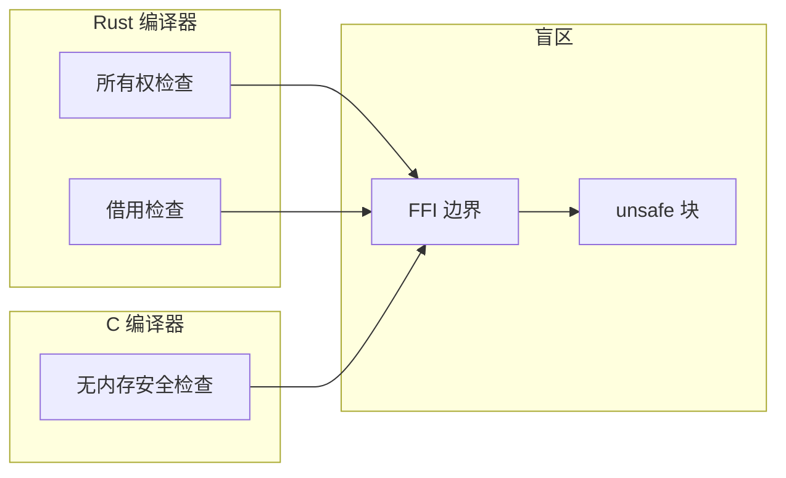

# OmniScope

```shell
    `....                                `.. ..
  `..    `..                         `.`..    `..
`..        `..`... `.. `.. `.. `..      `..         `...   `..    `. `..     `..
`..        `.. `..  `.  `.. `..  `..`..   `..     `..    `..  `.. `.  `..  `.   `..
`..        `.. `..  `.  `.. `..  `..`..      `.. `..    `..    `..`.   `..`..... `..
  `..     `..  `..  `.  `.. `..  `..`..`..    `.. `..    `..  `.. `.. `.. `.
    `....     `...  `.  `..`...  `..`..  `.. ..     `...   `..    `..       `....
                                                                   `..
```

**跨语言 FFI & 内存安全静态分析器**

**项目定位**: 专注于 unsafe/FFI 跨语言边界的静态安全分析

支持 C/C++/Rust/Zig/Go。通过 LLVM IR 检测内存安全问题和 FFI 边界违规。

[English](./README.md) | 简体中文

***

## v0.1.7 亮点（最新版本）

- **67 个 Bug 修复** — 覆盖 CRITICAL/HIGH/MEDIUM/LOW 所有严重级别（Round 7: 24 + Round 8: 43）
- **全量代码审查** — 完整 src/ 目录审计发现所有问题
- **343/343 测试通过** — 所有修复已验证
- **CI/CD 修复** — SARIF 上传正常工作，CodeQL v4 迁移
- **20 种 Issue Kind** — 新增 `data_race`, `thread_safety_violation`
- **311 函数语义** — 集成 14 个 POSIX static_buffer 函数到注册表

### 关键修复

| Bug | 影响 | 修复方案 |
|-----|------|---------|
| Double-free 检测失效 | `free_sites.get()` 返回副本 | `get()` → `getPtr()` |
| API 不匹配 | AutoHashMap.deinit() 参数错误 | 移除 allocator 参数 |
| OOM 崩溃 | `catch unreachable` 导致 panic | 正确错误处理 |

***

## 核心理念

### 为什么专注 unsafe/FFI？

**语言边界是所有编译器的盲区。**



- Rust 编译器只检查 Rust 侧的所有权
- C 编译器只看 C 侧的 malloc/free
- **跨语言边界 = 编译器不管的地方**

### Zone Classification（核心创新）

v0.1.5 引入 Zone Classification，只分析语言保障失效的地方：

| Zone 类型 | 含义 | 处理方式 |
|-----------|------|----------|
| **Safe Zone** | 有语言安全保障的代码 | 跳过分析（信任编译器） |
| **Runtime Internal** | 语言运行时/标准库 | 跳过分析（信任官方实现） |
| **Unknown Zone** | 无语言保障的代码 | 深度分析（必须检查） |

**效果**:
```
之前: "发现 185 个 UAF"  ❌ 大量误报
现在: "分析 267 函数，跳过 171 个 (64%)，发现 48 个问题"  ✅ 清晰可信
```

---

## 架构

详细架构文档: [docs/architecture.md](./docs/architecture.md)

OmniScope 采用分层架构设计：

- **Tier 1 — 基础层**: IR 解析、CFG/DFG 构建、Zone Classification、语言检测
- **Tier 2 — 分析层**: 所有权追踪、FFI 边界检测、污点分析、噪音过滤、生命周期分析

所有分析 pass 通过 `isOnDangerPath` 统一门控 — 仅当函数位于 Unknown Zone 且涉及 FFI/unsafe 交互时才执行深度分析，确保分析精度和性能。

---

## 检测能力

| 类型 | 严重性 | 示例 |
|------|--------|------|
| 内存泄漏 | MEDIUM | malloc 无 free |
| Use-After-Free | HIGH | 释放后解引用 |
| Double-Free | HIGH | 同一资源释放两次 |
| 空指针解引用 | MEDIUM | 未检查可空指针 |
| 格式字符串 | MEDIUM | 用户控制的格式字符串 |
| 命令注入 | CRITICAL | system 使用用户输入 |
| FFI 所有权违规 | HIGH | Rust Box 被 C 释放 |

---

## 快速开始

```bash
# 构建
zig build

# 分析单个文件
./zig-out/bin/omniscope target.ll

# JSON 输出
./zig-out/bin/omniscope --format json target.ll > report.json

# SARIF 输出（GitHub Code Scanning）
./zig-out/bin/omniscope --format sarif target.ll > results.sarif
```

| 依赖 | 版本 |
|------|------|
| Zig | 0.15.2+ |
| LLVM | 18+ |

---

## v0.1.6 版本亮点

- **Rust FFI 检测恢复**: 从 0% TP rate 恢复到 20%（v0.1.5 回归修复）
- **14 项 bug 修复**: 覆盖 Phase 1+2+3 三个阶段
- **92% 测试覆盖率**: 191 个测试用例
- **17 文件 benchmark 验证**: 全部通过

---

## 真实项目测试

### v0.1.6 测试结果

| 项目 | 语言 | 函数数 | Issues | 追踪指针 | FFI 边界 | 违规 |
|------|------|--------|--------|---------|---------|------|
| ring | Rust+C | 278 | 19 | 841 | 4266 | 0 |
| wasmtime | Rust | 619 | 44 | 31 | 130 | 0 |
| blst | Rust+C | 267 | 35 | 269 | 1382 | 0 |
| curl8 | C | 944 | 114 | 4948 | 1499 | 89 |
| sqlite3 | C | 3250 | 226 | 20192 | 1547 | 142 |
| zkcrypto | Rust | 287 | 0 | - | - | - |

### wasmtime 源码验证

OmniScope 检测到 wasmtime 的真实问题，并进行了源码验证：

**已验证的源码事实**：

1. **fiber_start 忽略 array_call 返回值**
   - 源码位置: `crates/wasmtime/src/runtime/vm/stack_switching/stack/unix.rs:326-328`
   - 开发者已用 TODO 注释标记此问题

2. **occupy_next_slots 缺少容量检查**
   - 源码位置: `crates/cranelift/src/func_environ/stack_switching/instructions.rs:301-320`
   - 注释声称会检查容量，实际代码中没有检查

详见: [wasmtime 源码验证报告](./docs/investigation_reports/zh/wasmtime_source.md)

---

## 与其他安全工具对比

| 工具 | 输入 | 跨语言 FFI | IR 级 | 污点分析 | 所有权追踪 | 开源 | 性能 (大项目) |
|------|------|-----------|-------|---------|-----------|------|--------------|
| **OmniScope** | LLVM IR | ✅ (C/C++/Rust/Zig/Go) | ✅ | ✅ | ✅ | ✅ (Apache 2.0) | ~150ms (sqlite3 3250 函数) |
| **CodeQL** | 源码/AST | ⚠️ (按语言查询) | ❌ | ✅ | ⚠️ | ✅ (MIT) | ~分钟级 (大型代码库) |
| **Clang Static Analyzer** | AST | ❌ (仅 C/C++) | ❌ | ✅ | ⚠️ | ✅ (Apache 2.0) | ~秒级 |
| **Infer** | 源码/AST | ❌ | ❌ | ✅ | ⚠️ | ✅ (MIT) | ~秒级 |
| **CBMC** | 源码/C | ❌ (仅 C) | ❌ (位级) | ❌ | ✅ | ✅ (BSD) | ~分钟-小时 (有界模型检测) |
| **Miri** | MIR (仅 Rust) | ❌ | ❌ | ❌ | ✅ | ✅ (MIT/Rust) | ~分钟级 |
| **cargo-audit** | Crate 依赖 | ❌ | ❌ | ❌ | ❌ | ✅ (MIT/Apache 2.0) | ~秒级 |

**关键差异化**：OmniScope 是唯一专注于**跨语言 FFI 边界**的静态分析器。它在 **LLVM IR 层**做跨语言分析，不依赖源码语言；独有的 **Zone Classification** 机制信任编译器已检查的部分，仅聚焦 Unknown Zone；支持 **5 种语言**（C/C++/Rust/Zig/Go）的 FFI 交叉分析，这是其他工具均不具备的能力。

---

## 性能数据

| 指标 | v0.1.5 | v0.1.6 | 变化 |
|------|--------|--------|------|
| Rust FFI TP Rate | 0% | 20% | +20pp |
| 测试覆盖率 | ~70% | 92% | +22pp |
| Issues (subtle_unsafe_rs) | 0 | 4 | +4 |
| FFI 边界 (Rust) | 0 | 123 | +123 |
| 死代码 | ~2000 行 | ~1300 行 | -35% |

---

## 给用户的信

> 这不是一篇技术文档。这是一个被跨语言内存 bug 折磨了两年的人，写给同行的几句话。

**凌晨两点的 crash log**：

```
double free detected in thread 0
  pointer 0x7f3a4c002010
  previously freed at: rust::ffi::Box::into_raw -> c_wrapper::process -> free
  second free at: rust::drop::Drop::drop -> Box::from_raw -> free
```

这个 bug 我在测试环境跑过一百遍。一百遍。没复现。上线第一天，炸了。

原因：Rust 把内存通过 `Box::into_raw()` 交给 C，C 侧调了 `free()`，但 Rust 侧的 `Drop` trait 不知道这件事，函数结束时又 `free()` 了一次。

**编译器不管这事。跨语言边界是所有编译器的盲区。**

完整内容: [写给每一个被 FFI 坑过的人](./docs/TOUSER/zh.md)

---

## 项目结构

```
src/
├── main.zig                    # 入口
├── root.zig                    # 根模块
├── common/                     # 公共类型与日志
├── ir/                         # LLVM IR 解析 (llvm_raw, llvm_safe, view)
├── dataflow/                   # 数据流图 (CFG/DFG, guard propagation)
├── semantics/                  # 语义分析 (zone_classifier, language_detector, memory_graph)
├── pass/
│   ├── foundation/             # 基础 pass (cfg, dfg)
│   ├── analysis/               # 分析 pass
│   │   ├── pointer_ownership.zig   # 所有权追踪
│   │   ├── ffi_boundary.zig        # FFI 边界检测
│   │   ├── taint.zig               # 污点分析
│   │   ├── noise_reduction.zig     # 噪音过滤
│   │   ├── alias.zig               # 别名分析
│   │   ├── buffer_overflow.zig     # 缓冲区溢出
│   │   ├── rust_ffi_auditor.zig    # Rust FFI 审计
│   │   └── issue/                  # 具体规则 (ffi_body_check, free_validation, ...)
│   ├── filter/                # 误报过滤
│   └── instrumentation/       # 插桩规划
├── registry/                   # 语义注册表 (layer1-6, posix, jni, python_c_api)
├── pipeline/                   # Pipeline 调度
├── diag/                       # 诊断与规则引擎
├── ffi/                        # FFI 匹配器
├── lifetime/                   # 生命周期分析
├── output/                     # 输出格式化 (text, json, sarif, lsp)
├── perf/                       # 性能分析 (profiler, memory_pool)
├── fact/                       # 事实存储与查询
├── report/                     # CI 集成
└── visual/                     # 图可视化

docs/
├── TOUSER/                     # 给用户的信
├── investigation_reports/      # 调查报告 (en/zh)
├── investigation_reports/    # 调查报告
├── en/                         # 英文技术文档
├── zh/                         # 中文技术文档
├── architecture.md             # 架构文档
└── WHITEPAPER.md               # 技术白皮书

benches/                        # Benchmark
corpus/                         # 测试语料库
config/                         # 语言配置
```

---

## 文档

| 文档 | 描述 |
|------|------|
| [写给用户的信](./docs/TOUSER/zh.md) | 为什么做这个项目 |
| [架构文档](./docs/architecture.md) | 分层架构详细设计 |
| [基准测试报告](./docs/BENCHMARK_zh.md) | 17 个项目性能数据 |
| [调查报告索引](./docs/investigation_reports/zh/README.md) | 各项目深度分析报告 |
| [wasmtime 源码验证](./docs/investigation_reports/zh/wasmtime_source.md) | 真实漏洞验证 |
| [FFI 密集型项目报告](./docs/investigation_reports/zh/ffi_dense.md) | 25 个真实问题 |
| [调查报告索引](./docs/investigation_reports/zh/README.md) | 所有调查报告汇总 |

---

## 局限性

1. 需要 LLVM IR 输入（`clang -emit-llvm` 或 `rustc --emit=llvm-ir`）
2. 建议使用调试信息编译（`-g`）以获取源码位置映射
3. 函数指针的间接调用通过启发式方法解析
4. 主要是过程内分析（所有权追踪支持过程间分析）
5. Rust FFI TP rate 20% — size truncation、buffer overflow、type confusion 需要新分析能力
6. 部分 pass 的 pipeline deps 声明不完整（已知问题，不影响当前正确性）

---

## 致谢

特别感谢 [@icehawk-hyb](https://github.com/icehawk-hyb) 担任技术顾问，为跨语言安全分析提供关键指导。

---

## License

Apache 2.0
