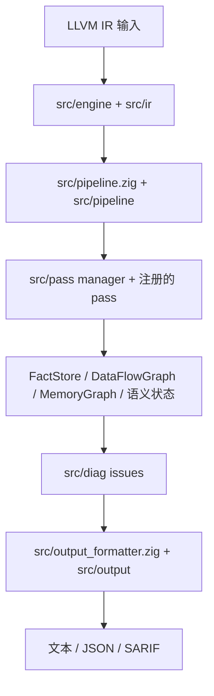

# OmniScope

```shell
    `....                                `.. ..
  `..    `..                         `.`..    `..
`..        `..`... `.. `.. `.. `..      `..         `...   `..    `. `..     `..
`..        `.. `..  `.  `.. `..  `..`..   `..     `..    `..  `.. `.  `..  `.   `..
`..        `.. `..  `.  `.. `..  `..`..      `.. `..    `..    `..`.   `..`..... `..
  `..     `..  `..  `.  `.. `..  `..`..`..    `.. `..    `..  `.. `.. `.. `.
    `....     `...  `.  `..`...  `..`..  `.. ..     `...   `..    `..       `....
                                                                   `..
```

OmniScope 分析 LLVM IR（`.ll` / `.bc`），报告可能的内存、所有权、资源和 FFI 边界问题。它适合在源码级工具到达语言边界后继续追问：这个指针或资源从哪里来、流向哪里、最终应该由谁释放。

它不是证明工具。报告应当作为审计证据，而不是已确认漏洞清单。

当前版本口径：`0.2.0`。

[English README](./README.md) | [English docs](./docs/en/README.md) | [中文文档](./docs/zh/README.md)

## 什么时候有用

- 你已经有 LLVM IR，想复核 FFI、unsafe、指针、回调或资源边界。
- 你需要 JSON 或 SARIF 输出，接入审计或 CI。
- 你想比较 release candidate 和 baseline 的结果差异。
- 你想查清某个 finding 是哪个 pass 产生的，以及证据从哪里来。

它不适合证明整个程序安全，也不替代编译器、sanitizer，或查出所有源码级 bug。

## 它怎么工作



核心思路是：只加载一次 IR，建立共享事实和图，让多个 pass 补充证据，再把最终 issue 列表格式化输出。继续阅读：

- [docs/zh/architecture.md](./docs/zh/architecture.md)：运行流程。
- [docs/zh/modules.md](./docs/zh/modules.md)：按问题理解模块职责。
- [docs/zh/passes.md](./docs/zh/passes.md)：pass 行为说明。

## 构建和运行

`build.zig` 默认使用 LLVM 22：

- macOS：`/opt/homebrew/opt/llvm`
- Linux：`/usr/lib/llvm-22`

```bash
zig build -Doptimize=ReleaseFast
./zig-out/bin/OmniScope path/to/input.bc --json
./zig-out/bin/OmniScope path/to/input.bc --sarif -o results.sarif
```

常用参数定义在 `src/config/main_config.zig`：

```bash
./zig-out/bin/OmniScope input.bc --boundary-only --min-severity high --json
./zig-out/bin/OmniScope input.bc --lang-prefix sqlite3_=c --default-lang rust
```

## 0.2.0 发布检查

版本字符串已经统一为 `0.2.0`，包括 `VERSION`、`build.zig.zon`、CLI `--version`、JSON 和 SARIF 输出。

但当前工作区不应直接打最终 `0.2.0` tag。发布前至少需要测试变绿，并更新 baseline 文档。优先检查：

- `zig build`
- `zig build test`
- `tests/BASELINE.md`
- `tests/integration/inline_ir_matrix.zig`

## 开源协议

[Apache 2.0](./LICENSE)
