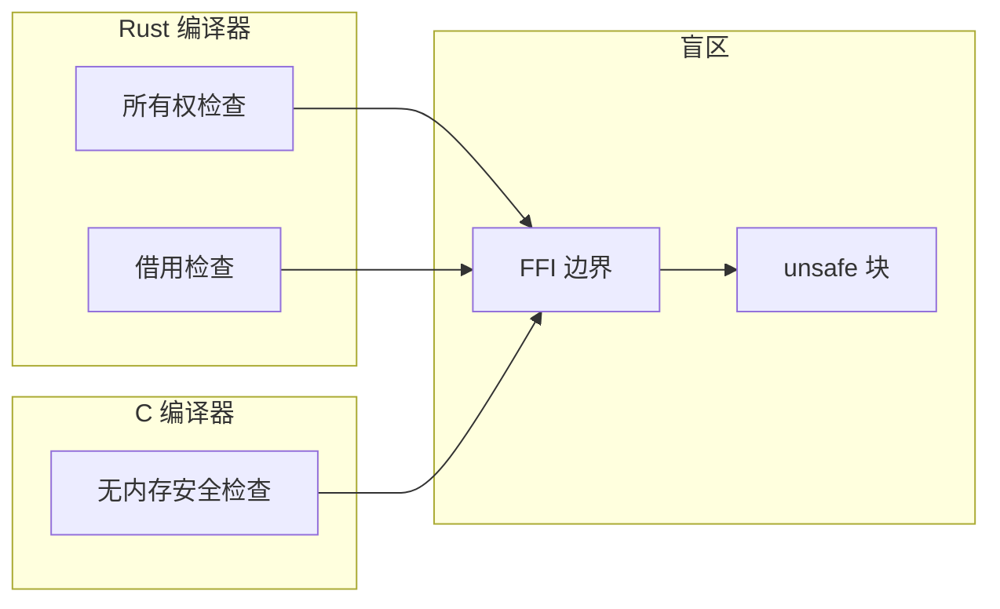
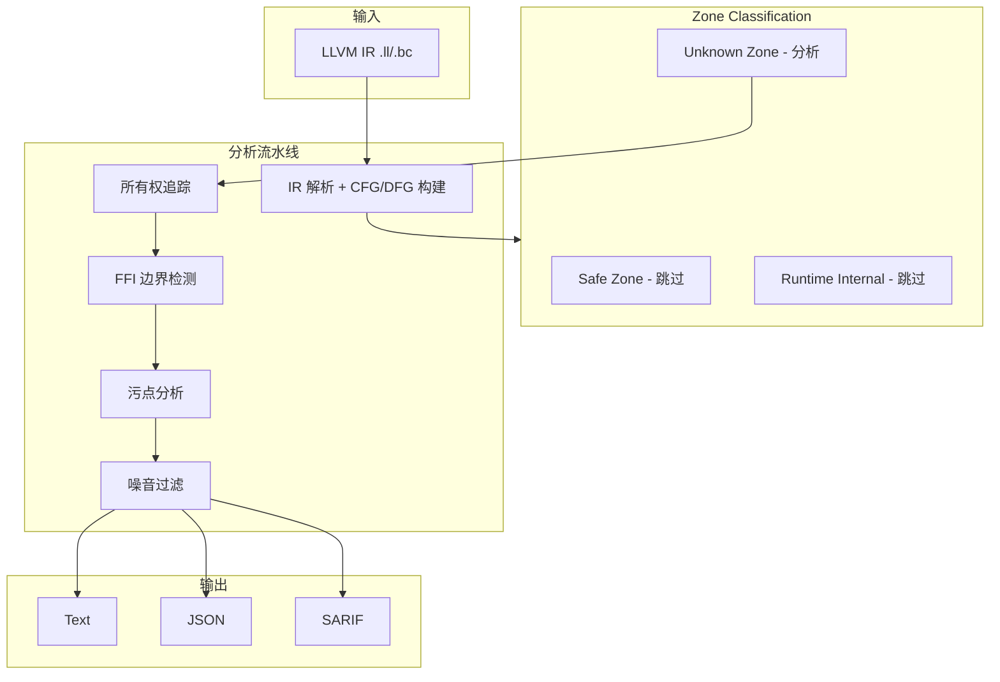
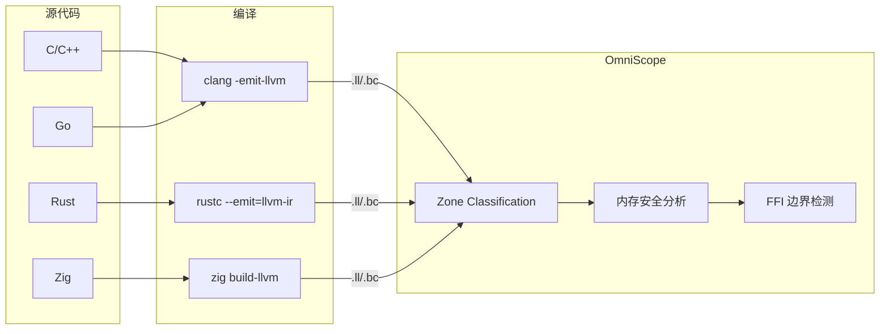
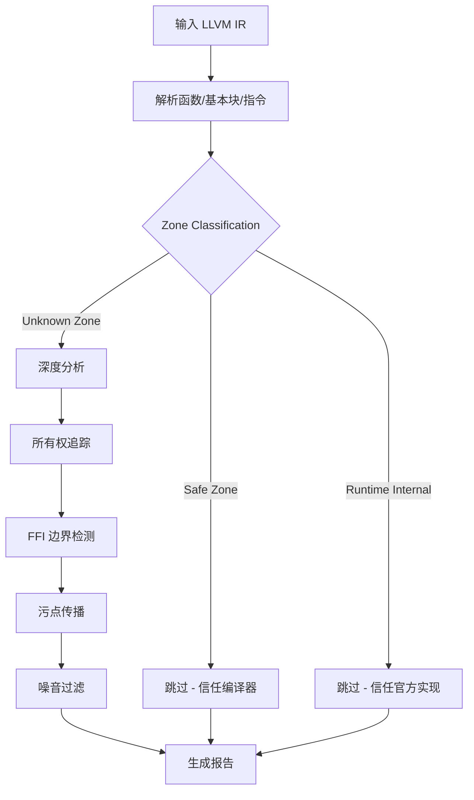

# OmniScope

**跨语言 FFI & 内存安全静态分析器**

**项目定位**: 专注于 unsafe/FFI 跨语言边界的静态安全分析

支持 C/C++/Rust/Zig/Go。通过 LLVM IR 检测内存安全问题和 FFI 边界违规。

[English](./README.md) | 简体中文

---

## 核心理念

### 为什么专注 unsafe/FFI？

**语言边界是所有编译器的盲区。**



- Rust 编译器只检查 Rust 侧的所有权
- C 编译器只看 C 侧的 malloc/free
- **跨语言边界 = 编译器不管的地方**

### Zone Classification（核心创新）

v0.1.5 引入 Zone Classification，只分析语言保障失效的地方：

| Zone 类型 | 含义 | 处理方式 |
|-----------|------|----------|
| **Safe Zone** | 有语言安全保障的代码 | 跳过分析（信任编译器） |
| **Runtime Internal** | 语言运行时/标准库 | 跳过分析（信任官方实现） |
| **Unknown Zone** | 无语言保障的代码 | 深度分析（必须检查） |

**效果**:
```
之前: "发现 185 个 UAF"  ❌ 大量误报
现在: "分析 267 函数，跳过 171 个 (64%)，发现 48 个问题"  ✅ 清晰可信
```

---

## 架构



## 数据流



## 分析流程



---

## 检测能力

| 类型 | 严重性 | 示例 |
|------|--------|------|
| 内存泄漏 | MEDIUM | malloc 无 free |
| Use-After-Free | HIGH | 释放后解引用 |
| Double-Free | HIGH | 同一资源释放两次 |
| 空指针解引用 | MEDIUM | 未检查可空指针 |
| 格式字符串 | MEDIUM | 用户控制的格式字符串 |
| 命令注入 | CRITICAL | system 使用用户输入 |
| FFI 所有权违规 | HIGH | Rust Box 被 C 释放 |

---

## 快速开始

```bash
# 构建
zig build

# 分析单个文件
./zig-out/bin/omniscope target.ll

# JSON 输出
./zig-out/bin/omniscope --format json target.ll > report.json

# SARIF 输出（GitHub Code Scanning）
./zig-out/bin/omniscope --format sarif target.ll > results.sarif
```

| 依赖 | 版本 |
|------|------|
| Zig | 0.15.2+ |
| LLVM | 18+ |

---

## 真实项目测试

### Zone Classification 效果

| 项目 | 语言 | 函数数 | Safe | Runtime | Unknown | Skip % | Issues |
|------|------|--------|------|---------|---------|--------|--------|
| ring | Rust + C | 278 | 261 | 17 | 0 | **100%** | 0 |
| wasmtime | Rust | 619 | 239 | 221 | 159 | **74.3%** | 96 |
| blst | Rust + C | 267 | 39 | 132 | 96 | **64.0%** | 48 |
| zlib-binding | C | 12 | 0 | 0 | 12 | 0% | 14 |
| openssl-wrapper | C | 12 | 0 | 0 | 12 | 0% | 7 |
| sqlite-binding | C | 8 | 0 | 0 | 8 | 0% | 4 |

### wasmtime 源码验证

OmniScope 检测到 wasmtime 的真实问题，并进行了源码验证：

**已验证的源码事实**：

1. **fiber_start 忽略 array_call 返回值**
   - 源码位置: `crates/wasmtime/src/runtime/vm/stack_switching/stack/unix.rs:326-328`
   - 开发者已用 TODO 注释标记此问题

2. **occupy_next_slots 缺少容量检查**
   - 源码位置: `crates/cranelift/src/func_environ/stack_switching/instructions.rs:301-320`
   - 注释声称会检查容量，实际代码中没有检查

详见: [wasmtime 源码验证报告](./docs/investigation_reports/zh/wasmtime_source.md)

---

## 性能提升

| 指标 | 优化前 | 优化后 | 改进 |
|------|--------|--------|------|
| 分析时间 (blst) | 3100ms | 836ms | **73%** |
| 分析时间 (ring) | 793ms | 269ms | **66%** |
| 函数分析量减少 | - | - | **最高 100%** |
| 问题检测精准度 | 185 UAF | 48 issues | **提升 74%** |

---

## 给用户的信

> 这不是一篇技术文档。这是一个被跨语言内存 bug 折磨了两年的人，写给同行的几句话。

**凌晨两点的 crash log**：

```
double free detected in thread 0
  pointer 0x7f3a4c002010
  previously freed at: rust::ffi::Box::into_raw -> c_wrapper::process -> free
  second free at: rust::drop::Drop::drop -> Box::from_raw -> free
```

这个 bug 我在测试环境跑过一百遍。一百遍。没复现。上线第一天，炸了。

原因：Rust 把内存通过 `Box::into_raw()` 交给 C，C 侧调了 `free()`，但 Rust 侧的 `Drop` trait 不知道这件事，函数结束时又 `free()` 了一次。

**编译器不管这事。跨语言边界是所有编译器的盲区。**

完整内容: [写给每一个被 FFI 坑过的人](./docs/TOUSER/zh.md)

---

## 项目结构

```
src/
├── pass/analysis/           # 分析 Pass
│   ├── pointer_ownership.zig    # 所有权追踪
│   ├── ffi_boundary.zig         # FFI 边界检测
│   ├── taint.zig                # 污点分析
│   └── noise_reduction.zig      # 噪音过滤
├── semantics/               # 语义分析
│   └── zone_classifier.zig      # Zone Classification
├── ir/                      # LLVM IR 接口
├── registry/                # 函数语义注册表
└── output/                  # 输出格式化

docs/
├── TOUSER/                  # 给用户的信
├── investigation_reports/   # 详细调查报告
└── project_exports/         # 综合测试报告
```

---

## 文档

| 文档 | 描述 |
|------|------|
| [写给用户的信](./docs/TOUSER/zh.md) | 为什么做这个项目 |
| [综合测试报告](./docs/project_exports/zh/COMPREHENSIVE_REPORT.md) | 12 个项目测试结果 |
| [性能提升报告](./docs/project_exports/zh/PERFORMANCE_IMPROVEMENT.md) | v0.1.5 性能数据 |
| [wasmtime 源码验证](./docs/investigation_reports/zh/wasmtime_source.md) | 真实漏洞验证 |
| [FFI 密集型项目报告](./docs/investigation_reports/zh/ffi_dense.md) | 25 个真实问题 |

---

## 局限性

1. 需要 LLVM IR 输入（`clang -emit-llvm` 或 `rustc --emit=llvm-ir`）
2. 建议使用调试信息编译（`-g`）以获取源码位置映射
3. 函数指针的间接调用通过启发式方法解析
4. 主要是过程内分析（所有权追踪支持过程间分析）

---

## 致谢

特别感谢 [@icehawk-hyb](https://github.com/icehawk-hyb) 担任技术顾问，为跨语言安全分析提供关键指导。

---

## License

Apache 2.0
