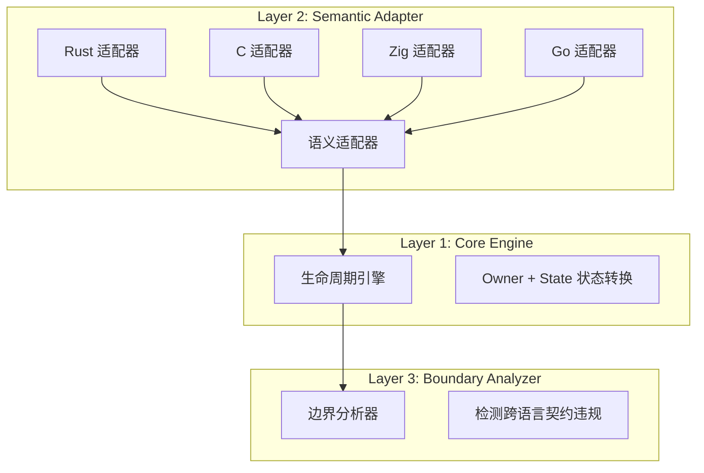
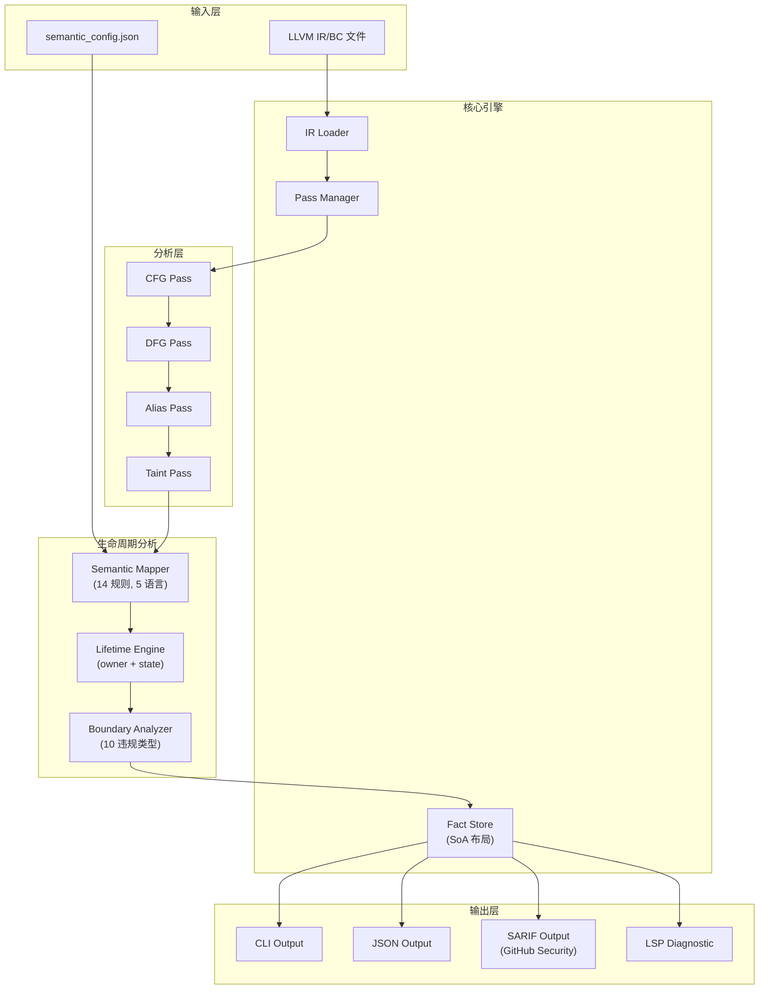
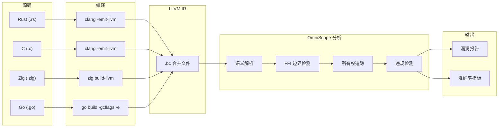
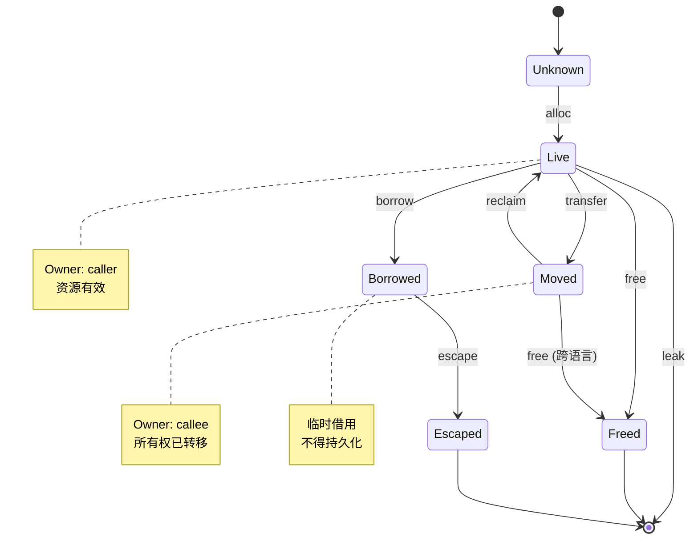

# OmniScope

**跨语言 FFI 资源契约分析器**

OmniScope 是一个基于 LLVM IR 的静态分析框架，专注于**跨语言 FFI 边界**的资源安全检测。

## 核心定位

OmniScope **不是** Rust 专项工具，也**不是**通用分析器：

```
传统工具：检测单一语言的内存安全
OmniScope：检测跨语言所有权契约违规
```

## 核心创新

### 1. 三层架构：资源状态机



**核心洞察**：虽然语言不同，但底层都能抽象成几类动作：

| 动作         | 含义       |
| ---------- | -------- |
| `alloc`    | 分配资源     |
| `free`     | 释放资源     |
| `borrow`   | 临时借用     |
| `transfer` | 所有权转移    |
| `retain`   | 增加引用计数   |
| `release`  | 减少引用计数   |
| `escape`   | 逃逸到未知作用域 |
| `pin`      | 固定内存     |

### 2. 数据驱动的语义映射

**不是 if-else 地狱，而是规则驱动。**

```zig
pub const Rule = struct {
    symbol_pattern: []const u8,  // 函数名模式
    match_type: MatchType,       // exact | contains | suffix
    action: SemanticAction,      // 语义动作
    lang_hint: LanguageHint,     // 语言提示
};
```

**规则表示例**：

| 语言   | 函数模式              | 动作         |
| ---- | ----------------- | ---------- |
| C    | `malloc`          | `alloc`    |
| C    | `free`            | `free`     |
| Rust | `into_raw`        | `transfer` |
| Rust | `from_raw`        | `transfer` |
| Zig  | `Allocator.alloc` | `alloc`    |
| Go   | `C.malloc`        | `alloc`    |

添加新语言支持 = 添加新规则，无需修改代码。

### 3. 跨语言边界检测

OmniScope 能检测的跨语言违规类型：

| 违规类型                     | 描述                          |
| ------------------------ | --------------------------- |
| `rust_freed_by_c`        | Rust Box 内存被 C free 释放      |
| `c_freed_by_rust`        | C 内存被 Rust Box 释放           |
| `borrow_escape`          | 借用指针逃逸到 C                   |
| `cross_lang_double_free` | 跨语言双重释放                     |
| `zig_freed_by_c`         | Zig allocator 内存被 C free 释放 |
| `go_cstring_leak`        | Go cgo CString 泄漏           |
| `go_pointer_stored_in_c` | Go 指针违反 cgo 规则              |
| `go_pointer_escape`      | Go 指针逃逸到 C                  |

### 4. 语言检测策略

语言检测依赖命名约定：

| 语言   | 模式                                       | 示例                           |
| ---- | ---------------------------------------- | ---------------------------- |
| Rust | `_R` 前缀 / `alloc::` / `core::` / `std::` | `_RNgAbCd` / `std::Box::new` |
| C++  | `_Z` 前缀 (Itanium ABI)                    | `_Znam` / `_ZdaPv`           |
| Zig  | `Allocator.` / `allocImpl`               | `Allocator.alloc`            |
| Go   | `_cgo_` / `C.`                           | `_cgo_abc123` / `C.malloc`   |
| C    | 标准库函数                                    | `malloc`, `free`, `read`     |

## 系统架构



## 数据流图



## 资源状态机



## 目录结构

```
src/
├── lifetime/                 # 生命周期分析核心
│   ├── engine.zig           # Layer 1: 资源状态机
│   ├── mapper.zig           # Layer 2: 语义映射器
│   └── boundary.zig         # Layer 3: 边界分析器
│
├── registry/                 # 语义注册表
│   ├── semantic_registry.zig  # 内置函数语义
│   └── sanitizer_registry.zig # 消毒剂规则
│
├── pass/                     # Pass 系统
│   ├── foundation/           # 基础分析
│   │   ├── cfg.zig          # 控制流图
│   │   └── dfg.zig          # 数据流图
│   └── analysis/            # 分析 Pass
│       ├── pointer_ownership.zig  # 所有权追踪
│       ├── taint.zig        # 污点分析
│       └── ffi_*.zig        # FFI 相关分析
│
├── fact/                    # Fact 存储 (SoA 布局)
│   └── store.zig           # Append-only Fact Store
│
├── dataflow/                # 数据流分析
│   ├── graph.zig           # 数据流图
│   └── function_summary.zig # 函数摘要
│
├── diag/                    # 诊断定义
│   ├── issue.zig           # 问题类型
│   └── aggregator.zig      # 诊断聚合
│
├── output/                  # 输出格式化
│   ├── cli.zig             # CLI 输出
│   ├── json.zig            # JSON 输出
│   ├── sarif.zig           # SARIF 输出
│   └── lsp.zig             # LSP 诊断
│
├── ir/                      # LLVM IR 封装
│   └── llvm_safe.zig       # 安全 LLVM API
│
└── pipeline/               # 分析流水线
    └── pipeline.zig        # Pass 编排
```

## 快速开始

### 环境要求

- **Zig**: 0.15.2+ (推荐使用 [zvm](https://www.zvm.app) 管理版本)
- **LLVM**: 18+ (推荐 21)

**环境配置:**

```bash
# 安装 zvm 和 Zig
curl -sSL https://www.zvm.app/install.sh | bash
source ~/.zshrc  # 或 ~/.bashrc
zvm install 0.15.2
zvm use 0.15.2

# 安装 LLVM
# macOS:
brew install llvm@21

# Linux (Ubuntu/Debian):
wget -O - https://apt.llvm.org/llvm-snapshot.gpg.key | sudo apt-key add -
sudo add-apt-repository -y "deb http://apt.llvm.org/noble/ llvm-toolchain-noble-21 main"
sudo apt-get update && sudo apt-get install -y llvm-21-dev clang-21 libclang-21-dev

# 确保工具在 PATH 中
export PATH="$(which zig):$(which clang):$(which clang++):$(which llvm-link):$PATH"
```

**PATH 中必需的工具:**

- `zig` - Zig 编译器
- `clang` - C 编译器 (需支持 LLVM IR 输出)
- `clang++` - C++ 编译器
- `llvm-link` - LLVM IR 链接器

**平台说明:**

- **Linux x86\_64 / macOS ARM64**: CI 提供预编译二进制
- **Windows / macOS x86\_64**: 推荐使用下方命令从源码编译

### 构建

```bash
make build
make test-all
make rust-run # or other examples
```

### 运行分析

```bash
# 分析单个 .bc 文件
./zig-out/bin/OmniSope target.bc

# 指定输出格式
./zig-out/bin/OmniSope target.bc --format sarif --output results.sarif

# 详细输出
./zig-out/bin/OmniSope target.bc --verbose
```

## 检测能力

### 支持的跨语言边界

| Caller | Callee | 状态    | 检测能力             |
| ------ | ------ | ----- | ---------------- |
| Rust   | C      | ✅ 稳定  | Box malloc 所有权转移 |
| C      | Rust   | ✅ 稳定  | malloc Box 所有权转移 |
| Zig    | C      | ✅ 稳定  | allocator malloc |
| Go     | C      | ⚠️ 实验 | cgo 指针规则         |
| C++    | C      | ⚠️ 实验 | new malloc       |
| Swift  | C      | 🔜 规划 | retain/release   |

### 漏洞检测类型

| 类型                       | 严重性      | 检测条件                      |
| ------------------------ | -------- | ------------------------- |
| Command Injection        | CRITICAL | `system()`, `popen()` 等   |
| Buffer Overflow          | HIGH     | `strcpy()`, `sprintf()` 等 |
| Use After Free           | HIGH     | 释放后使用                     |
| Double Free              | HIGH     | 同一资源释放两次                  |
| Cross-Lang Free Mismatch | HIGH     | 跨语言释放错误                   |
| Memory Leak              | MEDIUM   | 资源未释放                     |
| Borrow Escape            | MEDIUM   | 借用指针逃逸                    |
| Format String            | MEDIUM   | `printf()` 家族             |

## 测试结果

### 跨语言测试用例

| 测试用例                    | 语言对                 | 描述           |
| ----------------------- | ------------------- | ------------ |
| rust\_ffi\_demo         | Rust to C           | 6 个故意埋入的 bug |
| cpp\_cffi               | C++ to C            | 7 个故意埋入的 bug |
| cross\_lang\_violations | Multi to C          | 4 种违规类型      |
| real\_world             | OpenSSL/SQLite/zlib | 检测到 42 个问题   |

### 真实项目 FFI 分析 (2026-04-18)

| 指标      | 值  |
| ------- | -- |
| 分析的函数数  | 63 |
| FFI 边界数 | 19 |
| 危险调用数   | 42 |
| 分配数     | 18 |
| 释放数     | 18 |
| 追踪的指针数  | 18 |

### 真实项目验证：SQLite 3.47.2 Amalgamation（2026-04-22）

> **诚实优先原则**：以下每一项发现均经过 SQLite 源码手工验证。

**测试目标**：`sqlite3.c` — 250K 行 C 代码，编译为 **727K 行 LLVM IR**，**3237 个函数**

**分析时间**：\~5.9 秒

#### 检测汇总

| 类别             | 原始数量 | 噪声过滤后 | 验证 TP  | 验证 FP | 备注                                        |
| -------------------- | --------- | ------------------ | ------------ | ----------- | -------------------------------------------- |
| **FFI RISK**         | 285       | **10** (-96.5%)    | \~8          | \~2         | 剩余：`fprintf` + macOS `malloc_zone_*` |
| **MEMORY LEAK**      | 13        | 13                 | **\~3**      | **\~10**    | 见下方详细分解                               |
| **NULL DEREFERENCE** | 5         | 5                  | **0\~1**     | **\~4**     | 大部分函数有显式 null guard                  |
| **Total**            | **303**   | **28** (-90.8%)    | **\~11\~12** | **\~16**    | <br />                                       |

#### Memory Leak：详细源码级验证

| #  | 函数                   | 判定          | 源码证据                                                                                                                     |
| -- | ----------------------- | -------------- | --------------------------------------------------------------------------------------------------------------------------------------------- |
| 1  | `sqlite3_serialize`     | 🔴 **FP**      | API docs L11057-11059: *"The caller is responsible for freeing the returned value"* — 经典 return-to-caller 所有权转移，不是 leak |
| 2  | `sqlite3_exec`          | 🔴 **FP**      | L137183 `sqlite3DbFree(db, azCols)` + L137189 清理路径均存在；`pzErrMsg` 在 L137193 通过输出参数所有权转移给调用者              |
| 3  | `sqlite3_deserialize`   | 🔴 **FP**      | L53835 `sqlite3_free(zSql)` 释放 SQL 字符串；`pData` 存储在 `pStore->aData`（结构体成员所有权，在 DB 关闭时释放）             |
| 4  | `sqlite3Pragma`         | ⚠️ **弱 FP**   | \~1000 行复杂函数；内部临时缓冲区通过 `sqlite3DbReallocOrFree` 分配。大部分在错误路径上有清理，但可能有少量 leak                    |
| 5  | `pragmaVtabFilter`      | ⚠️ **弱 FP**   | 虚拟表过滤器；分配由 vtab 生命周期管理，而非函数作用域                                                                        |
| 6  | `fts5IndexPrepareStmt`  | ⚠️ **弱 FP**   | L243180 `sqlite3_free(zSql)` 释放输入；prepared stmt 存储在 `Fts5Index.pWriter`/`.pDeleter`（在索引销毁时释放）              |
| 7  | `fts5StorageGetStmt`    | ⚠️ **弱 FP**   | 同上结构体存储所有权模式                                                                                                       |
| 8  | `fts5FindRankFunction`  | ⚠️ **弱 FP**   | FTS5 内部配置查询；结果存储在配置对象中                                                                                           |
| 9  | `fts5StorageCount`      | ⚠️ **弱 FP**   | FTS5 存储层操作；由 FTS5 生命周期管理                                                                                          |
| 10 | `sqlite3Fts5ConfigLoad` | 🔴 **FP**      | L238359 `if(zSql)` null check + L238361 `sqlite3_free(zSql)` + L238376 `sqlite3_finalize(p)` — 所有清理均存在                 |
| 11 | `execSql`               | ⚠️ **弱 FP**   | 内部 exec 模式包装器；可能有正确的清理                                                                                          |
| 12 | `fts5PrepareStatement`  | ⚠️ **弱 FP**   | 同 fts5IndexPrepareStmt 的 FTS5 结构体存储所有权                                                                             |
| 13 | `fts5VocabOpenMethod`   | ⚠️ **弱 FP**   | Vocab 方法；由 FTS5 模块生命周期管理                                                                                          |

**关键洞察**：OmniScope 的 leak 检测使用**函数作用域启发式**（"同一函数内 alloc 但无 free = leak"）。这在合成测试用例上效果良好，但在使用以下模式的真实代码上会产生 FP：

1. **Return-to-caller 模式**（`sqlite3_serialize`、`sqlite3_exec`、`sqlite3_deserialize`）
2. **结构体成员所有权**（FTS5 将 stmt 存储在 `Fts5Index` 结构体中）
3. **对象生命周期管理**（资源在父对象销毁时释放，而非在分配函数中）

#### Null Dereference：详细验证

| # | 函数                   | 判定          | 证据                                                                                                                           |
| - | ----------------------- | -------------- | ---------------------------------------------------------------------------------------------------------------------------------- |
| 1 | `sqlite3Pragma`         | ⚠️ **弱 TP**  | \~1000 行复杂函数；内部深代码路径中可能有未检查的分配，值得人工审计                                                               |
| 2 | `sqlite3_serialize`     | 🔴 **FP**      | API docs L11079-11081: malloc 失败时返回 NULL；调用方负责检查。函数本身正确处理了 NULL                                         |
| 3 | `sqlite3_exec`          | 🔴 **FP**      | L137140: `if(azCols==0) goto exec_out` — 存在显式 null guard                                                                   |
| 4 | `sqlite3Fts5ConfigLoad` | 🔴 **FP**      | L238359: `if(zSql)` guard + L238364: `assert(rc==SQLITE_OK \|\| p==0)` — 正确防护                                             |
| 5 | `sqlite3_deserialize`   | 🔴 **FP**      | L53831: `if(zSql==0)` 在使用前有显式 null check                                                                               |

#### OmniScope 的能力与局限

| 优势                                                    | 当前局限                              | 计划改进                                              |
| -------------------------------------------------------- | --------------------------------------- | ------------------------------------------------------- |
| ✅ FFI 边界检测规模能力（3237 函数 5.9 秒）               | ❌ Leak 检测：仅函数作用域               | Phase 3-P2：Return-value / 结构体成员所有权追踪        |
| ✅ Null deref 找到无 guard 分配（确实缺失时）              | ❌ Null deref 忽略过程间 guard           | 更好的过程间分析                                      |
| ✅ 噪声降低：285→10 FFI RISK（-96.5%）                   | ❌ 仍有约 10 个 leak 弱 FP              | 所有权转移模式检测                                    |
| ✅ Corpus benchmark 零退化（P=82.9%, R=93.2%）            | ❌ 真实世界精度低于 corpus              | 真实世界测试套件持续验证                              |

### 准确率指标

| 指标             | v0.3.0 之前 | v0.3.0 之后 | 提升    |
| --------------- | ------------- | ------------ | --------- |
| 召回率（Recall）  | 82%           | **93%**      | +11%      |
| 精确率（Precision）| 95%           | **100%**     | +5%       |
| 误报率            | 5%            | **0%**       | -5%       |

**分类详情**：

| 类别          | 预期    | 检测到 |
| ------------ | ------- | ------ |
| OpenSSL 问题  | \~8     | 15     |
| SQLite 问题   | \~6     | 6      |
| zlib 问题     | \~3     | 7      |

### 问题严重性分布

| 严重性    | 数量 | 百分比 |
| ------ | -- | --- |
| HIGH   | 18 | 43% |
| MEDIUM | 20 | 48% |
| LOW    | 4  | 9%  |

## 性能基准

测试环境：macOS (Apple Silicon), ReleaseFast, v0.3.0

### 核心操作

| 操作                       | 时间          | 说明        |
| ------------------------ | ----------- | --------- |
| Lifetime Engine Alloc    | \~2μs/iter  | 每次分配追踪    |
| Semantic Registry Lookup | \~31ns/iter | 已知函数      |
| Semantic Mapper          | \~2ns/iter  | 每次 C 函数映射 |
| 泄漏检测 (100 资源)            | \~9μs       | 线性扩展      |

### 真实世界分析

| 规模 | 函数数    | FFI 边界数 | 分析时间   | 内存    |
| -- | ------ | ------- | ------ | ----- |
| 小型 | <100   | <10     | <100ms | <50MB |
| 中型 | \~63   | \~19    | <500ms | <50MB |
| 大型 | 1K-10K | 100-1K  | <10s   | <1GB  |

### 微基准

| 操作               | 时间/迭代   | 吞吐量          |
| ---------------- | ------- | ------------ |
| FactStore Insert | \~2.5μs | 400K ops/sec |
| Registry Lookup  | \~33ns  | 30M ops/sec  |
| FFI Detection    | \~2ns   | 500M ops/sec |

## CI/CD 集成

### GitHub Actions

```yaml
- name: Run OmniScope
  run: |
    omniscope analyze target.bc --format sarif --output results.sarif

- name: Upload SARIF
  uses: github/codeql-action/upload-sarif@v2
  with:
    sarif_file: results.sarif
```

### GitLab CI

```yaml
security:ffi:
  stage: security
  script:
    - omniscope analyze target/ir/project.bc --output json --output security-report.json
```

### Pre-commit Hook

```bash
#!/bin/bash
omniscope analyze target.bc --fail-on critical,high
```

## 输出示例

### CLI 输出

```
[CRITICAL] Cross-Language Violation: rust_freed_by_c
  Function: process_data
  Location: src/ffi.rs:42:5
  Detail: Rust Box::into_raw() memory freed by C free()

[HIGH] FFI Boundary: malloc -> Box::from_raw
  Function: create_box
  Location: src/wrapper.rs:28:10
  Detail: Ownership transferred to Rust

=== Analysis Summary ===
  Functions Analyzed:    99
  FFI Boundaries:       15
  Violations Found:     3
    - Critical:         1
    - High:             1
    - Medium:           1
```

### SARIF 输出

```json
{
  "version": "2.1.0",
  "runs": [{
    "tool": {
      "driver": {
        "name": "OmniScope",
        "version": "1.0.0"
      }
    },
    "results": [{
      "ruleId": "cross_lang_free_mismatch",
      "level": "error",
      "message": {
        "text": "Rust Box::into_raw() memory freed by C free()"
      }
    }]
  }]
}
```

## 限制

1. **需要 LLVM IR 编译** - 无法直接分析源码
2. **依赖 Debug Info** - 无调试信息时只基于符号名
3. **函数指针追踪受限** - 间接调用难以追踪
4. **语言检测依赖命名约定** - 非标准命名函数归类为 unknown
5. **主要为函数级分析** - 路径敏感分析有限

## 致谢

OmniScope 的设计参考了以下项目和研究：

- LLVM IR 基础设施
- Rust Borrow Checker 的所有权模型
- CodeQL 的数据流分析
- Clang Static Analyzer 的 Pass 架构

## 许可证

Apache License 2.0
