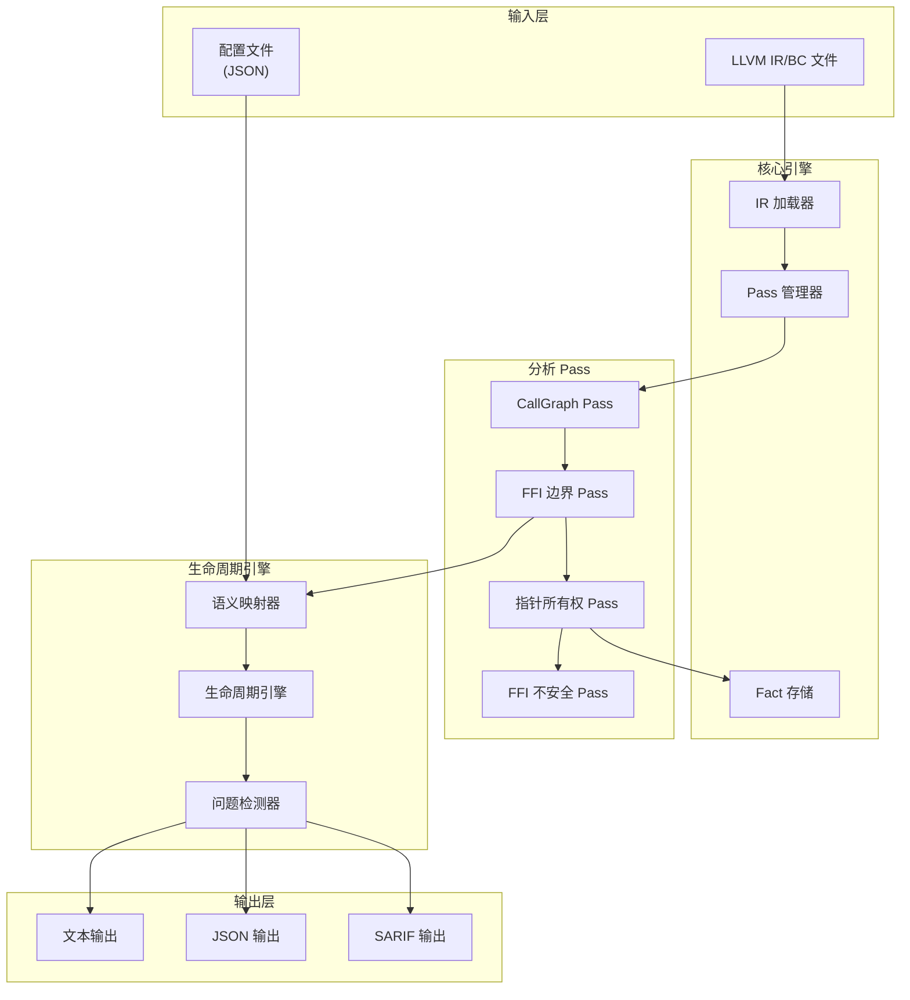
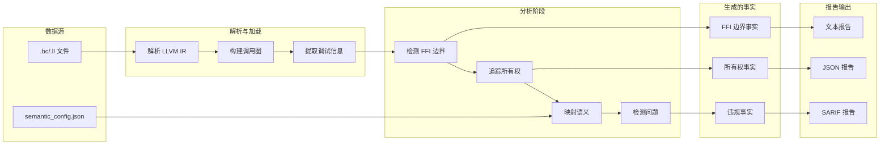
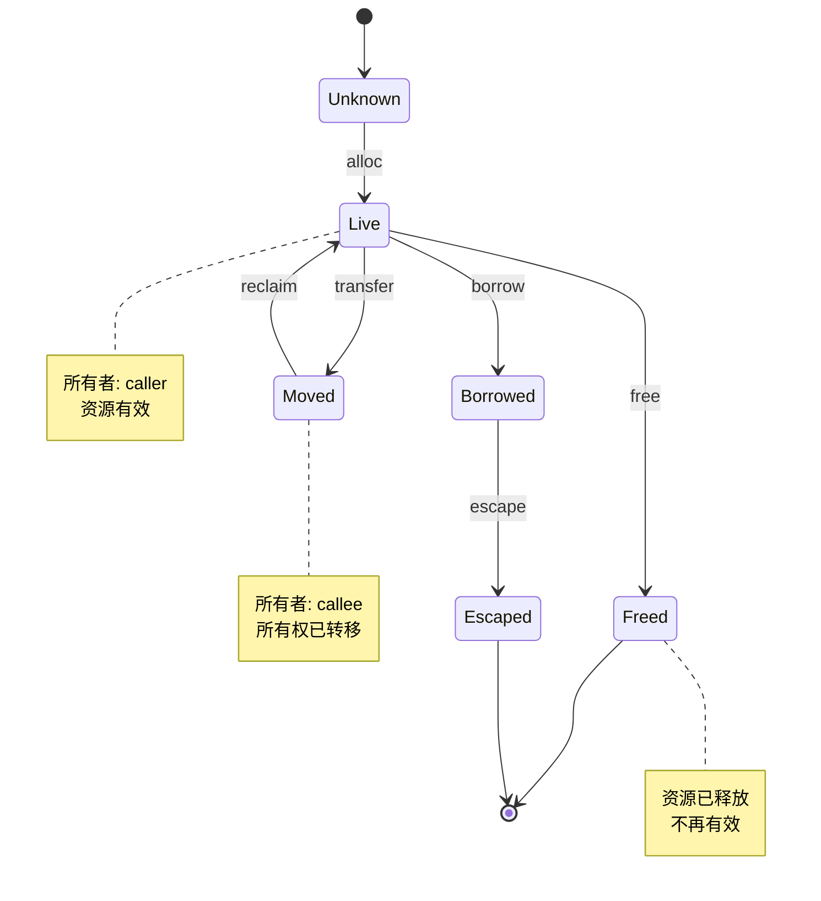
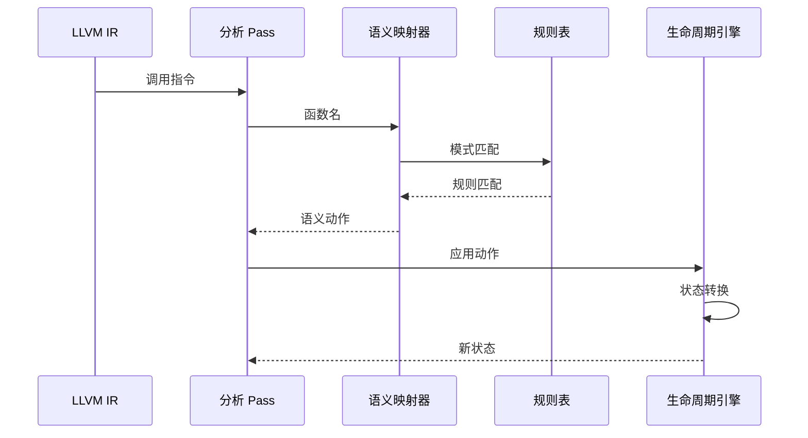

# OmniScope

**跨语言 FFI/Unsafe 边界分析器**

OmniScope 是一个基于 LLVM IR 的静态分析工具，专注于跨语言 FFI 边界的安全漏洞检测。

## 核心创新

### 1. Resource Lifetime Engine（资源生命周期引擎）

**不是 Rust 特定的 borrow checker，而是通用的资源生命周期分析。**

传统工具的问题：

- 只关注单一语言的内存安全
- 无法追踪跨语言边界的所有权转移

OmniScope 的解决方案：

```
资源生命周期 = 谁拥有 + 是否有效 + 是否逃逸

Owner: unknown | caller | callee | shared | system
State: unknown | live | moved | borrowed | freed | escaped | invalid
Action: alloc | free | borrow | transfer | reclaim | escape
```

这使得 OmniScope 能够分析：

- Rust ↔ C 的所有权转移
- Zig ↔ C 的分配器语义
- Go ↔ C 的 cgo 内存管理
- C++ ↔ C 的 RAII 边界

### 2. Semantic Registry（语义注册表）

**数据驱动的函数语义映射，而不是 if-else 地狱。**

```zig
pub const Rule = struct {
    symbol_pattern: []const u8,  // 函数名模式
    action: SemanticAction,       // 语义动作
    arg_index: ?u8,               // 资源参数索引
    returns_resource: bool,       // 是否返回资源
};
```

添加新语言支持 = 添加新规则，不需要修改代码逻辑。

### 3. 精确的源代码定位

通过 LLVM Debug Info 提取精确的文件名、行号、列号：

```
[CRITICAL] FFI RISK: dangerous_process -> _system
  Location: /path/to/dangerous.c:54:5
  Kind: command_exec
  Detail: Execute shell command - command injection risk
```

### 4. 跨语言 FFI 边界检测

| 调用方  | 被调用方 | 支持状态   |
| ---- | ---- | ------ |
| Rust | C    | ✅ 完全支持 |
| C++  | C    | ✅ 完全支持 |
| Go   | C    | ✅ 完全支持 |
| Zig  | C    | ✅ 完全支持 |
| C    | C    | ✅ 支持   |

## 检测的漏洞类型

| 类型             | 检测条件                                  | 严重程度     |
| -------------- | ------------------------------------- | -------- |
| 命令注入           | `system()`, `popen()` 等               | CRITICAL |
| 缓冲区溢出          | `strcpy()`, `strcat()`, `sprintf()` 等 | HIGH     |
| Double Free    | 同一资源被释放两次                             | HIGH     |
| Use After Free | 释放后继续使用                               | HIGH     |
| 内存泄漏           | 资源未释放                                 | MEDIUM   |
| 格式化字符串         | `printf()` 系列函数漏洞                     | MEDIUM   |
| 所有权不一致         | 跨语言边界的所有权不一致                          | HIGH     |
| 借用逃逸           | 借用逃逸到未知作用域                            | MEDIUM   |

## 快速开始

### 环境要求

- Zig 0.15+
- LLVM 18+ (macOS: `brew install llvm`)

### 构建

```bash
make build    # 构建项目
make check    # 类型检查
make test     # 运行测试
```

### 运行分析

```bash
# 分析单个 LLVM IR 文件
./zig-out/bin/OmniSope target.bc

# 分析跨语言 FFI
./zig-out/bin/OmniSope combined.bc
```

### 运行所有测试示例

```bash
make run      # 构建并运行所有 FFI 测试
```

## 架构

### 系统架构



### 数据流



### 生命周期引擎流程



### 语义映射流程



## 目录结构

```
src/
├── lifetime/           # Resource Lifetime Engine
│   ├── engine.zig      # 核心引擎
│   └── mapper.zig      # 语义映射
├── registry/           # Semantic Registry
│   ├── semantic_registry.zig  # 内置语义
│   └── config_loader.zig      # 配置文件加载
├── pass/               # Pass 系统
│   └── analysis/       # 分析 Pass
├── fact/               # Fact 存储
├── diag/               # 问题定义
└── ir/                 # LLVM 包装
```

## 使用示例

### 1. Rust → C FFI

```bash
make rust-run
```

预期检测：

- `system()` 命令注入 (CRITICAL)
- `strcpy()` 缓冲区溢出 (HIGH)
- `malloc()` 所有权转移 (MEDIUM)

### 2. C++ → C FFI

```bash
make cpp-run
```

检测 C++ 调用 C 函数时的：

- 所有权跨边界转移
- 危险 C 函数调用

### 3. Go → C FFI

```bash
make go-run
```

检测 Go 通过 cgo 调用 C 时的内存安全问题。

### 4. Zig → C FFI

```bash
make zig-run
```

检测 Zig 调用 C 函数时的分配器语义问题。

## 配置自定义 Wrapper

通过 JSON 配置文件添加项目特定的 wrapper 函数语义：

```json
{
  "functions": [
    {
      "pattern": "run_command",
      "match_type": "exact",
      "kind": "command_exec",
      "severity": "critical",
      "requires_taint_check": true,
      "description": "Execute shell command wrapper"
    }
  ]
}
```

## 输出示例

```
========================================
Test 1: Rust → C FFI
========================================

[CRITICAL] FFI RISK: dangerous_process -> _system
  Location: /path/to/dangerous.c:54:5
  Kind: command_exec
  Detail: Execute shell command - command injection risk

[HIGH] FFI RISK: dangerous_copy -> __strcpy_chk
  Location: /path/to/dangerous.c:84:5
  Kind: unchecked_copy
  Detail: Unchecked string copy - buffer overflow risk

[MEDIUM] RISKY LIBC CALL: dangerous_alloc -> malloc
  Location: /path/to/dangerous.c:107:20
  Kind: allocator
  Detail: Allocate memory - returns ownership, check for null
  Warning: This function TRANSFERS ownership
  Warning: Result requires NULL check

FFI Analysis Summary:
  Functions analyzed: 99
  FFI Boundaries: 62
  Dangerous calls: 12
  Semantic Registry: 18 functions known

PointerOwnership: Found 1 allocations, 1 frees, 1 tracked pointers
PointerOwnership: 1 cross-FFI ownership transfers detected
```

## 测试覆盖

| 示例              | 语言组合     | 检测的漏洞       | 准确率  |
| --------------- | -------- | ----------- | ---- |
| rust\_ffi\_demo | Rust → C | 6 个故意埋的 bug | 100% |
| cpp\_cffi       | C++ → C  | 7 个故意埋的 bug | 100% |
| go\_cffi        | Go → C   | 9 个故意埋的 bug | 89%  |
| zig\_cffi       | Zig → C  | 8 个故意埋的 bug | 88%  |

详细测试结果见 [examples/TEST\_RESULTS.md](examples/TEST_RESULTS.md)

## 局限性

1. **需要编译后的 LLVM IR** - 无法直接分析源代码
2. **过程内分析为主** - 跨函数的数据流分析有限
3. **依赖 Debug Info** - 没有 debug info 时只能显示符号名
4. **动态特性无法分析** - 函数指针、虚函数调用难以追踪

<br />

## 许可证

MIT License
