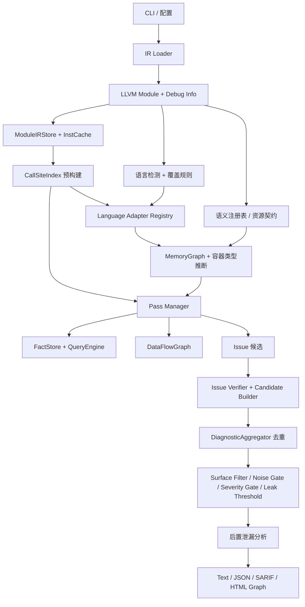

# OmniScope

```shell
    `....                                `.. ..
  `..    `..                         `.`..    `..
`..        `..`... `.. `.. `.. `..      `..         `...   `..    `. `..     `..
`..        `.. `..  `.  `.. `..  `..`..   `..     `..    `..  `.. `.  `..  `.   `..
`..        `.. `..  `.  `.. `..  `..`..      `.. `..    `..    `..`.   `..`..... `..
  `..     `..  `..  `.  `.. `..  `..`..`..    `.. `..    `..  `.. `.. `.. `.
    `....     `...  `.  `..`...  `..`..  `.. ..     `...   `..    `..       `....
                                                                   `..
```

OmniScope 是一个面向 LLVM IR（`.ll` / `.bc`）的静态分析器，用于审计 C、C++、Rust、Zig、Go、Java、Python、C# 之间的内存、所有权、资源和 FFI 边界风险。报告是审计证据，不等同于已确认漏洞。

Rust 版本正在开发中，敬请期待。该版本会尝试用不同的解题思路解决同一个跨语言安全分析问题。

当前版本：`0.2.0`。

[English README](./README.md) | [用户故事](./docs/touser/zh/ToUser.md) | [English docs](./docs/en/README.md) | [中文文档](./docs/zh/README.md) | [发布说明](./RELEASE_NOTES.md)

## 架构

```mermaid
flowchart LR
    Input[".ll / .bc 文件"] --> Load[加载 LLVM Module]
    Load --> Pre["预处理: 语言检测 + CallSiteIndex + Adapter + 容器推断"]
    Pre --> Phase1["阶段1 基础: CFG → DFG → Alias → CallGraph"]
    Phase1 --> Phase2["阶段2 分类: Surface + Semantic + Danger"]
    Phase2 --> Phase3["阶段3 FFI: Boundary + Type + ABI + Body + Detector"]
    Phase3 --> Phase4["阶段4 Issue: Lifetime + Ownership + Memory + Free + Overflow"]
    Phase4 --> Phase5["阶段5 运行时: Rust-FFI + JNI + GC + Callback + Lock + Error"]
    Phase5 --> Phase6["阶段6 跨语言: DataFlow + Taint"]
    Phase6 --> Post["后处理: 泄漏扫描 + 去重 + 置信度过滤"]
    Post --> Report[Text / JSON / SARIF / HTML]
```





## Pass 职责

| Pass 组 | Passes | 职责 |
|---|---|---|
| 基础 | `cfg`, `dfg`, `alias`, `call-graph` | 构建控制流、数据流、别名事实和调用关系。 |
| 分类 | `surface-classifier`, `semantic-resolver`, `danger-surface` | 分类用户代码、运行时、FFI surface 和语义风险区。 |
| 流与生命周期 | `taint-propagation`, `ptr-lifetime`, `pointer-ownership`, `cross-lang-dataflow` | 跟踪指针/资源流动、生命周期、所有权和边界传播。 |
| FFI 边界 | `ffi-detector`, `ffi-boundary`, `ffi-type-mismatch`, `abi-compat-checker`, `ffi-body-check` | 识别 FFI 调用/导出，以及 ABI、类型、函数体风险。 |
| FFI 安全 | `ffi-analysis-wrapper`, `ffi-unsafe`, `layout-mismatch`, `string-safety-ffi`, `unwind-boundary` | 检测 unsafe API、布局/字符串/unwind 问题和所有权违规。 |
| 内存/资源 | `malloc-check`, `free-validation`, `memory-safety`, `return-check`, `buffer-overflow`, `integer-overflow` | 检测分配、释放、返回值、溢出和释放后使用等问题。 |
| 运行时规则 | `rust-ffi-auditor`, `jni-leak-detector`, `gc-safety`, `callback-escape`, `callback-lifecycle`, `lock`, `error-propagation-tracer` | 应用 Rust FFI、JNI、GC、回调、锁和错误传播规则。 |

Pass Manager 会解析依赖、按拓扑序运行、可选记录性能数据，并在单个 pass 失败时尽量降级继续。

## CLI

```bash
zig build -Doptimize=ReleaseFast
./zig-out/bin/OmniScope input.bc
./zig-out/bin/OmniScope input.bc --json -o report.json
./zig-out/bin/OmniScope input.bc --sarif -o report.sarif
./zig-out/bin/OmniScope rust.bc c.bc
```

| 命令 / 选项 | 含义 |
|---|---|
| `<input.ll/bc> [...]` | 分析单文件；传入 2 个以上文件会启用多文件跨语言匹配。 |
| `--json`, `--sarif`, `-o/--output <file>` | 选择机器可读输出和输出文件。 |
| `--visualize` / `--viz` | 在 `output/<input>/` 下生成 HTML issue 图。 |
| `--focus-user-code`, `--no-focus-user-code`, `--include-stdlib` | 控制标准库/编译器噪音过滤。 |
| `--ffi-only`, `--boundary-only`, `--show-surface <list>` | 限制报告到 FFI、边界或指定 surface。可选：`boundary`, `ffi`, `reachable`, `internal`, `runtime`。 |
| `--min-severity <low|medium|high|critical>` | 过滤低于指定严重度的 issue。 |
| `--leak-threshold <0.0-1.0>`, `--no-zig-tracking` | 调整泄漏置信度阈值和 Zig allocator 跟踪。 |
| `--lang <name=lang>`, `--lang-prefix <prefix=lang>`, `--lang-suffix <suffix=lang>`, `--source-lang <file:lang>`, `--default-lang <lang>` | 覆盖语言检测。语言：`c`, `cpp`, `rust`, `zig`, `go`, `java`, `python`, `csharp`。 |
| `--report-surfaces` | 在 JSON 中加入 FFI 可见导出 surface。 |
| `--perf-stats`, `--perf-json <path>` | 打印/导出每个 pass 的时间和内存统计。 |
| `--config <file>`, `--init-config` | 加载 JSON 配置或生成 `omniscope.json`。自动发现 `./omniscope.json` 和 `~/.config/omniscope/config.json`。 |
| `-v/--verbose`, `-d/--debug`, `-q/--quiet`, `--debug-resource-contract` | 控制日志和资源契约调试。 |
| `-h/--help`, `--version` | 打印帮助或版本。 |

## 面向用户的说明

`docs/touser/` 解释了 OmniScope 要解决的问题：编译器和大多数分析器只理解单一语言，而 FFI bug 往往出现在运行时交接处。建议先读：

- [中文：写给每一个被 FFI 坑过的人](./docs/touser/zh/ToUser.md)
- [English: To Everyone Who's Been Burned by FFI](./docs/touser/en/ToUser.md)

## 构建和验证

```bash
zig build
zig build test
make baseline-check
make corpus-check
```

需要 Zig >= `0.15.2` 和 LLVM 22。

## 致谢

特别感谢 [@icehawk-hyb](https://github.com/icehawk-hyb) 担任技术顾问，并在跨语言安全分析方向提供关键指导。

## 引用

如果你在研究中使用 OmniScope，请引用：

```shell
@tool{omniscope,
  title = {OmniScope: Cross-Language FFI and Memory Safety Static Analyzer},
  author = {TimWood},
  year = {2026},
  url = {https://github.com/Timwood0x10/OmniScope}
}
```

## 开源协议

[Apache 2.0](./LICENSE)
