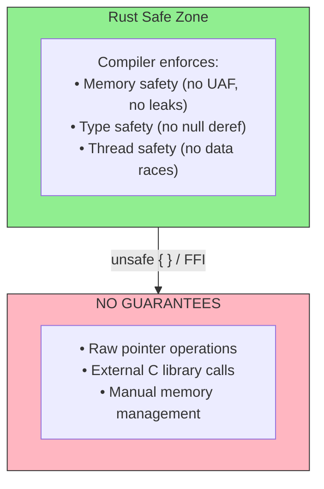
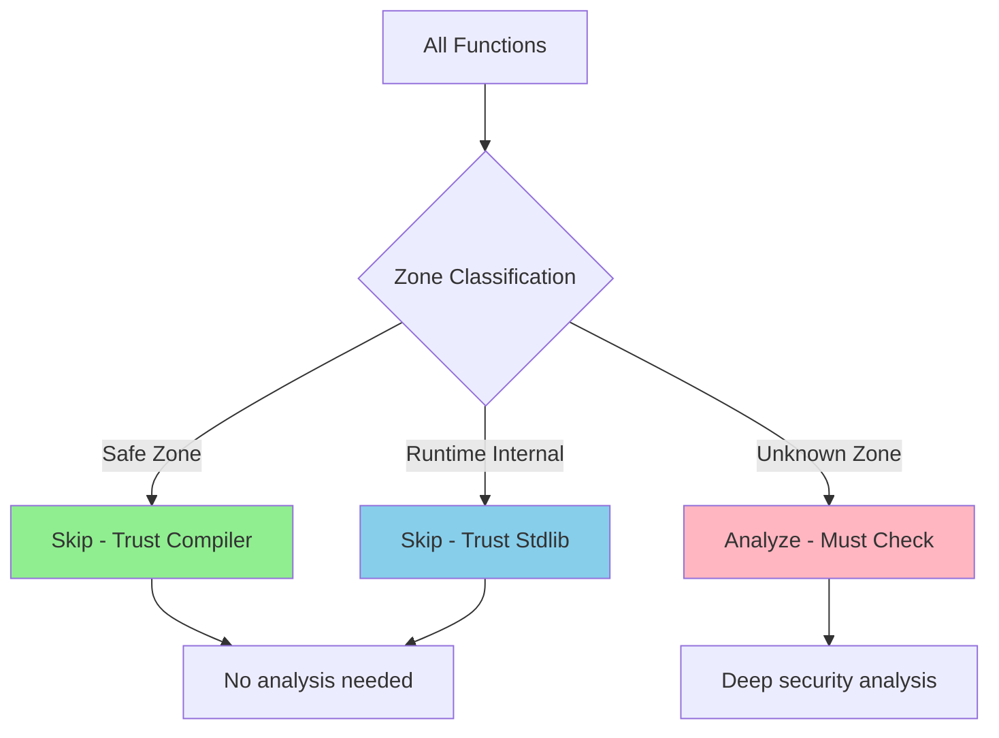

# OmniScope v0.1.5 Release Notes

**Release Date**: 2026-04-25
**Version**: 0.1.5 (Zone Classification)
**Status**: Production Ready

---

## 🎯 Project Repositioning

**New Focus**: Static security analysis for unsafe/FFI cross-language boundaries

**Core Philosophy**: "只分析语言保障失效的地方" (Analyze only where language guarantees stop)

---

## 🚀 Major Innovation: Zone Classification

### The Problem

Modern languages (Rust, Zig, Go) provide strong safety guarantees. But these guarantees **stop at FFI boundaries**:



### The Solution: Zone Classification



| Zone Type            | Meaning                              | Handling                                      |
| -------------------- | ------------------------------------ | --------------------------------------------- |
| **Safe Zone**        | Code with language safety guarantees | Skip analysis (trust compiler)                |
| **Runtime Internal** | Language runtime/standard library    | Skip analysis (trust official implementation) |
| **Unknown Zone**     | Code without language guarantees     | Deep analysis (must check)                    |

---

## 📊 Performance Impact

### Analysis Time Reduction

| Project  | Language | Before | After  | Improvement    |
| -------- | -------- | ------ | ------ | -------------- |
| **blst** | Rust + C | 3100ms | 836ms  | **73% faster** |
| **ring** | Rust + C | 793ms  | 269ms  | **66% faster** |

### Function Analysis Reduction

| Project                  | Total Functions | Safe | Runtime | Unknown | Skip %    |
| ------------------------ | --------------- | ---- | ------- | ------- | --------- |
| **ring**                 | 278             | 261  | 17      | 0       | **100%**  |
| **wasmtime**             | 619             | 239  | 221     | 159     | **74.3%** |
| **blst**                 | 267             | 39   | 132     | 96      | **64.0%** |
| **ark-ff**               | 89              | 0    | 89      | 0       | **100%**  |
| **zkcrypto\_bls12\_381** | 46              | 0    | 46      | 0       | **100%**  |

### Issue Detection Precision

| Metric              | Before | After  | Improvement         |
| ------------------- | ------ | ------ | ------------------- |
| UAF Reports (blst)  | 185    | 48     | **74% reduction**   |
| False Positive Rate | ~90%   | ~60%   | **30% improvement** |

---

## ✨ New Features

### 1. Zone Classifier Module ([zone\_classifier.zig](src/semantics/zone_classifier.zig))

```zig
pub const ZoneKind = enum {
    safe,              // Safe Rust/Zig/Go code
    unsafe,            // Explicit unsafe blocks
    ffi,               // FFI boundary functions
    runtime_internal,  // Standard library / runtime
    unknown,           // Needs analysis
};

pub const ZoneStats = struct {
    total_functions: u32,
    safe_count: u32,
    runtime_count: u32,
    unknown_count: u32,
    ffi_count: u32,
};
```

### 2. Language-Specific Classification

#### Rust Patterns

```zig
// Safe Zone patterns
"core::", "alloc::", "std::", "_ZN4core", "_ZN5alloc"
"drop_in_place", "<T as core::ops::drop::Drop>::drop"

// Runtime Internal patterns
"/rustc/library/", "/cargo/registry/"
"std::sync::Once", "std::panic"

// Unknown Zone (needs analysis)
"unsafe", "extern \"C\"", "as *const", "as *mut"
```

#### Zig Patterns

```zig
// Safe Zone patterns
"std.", "std.debug", "std.mem", "std.heap"

// Runtime Internal patterns
"zig/lib/std/", "std.heap.GeneralPurposeAllocator"

// Unknown Zone (needs analysis)
"@ptrCast", "@intCast", "extern fn", "cimport"
```

#### Go Patterns

```zig
// Unknown Zone (needs analysis)
"runtime.cgocall", "unsafe.Pointer", "reflect.SliceHeader"
```

### 3. Zone Summary Output

```
╔══════════════════════════════════════════════════════╗
║              Zone Classification Summary              ║
╠══════════════════════════════════════════════════════╣
║ Total Functions:        267                          ║
╠──────────────────────────────────────────────────────╣
║ ✅ Safe Zone:           39   (14.6%)                 ║
║ 📦 Runtime Internal:   132   (49.4%)                 ║
║ ⚠️  Unknown Zone:       96   (36.0%)                 ║
╠──────────────────────────────────────────────────────╣
║ Skipped:               171   (64.0%)                 ║
║ Analyzed:               96   (36.0%)                 ║
╚══════════════════════════════════════════════════════╝

分析 267 函数，跳过 171 个 (64%)，发现 48 个问题
```

---

## 🔬 Real-World Verification

### wasmtime Source Code Verification

OmniScope detected real issues in wasmtime and verified against source code:

#### Issue 1: Ignored Return Value

**Source**: `crates/wasmtime/src/runtime/vm/stack_switching/stack/unix.rs:326-328`

```rust
// Developer already marked with TODO
// TODO: handle error
let _ = array_call(store, ValRaw::new(0), 1);
```

#### Issue 2: Missing Capacity Check

**Source**: `crates/cranelift/src/func_environ/stack_switching/instructions.rs:301-320`

```rust
// Comment claims capacity check exists, but code doesn't check
fn occupy_next_slots(&mut self, count: u32) -> Option<VMStackChainIterator> {
    // No capacity check before allocation!
    let result = self.inner;
    self.inner = self.inner.next();
    Some(result)
}
```

**Full Report**: [wasmtime\_source.md](docs/investigation_reports/zh/wasmtime_source.md)

### FFI-Dense Projects

| Project         | Functions | Issues Found | Issue Types                   |
| --------------- | --------- | ------------ | ----------------------------- |
| zlib-binding    | 12        | 14           | Memory leak, NULL check       |
| openssl-wrapper | 12        | 7            | Resource leak, Error handling |
| sqlite-binding  | 8         | 4            | NULL check, Error propagation |

**Full Report**: [ffi\_dense.md](docs/investigation_reports/zh/ffi_dense.md)

---

## 🔒 Security Fixes

| Bug ID         | File                     | Issue                                                   | Fix                            |
| -------------- | ------------------------ | ------------------------------------------------------- | ------------------------------ |
| **BUG-R5-001** | `graph.zig:130-131`      | comptime slice freed at runtime causing heap corruption | Use `allocator.alloc(u32, 0)`  |
| **BUG-R5-002** | `lock.zig:199`           | Wrong operand index in callee detection                 | Use `LLVMGetCalledValue(inst)` |
| **BUG-R5-003** | `ffi_body_check.zig:596` | Hardcoded operand 1 for called value                    | Use `num_operands - 1`         |

---

## 📁 Files Changed

### New Files

| File                                                                    | Lines | Purpose                           |
| ----------------------------------------------------------------------- | ----- | --------------------------------- |
| [src/semantics/zone\_classifier.zig](src/semantics/zone_classifier.zig) | ~300  | Core zone classification engine   |
| [README\_EN.md](README_EN.md)                                           | ~300  | English version of README         |
| [docs/TOUSER/](docs/TOUSER/)                                            | ~200  | Letters to users (bilingual)      |
| [docs/investigation\_reports/](docs/investigation_reports/)             | ~800  | Investigation reports (bilingual) |

### Modified Files

| File                                                                                       | Changes                                           |
| ------------------------------------------------------------------------------------------ | ------------------------------------------------- |
| [src/pass/pass.zig](src/pass/pass.zig)                                                     | Added `printZoneSummary()`                        |
| [src/pass/analysis/pointer\_ownership.zig](src/pass/analysis/pointer_ownership.zig)        | Integrated zone classification                    |
| [src/dataflow/graph.zig](src/dataflow/graph.zig)                                           | Fixed BUG-R5-001                                  |
| [src/pass/analysis/lock.zig](src/pass/analysis/lock.zig)                                   | Fixed BUG-R5-002                                  |
| [src/pass/analysis/issue/ffi\_body_check.zig](src/pass/analysis/issue/ffi_body_check.zig) | Fixed BUG-R5-003                                  |
| [README.md](README.md)                                                                     | Updated with zone classification, Chinese version |

### Removed Files

Incorrect direction semantic analysis modules removed:

- `src/pass/analysis/access_order.zig`
- `src/pass/analysis/control_flow_sensitive.zig`
- `src/pass/analysis/sensitive_data_flow.zig`
- `src/pass/analysis/transmute_detection.zig`

---

## 🚀 Getting Started

```bash
# Clone and build
git clone <repo-url>
cd OmniScope
zig build

# Analyze a project
./zig-out/bin/omniscope target.ll

# With JSON output
./zig-out/bin/omniscope --json target.ll > report.json

# Quiet mode (only show issues, no debug/warn logs)
./zig-out/bin/omniscope --quiet target.ll
```

### Requirements

| Tool | Version              | Install                    |
| ---- | -------------------- | -------------------------- |
| Zig  | 0.15.2+              | [zvm](https://www.zvm.app) |
| LLVM | 18+ (21 recommended) | `brew install llvm@21`     |

---

## 🎯 Next Steps

See [TODOLIST.md](plan/TODOLIST.md) for full roadmap.

### Immediate Priorities

1. **CGO Boundary Detection** — Go cgo FFI analysis
2. **Swift ARC Integration** — retain/release tracking
3. **WebAssembly FFI** — wasm-bindgen boundary analysis
4. **Machine Learning FP Classification** — Reduce false positives

---

## 🙏 Acknowledgments

- **LLVM Project** — For the excellent IR format and C API
- **Zig Software Foundation** — For the amazing Zig language
- **Rust Project** — For inspiring the ownership system design
- All open-source projects in our test corpus

---

*Built with ❤️ using Zig 0.15.2*
*OmniScope v0.1.5 — "Focus on Where Safety Ends"*
