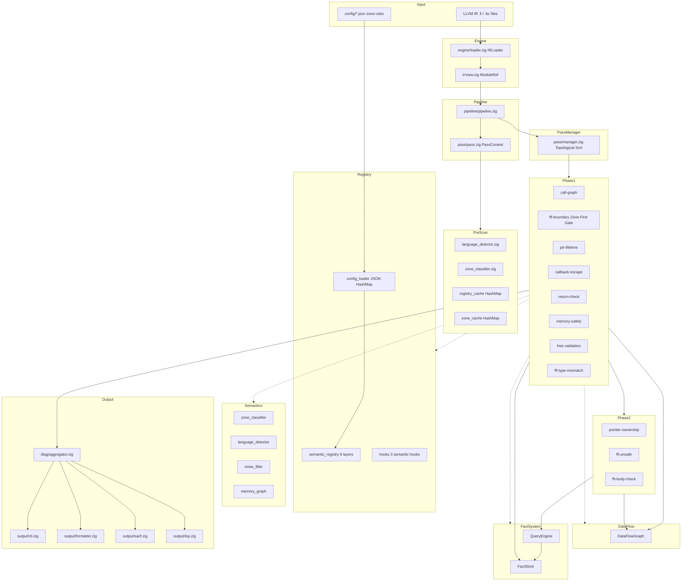
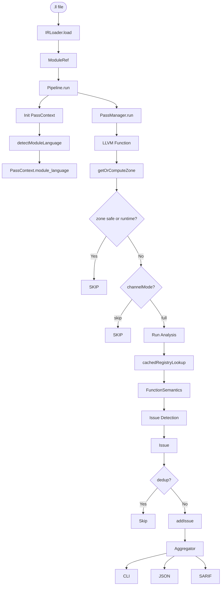
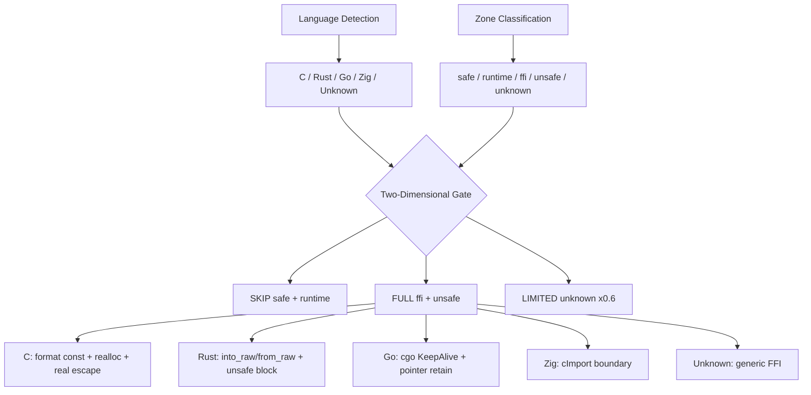
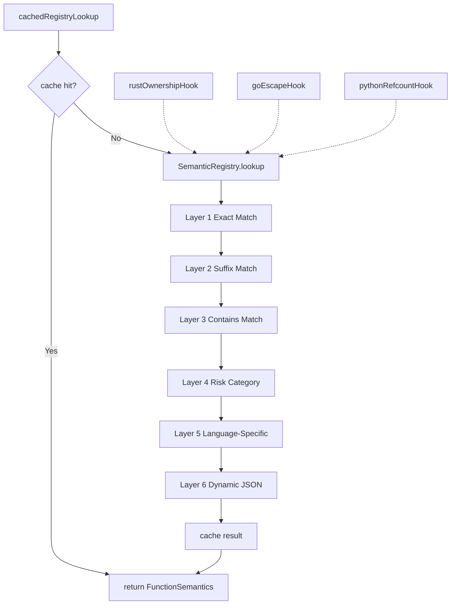
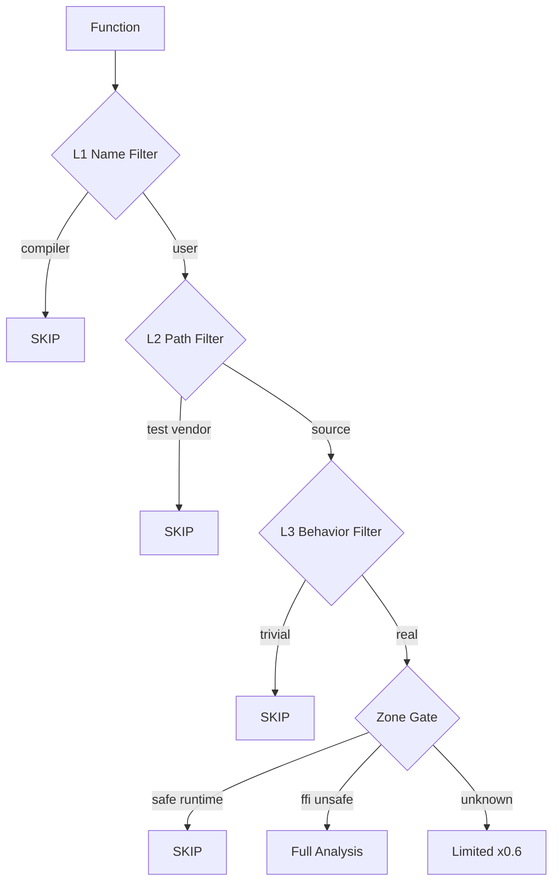
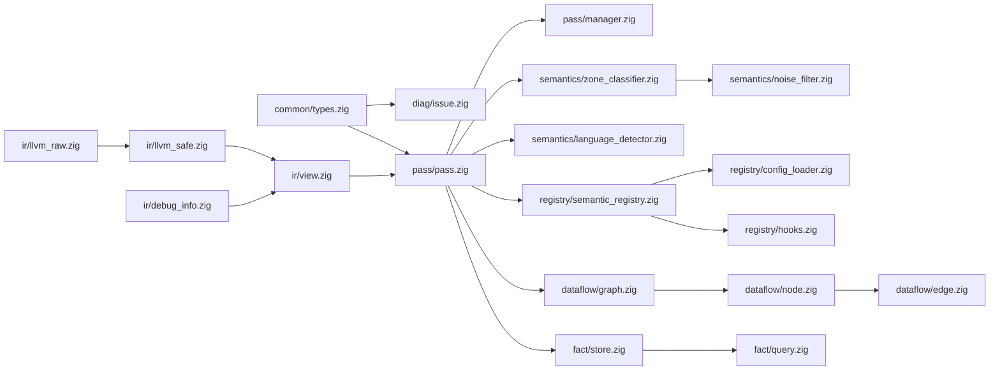

# OmniScope Architecture &amp; Data Flow

## 1. System Architecture

## 2. Data Flow

## 3. Zone-First + Language-First Channel Matrix

## 4. Registry and Hook System

## 5. Noise Reduction Pipeline

## 6. Module Dependency Graph

