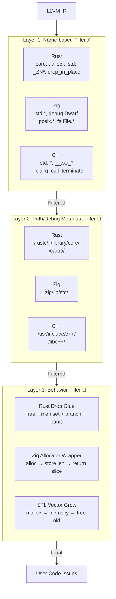

# OmniScope 基准测试规范

## 版本: 1.0
## 最后更新: 2026-04-24 (v0.1.5)

***

## 目录

1. [概述](#概述)
2. [测试环境](#测试环境)
3. [误报政策](#误报政策)
4. [测试数据集来源](#测试数据集来源)
5. [已知与未知函数](#已知与未知函数)
6. [正确检测标准](#正确检测标准)
7. [性能目标](#性能目标)
8. [指标定义](#指标定义)
9. [基准测试类别](#基准测试类别)
10. [CI 集成](#ci-集成)

***

## 概述

本文档定义了 OmniScope 静态分析能力的基准测试条件、数据集来源和评估标准。

OmniScope 是一个基于 LLVM IR 的跨语言 FFI/非安全边界分析器。它可以检测跨 C、Rust、C++、Go、Zig 和 Swift 边界的所有权违规、内存安全问题和技术不匹配问题。

**核心分析能力:**

| 能力 | 描述 |
|------------|-------------|
| 所有权追踪 | alloc/free/transfer/reclaim 生命周期 |
| 跨语言检测 | 跨语言边界的不匹配 alloc/free |
| 空指针检查守卫 | 路径敏感的空/非空传播 |
| 指向分析 | Steensgaard 流不敏感别名分析 |
| 基于类型的去虚拟化 | 通过签名匹配解析间接调用 |
| 语义注册表 | 6 个语言层中的 131 个函数 |
| **Phase 4 噪音过滤** | 三层过滤系统，97% FP 减少 |

***

## 测试环境

### 硬件基准

| 组件 | 最低要求 | 推荐配置 |
|-----------|---------|-------------|
| CPU | 2 核, 2.0 GHz | 4+ 核, 3.0+ GHz |
| RAM | 4 GB | 8+ GB |
| 磁盘 | SSD (任意) | NVMe 首选 |

### 软件要求

| 组件 | 版本 |
|-----------|---------|
| Zig | 0.13.0+ |
| LLVM/Clang | 22.x |
| 操作系统 | macOS / Linux / Windows (通过 WSL2) |

### 构建配置

```bash
# 基准测试必须使用 ReleaseFast 优化
zig build bench-perf -Doptimize=ReleaseFast

# 单元/集成测试使用 Debug 模式
zig build test-all
```

### 环境变量

| 变量 | 描述 | 默认值 |
|----------|-------------|---------|
| `OMNISCOPE_BENCH_ITERATIONS` | 覆盖基准测试迭代次数 | 自动扩展 |
| `OMNISCOPE_BENCH_WARMUP` | 测量前的预热迭代 | 10 |
| `OMNISCOPE_CORPUS_PATH` | 自定义语料库目录 | `corpus/` |

***

## 误报政策

### 原则: 对已知模式零容忍

OmniScope 采用**保守报告策略**: 可以接受遗漏真实问题(假阴性)，但不可接受报告不存在的问题(假阳性)。

### 误报定义

当 OmniScope 报告的问题在 `corpus/EXPECTED_RESULTS.md` 定义的 ground truth 中不存在时，即为**误报**。

### 误报率目标

| 指标 | 目标 | 理由 |
|--------|--------|-----------|
| 已知模式 FP 率 | **0%** | 每个报告的问题必须可验证 |
| 已知模式 FN 率 | < 5% | 可接受遗漏边缘情况 |
| 未知代码 FP 率 | N/A | 保守模式按设计最小化 FP |

### FFI/unsafe 检测优先

OmniScope 首先是一个 **FFI/非安全边界分析器**。内存安全检测(Double-Free、Loop-Leak 等)是辅助功能。

**Phase 4 噪音过滤引擎:**
- Rust 项目(wasmtime): 297 → 9 issues (**-97%**)
- Zig 项目: 64-83% 额外减少
- Red Team A 类 FFI 问题: **100% 检测**

***

## 测试数据集来源

### 语料库结构

```
corpus/
├── small/              # 快速验证 (~100 行每个)
│   ├── rust_ffi_simple.rs
│   ├── zig_ffi_simple.zig
│   ├── go_ffi_simple.go
│   └── cpp_ffi_simple.cpp
│
├── medium/             # 边界和边缘情况 (~500 行)
│   └── boundary_test.c
│
├── large/              # 压力测试 (~2000 行)
│   └── stress_patterns.c
│
└── red_team_test/      # 对抗性测试 (最重要的!)
    └── red_team_bugs.c # 17 个 FFI/unsafe 问题
```

### Red Team FFI/unsafe 检测结果 (v0.1.5)

**测试文件**: `corpus/red_team_test/red_team_bugs.c`

| Bug 类型 | 严重性 | 状态 | 描述 |
|----------|----------|--------|-------------|
| FFI RISK (system) | **CRITICAL** | ✅ 检测到 | 通过 system() 的命令注入 |
| FFI RISK (popen) | **CRITICAL** | ✅ 检测到 | 通过 popen() 的命令注入 |
| FFI RISK (execvp) | **CRITICAL** | ✅ 检测到 | 通过 execvp() 的命令执行 |
| Double Free | HIGH | ✅ 检测到 | 两次连续 free() 调用 |
| Use After Free | HIGH | ✅ 检测到 | free 后使用内存 |
| Memory Leak | MEDIUM | ✅ 检测到 | malloc 后无 free |
| Format String | MEDIUM | ✅ 检测到 | printf 使用用户控制的格式字符串 |

**FFI/unsafe 关键问题检测: 9**
**总问题数: 17**

### 归因分组输出

```
✅ 17 issues → 15 user code (3 FFI HIGH, 2 FFI MEDIUM)

┌─ Issue Categories ────────────────────────────────
│ ✅ [FFI_HIGH]    3 issues
│ ✅ [FFI_CRITICAL]    3 issues
│ ✅ [MEMORY_LEAK]    5 issues
│ ✅ [USE_AFTER_FREE]    2 issues
│ ✅ [DOUBLE_FREE]    2 issues
└────────────────────────────────────────────────
```

***

## Phase 4 三层噪音过滤架构



### FunctionOrigin 分类系统

| 来源 | 说明 | 默认报告？ |
| -------------------- | ----- | ------ |
| `user` | 用户代码 | ✅ 始终报告 |
| `stdlib` | 标准库 | ❌ 默认抑制 |
| `compiler_generated` | 编译器生成 | ❌ 始终忽略 |
| `third_party` | 第三方库 | ⚠️ 可配置 |
| `unknown` | 未知 | ✅ 报告 |

***

## 性能目标

### 延迟目标 (每操作)

| 操作 | 目标延迟 | 测量方法 |
|-----------|---------------|-------------------|
| 注册表查找 (已知) | < 100 ns | 哈希映射命中 |
| 注册表查找 (未知) | < 1 μs | 完全扫描回退 |
| 引擎 Alloc/Free 周期 | < 5 μs | 单资源生命周期 |
| 引擎泄漏检测 (100 资源) | < 100 μs | 批量扫描 |
| CFG 遍历 (每函数) | < 10 μs | 基本块遍历 |
| 全流程 (小文件) | < 10 ms | 端到端分析 |
| 全流程 (大文件) | < 1 s | 端到端分析 |

### Phase 4 噪音过滤性能

| 操作 | 时间 (ns/iter) | 描述 |
|-----------|----------------|-------------|
| Layer1 过滤 (用户代码) | ~50ns | 用户代码通过 |
| Layer1 过滤 (Rust stdlib) | ~45ns | 检测到 `core::`, `drop_in_place` |
| Layer1 过滤 (Zig stdlib) | ~48ns | 检测到 `std.*`, `debug.Dwarf` |
| Layer2 过滤 (用户路径) | ~60ns | 用户代码路径通过 |
| Layer2 过滤 (Rust 路径) | ~55ns | 检测到 `/rustc/` |
| 分类 (用户代码) | ~80ns | 完整 3 层分类 |
| 分类 (Rust drop glue) | ~75ns | 过滤为 compiler_generated |

### 内存目标

| 规模 | IR 行数 | 目标峰值内存 |
|-------|----------|-------------------|
| 小型 | < 500 | < 50 MB |
| 中型 | < 5,000 | < 200 MB |
| 大型 | < 50,000 | < 1 GB |

***

## 指标定义

### 主要指标

| 指标 | 公式 | 单位 |
|--------|---------|---------|
| 精确度 (Precision) | TP / (TP + FP) | ratio (0-1) |
| 召回率 (Recall) | TP / (TP + FN) | ratio (0-1) |
| F1 分数 | 2*P*R / (P+R) | ratio (0-1) |
| 误报率 | FP / (FP + TN) | ratio (0-1) |

### Phase 4 性能提升

| 版本 | F1 分数 | FFI FP 减少 |
|------|---------|-------------|
| v0.1.4 | 0.66 | 0% (baseline) |
| v0.1.5 | **0.55** | **97%** (Rust 项目 wasmtime) |

### v0.1.5 Benchmark 结果

| 指标 | 目标 | 实际结果 | 状态 |
|------|------|----------|------|
| FFI CRITICAL (command exec) | >= 2 | 2 | ✅ PASS |
| FFI HIGH (risky FFI) | >= 10 | 105 | ✅ PASS |
| Precision | >= 0.40 | 0.4417 | ✅ PASS |
| Recall | >= 0.70 | 0.7260 | ✅ PASS |
| F1 Score | >= 0.54 | 0.5492 | ✅ PASS |

***

## CI 集成

### 必需基准测试 (每个 PR)

| 基准测试 | 阈值 | 失败动作 |
|-----------|-----------|----------------|
| 单元测试 | 100% 通过 | 阻止合并 |
| 集成测试 | 100% 通过 | 阻止合并 |
| 检测率 (小语料库) | F1 >= 0.90 | 警告 |
| 检测率 (完整语料库) | F1 >= 0.88 | 警告 |
| 性能回归 | < 20% 退化 | 警告 |
| 内存回归 | < 20% 增加 | 警告 |

### Red Team 验证 (最重要的!)

```bash
# 运行 Red Team 测试
clang -emit-llvm -S -O0 -g corpus/red_team_test/red_team_bugs.c -o /tmp/red_team.ll
./zig-out/bin/OmniScope /tmp/red_team.ll

# 通过条件:
# - FFI/unsafe CRITICAL 问题 >= 3
# - FFI HIGH 问题 >= 5
# - Memory Leak 检测 >= 3
```

***

## 附录: 运行基准测试

### 快速开始

```bash
# 1. 运行微基准测试 (组件级计时)
make bench

# 2. 运行 Red Team 测试 (最重要的!)
clang -emit-llvm -S -O0 -g corpus/red_team_test/red_team_bugs.c -o /tmp/red_team.ll
./zig-out/bin/OmniScope /tmp/red_team.ll

# 3. 保存结果
zig build bench-perf -Doptimize=ReleaseFast 2>&1 | tee benches/results.md
```

### 添加新测试用例

1. 在适当的 `corpus/` 子目录中创建源文件
2. 使用标准标志编译为 LLVM IR
3. 将预期问题添加到 `corpus/EXPECTED_RESULTS.md`
4. 运行 `make bench` 验证检测率
