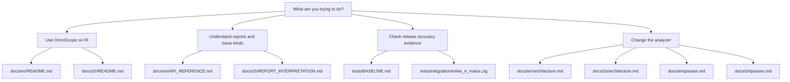

# OmniScope Docs

Start from the question you need to answer. OmniScope is an LLVM IR-level FFI and memory/resource ownership auditor, so the most useful docs guide you from risk framing to evidence, then to implementation details.

## Choose Your Path

## English

| Document | Use it when |
| --- | --- |
| `docs/en/README.md` | You need the English entry point and practical first-run guidance. |
| `docs/en/architecture.md` | You need the current loader, pipeline, pass, shared-state, and output flow. |
| `docs/en/modules.md` | You want a module inventory after understanding the main flow. |
| `docs/en/passes.md` | You want details about analysis pass behavior. |
| `docs/en/API_REFERENCE.md` | You need API-level reference material. |
| `docs/en/developer_guide.md` | You are contributing code. |
| `docs/en/ir-specs/` | You need compiler/IR pattern notes. |

## 中文

| 文档 | 适合场景 |
| --- | --- |
| `docs/zh/README.md` | 中文入口和第一次使用路径。 |
| `docs/zh/architecture.md` | 当前 loader、pipeline、pass、共享状态和输出路径。 |
| `docs/zh/REPORT_INTERPRETATION.md` | 解读分析结果和报告字段。 |
| `docs/zh/ISSUE_CLASSIFICATION.md` | 理解 issue 分类。 |
| `docs/zh/modules.md` | 查看模块清单。 |
| `docs/zh/passes.md` | 查看分析 pass 行为。 |
| `docs/zh/developer_guide.md` | 参与开发。 |
| `docs/zh/RED_BLUE_TEAM.md` | 运行红蓝队测试。 |
| `docs/zh/ir-specs/` | 查看编译器/IR 模式说明。 |

## 0.2.0 Release Status

The repository declares `0.2.0` in `VERSION`, `build.zig.zon`, CLI `--version`, JSON output, and SARIF output. Treat the current worktree as a release candidate until `zig build test` is green and `tests/BASELINE.md` is updated from its pre-fix status.
