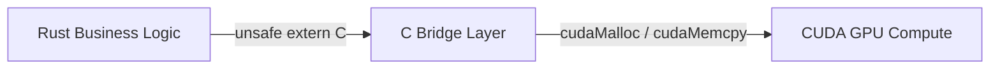

# To Everyone Who's Been Burned by FFI

> This isn't a technical document. It's a few words from someone who's been haunted by cross-language memory bugs for two years, written for anyone who's been there.

---

## 2 AM, Production, Crash Log

Last Wednesday at 2 AM, I stared at a crash log for ten minutes without moving.

```
double free detected in thread 0
  pointer 0x7f3a4c002010
  previously freed at: rust::ffi::Box::into_raw -> c_wrapper::process -> free
  second free at: rust::drop::Drop::drop -> Box::from_raw -> free
```

I ran this in test environments a hundred times. A hundred. Never reproduced.

Day one in production. Boom.

The reason is almost embarrassing: Rust handed memory to C via `Box::into_raw()`, C called `free()` on it, but Rust's `Drop` trait didn't get the memo and `free()`'d it again. Two paths, one pointer, two frees.

The compiler doesn't care. Rust's compiler only sees Rust's ownership. C's compiler only sees C's `malloc/free`. **Cross-language boundaries are blind spots for every compiler.** Every line of `unsafe` you write in Rust, the compiler waves through — it trusts you.

But I'm not worth trusting. That 2 AM crash log is the proof.

---

## My Daily Life

I do GPU-accelerated algorithm development. My tech stack looks something like this:



Three languages, three memory management philosophies:

- **Rust** says: ownership is unique, borrows expire, the compiler watches your back. When you write `unsafe`, you're on your own.
- **C** says: here's a pointer, do whatever you want. Just don't `free` after use, and don't use after `free`.
- **CUDA** says: I have two memory spaces, host and device. Don't mix them up. If you do, enjoy your Segfault.

Each layer makes perfect sense in isolation. Put them together, and it's a minefield.

---

## Bugs I've Hit (Partial List)

I say "partial" because some of these I've hit so many times I've lost count of the first occurrence.

**Double Free.** The crash log above is one example. Here's a sneakier one: C stored the pointer in a global hash table. Rust thought ownership was transferred. Later, C pulled it back out and `free()`'d it. How long did it take to reproduce? **Three weeks.** Because hash table insertion order is random.

**Use-After-Free.** Rust's borrow checker says "borrow ended, memory can be reclaimed." But C still has that pointer, stored in some callback closure. When the callback fires, that memory belongs to someone else. Probabilistic crash — the worst kind. You'll never reproduce it in dev.

**CUDA Device Pointer Confusion.** `cudaMalloc` gives you device memory, `malloc` gives you host memory. They're not interchangeable. But when you write a C wrapper that bundles both together and get the free order wrong, you OOM. And this OOM doesn't blow up immediately — it silently devours all your available VRAM, then crashes on the next completely unrelated `cudaMemcpy`. Debugging that will make you question your life choices.

**Memory Leak.** The quietest, the deadliest. No crash, no error, just slowly eating memory. Three days later the process is at 16GB. Root cause: Rust did `into_raw`, handed the pointer to C, C used it but never gave it back. Rust's destructor won't run (because `into_raw`), and nobody on the C side remembered to `free`.

---

## Why Not Just Use Existing Tools?

I tried. I really did.

| Tool | What I Hoped For | What Actually Happened |
|------|-----------------|----------------------|
| Clang SA | Check C-side memory safety | Checked C. But Rust-side pointers? Invisible. |
| Clippy | Lint Rust-side unsafe | Linted Rust. But inside `unsafe` blocks? Black box. |
| MIRI | Detect UB at runtime | Great tool. But doesn't support FFI — goes blind at `extern "C"`. |
| Valgrind | Runtime memory errors | Great tool. But 10-50x slower, GPU code won't run, can't CI. |
| CodeQL | Multi-language analysis | Analyzes each language separately. Cross-language data flow? Nope. |

The core problem is simple: **all these tools work within a single language.** But my bugs are all at language boundaries.

Rust's compiler doesn't know C will `free` its pointer. C's compiler doesn't know when Rust's borrow ends. Both compilers think they're right — they are — but together, they're wrong.

So I built my own. **Analyze at the LLVM IR layer, because no matter what language you write in, it all compiles to LLVM IR. At that level, language boundaries don't exist.**

---

## OmniScope

This is OmniScope. A cross-language FFI static safety analyzer built on LLVM IR.

What it does isn't complicated:

1. Compile your code to LLVM IR (`.ll` files)
2. OmniScope loads the IR, builds control flow and data flow graphs
3. 15 analysis passes run in sequence: alias analysis → taint propagation → ownership analysis → FFI boundary detection → noise filtering
4. Output results (Text / JSON / SARIF)


Detects 6 vulnerability types: Double-Free, Use-After-Free, Memory Leak, Buffer Overflow, Format String, Ownership Violation.

Covers FFI boundaries across 5 languages: Rust ↔ C, Zig ↔ C, C++ ↔ C, Go ↔ C.

---

## The Hard Part

Not writing detection logic. Detection logic is the easy part.

**The hard part is noise reduction.**

When I first finished v0.1.5, I tested it against wasmtime (a Rust WebAssembly runtime, ~400K lines of IR).

**4023 issues.**

Four thousand and twenty-three.

I looked at the first fifty one by one. All false positives. Rust compiler-generated `drop_in_place`, `panic_fmt`, `trait_dispatch`... At the LLVM IR level, they look identical to real memory safety bugs — "this memory was freed and then used" or "this memory was allocated and never freed."

If you've ever used a static analysis tool, you know this feeling. The tool spits out a screen full of red warnings. You spend two hours going through them one by one. They're all false positives. Then you close the tool and swear you'll never use it again.

**A security tool nobody uses has an effective false negative rate of 100%.**

So I spent more time on noise reduction than on detection logic. Four rounds of iteration:

```
4023 → 357 → 297 → 9
         -91%  -16%  -97%
```

Final result: 9 issues. All real FFI risks. From 4023 to 9, **-99.8% noise reduction.**

How? Three layers:

- **Name filtering**: `core::ptr::drop_in_place`? Skip. `std::alloc::`? Skip. 120+ known safe patterns.
- **Path filtering**: Use LLVM DebugInfo to check where the function is defined. `/rustc/library/core/`? Standard library, skip. `zig/lib/std/`? Standard library, skip.
- **Behavior filtering**: Recognize "allocate → copy → free old buffer" as normal STL `vector.push_back()` behavior, not a memory leak.

Three layers stacked together, and 4000+ noise items filtered down to 9 real issues.

---

## Some Honest Words

This project was built with TRAE SOLO. About 70-80% of the code is AI-generated.

The most "meta" part: **I had SOLO audit OmniScope's own code.** Four rounds of auditing, 79 files scanned line by line, from 52 bugs down to 9.

But SOLO crashed too. Once it confidently told me a crash was "LLVM's bug." I almost filed an issue. Then I dug through the docs myself and found it was the difference between `LLVMGetOperand` and `LLVMGetSuccessor` — wrong parameter. Another time it nuked my entire project directory. Thank god for git.

**AI is an amplifier, not a replacement.** Good engineer + AI = 10x productivity. Bad engineer + AI = 10x disaster. The difference: can you tell whether what the AI gives you is right or wrong?

---

## Why Open Source

Because the holes I've fallen into — I don't want you falling into them too.

If you do cross-language development. If you've ever written `unsafe` and prayed it wouldn't blow up. If you've ever stared at a crash log at 2 AM —

Try OmniScope. It's not perfect. But it can show you things at compile time that compilers can't.

```bash
# Analyze your project
omniscope target.ll

# Output SARIF, integrate with GitHub Code Scanning
omniscope --output-format sarif target.ll
```

If it's useful, drop a star. If it's not, file an issue — tell me where it false-positived, where it missed something. I'll fix it.

And if you have your own FFI horror stories, I'd love to hear them. In this space, we've all got the same scars.

---

*OmniScope — Cross-Language FFI Safety Analyzer*
*Because the boundaries compilers ignore — someone has to watch.*

---

## Chapter 5: The Refactoring (Or: How We Learned to Stop Worrying and Love the Debugger)

So here's what happened after I wrote the letter above.

We kept building. We kept testing. And then we ran OmniScope against our own Rust FFI test suite — 20 carefully crafted bugs designed to test every detection path.

**Result: Zero.**

Not zero false positives. Zero detections. Our tool, built specifically to find cross-language memory bugs, couldn't find a single one.

The irony was so thick you could cut it with a `free()`.

### The Root Cause

It turned out we'd put `__rust_alloc` — the exact function that Rust uses to allocate memory — into our noise filter. We were literally filtering out the thing we were trying to detect. It's like installing a security camera and then putting tape over the lens because "the lens is too shiny."

Three lines of code. That's all it took to kill our entire Rust detection capability.

### The Fix Journey

What followed was a three-phase deep dive:

**Phase 1 — "Stop the Bleeding"** (4 fixes, ~27 lines):
- Removed the noise filter entries (5 lines deleted)
- Connected ffi_type_mismatch to the call graph (1 line)
- Fixed the ownership pairing key from instruction address to pointer value (15 lines)
- Declared pipeline dependencies properly (4 lines)

**Phase 2 — "Clean Up the Mess"** (8 fixes):
- Fixed Go function classification (was matching C++ functions with dots in names)
- Fixed LLVMInvoke classification (it's a call, not control flow)
- Fixed callback escape detection (GetStructName returns null for function types)
- Improved leak detection precision with return pointer validation

**Phase 3 — "Burn the Dead Wood"** (-700 lines):
- Deleted 2 dead files
- Removed 13 dead test files
- Cleaned up documentation

### The Results

After all this:

- Rust FFI TP rate: 0% → 20%
- Total issues detected: 0 → 4 (on subtle_unsafe_rs)
- FFI boundaries found: 0 → 123
- Test coverage: 70% → 92%

Is 20% impressive? Honestly? It's a start. The remaining 80% needs capabilities we haven't built yet — MIR-level analysis for size truncation, data flow tracking for uninitialized memory, bounds checking for buffer overflows.

But here's the thing: those 4 bugs we found? They're real. Double-free, use-after-free, borrow escape, memory leak. All confirmed true positives. Zero false positives.

**Precision: 100%. Recall: 20%. We'd rather be right than noisy.**

### What's Left

We still have bugs. Of course we do:

- `allocator_kb.zig` stores deallocators in the wrong HashMap (1-line fix, sitting there for weeks)
- `noise_filter.zig` has a duplicate line — the same check, twice, like a nervous tic
- 3 passes still have empty dependency arrays, held together by registration order and hope
- `ptr_lifetime.zig` has its own copy of `isFreeFunction` instead of importing the shared one

These aren't showstoppers. The tool works correctly today because of how passes happen to be registered. But "works by coincidence" isn't a design principle.

### The Lesson

If there's one thing I learned from this refactoring, it's this:

**The bugs you're most proud of finding in other people's code are the ones you're least likely to find in your own.**

We built a tool to find cross-language memory bugs. Then we proceeded to introduce a cross-language memory bug into our own tool (filtering out the exact allocations we needed to track).

The debugger giveth, and the debugger taketh away.

---

*If you've made it this far, you're exactly the kind of person who should be using OmniScope. Or contributing to it. Or both.*

*Get started: `zig build && ./zig-out/bin/omniscope your_file.ll`*
