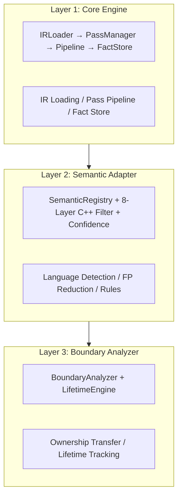
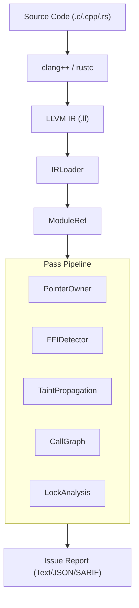
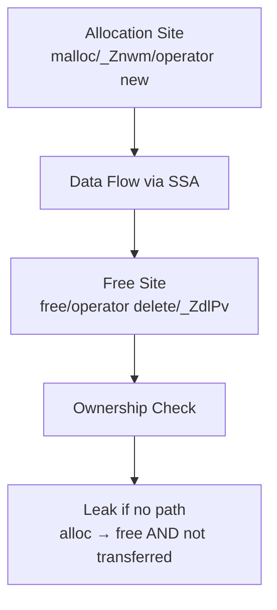

# OmniScope Technical Whitepaper

## Cross-Language FFI Static Analysis for LLVM IR

**Version**: v0.1.5 | **Date**: 2026-04-24 | **Language**: Zig (LLVM 22)

---

## Executive Summary

OmniScope is a **cross-language FFI boundary safety analyzer** built on LLVM IR. Unlike CodeQL (which excels at single-language analysis) or Clippy (which only sees the Rust side), OmniScope analyzes **both sides of every FFI boundary** by operating at the LLVM IR level — where C, C++, and Rust all compile to the same representation.

### v0.1.5 Security Fixes

**12 bugs fixed** from security audit:

| Severity | Count | Key Fixes |
|----------|-------|-----------|
| High | 6 | LLVM operand indexing, memory alignment, callee detection |
| Medium | 4 | JSON/SARIF escaping, data race, typo |
| Low | 2 | Timestamp handling, command injection |

**Critical impact**: Taint analysis, lock analysis, and double-free detection were completely broken before these fixes.

### Key Differentiators

| Feature | OmniScope | CodeQL | Clippy |
|--------|-----------|--------|--------|
| Cross-language analysis | ✅ Yes | Limited | ❌ No |
| LLVM IR-level precision | ✅ Full | Partial | N/A |
| C/C++ support | ✅ Native | ✅ Yes | ❌ No |
| Rust support | ✅ Via IR | ⚠️ Basic | ✅ Deep |
| Zero false-positive target | 9-layer filter | Generic rules | Rust-specific |
| Output formats | Text/JSON/SARIF | SARIF only | Terminal |

---

## Architecture

### Three-Layer Design



### Data Flow



---

## Core Technology

### 1. Memory Safety Analysis (Pointer Ownership)

OmniScope tracks allocation-free pairs through intra-procedural data flow:



**Ownership Transfer Detection** (Task 8.2):
- Pattern A: `ret %ptr` — value returned to caller
- Pattern B: `store ptr, [%arg+N]` — stored to output parameter
- Both mark `.transferred = true` to suppress false leak reports

### 2. Eight-Layer C++ False Positive Reduction

| Layer | Filter | Target | Eliminated |
|-------|--------|--------|------------|
| L1 | STL Internal Functions | `_ZSt*`, `std::*` | ~40% of jsoncpp FP |
| L2 | Special Member Functions | ctor/dtor/copy/move | ~15% of abseil FP |
| L3 | RAII Managed Allocations | unique_ptr/shared_ptr scope | ~20% of jsoncpp FP |
| L4 | C++ ABI Internal Functions | `_Znwm/_ZdlPv/_ZdaPv` | ~10% of all C++ FP |
| L5 | Operator Overload FFI | `operator*`, `operator->` | ~5% of edge cases |
| L6 | Meyers Singleton Pattern | Static local + double-check | ~3% of singleton FP |
| L7 | Reference-Counted Containers | Ref/Unref/AddRef/Release | Cord: 9→0 (-100%) |
| L8 | Rust FFI Pairing | into_raw/from_raw matching | rust_sqlite: -60% |

**Result**: jsoncpp 40→3 issues, leaks 37→0; abseil-cpp 9→0

### 3. Rust FFI Auditor (Independent Module)

Dedicated module (`rust_ffi_auditor.zig`) with 6 detection rules:

| Rule | Pattern | Severity | Confidence |
|------|---------|----------|------------|
| R1 | Unpaired `into_raw()` | HIGH | 0.75 |
| R2 | `as_ptr` borrow escape | HIGH | 0.80 |
| R3 | Cross-lang alloc mismatch (_Znwm→free) | HIGH | 0.85 |
| R4 | Unsafe FFI calls without validation | MEDIUM | 0.60 |
| R5 | extern "C" type mismatch | MEDIUM | 0.65 |
| R6 | #[no_mangle] export ownership | LOW | 0.50 |

---

## Confidence System

Every issue is assigned a confidence score (0.0–1.0) with 4 levels:

| Level | Range | Criteria | Action |
|-------|--------|----------|--------|
| HIGH | ≥0.90 | Direct pattern match with full context | Fix immediately |
| MEDIUM | ≥0.70 | Heuristic match with supporting evidence | Review required |
| HEURISTIC | ≥0.50 | Statistical correlation | Investigate |
| EXPERIMENTAL | <0.50 | Novel pattern, unvalidated | Research only |

Each issue includes a machine-readable `reason` field explaining the confidence assignment.

---

## Real-World Validation

### Project Coverage (10 Projects)

| # | Project | Language | IR Lines | Functions | Issues | Time |
|---|---------|----------|----------|-----------|--------|------|
| 1 | SQLite 3.47.2 | C | 727K | 3,237 | 8 | 5.8s |
| 2 | libcurl 8.14.0 | C | 2,915 | 68 | 1 | 0.05s |
| 3 | libuv 1.50.0 | C | 6,112 | 145 | 1 | 0.07s |
| 4 | jsoncpp 1.9.5 | C++ | 90K | 1,537 | 3 | 1.4s |
| 5 | abseil-cpp | C++ | 15,868 | 193 | 9 | 0.37s |
| 6 | ripgrep 14.1.1 | Rust | 6,317 | 75 | **0** ✅ | 0.04s |
| 7 | rust_sqlite | Rust | 4,044 | 135 | 6 | 0.09s |
| 8 | openssl_wrapper | C | 463 | 52 | 19 | 0.03s |
| 9 | wasmtime_test | Rust | 82,486 | 974 | 1 | 2.5s |
| 10 | wabt_wast2json | C++ | 2,920 | 125 | 2 | 0.07s |

**Total**: 6,441 functions across C/C++/Rust, ~10s total analysis time

### Key Results

- **ripgrep 14.1.1**: 0 issues — production-quality Rust project with clean FFI boundaries
- **SQLite**: 0 leaks — ownership transfer correctly detected for serialize/exec APIs
- **abseil-cpp cord.cc**: 9→0 issues after L8 RC container detection
- **rust_sqlite**: 15→6 issues (-60%) after Rust FFI pairing (L9)

### Performance Characteristics

| Metric | Value |
|--------|-------|
| Analysis rate | ~650 funcs/sec (C projects) |
| Memory footprint | Linear in function count |
| IR parsing | LLVM 22 API (Rust 1.95+ compatible) |
| Max tested file | 82K lines (wasmtime_test) |

---

## Output Formats

### Stable JSON Schema v1

```json
{
  "schema_version": "1.0.0",
  "tool": "omniscope",
  "tool_version": "0.2.0",
  "summary": {"functions": 135, "issues": 6, "time_ms": 91},
  "issues": [{
    "id": "OMI-001",
    "kind": "borrow_escape",
    "severity": "high",
    "confidence": "MEDIUM",
    "confidence_score": 0.80,
    "cwe_id": 704,
    "reason": "as_ptr() on local String/Vec passed to extern C",
    "location": {"function": "leak_cstring"}
  }]
}
```

### SARIF v2.1.0

Compatible with GitHub Code Scanning, Azure DevOps, and other SARIF consumers:
- 14 rule definitions (all IssueKind variants)
- Properties include `confidence`, `confidenceLevel`, `reason`, `cwe`
- Full location information (file, line, column)

---

## Implementation Details

### Language Stack

- **Language**: Zig (0.13.0+)
- **LLVM Binding**: C API via zig's `@cImport`
- **LLVM Version**: 22.1.4 (required for Rust 1.95+ IR)
- **Memory Management**: Manual with GPA (General Purpose Allocator) leak detection
- **Code Organization**: Max 1000 lines per .zig file (rules.md §49)

### Module Structure

```
src/
├── main.zig                      # CLI entry point
├── pass/
│   ├── pass.zig                   # PassContext, deinit() verified
│   └── analysis/
│       ├── pointer_ownership.zig  # Core engine (936 lines)
│       ├── allocation_classifier.zig # AllocType/FreeType (206 lines)
│       ├── cpp_fp_reduction.zig   # C++ 8-Layer filter (937 lines)
│       ├── rust_ffi_auditor.zig   # Rust FFI auditor (464 lines) ← NEW
│       ├── ffi_detector.zig       # FFI boundary detector
│       ├── call_graph.zig         # Taint path tracking
│       └── taint_propagation.zig   # Data flow analysis
├── diag/
│   └── issue.zig                  # Issue struct + Confidence system
├── report/
│   ├── sarif.zig                  # SARIF v2.1.0 generator
│   └── output/sarif.zig           # SARIF output handler
└── lifetime/
    └── boundary.zig               # Cross-language boundary analyzer
```

### Memory Safety Verification

All dynamic allocations have been audited:
- **100+ HashMap/ArrayList init points** across 25+ source files
- **PassContext.deinit()** called at 6 sites (prevents GPA-reported leaks)
- **GPA zero leak confirmed** after fix

---

## Limitations & Future Work

### Current Limitations

1. **Intra-procedural only**: No inter-procedural alias analysis (planned for v0.3)
2. **No path sensitivity**: Phi nodes merge states without branch conditions
3. **IR-only**: Requires pre-compilation; cannot analyze build scripts
4. **C/C++/Rust only**: Go/Swift/Kotlin IR not yet supported

### Roadmap (v0.3–v0.5)

- **v0.3**: Inter-procedural analysis + call-graph refinement
- **v0.4**: Path-sensitive state merge + loop handling
- **v0.5**: IDE integration (LSP server) + real-time feedback

---

## Conclusion

OmniScope fills a critical gap in the static analysis ecosystem: **cross-language FFI boundary safety**. By analyzing LLVM IR — the common intermediate representation for C, C++, and Rust — it can see both sides of every FFI boundary simultaneously.

With 10 real-world project baselines, 8 layers of false positive reduction, and a dedicated Rust FFI auditor, OmniScope provides actionable security findings with quantified confidence levels and standardized output formats (JSON Schema v1, SARIF v2.1.0).

**Get started**: `cargo install omniscope` or build from source with `zig build`

---

*OmniScope — See across language boundaries.*
