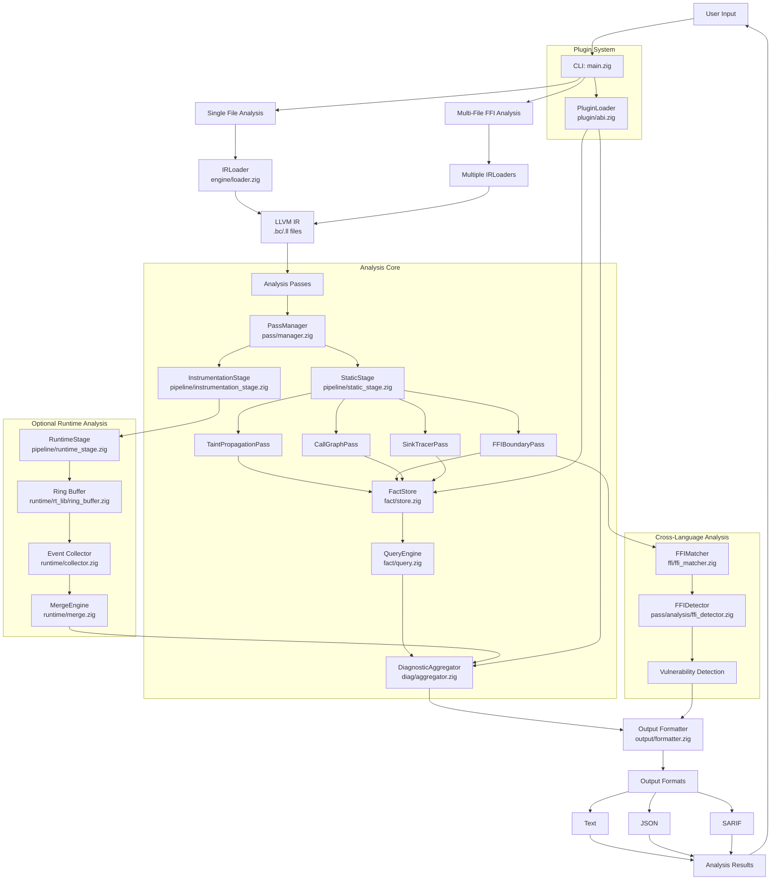
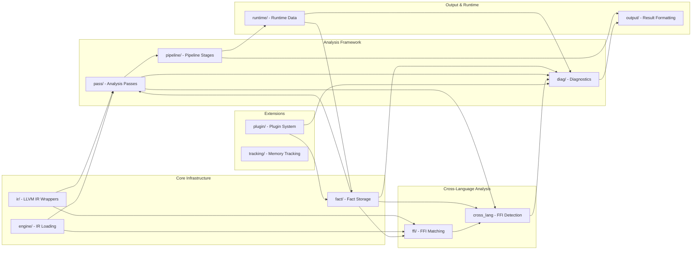
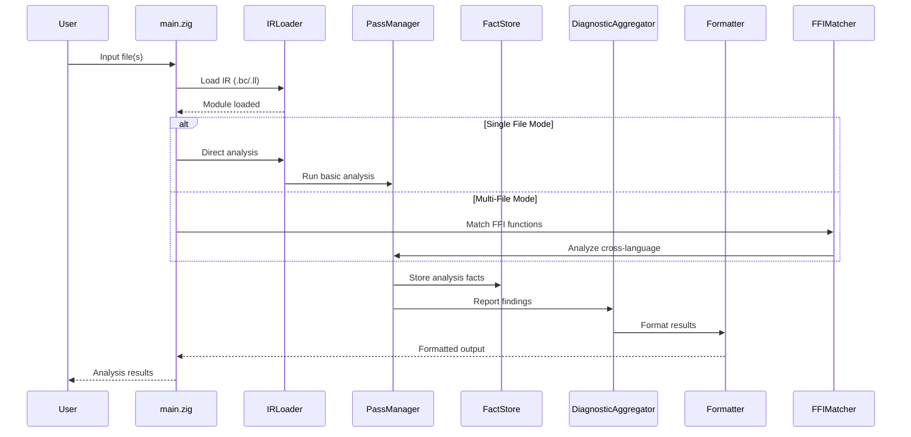

# OmniScope Architecture

## System Architecture Overview

## Module Dependencies

## Data Flow

## Component Responsibilities

### User Interface Layer
- **main.zig**: CLI entry point, argument parsing, analysis orchestration

### Engine Layer
- **engine/loader.zig**: IR file loading, LLVM context management
- **ir/**: LLVM C API wrappers (raw, safe, view)

### Analysis Core
- **pass/manager.zig**: Pass registration and execution
- **pass/pass.zig**: Pass context and interfaces
- **pass/analysis/**: Specific analysis passes
  - call_graph.zig: Function call graph
  - taint_propagation.zig: Data flow analysis
  - ffi_boundary.zig: FFI boundary detection
  - sink_tracer.zig: Vulnerability sink tracing
  - ffi_detector.zig: FFI vulnerability detection

### Fact System
- **fact/store.zig**: Fact storage and indexing
- **fact/query.zig**: Fact querying engine
- **fact/fact.zig**: Fact type definitions

### Pipeline System
- **pipeline/pipeline.zig**: Main analysis coordinator
- **pipeline/static_stage.zig**: Static analysis stage
- **pipeline/instrumentation_stage.zig**: IR instrumentation
- **pipeline/runtime_stage.zig**: Runtime data collection
- **pipeline/merge_stage.zig**: Static/runtime data merge

### Cross-Language Analysis
- **ffi/ffi_matcher.zig**: Multi-language function matching
- **cross_lang/**: Cross-language vulnerability detection

### Output System
- **output/formatter.zig**: Result formatting (text/JSON/SARIF)

### Runtime Support
- **runtime/collector.zig**: Event collection
- **runtime/merge.zig**: Static/runtime data merge
- **runtime/rt_lib/**: Runtime library for instrumentation

### Extensions
- **plugin/abi.zig**: Plugin loading and ABI
- **tracking/**: Memory tracking utilities
- **diag/aggregator.zig**: Diagnostic collection and reporting

## Key Design Principles

1. **Separation of Concerns**: Each layer has distinct responsibilities
2. **Extensibility**: Plugin system allows custom analysis passes
3. **Performance**: Efficient fact storage and querying
4. **Cross-Language**: Support for multi-language FFI analysis
5. **Modularity**: Components can be used independently or together