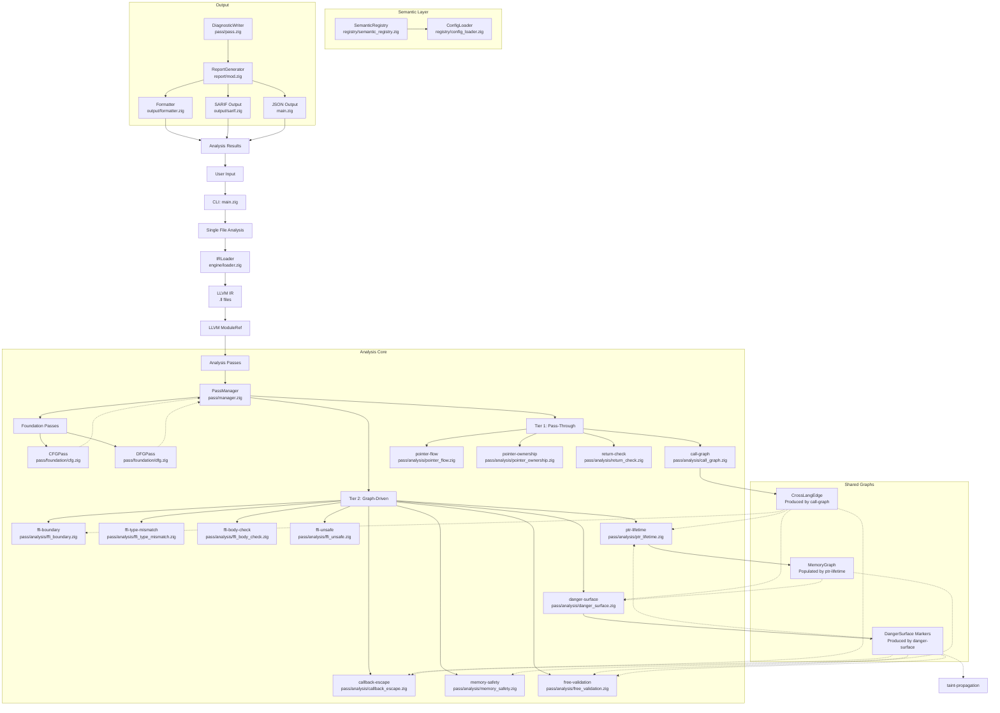
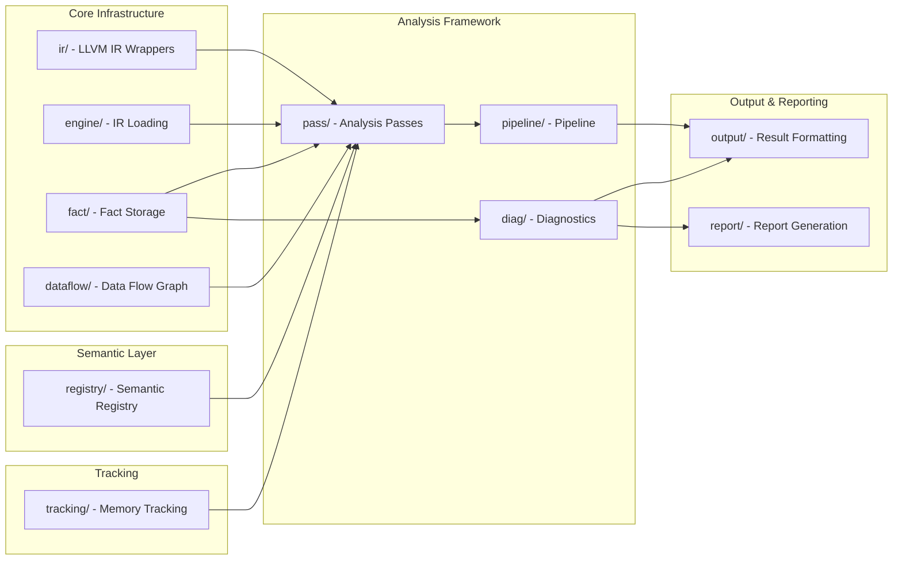
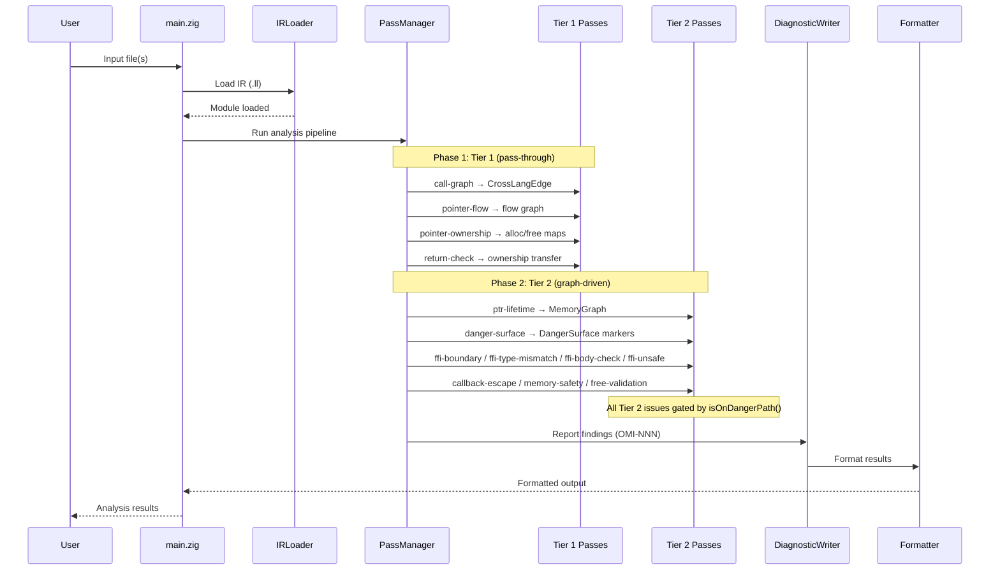
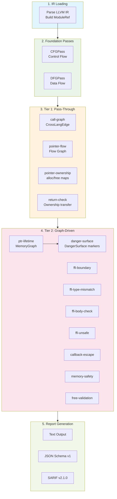
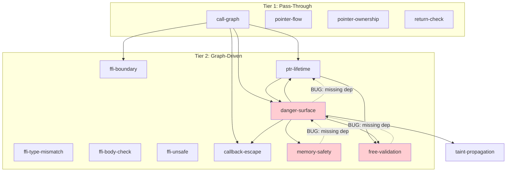

# OmniScope Architecture

> **Version**: v0.1.6
> **Last updated**: 2026-05-04

## System Architecture Overview



## Tier 1 / Tier 2 Architecture

OmniScope v0.1.6 classifies all 13 analysis passes into two tiers based on their
analysis strategy and issue-reporting behavior.

### Tier 1 -- Pass-Through (No Issues)

Tier 1 passes operate on **pure C/C++ internal operations**. They build and enrich
intermediate data structures but **never emit issues** directly. Their role is
information gathering and lightweight classification.

| Pass | Purpose |
|------|---------|
| **call-graph** | Build function call graph; produce `CrossLangEdge` entries for every FFI call site |
| **pointer-flow** | Track pointer value flow across assignments, parameters, and return values |
| **pointer-ownership** | Classify alloc/free pairs; build `alloc_map` / `free_map` |
| **return-check** | Validate return-value ownership transfers (caller takes ownership) |

### Tier 2 -- Strict Graph-Driven Analysis (Issues)

Tier 2 passes perform **FFI and unsafe-boundary analysis**. Every issue emitted by a
Tier 2 pass is gated through `isOnDangerPath()` -- a unified check that consults the
`DangerSurface` marker set. If a function or pointer is not on a danger path, the pass
skips it silently.

| Pass | Purpose |
|------|---------|
| **ffi-boundary** | Detect FFI call boundaries; consume `CrossLangEdge` |
| **ffi-type-mismatch** | Check type compatibility across FFI boundaries |
| **ffi-body-check** | Audit function bodies of FFI-exposed functions |
| **ffi-unsafe** | Detect `unsafe` block / `extern "C"` violations |
| **ptr-lifetime** | Track pointer lifetime across FFI; populate `MemoryGraph`; consume `CrossLangEdge` + `DangerSurface` |
| **danger-surface** | Mark functions/pointers as danger surfaces; consume `CrossLangEdge` + `MemoryGraph` |
| **callback-escape** | Detect callback pointer escapes across FFI; consume `CrossLangEdge` + `DangerSurface` |
| **memory-safety** | General memory safety checks on danger paths; consume `DangerSurface` |
| **free-validation** | Validate free-site correctness on danger paths; consume `MemoryGraph` + `DangerSurface` |

### `isOnDangerPath` Gate

```
fn isOnDangerPath(fn_or_ptr: ID) bool {
    return dangerSurfaceMarkers.contains(fn_or_ptr);
}
```

All Tier 2 passes call this before emitting any issue. This single gate prevents
noise from non-FFI internal code paths.

## Zone Classification

Every function and pointer is classified into one of four zones. Classification
results are **cached** per function to avoid redundant computation.

| Zone | Meaning | Issue Reporting |
|------|---------|-----------------|
| **safe** | Pure C/C++ internal, no FFI contact | Tier 1 only (no issues) |
| **unsafe** | Contains `unsafe` block or raw pointer cast | Tier 2 eligible |
| **ffi** | Declared `extern "C"` or called across language boundary | Tier 2 eligible |
| **unknown** | Insufficient information to classify | Deferred (no issues until resolved) |

Cache invalidation occurs when new `CrossLangEdge` entries are added by the
`call-graph` pass.

## Module Dependencies



## Data Flow



## Shared Graph Data Structures

### CrossLangEdge

- **Produced by**: `call-graph`
- **Consumed by**: `ptr-lifetime`, `ffi-boundary`, `callback-escape`, `danger-surface`
- **Content**: Source function, target function, call site location, language pair (e.g. Rust->C)

### MemoryGraph

- **Produced by**: `ptr-lifetime`
- **Consumed by**: `danger-surface`, `free-validation`
- **Content**: Pointer allocation sites, lifetime intervals, cross-boundary flows

### DangerSurface Markers

- **Produced by**: `danger-surface`
- **Consumed by**: `ptr-lifetime`, `callback-escape`, `free-validation`, `memory-safety`, `taint-propagation`
- **Content**: Set of function/pointer IDs that are on a danger path (FFI-exposed or unsafe)

## Component Responsibilities

### User Interface Layer
- **main.zig**: CLI entry point, argument parsing (`--json`, `--sarif`, `-o`), analysis orchestration

### Engine Layer
- **engine/loader.zig**: IR file loading, LLVM context management
- **ir/**: LLVM C API wrappers (raw, safe, view, debug_info, location)

### Analysis Framework
- **pass/manager.zig**: Pass registration and execution; Tier 1 runs before Tier 2
- **pass/pass.zig**: PassContext with shared graph access (CrossLangEdge, MemoryGraph, DangerSurface)
- **pipeline/pipeline.zig**: Analysis pipeline orchestration

### Foundation Passes
- **pass/foundation/cfg.zig**: Control flow graph construction
- **pass/foundation/dfg.zig**: Data flow graph construction

### Tier 1 Passes (Pass-Through)
- **pass/analysis/call_graph.zig**: Build function call graph; produce `CrossLangEdge` for every FFI call site. No issues emitted.
- **pass/analysis/pointer_flow.zig**: Track pointer value flow across assignments, parameters, and return values. No issues emitted.
- **pass/analysis/pointer_ownership.zig**: Classify alloc/free pairs; build `alloc_map` / `free_map`. No issues emitted.
- **pass/analysis/return_check.zig**: Validate return-value ownership transfers (caller takes ownership). No issues emitted.

### Tier 2 Passes (Graph-Driven)
- **pass/analysis/ffi_boundary.zig**: Detect FFI call boundaries. Consumes `CrossLangEdge`. Issues gated by `isOnDangerPath`.
- **pass/analysis/ffi_type_mismatch.zig**: Check type compatibility across FFI boundaries. Issues gated by `isOnDangerPath`.
- **pass/analysis/ffi_body_check.zig**: Audit function bodies of FFI-exposed functions. Issues gated by `isOnDangerPath`.
- **pass/analysis/ffi_unsafe.zig**: Detect `unsafe` block / `extern "C"` violations. Issues gated by `isOnDangerPath`.
- **pass/analysis/ptr_lifetime.zig**: Track pointer lifetime across FFI boundaries. Produces `MemoryGraph`. Consumes `CrossLangEdge` + `DangerSurface`. Issues gated by `isOnDangerPath`.
- **pass/analysis/danger_surface.zig**: Mark functions/pointers as danger surfaces. Consumes `CrossLangEdge` + `MemoryGraph`. Produces `DangerSurface` markers.
- **pass/analysis/callback_escape.zig**: Detect callback pointer escapes across FFI. Consumes `CrossLangEdge` + `DangerSurface`. Issues gated by `isOnDangerPath`.
- **pass/analysis/memory_safety.zig**: General memory safety checks on danger paths. Consumes `DangerSurface`. Issues gated by `isOnDangerPath`.
- **pass/analysis/free_validation.zig**: Validate free-site correctness on danger paths. Consumes `MemoryGraph` + `DangerSurface`. Issues gated by `isOnDangerPath`.

### Data Flow
- **dataflow/graph.zig**: Data flow graph construction
- **dataflow/guard_propagation.zig**: Guard propagation
- **dataflow/null_check_guard.zig**: Null check guard analysis

### Fact System
- **fact/store.zig**: Fact storage and indexing
- **fact/query.zig**: Fact querying engine
- **fact/fact.zig**: Fact type definitions

### Semantic Layer
- **registry/semantic_registry.zig**: Function semantic knowledge base (400+ entries)
- **registry/config_loader.zig**: Dynamic registry from JSON config

### Output System
- **output/formatter.zig**: Result formatting (text)
- **output/cli.zig**: CLI output
- **output/sarif.zig**: SARIF v2.1.0 format output (14 rules)
- **output/lsp.zig**: LSP integration
- **report/mod.zig**: Report generation
- **report/sarif.zig**: SARIF report generation (v2.1.0)
- **report/ci_integration.zig**: CI/CD integration

### Diagnostics
- **diag/issue.zig**: Issue type definitions + Confidence system
  - `Confidence`: HIGH/MEDIUM/HEURISTIC/EXPERIMENTAL
  - `IssueKind`: 14 types (memory_leak, borrow_escape, cross_language_leak, etc.)

### Tracking
- **tracking/allocator.zig**: Memory allocation tracking

## Key Design Principles

1. **Two-Tier Analysis**: Tier 1 gathers data silently; Tier 2 reports issues only on danger paths
2. **Data-Driven Analysis**: Semantic registry provides function knowledge
3. **Ownership Focus**: Core analysis tracks pointer ownership, not generic taint
4. **Cross-Language**: Support for multi-language FFI analysis (C/C++/Rust)
5. **Modularity**: Components can be used independently or together
6. **Danger Path Gating**: `isOnDangerPath()` unifies all Tier 2 issue emission behind a single check
7. **Zone Classification**: safe/unsafe/ffi/unknown with per-function caching

## Analysis Pipeline



## Supported Languages

| Language | IR Analysis | Ownership Tracking | FFI Boundary |
|----------|-------------|-------------------|--------------|
| C | Full | Full | Full |
| C++ | Full | Full | Full |
| Rust | Full (LLVM IR) | Full | Full (Tier 2) |
| Zig | Beta | Beta | Beta |
| Go | Experimental | Experimental | Experimental |

## Issue Detection Categories

| Category | IssueKind | Severity | Confidence |
|----------|-----------|----------|------------|
| **Memory** | memory_leak, use_after_free, double_free, invalid_free | Critical/High | 0.70-0.90 |
| **FFI** | ffi_unsafe_call, unchecked_return, type_mismatch | High | 0.65-0.80 |
| **Rust FFI** | borrow_escape, cross_language_leak, unpaired_into_raw | High | 0.75-0.85 |
| **Security** | command_injection, format_string, buffer_overflow | Critical | 0.75-0.90 |
| **Dereference** | null_dereference | Critical | 0.85 |
| **Concurrency** | (via lock analysis) | High | TBD |

## Output Formats

### Text (Default)
```
VULNERABILITY OMI-001 [high] [Confidence: medium]
Type: borrow_escape
Reason: as_ptr() on local String/Vec passed to extern C - may dangle
```

### JSON (Stable Schema v1)
```json
{
  "schema_version": "1.0.0",
  "tool": "omniscope",
  "tool_version 0.1.6",
  "summary": {"functions": 135, "issues": 6, "time_ms": 91},
  "issues": [{
    "id": "OMI-001",
    "kind": "borrow_escape",
    "severity": "high",
    "confidence": "MEDIUM",
    "confidence_score": 0.80,
    "cwe_id": 704,
    "reason": "as_ptr() on local String/Vec passed to extern C",
    "message": "Potential as_ptr borrow escape",
    "location": {"function": "leak_cstring"}
  }]
}
```

### SARIF v2.1.0
- 14 rule definitions (all IssueKind variants)
- GitHub Code Scanning compatible
- Properties: `confidence`, `confidenceLevel`, `reason`, `cwe`

## File Organization Rules

Per **rules.md section 49**: Maximum 1000 lines per `.zig` file

| File | Lines | Status |
|------|-------|--------|
| pointer_ownership.zig | 936 | Within limit |
| cpp_fp_reduction.zig | 937 | Within limit |
| allocation_classifier.zig | 206 | Within limit |
| rust_ffi_auditor.zig | 464 | Within limit |
| ffi_detector.zig | 729 | Within limit |
| lock.zig | 719 | Within limit |
| taint.zig | 708 | Within limit |
| call_graph.zig | -- | Within limit |
| pointer_flow.zig | -- | Within limit |
| ffi_boundary.zig | -- | Within limit |
| ffi_type_mismatch.zig | -- | Within limit |
| ffi_body_check.zig | -- | Within limit |
| ffi_unsafe.zig | -- | Within limit |
| ptr_lifetime.zig | -- | Within limit |
| danger_surface.zig | -- | Within limit |
| callback_escape.zig | -- | Within limit |
| return_check.zig | -- | Within limit |
| memory_safety.zig | -- | Within limit |
| free_validation.zig | -- | Within limit |

## Known Issues (v0.1.6)

### Pass Dependency Bugs (3 unfixed)

The following Tier 2 passes have incorrect dependency declarations in the pass
registry. They may execute before their required input graphs are fully populated:

1. **free_validation**: Declares dependency on `ptr-lifetime` but does not declare
   dependency on `danger-surface`. May run before `DangerSurface` markers are
   available, causing `isOnDangerPath()` to return false for all sites.
2. **memory_safety**: Does not declare dependency on `danger-surface`. Same
   gating problem as `free_validation`.
3. **danger_surface**: Does not declare dependency on `ptr-lifetime`. May run
   before `MemoryGraph` is populated, producing incomplete danger surface
   markers.

### allocator_kb Bugs (2)

1. **Missing allocator entries**: `allocator_kb` does not include Rust's
   `GlobalAlloc::alloc` trait implementations, causing false negatives for
   Rust FFI patterns that use custom allocators.
2. **Incorrect free mapping**: `allocator_kb` maps `objc_free` to `FreeType.free`
   but the correct mapping should be `FreeType.objc_free` (Objective-C specific
   free), leading to misclassification on mixed ObjC/C codebases.

### noise_filter Duplicate Lines

`noise_filter` contains duplicate filter entries for `std::vector::push_back`
and `std::string::c_str`, causing redundant string comparisons during filtering.
Performance impact is minor but should be deduplicated.

## Pass Dependency Graph



> **Red-highlighted nodes** indicate passes with known dependency bugs (see Known Issues above).
