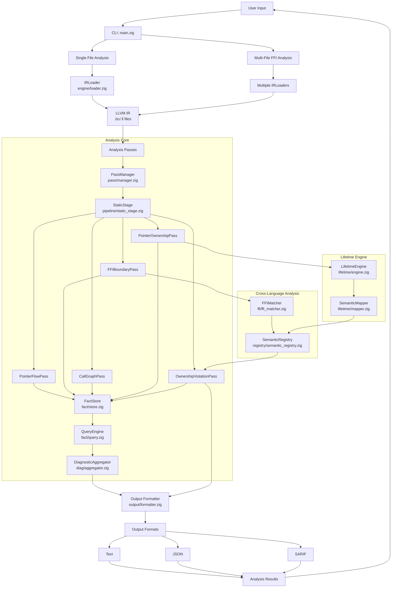
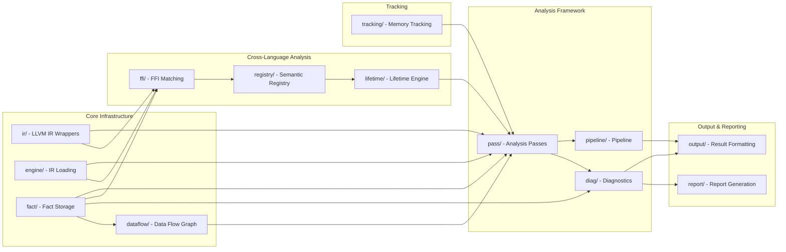
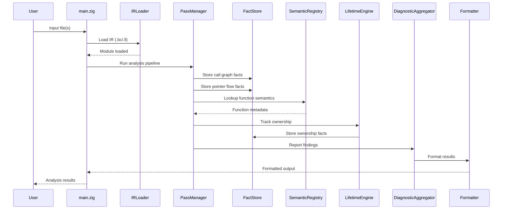

# OmniScope Architecture

## System Architecture Overview



## Module Dependencies



## Data Flow



## Component Responsibilities

### User Interface Layer
- **main.zig**: CLI entry point, argument parsing, analysis orchestration

### Engine Layer
- **engine/loader.zig**: IR file loading, LLVM context management
- **ir/**: LLVM C API wrappers (raw, safe, view, debug_info, location)

### Analysis Core
- **pass/manager.zig**: Pass registration and execution
- **pass/pass.zig**: Pass context and interfaces
- **pass/foundation/**: Foundation passes (cfg, dfg)
- **pass/analysis/**: Analysis passes
  - call_graph.zig: Function call graph construction
  - taint_propagation.zig: Pointer flow analysis
  - ffi_boundary.zig: FFI boundary detection
  - pointer_ownership.zig: Pointer ownership tracking
  - ffi_analysis.zig: Ownership violation detection
  - flow_path.zig: Data flow path construction
  - issue/: Issue-specific passes (ffi_unsafe, free_validation, memory_safety, etc.)
- **pass/instrumentation/**: Instrumentation planning

### Data Flow
- **dataflow/graph.zig**: Data flow graph construction
- **dataflow/node.zig**: Node representation
- **dataflow/edge.zig**: Edge representation

### Fact System
- **fact/store.zig**: Fact storage and indexing
- **fact/query.zig**: Fact querying engine
- **fact/fact.zig**: Fact type definitions
- **fact/ownership_fact.zig**: Ownership-specific facts

### Semantic Registry
- **registry/semantic_registry.zig**: Function semantic knowledge base
- **registry/config_loader.zig**: Dynamic registry from JSON config

### Lifetime Engine
- **lifetime/engine.zig**: Resource lifetime tracking
- **lifetime/mapper.zig**: Semantic action mapping

### Cross-Language Analysis
- **ffi/ffi_matcher.zig**: Multi-language function matching

### Output System
- **output/formatter.zig**: Result formatting
- **output/cli.zig**: CLI output
- **output/sarif.zig**: SARIF format output
- **output/lsp.zig**: LSP integration

### Reporting
- **report/sarif.zig**: SARIF report generation
- **report/ci_integration.zig**: CI/CD integration

### Diagnostics
- **diag/aggregator.zig**: Diagnostic collection and reporting
- **diag/issue.zig**: Issue type definitions

### Tracking
- **tracking/allocator.zig**: Memory allocation tracking

## Key Design Principles

1. **Separation of Concerns**: Each layer has distinct responsibilities
2. **Data-Driven Analysis**: Semantic registry provides function knowledge
3. **Ownership Focus**: Core analysis tracks pointer ownership, not generic taint
4. **Cross-Language**: Support for multi-language FFI analysis
5. **Modularity**: Components can be used independently or together

## Analysis Pipeline

```
┌─────────────────────────────────────────────────────────────────┐
│                     Analysis Pipeline                            │
├─────────────────────────────────────────────────────────────────┤
│  1. IR Loading                                                   │
│     └── Parse LLVM IR, build module representation               │
│                                                                  │
│  2. Call Graph Construction                                      │
│     └── Build function call relationships                        │
│                                                                  │
│  3. Pointer Flow Analysis                                        │
│     └── Track pointer values through def-use chains              │
│                                                                  │
│  4. FFI Boundary Detection                                       │
│     └── Identify cross-language function calls                   │
│                                                                  │
│  5. Ownership Tracking                                           │
│     └── Track allocation/free sites and ownership state          │
│                                                                  │
│  6. Violation Detection                                          │
│     └── Detect cross-language ownership mismatches               │
│                                                                  │
│  7. Report Generation                                            │
│     └── Format and output findings                               │
└─────────────────────────────────────────────────────────────────┘
```

## Supported Languages

| Language | Detection | Ownership Tracking | Debug Info |
|----------|-----------|-------------------|------------|
| C | ✅ Full | ✅ Full | ✅ Full |
| C++ | ✅ Full | ✅ Full | ✅ Full |
| Rust | ✅ Full | ✅ Full | ✅ Full |
| Zig | ⚠️ Beta | ⚠️ Beta | ✅ Full |
| Swift | ⚠️ Beta | ⚠️ Beta | ✅ Full |
| Go | ⚠️ Experimental | ⚠️ Experimental | ✅ Full |

## Issue Detection Categories

| Category | Types | Severity |
|----------|-------|----------|
| **Ownership** | Cross-language free mismatch, Double free, Use after free | Critical |
| **Memory** | Leak, Buffer overflow, Dangling pointer | High |
| **Security** | Command injection, Format string, Buffer overflow | Critical |
| **Concurrency** | Data race, Lock order violation | High |
