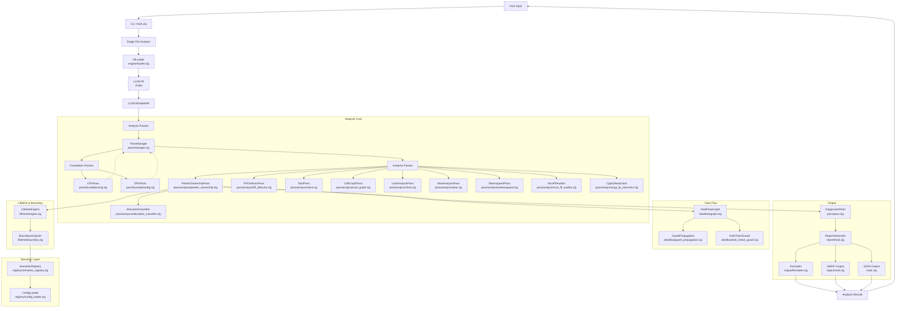
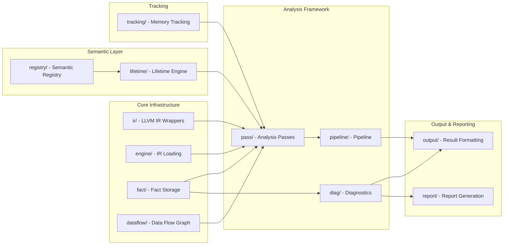
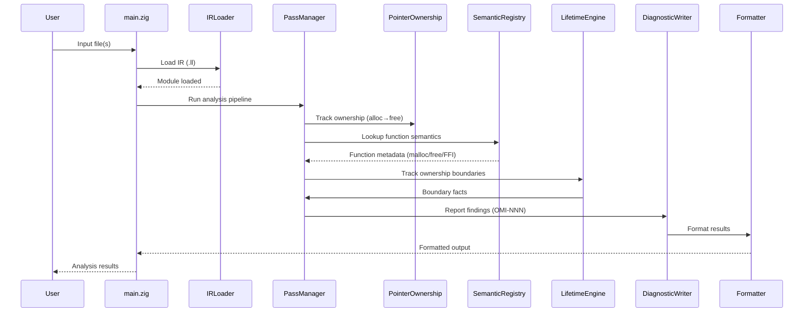
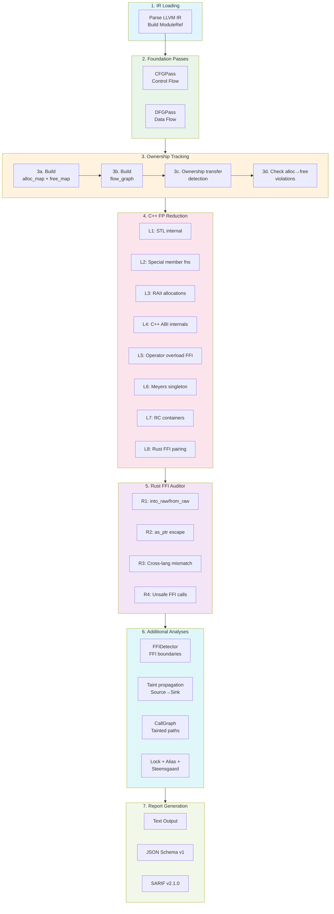

# OmniScope Architecture

## System Architecture Overview



## Module Dependencies



## Data Flow



## Component Responsibilities

### User Interface Layer
- **main.zig**: CLI entry point, argument parsing (`--json`, `--sarif`, `-o`), analysis orchestration

### Engine Layer
- **engine/loader.zig**: IR file loading, LLVM context management
- **ir/**: LLVM C API wrappers (raw, safe, view, debug_info, location)

### Analysis Framework
- **pass/manager.zig**: Pass registration and execution
- **pass/pass.zig**: PassContext with HashMap sets (raii/meyers/rc/into_raw/from_raw)
- **pipeline/pipeline.zig**: Analysis pipeline orchestration

### Foundation Passes
- **pass/foundation/cfg.zig**: Control flow graph construction
- **pass/foundation/dfg.zig**: Data flow graph construction

### Analysis Passes
- **pass/analysis/pointer_ownership.zig**: Core memory leak/UAF/double-free detection (936 lines)
  - Ownership transfer detection (return-value / output-param patterns)
  - 8-Layer C++ FP reduction delegation
- **pass/analysis/cpp_fp_reduction.zig**: C++ false positive reduction (937 lines)
  - L1-L8: STL/RAII/Meyers/RC container filters
  - L9: Rust FFI pairing (into_raw/from_raw)
- **pass/analysis/allocation_classifier.zig**: AllocType/FreeType classification (206 lines)
  - `AllocType`: malloc/ocaml_alloc/c_alloc/virtual_alloc/rust_alloc/unknown
  - `FreeType`: free/ocaml_free/c_free/virtual_free/rust_alloc/free_unknown
- **pass/analysis/rust_ffi_auditor.zig**: Rust FFI boundary auditor (464 lines) ← **v0.1.5 NEW**
  - R1: Unpaired `Box::into_raw()` / `CString::into_raw()`
  - R2: `as_ptr` borrow escape detection
  - R3: Cross-lang alloc mismatch (_Znwm → C free)
  - R4: Unsafe FFI calls without validation
  - R5: `extern "C"` type mismatch
  - R6: `#[no_mangle]` export ownership
- **pass/analysis/ffi_detector.zig**: FFI boundary detection and vulnerability analysis
- **pass/analysis/call_graph.zig**: Function call graph, tainted path to sink
- **pass/analysis/taint.zig**: Taint propagation analysis
- **pass/analysis/lock.zig**: Lock analysis and deadlock detection
- **pass/analysis/alias.zig**: Alias analysis
- **pass/analysis/steensgaard.zig**: Steensgaard pointer analysis
- **pass/analysis/taint_propagation.zig**: Taint propagation with path manager
- **pass/instrumentation/planner.zig**: Instrumentation planning

### Data Flow
- **dataflow/graph.zig**: Data flow graph construction
- **dataflow/guard_propagation.zig**: Guard propagation
- **dataflow/null_check_guard.zig**: Null check guard analysis

### Fact System
- **fact/store.zig**: Fact storage and indexing
- **fact/query.zig**: Fact querying engine
- **fact/fact.zig**: Fact type definitions

### Semantic Layer
- **registry/semantic_registry.zig**: Function semantic knowledge base (400+ entries)
- **registry/config_loader.zig**: Dynamic registry from JSON config

### Lifetime Engine
- **lifetime/engine.zig**: Resource lifetime tracking
- **lifetime/boundary.zig**: Cross-language boundary analyzer

### Output System
- **output/formatter.zig**: Result formatting (text)
- **output/cli.zig**: CLI output
- **output/sarif.zig**: SARIF v2.1.0 format output (14 rules)
- **output/lsp.zig**: LSP integration
- **report/mod.zig**: Report generation
- **report/sarif.zig**: SARIF report generation (v2.1.0)
- **report/ci_integration.zig**: CI/CD integration

### Diagnostics
- **diag/issue.zig**: Issue type definitions + Confidence system
  - `Confidence`: HIGH/MEDIUM/HEURISTIC/EXPERIMENTAL
  - `IssueKind`: 14 types (memory_leak, borrow_escape, cross_language_leak, etc.)

### Tracking
- **tracking/allocator.zig**: Memory allocation tracking

## Key Design Principles

1. **Separation of Concerns**: Each layer has distinct responsibilities
2. **Data-Driven Analysis**: Semantic registry provides function knowledge
3. **Ownership Focus**: Core analysis tracks pointer ownership, not generic taint
4. **Cross-Language**: Support for multi-language FFI analysis (C/C++/Rust)
5. **Modularity**: Components can be used independently or together
6. **False Positive Reduction**: 9-layer filtering (L1-L8 C++ + L9 Rust FFI)

## Analysis Pipeline



## Supported Languages

| Language | IR Analysis | Ownership Tracking | FFI Boundary |
|----------|-------------|-------------------|--------------|
| C | ✅ Full | ✅ Full | ✅ Full |
| C++ | ✅ Full | ✅ Full | ✅ Full |
| Rust | ✅ Full (LLVM IR) | ✅ Full | ✅ Rust FFI Auditor |
| Zig | ⚠️ Beta | ⚠️ Beta | ⚠️ Beta |
| Go | ⚠️ Experimental | ⚠️ Experimental | ⚠️ Experimental |

## Issue Detection Categories

| Category | IssueKind | Severity | Confidence |
|----------|-----------|----------|------------|
| **Memory** | memory_leak, use_after_free, double_free, invalid_free | Critical/High | 0.70-0.90 |
| **FFI** | ffi_unsafe_call, unchecked_return, type_mismatch | High | 0.65-0.80 |
| **Rust FFI** | borrow_escape, cross_language_leak, unpaired_into_raw | High | 0.75-0.85 |
| **Security** | command_injection, format_string, buffer_overflow | Critical | 0.75-0.90 |
| **Dereference** | null_dereference | Critical | 0.85 |
| **Concurrency** | (via lock.zig) | High | TBD |

## Output Formats

### Text (Default)
```
VULNERABILITY OMI-001 [high] [Confidence: medium]
Type: borrow_escape
Reason: as_ptr() on local String/Vec passed to extern C - may dangle
```

### JSON (Stable Schema v1)
```json
{
  "schema_version": "1.0.0",
  "tool": "omniscope",
  "tool_version": "0.1.5",
  "summary": {"functions": 135, "issues": 6, "time_ms": 91},
  "issues": [{
    "id": "OMI-001",
    "kind": "borrow_escape",
    "severity": "high",
    "confidence": "MEDIUM",
    "confidence_score": 0.80,
    "cwe_id": 704,
    "reason": "as_ptr() on local String/Vec passed to extern C",
    "message": "Potential as_ptr borrow escape",
    "location": {"function": "leak_cstring"}
  }]
}
```

### SARIF v2.1.0
- 14 rule definitions (all IssueKind variants)
- GitHub Code Scanning compatible
- Properties: `confidence`, `confidenceLevel`, `reason`, `cwe`

## File Organization Rules

Per **rules.md §49**: Maximum 1000 lines per `.zig` file

| File | Lines | Status |
|------|-------|--------|
| pointer_ownership.zig | 936 | ✅ ≤1000 |
| cpp_fp_reduction.zig | 937 | ✅ ≤1000 |
| allocation_classifier.zig | 206 | ✅ ≤1000 |
| rust_ffi_auditor.zig | 464 | ✅ ≤1000 |
| ffi_detector.zig | 729 | ✅ ≤1000 |
| lock.zig | 719 | ✅ ≤1000 |
| taint.zig | 708 | ✅ ≤1000 |
