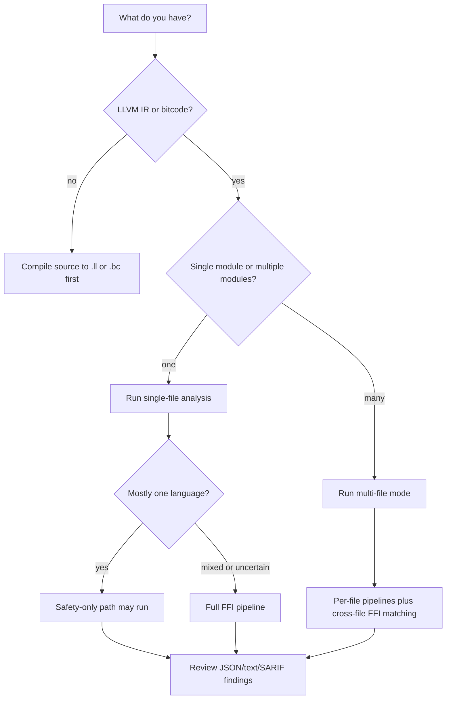

# OmniScope English Documentation

OmniScope is a Zig-based LLVM IR analyzer for memory-safety and FFI-boundary review. It is most useful when the question is not "is this source file valid?" but "what happens when ownership, pointers, callbacks, or runtime contracts cross a language boundary?"

The repository version is `0.2.0` in `VERSION`, `build.zig.zon`, CLI `--version`, JSON output, and SARIF output.

## Start With The Question

Choose the path by the risk you are trying to answer:

| Question | Use OmniScope when | Better first tool |
| --- | --- | --- |
| Can a value allocated by one language be freed by another? | You have `.ll` or `.bc` with FFI symbols or external calls. | Source compiler checks if the code has not been compiled yet. |
| Did a pointer, callback, string, layout, or unwind contract cross an unsafe boundary? | You need IR-level evidence across C, C++, Rust, Zig, Go, Python, Java, or C#-style symbols. | Language-specific linters for purely local source style. |
| Is this general C/Rust/Python program safe? | Only as a secondary signal; OmniScope has a safety-only path but the project focus is FFI. | Clang Static Analyzer, Infer, CodeQL, sanitizers, or language-native tools. |
| Is a release accurate enough? | Use the fixture and corpus baselines in `tests/`, `corpus/`, `benches/`, and `test_results/`. | Manual review alone, because it does not catch regressions repeatably. |

## Decision Flow



## What The Tool Actually Runs

The entry point is `src/main.zig`. Argument parsing lives in `src/config/main_config.zig`. Single-file analysis is orchestrated by `src/pipeline_runner.zig`; multi-file analysis is in `src/pipeline.zig`.

Inputs are LLVM `.ll` or `.bc` files loaded by `src/engine/loader.zig`. The full pipeline registers passes through `src/pipeline_registration.zig`. The current registered set includes foundation passes, surface and semantic classification, taint/data-flow passes, FFI boundary/type/layout/string/unwind checks, Rust FFI checks, callback checks, memory-safety checks, free validation, GC safety, error propagation, and lock analysis.

Outputs are formatted by `src/output_formatter.zig` as text, JSON, or SARIF. Issue kinds are defined in `src/common/types.zig` and include FFI unsafe calls, unchecked returns, type mismatches, cross-language leaks/free violations, leaks, use-after-free, command injection, buffer/integer overflow, double-free, contract mismatch, format string, null dereference, borrow escape, callback risks, invalid free, immutable writes, static-buffer misuse, data race, and thread-safety issues.

## First Run

Install Zig and LLVM 22, then build:

```bash
zig build -Doptimize=ReleaseFast
```

Analyze one IR file generated from your project:

```bash
./zig-out/bin/OmniScope path/to/input.bc --json
```

Use stricter filters when you want fewer findings for review:

```bash
./zig-out/bin/OmniScope input.bc --boundary-only --min-severity high --json
```

For multiple modules, pass more than one file:

```bash
./zig-out/bin/OmniScope rust_side.bc c_side.bc --json
```

The main knobs are documented in `src/config/main_config.zig` and exposed through `--help`: `--boundary-only`, `--min-severity`, `--leak-threshold`, `--focus-user-code`, `--no-focus-user-code`, `--show-surface`, `--lang`, `--lang-prefix`, `--lang-suffix`, `--source-lang`, `--default-lang`, `--json`, `--sarif`, and `--output`.

## What To Read Next

- `docs/en/architecture.md`: how the loader, language detection, pass manager, shared stores, filtering, and output path fit together.
- `docs/en/modules.md`: module responsibilities and how they cooperate.
- `docs/en/passes.md`: pass inventory and pass behavior.
- `docs/en/API_REFERENCE.md`: API-level notes for code readers.
- `tests/BASELINE.md`, `corpus/EXPECTED_RESULTS.md`, `benches/README.md`, and `test_results/`: current baseline and benchmark material.
