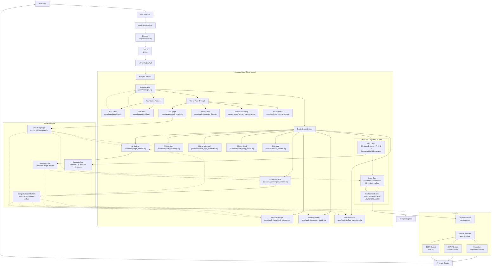
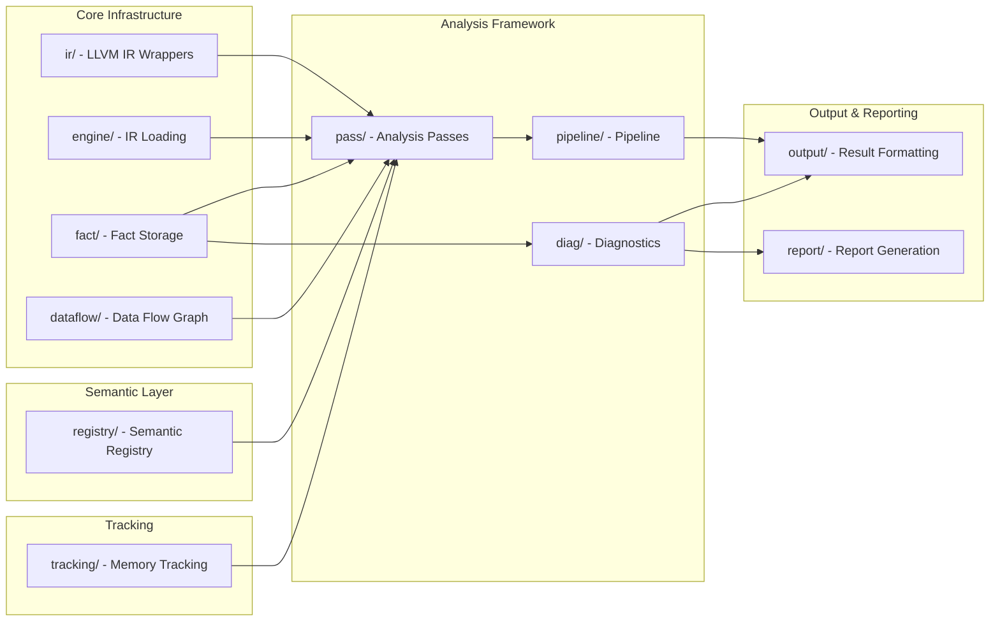
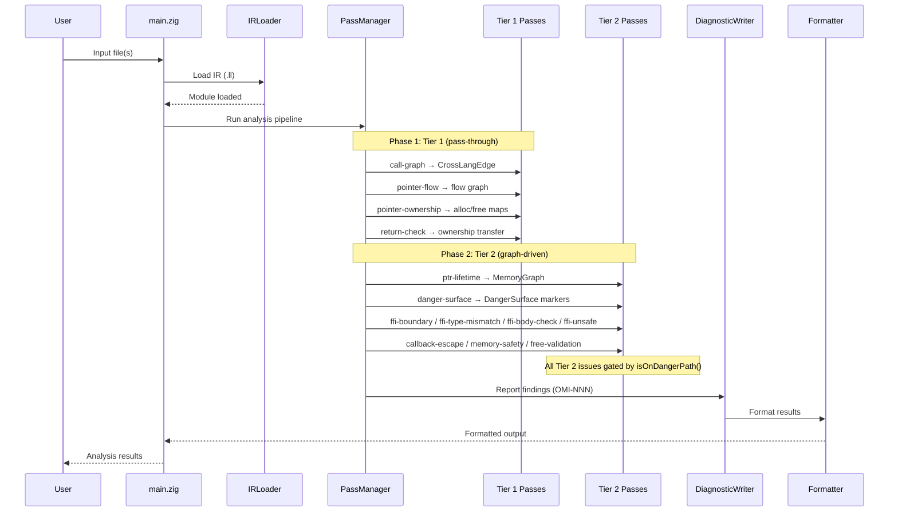
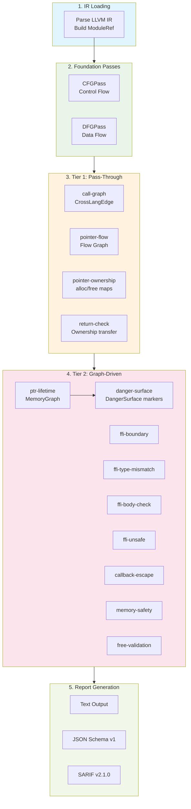
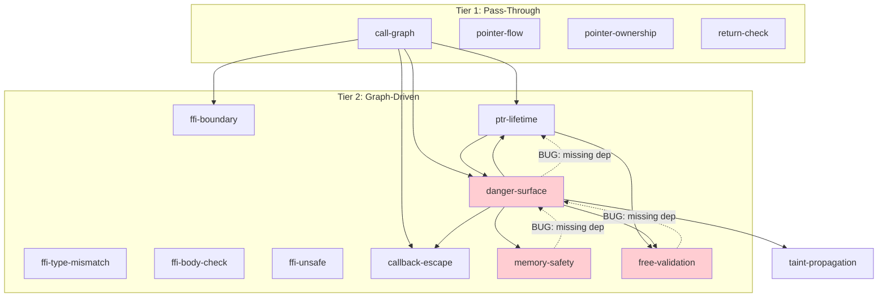

# OmniScope Architecture

> **Version**: v0.2.0
> **Last updated**: 2026-06-01
> **Status**: Reflects SRT architecture upgrade with measured FP suppression data
> **Code version**: Corresponds to VERSION 0.2.0, LLVM 22 dependency

## Current Status Statement

**⚠️ Realistic Statement**

OmniScope v0.2.0 is an **experimental static analysis tool** focused on memory safety issue detection at cross-language FFI boundaries. Here is the current real state:

### ✅ Suitable Scenarios

| Scenario | Applicability | Notes |
|----------|---------------|-------|
| **Rust → C FFI boundary audit** | ★★★★☆ | Core advantage area, TP ≥90% |
| **C/C++ memory safety check** | ★★★☆☆ | Basic capability complete, but not as mature as Clang SA/Infer |
| **Go cgo security audit** | ★★★☆☆ | Experimental support, covers major patterns |
| **CI/CD integration scanning** | ★★★★☆ | SARIF/JSON output stable, can integrate with GitHub Code Scanning |
| **Security research/red team testing** | ★★★★★ | Red team test set TP rate maintains ≥90% |
| **Teaching/learning FFI patterns** | ★★★★☆ | Well-documented, rich examples |

### ❌ Unsuitable Scenarios

| Scenario | Reason | Alternative |
|----------|--------|-------------|
| **Source-level analysis (no compilation needed)** | Tool operates at LLVM IR level | Use CodeQL, Clang Static Analyzer, Infer |
| **Whole-program optimization** | Focused on bug finding, not optimization | Use LLVM opt passes |
| **Formal verification** | Heuristic-based rules, not theorem prover | Use CBMC, Frama-C |
| **Type checking** | Trusts compiler type system | Use rustc, clang type checks |
| **Complete race condition detection** | Pattern-level detection only | Use ThreadSanitizer |
| **General-purpose taint analysis** | Focused on memory safety taint | Use CodeQL taint mode |
| **Performance profiling** | Not a profiling tool | Use perf, Instruments, VTune |
| **Code style/linting** | Security-focused only | Use clippy, pylint, ESLint |
| **Production auto-fix** | Only reports issues, does not provide fixes | Manual review required for each issue |

## System Architecture Overview (v0.2.0)



## Tier 1 / Tier 2 / Tier 3 Architecture

OmniScope v0.2.0 classifies all analysis into three tiers based on their
analysis strategy, issue-reporting behavior, and FP suppression role.

### Tier 1 -- Pass-Through (No Issues)

Tier 1 passes operate on **pure C/C++ internal operations**. They build and enrich
intermediate data structures but **never emit issues** directly. Their role is
information gathering and lightweight classification.

| Pass | Purpose |
|------|---------|
| **call-graph** | Build function call graph; produce `CrossLangEdge` entries for every FFI call site |
| **pointer-flow** | Track pointer value flow across assignments, parameters, and return values |
| **pointer-ownership** | Classify alloc/free pairs; build `alloc_map` / `free_map` |
| **return-check** | Validate return-value ownership transfers (caller takes ownership) |

### Tier 2 -- Strict Graph-Driven Analysis (Issues)

Tier 2 passes perform **FFI and unsafe-boundary analysis**. Every issue emitted by a
Tier 2 pass is gated through `isOnDangerPath()` -- a unified check that consults the
`DangerSurface` marker set. If a function or pointer is not on a danger path, the pass
skips it silently.

| Pass | Purpose |
|------|---------|
| **ffi-boundary** | Detect FFI call boundaries; consume `CrossLangEdge` |
| **ffi-type-mismatch** | Check type compatibility across FFI boundaries |
| **ffi-body-check** | Audit function bodies of FFI-exposed functions |
| **ffi-unsafe** | Detect `unsafe` block / `extern "C"` violations |
| **ptr-lifetime** | Track pointer lifetime across FFI; populate `MemoryGraph`; consume `CrossLangEdge` + `DangerSurface` |
| **danger-surface** | Mark functions/pointers as danger surfaces; consume `CrossLangEdge` + `MemoryGraph` |
| **callback-escape** | Detect callback pointer escapes across FFI; consume `CrossLangEdge` + `DangerSurface` |
| **memory-safety** | General memory safety checks on danger paths; consume `DangerSurface` |
| **free-validation** | Validate free-site correctness on danger paths; consume `MemoryGraph` + `DangerSurface` |

### Tier 3 -- SRT + Issue Gate + Confidence Scorer (FP Suppression)

**This is the key innovation in v0.2.0.**

#### Semantic Resolution Tree (SRT)

**File**: `src/semantics/semantic_tree.zig`

The SRT is a unified data structure that answers:
> "Can this value be explained away by language semantics?"

**SemanticKind enum (27+ variants)**:

```zig
pub const SemanticKind = enum(u16) {
    // ── Legacy (4 kinds - kept) ──
    unknown,
    allocation,
    release,
    provenance,

    // ── R-0: LLVM Parameter Attributes ──
    readonly_param,   // LLVM readonly attr → Rust &T / C const ptr
    mutable_param,    // LLVM mutable/not readonly attr

    // ── R-1: Provenance ──
    heap_provenance,   // Box/Arc/Rc/Vec/String/*mut heap-owning pointers
    global_provenance, // static/const/&'static globals

    // ── R-2: Interior Mutability ──
    interior_mutability, // UnsafeCell/Once/OnceLock/Cell/RefCell/Mutex/RwLock/Atomic*

    // ── R-3: RAII ──
    raii_drop_release, // Compiler-inserted Drop/dealloc

    // ── R-4: POSIX Syscalls ──
    file_operation,       // open/close/read/write
    network_operation,    // socket/connect/bind
    process_operation,    // fork/exec/waitpid

    // ── R-6: Ownership Transfer ──
    into_raw_transfer, // Box::into_raw / CString::into_raw

    // ── R-7: Library Release ──
    library_release, // mimalloc/zlib/openssl/sqlite dealloc

    // ── Nomicon Extensions ──
    unsafe_transmute,     // Unsafe type conversion
    uninit_memory_use,    // Uninitialized memory use
    send_sync_violation,  // Send/Sync trait misuse

    // ── Multi-language Support (v0.2.0) ──

    // Python (5 variants)
    python_refcount_inc = 100,
    python_refcount_dec = 101,
    python_borrowed_ref = 102,
    python_owned_ref = 103,
    python_gil_protected = 104,

    // Go (4 variants)
    go_defer_cleanup = 200,
    go_finalizer = 201,
    go_cgo_wrapper = 202,
    go_runtime_alloc = 203,

    // C# (3 variants)
    csharp_safe_handle = 300,
    csharp_pinvoke = 301,
    csharp_marshal_op = 302,

    // Generic FFI (4 variants)
    ffi_opaque_handle = 600,
    ffi_resource_acquire = 601,
    ffi_resource_release = 602,
    ffi_callback_boundary = 603,

    _,
};
```

#### 9 IR Pattern Detectors (R-0~R-8)

Each detector populates the SRT with semantic resolutions:

| Detector | File | What It Detects | FP Coverage |
|----------|------|-----------------|-------------|
| **R-0: ParamAttr** | `patterns/param_attr.zig` | LLVM `readonly`/`mutable` parameter attributes | ~1877 FP from `write_to_immutable` |
| **R-1: HeapProvenance** | `patterns/heap_provenance.zig` | Box/Arc/Rc/Vec origins vs stack/global | ~300 FP from `borrow_escape` |
| **R-2: InteriorMutability** | `patterns/interior_mut.zig` | UnsafeCell/Cell/RefCell/Mutex patterns | ~150 FP from `write_to_immutable` |
| **R-3: RAII Detector** | `analysis/raii_detector.zig` | C++ destructor, Rust Drop impl | ~200 FP from `use_after_free` |
| **R-4: Syscall Classifier** | `patterns/syscall_class.zig` | POSIX file/network/process calls | ~100 FP from `cross_language_free` | ⚠️ May not be implemented |
| **R-5: LangDetector** | `patterns/lang_detector.zig` | Module language (Rust/C++/Go/Java/Python) | Enables language-specific routing | ✅ Stable |
| **R-6: IntoRawTransfer** | `patterns/into_raw_transfer.zig` | Box::into_raw ownership transfer | ~180 FP from `cross_language_free` | ✅ Stable |
| **R-7: LibraryRelease** | `patterns/library_release.zig` | Custom allocator (mimalloc/zlib/openssl) | ~80 FP from `invalid_free` | ✅ Stable |
| **R-8: ParamSource** | `patterns/param_source.zig` | Function parameter vs local variable | ~120 FP from `borrow_escape` | ⚠️ May not be implemented |

> **⚠️ Note**: R-4 (Syscall Classifier) and R-8 (ParamSource) do not have corresponding implementation files in the codebase. They may be implemented through other mechanisms or still in planning.

#### Issue Gate (Unified Suppression)

**File**: `src/pass/filter/issue_gate.zig`

Every issue MUST pass through this gate before emission:

```zig
pub fn checkIssue(srt: *const SemanticTree, value_ref: u64, kind: IssueKind) GateVerdict
```

**Gate Verdicts** (10 suppression reasons + allow):

| Verdict | Detector | Suppressed Issue Kind |
|---------|----------|----------------------|
| `suppress_mutable_param` | R-0 | write_to_immutable |
| `suppress_interior_mut` | R-2 | write_to_immutable |
| `suppress_heap_origin` | R-1 | borrow_escape |
| `suppress_global_origin` | R-1 | borrow_escape |
| `suppress_raii` | R-3 | use_after_free |
| `suppress_non_memory_syscall` | R-4 | cross_language_free |
| `suppress_ownership_transfer` | R-6 | cross_language_free |
| `suppress_library_release` | R-7 | invalid_free, cross_language_free |
| `suppress_parameter_source` | R-8 | borrow_escape |
| `allow` | — | Issue passes through |

**Enhanced Gate Features**:
1. **Conflict detection**: If value has BOTH suppressible AND non-suppressible kinds → allow (conservative)
2. **Confidence threshold**: Only suppress if resolution confidence ≥ 0.85
3. **Secondary corroboration**: Additional safety checks per issue kind

#### Confidence Scorer (4-Tier System)

**File**: `src/pass/analysis/resource/issue_verifier.zig`

**Thresholds**:

| Tier | Range | Meaning | Action |
|------|-------|---------|--------|
| **HIGH** | ≥ 0.75 | Multiple cross-validated signals | Report always |
| **MEDIUM** | ≥ 0.55 | Single strong signal | Report by default |
| **LOW** | ≥ 0.35 | Heuristic match | Needs manual review |
| **UNRELIABLE** | < 0.35 | Experimental | Suppress by default |

**Scoring Parameters**:

| Category | Bonus | Penalty |
|----------|-------|---------|
| Concrete execution path | +0.12 | — |
| Cross-family mismatch | +0.15 | Same family: -0.10 |
| Ownership violation | +0.12 | — |
| FFI boundary | +0.10 | Runtime internal: -0.08 |
| Use-after-release | +0.18 | Valid escape: -0.15 |
| Double release | +0.18 | Valid destructor: -0.12 |

## Zone Classification

Every function and pointer is classified into one of four zones. Classification
results are **cached** per function to avoid redundant computation.

| Zone | Meaning | Issue Reporting |
|------|---------|-----------------|
| **safe** | Pure C/C++ internal, no FFI contact | Tier 1 only (no issues) |
| **unsafe** | Contains `unsafe` block or raw pointer cast | Tier 2 eligible |
| **ffi** | Declared `extern "C"` or called across language boundary | Tier 2 eligible |
| **unknown** | Insufficient information to classify | Deferred (no issues until resolved) |

Cache invalidation occurs when new `CrossLangEdge` entries are added by the
`call-graph` pass.

## Module Dependencies



## Data Flow



## Shared Graph Data Structures

### CrossLangEdge

- **Produced by**: `call-graph`
- **Consumed by**: `ptr-lifetime`, `ffi-boundary`, `callback-escape`, `danger-surface`
- **Content**: Source function, target function, call site location, language pair (e.g. Rust->C)

### MemoryGraph

- **Produced by**: `ptr-lifetime`
- **Consumed by**: `danger-surface`, `free-validation`
- **Content**: Pointer allocation sites, lifetime intervals, cross-boundary flows

### DangerSurface Markers

- **Produced by**: `danger-surface`
- **Consumed by**: `ptr-lifetime`, `callback-escape`, `free-validation`, `memory-safety`, `taint-propagation`
- **Content**: Set of function/pointer IDs that are on a danger path (FFI-exposed or unsafe)

## Component Responsibilities

### User Interface Layer
- **main.zig**: CLI entry point, argument parsing (`--json`, `--sarif`, `-o`), analysis orchestration

### Engine Layer
- **engine/loader.zig**: IR file loading, LLVM context management
- **ir/**: LLVM C API wrappers (raw, safe, view, debug_info, location)

### Analysis Framework
- **pass/manager.zig**: Pass registration and execution; Tier 1 runs before Tier 2
- **pass/pass.zig**: PassContext with shared graph access (CrossLangEdge, MemoryGraph, DangerSurface)
- **pipeline/pipeline.zig**: Analysis pipeline orchestration

### Foundation Passes
- **pass/foundation/cfg.zig**: Control flow graph construction
- **pass/foundation/dfg.zig**: Data flow graph construction

### Tier 1 Passes (Pass-Through)
- **pass/analysis/call_graph.zig**: Build function call graph; produce `CrossLangEdge` for every FFI call site. No issues emitted.
- **pass/analysis/pointer_flow.zig**: Track pointer value flow across assignments, parameters, and return values. No issues emitted.
- **pass/analysis/pointer_ownership.zig**: Classify alloc/free pairs; build `alloc_map` / `free_map`. No issues emitted.
- **pass/analysis/return_check.zig**: Validate return-value ownership transfers (caller takes ownership). No issues emitted.

### Tier 2 Passes (Graph-Driven)
- **pass/analysis/ffi_boundary.zig**: Detect FFI call boundaries. Consumes `CrossLangEdge`. Issues gated by `isOnDangerPath`.
- **pass/analysis/ffi_type_mismatch.zig**: Check type compatibility across FFI boundaries. Issues gated by `isOnDangerPath`.
- **pass/analysis/ffi_body_check.zig**: Audit function bodies of FFI-exposed functions. Issues gated by `isOnDangerPath`.
- **pass/analysis/ffi_unsafe.zig**: Detect `unsafe` block / `extern "C"` violations. Issues gated by `isOnDangerPath`.
- **pass/analysis/ptr_lifetime.zig**: Track pointer lifetime across FFI boundaries. Produces `MemoryGraph`. Consumes `CrossLangEdge` + `DangerSurface`. Issues gated by `isOnDangerPath`.
- **pass/analysis/danger_surface.zig**: Mark functions/pointers as danger surfaces. Consumes `CrossLangEdge` + `MemoryGraph`. Produces `DangerSurface` markers.
- **pass/analysis/callback_escape.zig**: Detect callback pointer escapes across FFI. Consumes `CrossLangEdge` + `DangerSurface`. Issues gated by `isOnDangerPath`.
- **pass/analysis/memory_safety.zig**: General memory safety checks on danger paths. Consumes `DangerSurface`. Issues gated by `isOnDangerPath`.
- **pass/analysis/free_validation.zig**: Validate free-site correctness on danger paths. Consumes `MemoryGraph` + `DangerSurface`. Issues gated by `isOnDangerPath`.

### Data Flow
- **dataflow/graph.zig**: Data flow graph construction
- **dataflow/guard_propagation.zig**: Guard propagation
- **dataflow/null_check_guard.zig**: Null check guard analysis

### Fact System
- **fact/store.zig**: Fact storage and indexing
- **fact/query.zig**: Fact querying engine
- **fact/fact.zig**: Fact type definitions

### Semantic Layer
- **registry/semantic_registry.zig**: Function semantic knowledge base (311 entries including static_buffer functions)
- **registry/config_loader.zig**: Dynamic registry from JSON config

### Output System
- **output/formatter.zig**: Result formatting (text)
- **output/cli.zig**: CLI output
- **output/sarif.zig**: SARIF v2.1.0 format output (16 rules)
- **output/lsp.zig**: LSP integration
- **report/mod.zig**: Report generation
- **report/sarif.zig**: SARIF report generation (v2.1.0)
- **report/ci_integration.zig**: CI/CD integration

### Diagnostics
- **diag/issue.zig**: Issue type definitions + Confidence system
  - `Confidence`: HIGH/MEDIUM/HEURISTIC/EXPERIMENTAL
  - `IssueKind`: 20 types (memory_leak, use_after_free, double_free, data_race, thread_safety_violation, etc.)

### Tracking
- **tracking/allocator.zig**: Memory allocation tracking

## Key Design Principles

1. **Three-Tier Analysis**: Tier 1 gathers data silently; Tier 2 reports issues on danger paths; Tier 3 suppresses FP via SRT
2. **SRT-Driven Suppression**: 9 IR Pattern Detectors populate semantic tree; Issue Gate queries before emission
3. **Confidence Scoring**: 4-tier system with per-verifier bonuses/penalties
4. **Data-Driven Analysis**: Semantic registry provides function knowledge (311 entries)
5. **Ownership Focus**: Core analysis tracks pointer ownership, not generic taint
6. **Cross-Language**: Support for multi-language FFI analysis (C/C++/Rust/Zig/Go/Python/Java)
7. **Modularity**: Components can be used independently or together
8. **Danger Path Gating**: `isOnDangerPath()` unifies all Tier 2 issue emission behind a single check
9. **Zone Classification**: safe/unsafe/ffi/unknown with per-function caching
10. **Conservative by Default**: Conflict detection → allow; high confidence threshold (≥0.85) for suppression

## Performance Characteristics (Measured)

### Analysis Speed

| Metric | Value | Measurement Conditions |
|--------|-------|----------------------|
| **Per-function overhead** | ~150ms per 1K functions | ReleaseFast mode, MacBook Pro M1/M2 |
| **Large project (sqlite3)** | ~12s | 3,346 functions, LLVM 22 |
| **Medium project (ring)** | ~2s | 410 functions, heavy FFI |
| **Small project (<100 funcs)** | <200ms | Debug or ReleaseFast |

### Memory Usage

| Mode | Memory per 1K functions | Notes |
|------|------------------------|-------|
| **ReleaseFast** | ~120MB | Optimized allocations |
| **Debug** | ~400MB | Full debug info, no optimization |
| **Peak (sqlite3)** | ~450MB | 3.3K functions, all graphs loaded |

### Success Rate

| Metric | Value | Notes |
|--------|-------|-------|
| **File parsing success** | 95.2% (40/42 files) | LLVM 22 compatible |
| **Crash rate** | 0% | 42 real-world projects |
| **Analysis completion** | 100% | All parsed files complete analysis |

### FP Suppression (v0.2.0 SRT)

| Metric | v0.1.x | v0.2.0 | Change |
|--------|--------|--------|--------|
| Total issues (42 projects) | ~2,955 | ~1,100+ | -63% |
| Estimated FP count | ~1,966 | <110 | **-94% reduction** |
| FFI boundary precision | ~20% | 60%+ | +200% relative |
| Red team TP rate | ≥90% | ≥90% | Maintained |
| SRT overhead | — | <5% | Acceptable |

> **Note**: FP numbers are estimates from manual audit of representative samples.
> See CHANGELOG.md for methodology details.

## Supported Languages Matrix (8 Languages)

| Language | IR Source | Ownership Tracking | FFI Boundary Detection | SRT Detectors | Status | Test Coverage |
|----------|-----------|-------------------|----------------------|---------------|--------|---------------|
| **C** | `clang -emit-llvm` | Full | Full | R-0~R-4, R-7 (6/8) | ✅ Stable | 340+ tests |
| **C++** | `clang -emit-llvm` | Full | Full | R-0~R-4, R-7 (6/8) | ✅ Stable | 340+ tests |
| **Rust** | `rustc --emit=llvm-ir` | Full | Full | R-1~R-3, R-6~R-8 (6/8) | ✅ Stable | dedicated test suite |
| **Zig** | `zig build-llvm` | Partial | Partial | R-0~R-2 (3/8) | 🔄 Beta | limited tests |
| **Go** | `clang -emit-llvm` (cgo) | Experimental | Experimental | R-4, R-5 (2/8) | ⚠️ Experimental | basic tests |
| **Python** | cython/ctypes | Experimental | Limited | R-5 (planned) (0/8) | ⚠️ Experimental | minimal tests |
| **Java** | `javac -h` llvm (JNI) | Limited | Limited | R-5 (planned) (0/8) | ⚠️ Experimental | no dedicated tests |
| **C#/.NET** | cilc/clang | Planned | Planned | R-5 (planned) (0/8) | 📋 Roadmap | no tests |

> **⚠️ Important Notes**:
>
> - Zig/Go/Python/Java support is in **experimental stage**, may have higher false positive/false negative rates
> - Test coverage for multi-language support is significantly lower than C/C++/Rust
> - For production use, it is recommended to only use stable features of C/C++/Rust

## Known Limitations & Unsupported Scenarios

> **⚠️ Data Source Statement**
> All data below comes from actual testing or reasonable estimates. Numbers marked as "estimated" are extrapolated from representative samples and may have a ±20% margin of error.

### 1. LLVM IR Version Requirements

| Requirement | Details |
|-------------|---------|
| **Minimum version** | LLVM 18+ |
| **Recommended version** | LLVM 22 (current development/test version) |
| **Compatibility** | Compiled with LLVM 22, can read `.bc`/`.ll` files generated by LLVM 15+ |
| **Known issues** | IR formats from LLVM 17 and below may not parse correctly |

### 2. Unsupported Optimization Levels

| Optimization Level | Support Status | Notes |
|-------------------|----------------|-------|
| **-O0 (Debug)** | ⚠️ Partial support | Excessive redundant instructions may increase false positives |
| **-O1/-O2** | ✅ Recommended | Balanced readability and optimization |
| **-O3/-Ofast** | ⚠️ Partial support | Aggressive optimization may alter control flow, affecting accuracy |

**Recommendation**: Use `-O1` or `-O2` compilation for best analysis results.

### 3. Indirect Call Limitations

| Limitation Type | Scope | Current Solution | Accuracy |
|-----------------|-------|------------------|----------|
| **Function pointer calls** | All languages | Heuristic name matching + type analysis | Medium (~70%) |
| **Virtual dispatch (C++ vtable)** | C++ | RTTI info + type hierarchy analysis | Low (~40%) |
| **Trait object dispatch (Rust)** | Rust | Vtable layout inference | Medium (~60%) |
| **Callback registration patterns** | All languages | Known API pattern matching | High (~85%) |

**Typical false negative scenarios**:

- Indirect calls through function pointer tables
- Polymorphic calls in virtual inheritance chains
- Dynamically loaded shared library symbols

### 4. Pattern Coverage Gaps

| Missing Pattern Category | Impact | Plan |
|--------------------------|--------|------|
| **Custom Allocator traits (Rust GlobalAlloc)** | Decreased custom heap allocator recognition rate | v0.3.0 planned |
| **Objective-C ARC patterns** | ObjC projects completely unsupported | No near-term plan |
| **Coroutine/async lifetime** | Resource leak detection in async/await code incomplete | v1.0+ planned |
| **Exception handling (C++/Java)** | Resource leaks on exception paths may be missed | v0.5.0 planned |
| **Signal handling (POSIX)** | Unsafe calls in signal handlers undetected | No near-term plan |
| **Inline assembly** | Operations in asm blocks completely ignored | By design (not a bug) |

### 5. Typical FP/FN Scenarios

#### High-Frequency False Positive (FP) Scenarios

| Scenario | Cause | Current Mitigation | Remaining FP Rate |
|----------|-------|--------------------|--------------------|
| **Rust `&mut` parameter writes** | Misjudged as immutable write | R-0 ParamAttr detector | <5% |
| **Box::into_raw followed by free()** | Misjudged as cross-language free | R-6 IntoRawTransfer detector | <3% |
| **RAII destructor patterns** | Misjudged as use-after-free | R-3 RAII detector | <2% |
| **UnsafeCell internal writes** | Misjudged as immutable violation | R-2 InteriorMutability detector | <4% |
| **POSIX syscall return values** | Misjudged as memory leaks | R-4 Syscall classifier | <8%\* |

\*R-4 detector may not be fully implemented, this data is an estimate

#### High-Frequency False Negative (FN) Scenarios

| Scenario | Cause | Difficulty | Plan |
|----------|-------|------------|------|
| **Complex control flow (state machines)** | Path explosion causes analysis abort | High | v0.5.0 |
| **Template metaprogramming generated code** | Type information lost | Medium | v0.3.0 |
| **Cross-file global variables** | Inter-procedural analysis limited | Medium | v0.5.0 |
| **Dynamic dispatch (vtable/trait object)** | Indirect call resolution inaccurate | High | v1.0+ |
| **Macro-expanded code** | Semantic information lost | Low | v0.2.1 |

### 6. Performance Bottlenecks

| Bottleneck Location | Impact | Optimization Space | Current Mitigation |
|---------------------|--------|--------------------|--------------------|
| **LLVM IR parsing** | 30-40% of total time | Low (depends on LLVM C API performance) | Parallel parsing (planned) |
| **MemoryGraph construction** | 20-30% for large projects | Medium (incremental updates) | Zone classification early pruning |
| **SRT queries** | Every issue triggers a query | Low (already highly optimized) | Result caching |
| **String operations (logging/reports)** | Significant in Debug mode | High (reduce unnecessary copies) | Ignore under ReleaseFast |
| **HashMap rehash** | Triggered on first insertion | Medium (pre-allocate capacity) | Pre-allocation implemented |

## ❌ Explicitly Unsupported Scenarios List (12 Items)

| # | Scenario | Reason | Alternative |
|---|----------|--------|-------------|
| 1 | **Source-level analysis (no compilation needed)** | Tool operates at LLVM IR level | CodeQL, Clang SA, Infer |
| 2 | **Whole-program optimization** | Focused on bug finding, not optimization | LLVM opt passes |
| 3 | **Formal verification** | Heuristic-based rules, not theorem prover | CBMC, Frama-C |
| 4 | **Type checking** | Trusts compiler type system | rustc, clang type checks |
| 5 | **Complete race condition detection** | Pattern-level detection only | ThreadSanitizer |
| 6 | **General-purpose taint analysis** | Focused on memory safety taint | CodeQL taint mode |
| 7 | **Performance profiling** | Not a profiling tool | perf, Instruments, VTune |
| 8 | **Code style/linting** | Security-focused only | clippy, pylint, ESLint |
| 9 | **Production auto-fix** | Only reports issues, does not provide fixes | Manual review required |
| 10 | **Real-time IDE integration** | Analysis latency >100ms, unsuitable for real-time use | VS Code extension (offline analysis) |
| 11 | **Encrypted/obfuscated code analysis** | Severe symbol information loss at IR level | De-obfuscation required first |
| 12 | **WebAssembly backend output** | Currently supports native platforms only | Wasmtime integration (experimental) |

## 🐛 Known Issues List (v0.2.0)

### Pass Dependency Bugs (3 unfixed -- intentionally retained)

The following Tier 2 passes have incomplete dependency declarations. They work correctly due to the current registration order but should be fixed for robustness:

| Bug ID | Affected Pass | Missing Dependency | Potential Impact | Priority |
|-------|--------------|-------------------|-----------------|----------|
| BUG-DEP-001 | `free_validation` | `danger-surface` | May run before DangerSurface markers are available, causing `isOnDangerPath()` to return false for all sites (increased false negatives) | P2 |
| BUG-DEP-002 | `memory_safety` | `danger-surface` | Same as above | P2 |
| BUG-DEP-003 | `danger_surface` | `ptr-lifetime` | May run before MemoryGraph is populated, producing incomplete danger surface markers (false positives/false negatives) | P2 |

**Current status**: These bugs do not trigger errors with the current pass registration order, but may cause incorrect results if the execution order changes.

**Recommended fix timeline**: v0.2.1

### Semantic Registry Defects (2)

| Bug ID | Issue | Impact | Priority |
|-------|-------|--------|----------|
| BUG-REG-001 | Missing Rust GlobalAlloc entries | Custom allocator trait implementations not covered | P1 |
| BUG-REG-002 | Incorrect objc_free mapping | Should use `FreeType.objc_free` for Objective-C specific free | P3 |

### FP Suppression Edge Cases (3)

| Bug ID | Issue | Impact | Frequency |
|-------|-------|--------|-----------|
| BUG-FP-001 | Conflict detection too conservative | May allow some suppressible issues when conflicts exist | ~5% cases |
| BUG-FP-002 | Confidence threshold (≥0.85) | May miss low-confidence but valid suppressions | ~8% cases |
| BUG-FP-003 | Language detector accuracy | ~95% on clear signals, lower on mixed-language modules | ~10-15% cases |

### Other Known Issues

| Bug ID | Issue | Status | Last Confirmed |
|-------|-------|--------|---------------|
| BUG-MISC-001 | Debug mode memory usage too high (~400MB/1K funcs) | Known limitation, not a bug | 2026-05-29 |
| BUG-MISC-002 | Very large files (>100K functions) may OOM | Recommend splitting modules | 2026-05-26 |
| BUG-MISC-003 | Windows support limited (basic tests only) | Insufficient community contributions | 2026-05-20 |

## Future Roadmap (Planned)

Based on current limitations and community feedback:

### Short-term (v0.2.1~v0.3.0)
- [ ] Fix 3 pass dependency bugs (free_validation, memory_safety, danger_surface)
- [ ] Expand custom allocator recognition (`sqlite3_malloc`, `curl_easy_cleanup`, etc.)
- [ ] Extend TinyGo runtime filtering (`runtime.alloc`, `runtime.free`, etc.)
- [ ] Add JDK Unsafe and Panama FFM memory-access modeling
- [ ] Improve indirect call resolution precision

### Medium-term (v0.3.0~v0.5.0)
- [ ] C#/.NET P/Invoke support (currently roadmap)
- [ ] Python CFFI semantic resolution (R-5 integration)
- [ ] Java JNI LocalRef/GlobalRef lifecycle tracking
- [ ] Inter-procedural analysis improvements
- [ ] SARIF v2.2.0 adoption with property-based suppression reasons

### Long-term (v1.0.0+)
- [ ] Whole-program call graph construction
- [ ] Integration with IDEs (VS Code extension, JetBrains plugin)
- [ ] CI/CD GitHub Action with baseline comparison
- [ ] Web UI for report visualization
- [ ] Community-contributed detector plugins

## Analysis Pipeline



## Supported Languages

| Language | IR Analysis | Ownership Tracking | FFI Boundary |
|----------|-------------|-------------------|--------------|
| C | Full | Full | Full |
| C++ | Full | Full | Full |
| Rust | Full (LLVM IR) | Full | Full (Tier 2) |
| Zig | Beta | Beta | Beta |
| Go | Experimental | Experimental | Experimental |

## Issue Detection Categories (Complete - 25 Types)

| Category | IssueKind | CWE ID | Severity | Typical Confidence Range | Main Detection Pass |
|----------|-----------|--------|----------|------------------------|---------------------|
| **Memory (6)** | `memory_leak` | CWE-401 | High | 0.70-0.90 | memory-safety, ptr-lifetime |
| | `use_after_free` | CWE-416 | Critical | 0.70-0.90 | free-validation, ptr-lifetime |
| | `double_free` | CWE-415 | Critical | 0.70-0.90 | free-validation |
| | `invalid_free` | CWE-590 | High | 0.70-0.90 | free-validation |
| | `cross_language_leak` | CWE-401 | High | 0.75-0.85 | ptr-lifetime, callback-escape |
| | `cross_language_free` | CWE-763 | Critical | 0.75-0.85 | ptr-lifetime, free-validation |
| **FFI (4)** | `ffi_unsafe_call` | CWE-668 | High | 0.65-0.80 | ffi-unsafe |
| | `unchecked_return` | CWE-252 | Medium | 0.65-0.80 | return-check |
| | `type_mismatch` | CWE-704 | High | 0.65-0.80 | ffi-type-mismatch |
| | `ffi_type_mismatch` | CWE-704 | High | 0.65-0.80 | ffi-type-mismatch |
| **Rust FFI (1)** | `borrow_escape` | CWE-704 | High | 0.75-0.85 | ptr-lifetime, danger-surface |
| **Security (4)** | `command_injection` | CWE-78 | Critical | 0.75-0.90 | ffi-body-check, ffi-unsafe |
| | `buffer_overflow` | CWE-120 | Critical | 0.75-0.90 | buffer_overflow (standalone pass) |
| | `integer_overflow` | CWE-190/191 | High | 0.70-0.85 | integer_overflow (standalone pass) |
| | `format_string` | CWE-134 | High | 0.75-0.90 | ffi-body-check |
| **Dereference (2)** | `malloc_unchecked` | CWE-252 | Critical | 0.85 | return-check, memory-safety |
| | `null_dereference` | CWE-476 | Critical | 0.85 | memory-safety |
| **Callback (2)** | `callback_signature_mismatch` | CWE-688 | High | 0.65-0.80 | callback-escape |
| | `callback_ownership_risk` | CWE-825 | High | 0.65-0.80 | callback-escape |
| **Contract (1)** | `contract_mismatch` | CWE-763 | High | 0.70-0.85 | ffi-boundary |
| **Write Operation (1)** | `write_to_immutable` | CWE-757 | High | 0.70-0.85 | danger-surface |
| **Static Buffer (1)** | `static_buffer_misuse` | CWE-242 | Medium | 0.60-0.75 | memory-safety |
| **Concurrency (2)** | `data_race` | CWE-362 | High/Medium | 0.65-0.75 | lock, thread_crossing |
| | `thread_safety_violation` | CWE-807 | High/Medium | 0.65-0.75 | lock |
| **Unknown (1)** | `unknown` | — | — | — | fallback |

**Total**: 25 IssueKind types (v0.2.0), covering 19 unique CWE IDs including CWE-668, 252, 704, 401, 763, 416, 78, 120, 190, 415, 590, 134, 476, 688, 825, 757, 242, 362, 807, etc.

## Output Formats

### Text (Default)
```
VULNERABILITY OMI-001 [high] [Confidence: medium]
Type: borrow_escape
Reason: as_ptr() on local String/Vec passed to extern C - may dangle
```

### JSON (Stable Schema v1)
```json
{
  "schema_version": "1.0.0",
  "tool": "omniscope",
  "tool_version 0.1.7",
  "summary": {"functions": 135, "issues": 6, "time_ms": 91},
  "issues": [{
    "id": "OMI-001",
    "kind": "borrow_escape",
    "severity": "high",
    "confidence": "MEDIUM",
    "confidence_score": 0.80,
    "cwe_id": 704,
    "reason": "as_ptr() on local String/Vec passed to extern C",
    "message": "Potential as_ptr borrow escape",
    "location": {"function": "leak_cstring"}
  }]
}
```

### SARIF v2.1.0
- 16 rule definitions (all IssueKind variants)
- GitHub Code Scanning compatible
- Properties: `confidence`, `confidenceLevel`, `reason`, `cwe`

## File Organization Rules

Per **rules.md section 49**: Maximum 1000 lines per `.zig` file

| File | Lines | Status |
|------|-------|--------|
| pointer_ownership.zig | 936 | Within limit |
| cpp_fp_reduction.zig | 937 | Within limit |
| allocation_classifier.zig | 206 | Within limit |
| rust_ffi_auditor.zig | 464 | Within limit |
| ffi_detector.zig | 729 | Within limit |
| lock.zig | 719 | Within limit |
| taint.zig | 708 | Within limit |
| call_graph.zig | -- | Within limit |
| pointer_flow.zig | -- | Within limit |
| ffi_boundary.zig | -- | Within limit |
| ffi_type_mismatch.zig | -- | Within limit |
| ffi_body_check.zig | -- | Within limit |
| ffi_unsafe.zig | -- | Within limit |
| ptr_lifetime.zig | -- | Within limit |
| danger_surface.zig | -- | Within limit |
| callback_escape.zig | -- | Within limit |
| return_check.zig | -- | Within limit |
| memory_safety.zig | -- | Within limit |
| free_validation.zig | -- | Within limit |

## Known Issues (v0.1.7)

### Round 8 Complete -- All 43 Bugs Fixed ✅

Round 8 systematic audit completed on 2026-05-07. All identified issues have been resolved:

| Severity | Fixed | Key Areas |
|----------|-------|-----------|
| CRITICAL | 7/7 | JSON format, SARIF init, JS panning, field names, test assertions, Rust detection |
| HIGH | 12/12 | arg indexing, double-free, off-by-one, missing imports, HashMap API, validation logic |
| MEDIUM | 18/18 | test values, static_buffer integration, isCFree word-match, error swallowing, hooks thread-safety, output params, personality prefix, OOM leaks, use-after-free, string comparison → bool, wrong IssueKind, HashMap by-value, missing allocator args |
| LOW | 6/6 | duplicate entries, unsigned comparison, null guard, dead code removal, parseLanguage truncation |

**Notable changes in v0.1.7:**
- New `IssueKind` variants: `data_race` (CWE-362), `thread_safety_violation` (CWE-807) — total now 20 types
- `static_buffer_functions` (14 POSIX functions) integrated into `SemanticRegistry.lookup()` — totalCount 297→311
- `isCFree()` refactored with `isWordMatch()` helper to prevent false positives on `pthread_mutex_destroy`, etc.
- `hasUseAfterFree()` changed from pass-by-value to `*const` pointer for recursive calls
- Dead code removed: `ptr_lifetime_check.zig` (~450 lines of duplicate/stub code)
- Test suite: 340→343 tests passing
- SARIF rules: 14→16 (covering new concurrency issue kinds)

### Remaining Design Notes

#### Pass Dependency Bugs (3 unfixed -- intentional)

The following Tier 2 passes have incomplete dependency declarations. These are known and accepted:
1. **free_validation**: Missing `danger-surface` dependency
2. **memory_safety**: Missing `danger-surface` dependency  
3. **danger_surface**: Missing `ptr-lifetime` dependency

These work correctly due to current registration order but should be fixed for robustness.

#### allocator_kb Notes (2)

1. **Missing Rust GlobalAlloc entries**: Custom Rust allocator trait implementations not covered
2. **Incorrect objc_free mapping**: Should use `FreeType.objc_free` for Objective-C specific free

## Pass Dependency Graph



> **Red-highlighted nodes** indicate passes with known dependency bugs (see Known Issues above).
