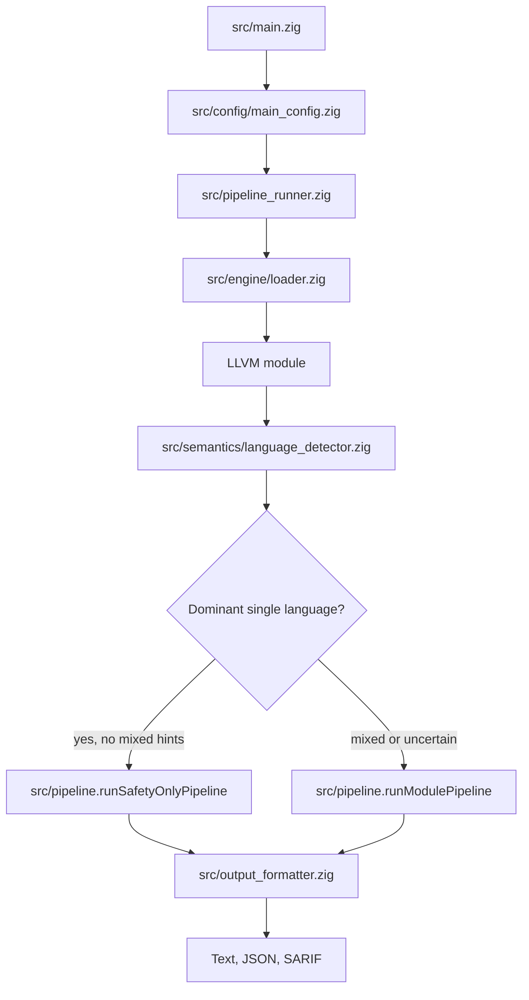
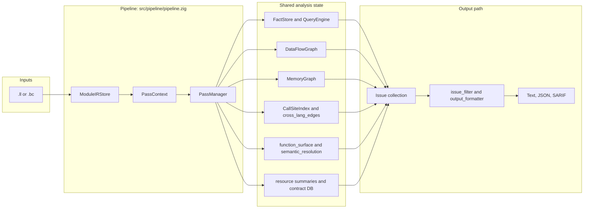
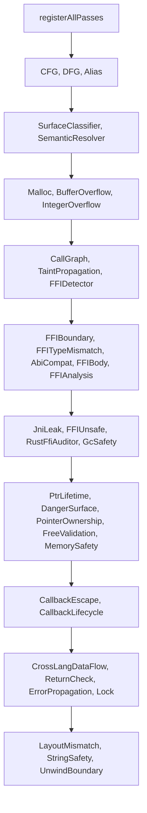
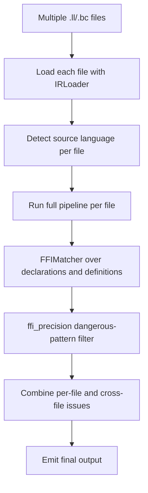

# OmniScope Architecture

This document describes the current repository shape. It cites code paths because several older docs and roadmap notes are stale relative to the working tree.

## Start With The Design Question

OmniScope has to answer three practical questions before it can report a finding:

| Question | Architecture answer | Main code paths |
| --- | --- | --- |
| What IR are we analyzing? | Load `.ll` or `.bc` into one LLVM module owner, then expose borrowed views. | `src/engine/loader.zig`, `src/ir/llvm_safe.zig`, `src/ir/view.zig` |
| Is this single-language or cross-language work? | Detect module language first, then choose safety-only or full FFI analysis. | `src/pipeline_runner.zig`, `src/semantics/language_detector.zig`, `src/pipeline.zig` |
| Is a candidate issue actionable? | Passes write shared facts/graphs/issues; `PassContext.addIssue()` applies suppression, surface classification, deduplication, and severity adjustment before output. | `src/types/pass_types.zig`, `src/pass/pass_context_impl.zig`, `src/output_formatter.zig` |

## Top-Level Flow

The first branch is deliberate. `src/pipeline_runner.zig` checks whether the module is confidently one language and then looks for mixed-language hints such as Rust/C++ mangling, Go cgo names, JNI names, Python C API names, Zig allocator/runtime names, and C#/.NET-style symbols. If no mixed hint is found, it runs the smaller safety-only pipeline. Otherwise it runs the full registered pass set.

## Pipeline Data Flow

Important implementation details:

- `src/pipeline/pipeline.zig` creates `FactStore`, `QueryEngine`, `DataFlowGraph`, `PassManager`, `InstCache`, and the resource-contract helpers.
- `ModuleIRStore.collect()` is called before pass execution so later code can iterate pre-collected functions and instructions.
- `PassContext` in `src/types/pass_types.zig` carries the module, fact store, data-flow graph, memory graph, call-site index, cross-language edges, surface-classifier cache, language overrides, resource summaries, and contract database.
- `PassManager` in `src/pass/manager.zig` topologically sorts pass dependencies, runs passes, logs per-pass timing, continues after individual pass failures, and supports early exit through `ctx.early_exit`.
- `PassContext.addIssue()` in `src/pass/pass_context_impl.zig` is the main issue gate in this tree: it suppresses known-safe patterns, classifies function surface, applies risk/noise filters, deduplicates, and stores final issues in the data-flow graph.

## Pass Registration

The full pass list is centralized in `src/pipeline_registration.zig`. Do not infer registered behavior only from individual files existing under `src/pass/analysis/`; a detector file can exist without being part of the full pipeline.

Safety-only mode is smaller. `src/pipeline.zig` registers `CallGraphPass`, `MallocCheckPass`, `BufferOverflowPass`, `IntegerOverflowPass`, `PtrLifetimePass`, `DangerSurfacePass`, `MemorySafetyPass`, `FreeValidationPass`, and `CallbackEscapePass` for confidently single-language modules.

## Shared Classifiers And Gates

OmniScope relies on several layers before a finding reaches the user:

| Layer | Purpose | Code paths |
| --- | --- | --- |
| Language detection | Pick the module language and adapter path. | `src/semantics/language_detector.zig`, `src/lang/adapter_registry.zig`, `src/lang/*_adapter.zig` |
| Surface classification | Distinguish boundary/user/runtime/internal functions. | `src/pass/analysis/surface_classifier_pass.zig`, `src/semantics/surface_classifier/` |
| Semantic resolution | Record language/runtime explanations for values and functions. | `src/pass/analysis/semantic_resolver_pass.zig`, `src/semantics/resolution_engine.zig`, `src/semantics/semantic_tree.zig`, `src/semantics/patterns/` |
| Memory/resource modeling | Track allocation, free, ownership, borrowing, transfer, and contracts. | `src/semantics/memory_graph.zig`, `src/semantics/resource/`, `src/resource/ffi_contract_db.zig` |
| Issue filtering | Suppress duplicates/noise and apply surface/severity rules. | `src/pass/pass_context_impl.zig`, `src/issue_filter.zig`, `src/pass/analysis/noise/`, `src/filter/` |

This means a raw detector match is not automatically a report. A finding can be downgraded, suppressed, deduplicated, or surface-classified before it appears in text, JSON, or SARIF output.

## Multi-File Mode

When the CLI receives two or more input files, `src/main.zig` calls `runMultiFileAnalysis()` in `src/pipeline.zig`.

The cross-file matcher uses `src/ffi/ffi_matcher.zig` through the `OmniScope.cross_lang.FFIMatcher` export in `src/root.zig`. Additional filtering is applied through `src/ffi_precision.zig` before the extra cross-file issues are combined with per-file pipeline findings.

## Output Contract

The user-facing issue schema is defined by `src/diag/issue.zig` and `src/common/types.zig`. Output formatting is in `src/output_formatter.zig`.

Current output formats:

| Format | How to request it | Notes |
| --- | --- | --- |
| Text | default | Human-readable summary, findings, confidence, surfaces, trace snippets, and FFI context when available. |
| JSON | `--json` | Includes version, function count, issue count, analysis time, issue kind/severity/confidence/location/reason/message, and optional FFI boundary. |
| SARIF | `--sarif` | Generated through `src/output/sarif.zig`; suitable for code-scanning ingestion. |

Version label: `VERSION`, `build.zig.zon`, CLI `--version`, JSON output, and SARIF output currently use `0.2.0`.
