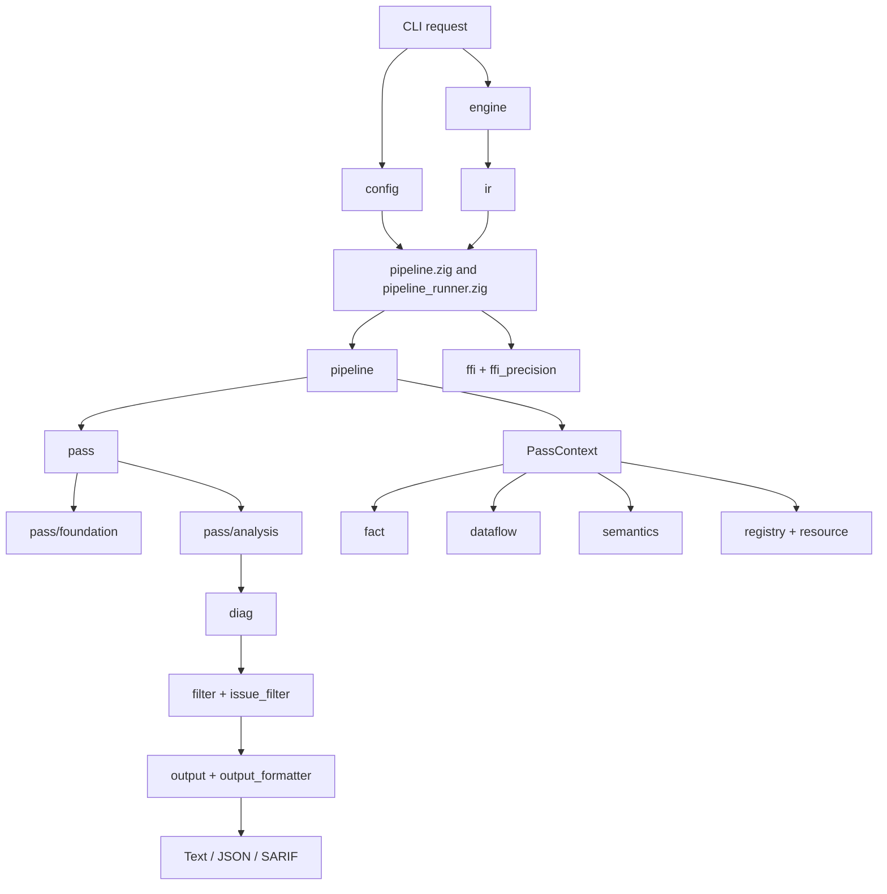
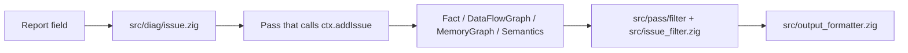
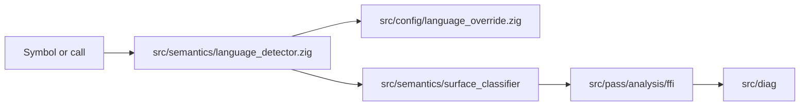
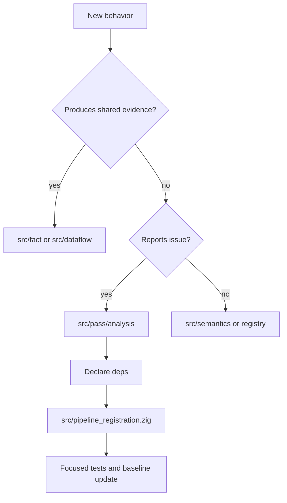

# Module Guide By Problem

This page explains OmniScope's modules by the problems they solve. "Module" means a top-level Zig directory, a public export in `src/root.zig`, or an important top-level file. OmniScope is not a Rust workspace.

Use this document when you know the question but do not yet know the file. Each section gives the problem, the local design, the main files, and how the module cooperates with the rest of the analyzer.

## System Map

The flow is intentionally centered on `PassContext`. A pass should usually read IR, facts, graphs, semantic state, and resource summaries from that context instead of creating a parallel private model.

## Release Status Context

The repository version label is `0.2.0`, but the current worktree should be treated as a release candidate. `zig build` passes, while `zig build test` currently fails, and `tests/BASELINE.md` still describes a pre-fix baseline. Do not use this module document to imply final release readiness.

## Entry And Configuration

### Problem

Users start with command-line flags and one or more IR files. The analyzer needs to turn that into a configured analysis run without making every downstream module parse CLI state.

### How It Solves It

`src/main.zig` owns the CLI entry. It parses arguments through `src/config/main_config.zig`, initializes logging and configuration, then dispatches to single-file or multi-file analysis.

Language override flags are parsed in config and later injected into the pipeline. This keeps project-specific symbol knowledge out of low-level language detectors.

### Main Files

| File or directory | Role |
| --- | --- |
| `src/main.zig` | Program entry, help/version handling, input dispatch. |
| `src/config/main_config.zig` | CLI flags, output mode, severity thresholds, language overrides. |
| `src/config/file_config.zig` | File-based configuration. |
| `src/config/language_override.zig` | Exact/prefix/suffix/source/default language overrides. |
| `src/pipeline_runner.zig` | Single-file runner and language-profile routing. |

### Cooperates With

`engine/` for loading files, `pipeline.zig` for running analysis, `output_formatter.zig` for reports, and `semantics/language_detector.zig` when overrides affect classification.

### Read This When

You are adding a CLI flag, changing default filters, wiring a config file option, or debugging why a file went through safety-only instead of the full FFI pipeline.

## IR Loading And Views

### Problem

LLVM values are C pointers with strict ownership rules. If every pass owns or frees LLVM objects independently, the analyzer becomes fragile.

### How It Solves It

`engine/loader.zig` is the owner of LLVM loading and teardown. `ir/` exposes raw bindings, safer wrappers, borrowed view types, debug info helpers, instruction caching, mangling helpers, and pre-collected module stores.

Passes are expected to inspect borrowed views and cached module structure, not manage LLVM lifetime.

### Main Files

| File or directory | Role |
| --- | --- |
| `src/engine/loader.zig` | Loads `.ll` / `.bc`, owns LLVM context/module lifecycle. |
| `src/ir/llvm_raw.zig` | Direct LLVM-C bindings. |
| `src/ir/llvm_safe.zig` | Safer wrapper around LLVM loading and parsing. |
| `src/ir/view.zig` | Borrowed `ModuleRef`, `FunctionRef`, value/block views. |
| `src/ir/ir_store.zig` | Pre-collected module functions, instructions, and call records. |
| `src/ir/inst_cache.zig` | Instruction-level cache for repeated pass queries. |
| `src/ir/debug_info.zig` and `src/ir/location.zig` | Source/debug location support when available. |
| `src/ir/mangling.zig` and `src/ir/ir_helpers.zig` | Symbol names and common IR helpers. |

### Cooperates With

`pipeline/` builds `ModuleIRStore`, `pass/analysis/*` consumes functions/instructions, `semantics/` classifies symbols, and `diag/` uses locations for reports.

### Read This When

An IR file fails to load, a pass needs function/instruction traversal, source locations look wrong, or repeated LLVM scans are making a pass hard to reason about.

## Pipeline And Shared Context

### Problem

Many checks need the same module, facts, data-flow graph, memory graph, language profile, resource summaries, and output issue list. Rebuilding those per pass would make results inconsistent.

### How It Solves It

Top-level `src/pipeline.zig` provides public orchestration functions. `src/pipeline/pipeline.zig` creates the core `Pipeline`, shared stores, `PassManager`, `PassContext`, and result collection.

The full pass list is centralized in `src/pipeline_registration.zig`; safety-only mode has its own smaller registration path in `src/pipeline.zig`.

### Main Files

| File or directory | Role |
| --- | --- |
| `src/pipeline.zig` | `runModulePipeline`, `runSafetyOnlyPipeline`, `runMultiFileAnalysis`. |
| `src/pipeline/pipeline.zig` | Core pipeline state and `PassContext` construction. |
| `src/pipeline/traversal_index.zig` | Shared call traversal/index records. |
| `src/pipeline/parallel.zig` | Parallel helpers where used. |
| `src/pipeline_registration.zig` | Full pipeline pass registration. |
| `src/types/pass_types.zig` and `src/types/pass_defs.zig` | Shared pass/context types. |

### Cooperates With

`engine/` and `ir/` provide the module; `pass/manager.zig` runs passes; `fact/`, `dataflow/`, `semantics/`, `resource/`, and `diag/` are attached to the context.

### Read This When

You need to know what exists in `PassContext`, why a pass ran, why a pass did not run, or how single-file and multi-file execution differ.

## Pass System

### Problem

Analysis logic is split across many checks. They need ordering, dependencies, diagnostics, and a common interface.

### How It Solves It

Each pass type exposes a `name`, `kind`, `deps`, and `run`. The manager resolves dependencies, then calls each pass with a shared context and diagnostic writer. Pass registration decides whether a file on disk participates in the default pipeline.

### Main Files

| Area | Role |
| --- | --- |
| `src/pass/pass.zig` | Re-exports pass interface and context types. |
| `src/pass/manager.zig` | Dependency resolution, pass execution, optional stats. |
| `src/pass/pass_context_impl.zig` | Context helper behavior, including issue insertion/filtering path. |
| `src/pass/foundation/cfg.zig`, `src/pass/foundation/dfg.zig` | Foundation graph passes. |
| `src/pass/analysis/` | Most analysis checks. |
| `src/pass/filter/` | Pass-side issue gate, precision guard, whitelist. |
| `src/pass/instrumentation/planner.zig` | Instrumentation planning. |

### Analysis Areas

| Area | Problem handled |
| --- | --- |
| `call_graph.zig`, `taint/`, `alias.zig` | Call relationships, pointer/data flow, alias evidence. |
| `ffi/` | FFI boundaries, type/layout/string/unwind checks, GC safety, error propagation. |
| `issue/` | Issue-oriented checks such as return check, malloc check, memory safety, free validation. |
| `ptr_lifetime/` | Pointer lifetime, allocation source, escape, return, and free tracking. |
| `rust_ffi/` | Rust-specific FFI rules and auditor helpers. |
| `resource/` | Resource contract graph, candidates, verifier, and path analysis. |
| `noise/` | False-positive suppression and severity/noise rules. |
| `surface_classifier_pass.zig`, `semantic_resolver_pass.zig` | Context-producing passes used by later checks. |

### Cooperates With

Almost everything: `ir/` for traversal, `fact/` and `dataflow/` for evidence, `semantics/` for meaning, `registry/` and `resource/` for known contracts, `diag/` for issue creation.

### Read This When

You are adding a check, changing dependencies, debugging duplicated reports, or tracing how a raw candidate becomes an issue.

## Facts And Data Flow

### Problem

One pass may discover evidence that another pass needs later. That evidence needs structure; otherwise passes become tightly coupled.

### How It Solves It

`fact/` stores typed facts and supports queries. `dataflow/` stores graph nodes, edges, summaries, path conditions, value IDs, and guard information. Together they form the shared evidence layer.

### Main Files

| File or directory | Role |
| --- | --- |
| `src/fact/fact.zig` | Fact vocabulary. |
| `src/fact/store.zig` | Fact storage. |
| `src/fact/query.zig` | Query helpers. |
| `src/dataflow/graph.zig` | Main data-flow graph and issue collection path. |
| `src/dataflow/node.zig`, `src/dataflow/edge.zig` | Graph entities. |
| `src/dataflow/value_id_map.zig` | LLVM value to internal ID mapping. |
| `src/dataflow/function_summary.zig`, `summary_propagation.zig` | Summary propagation. |
| `src/dataflow/path_condition.zig`, `null_check_guard.zig` | Path and guard evidence. |
| `src/dataflow/graph_algorithms.zig` | Reachability and graph utilities. |

### Cooperates With

Foundation passes populate basic structure. Analysis passes read/write facts and graph edges. `diag/` and `output/` consume final issue data.

### Read This When

A check depends on whether a value can reach a sink, whether a null check was present, or whether a later pass is missing evidence from an earlier pass.

## Semantics, Surfaces, And Noise

### Problem

LLVM IR alone does not say whether a function is compiler/runtime glue, user code, an FFI producer, or a boundary. Reporting every name match would create noisy results.

### How It Solves It

`semantics/` provides language detection, zone classification, surface classification, semantic resolution, memory graph modeling, platform/runtime recognition, allocator knowledge, and noise filters.

### Main Files

| Area | Role |
| --- | --- |
| `language_detector.zig`, `language_detector_data.zig` | Module/function language hints. |
| `zone_classifier.zig`, `zone_lang_*.zig`, `zone_llvm_path.zig` | Safe/runtime/FFI/unknown style classification. |
| `surface_classifier.zig`, `surface_classifier/` | Function surface and boundary context. |
| `semantic_tree.zig`, `semantic_patterns.zig`, `resolution_engine.zig` | Semantic evidence and explanations. |
| `patterns/` and `nomicon/` | Specific semantic patterns. |
| `memory_graph*.zig`, `memory_relations.zig` | Allocation/free/escape/call memory model. |
| `allocator_kb.zig`, `output_param_classifier.zig`, `container_inference.zig` | Domain-specific helper knowledge. |
| `noise_filter.zig`, `path_filter.zig`, `behavior_filter.zig`, `intrinsic_filter.zig` | Noise and runtime filtering. |
| `platform_*.zig` | Platform/runtime normalization and profile. |

### Cooperates With

`pass/analysis/*` asks semantics for meaning; `filter/` and `pass/filter/` use semantic context before reporting; `registry/` provides known function semantics.

### Read This When

A finding looks like runtime noise, language detection seems wrong, or a pass needs to know whether a function name has a recognized language/runtime meaning.

## Registries And Resource Contracts

### Problem

Some functions only make sense with external knowledge: `malloc` allocates, `free` releases, `SSL_new` must be paired with an OpenSSL release function, JNI and Python APIs have their own ownership rules.

### How It Solves It

`registry/` stores function-level semantics and hooks. `resource/` stores FFI contract databases and generated contract data. `semantics/resource/` derives summaries and resource ownership state used by passes.

### Main Files

| Area | Role |
| --- | --- |
| `src/registry/semantic_registry.zig` | Main semantic lookup. |
| `src/registry/layer*_reg.zig` | Layered built-in registries. |
| `src/registry/jni_reg.zig`, `python_c_api_reg.zig`, `posix_*_reg.zig` | Domain registries. |
| `src/registry/config_loader.zig` | Dynamic registry config. |
| `src/registry/hooks.zig` | Hook patterns. |
| `src/resource/ffi_contract_db.zig` | Contract database API. |
| `src/resource/ffi_contract_db_data.zig`, `ffi_contract_data.zig` | Contract data. |
| `src/semantics/resource/` | Resource families, summaries, transfer inference, ownership states. |

### Cooperates With

`pass/analysis/resource/`, `free_validation`, `cross_lang_dataflow`, `semantics/memory_graph`, and filtering code.

### Read This When

A known library pair is missing, a contract mismatch looks wrong, or a check needs library/resource semantics rather than only symbol-pattern matching.

## FFI And Language Adapters

### Problem

FFI evidence can appear as calls, declarations, definitions, mangled names, runtime functions, or project-specific naming. Multi-file analysis also needs to match declarations in one module with definitions in another.

### How It Solves It

`pass/analysis/ffi/` contains most single-module FFI checks. `ffi/ffi_matcher.zig` handles cross-file declare/define matching. `lang/` provides adapters currently present for C/C++, Go, and Python behavior.

### Main Files

| Area | Role |
| --- | --- |
| `src/pass/analysis/ffi/ffi_boundary.zig` | Boundary pass. |
| `ffi_detector.zig`, `ffi_call_analyzer.zig`, `ffi_language_classifier.zig` | FFI identification helpers. |
| `ffi_type_mismatch.zig`, `abi_compat_checker.zig`, `layout_mismatch_detector.zig` | Type/layout/ABI checks. |
| `string_safety_ffi.zig`, `unwind_boundary_checker.zig`, `gc_safety_analyzer.zig` | Specific FFI safety checks. |
| `callback_lifecycle_checker.zig`, `cross_lang_dataflow.zig` | Callback and cross-language flow behavior. |
| `error_propagation_tracer.zig`, `ffi_analysis.zig` | Additional analysis passes. |
| `src/ffi/ffi_matcher.zig`, `src/ffi_precision.zig` | Multi-file matching and post-match filtering. |
| `src/lang/` | Language adapter types and C++/Go/Python adapters. |
| `src/lifetime/` | Ownership state and boundary helpers. |

### Cooperates With

`semantics/language_detector.zig`, `config/language_override.zig`, `registry/`, `resource/`, `dataflow/`, and `diag/`.

### Read This When

A boundary was missed, a language was misclassified, a type mismatch appears suspicious, or multi-file FFI results do not match expectation.

## Diagnostics, Filtering, And Output

### Problem

Raw candidates are not useful by themselves. Users need issue kind, severity, confidence, location, traces, FFI context, and machine-readable output.

### How It Solves It

`diag/` defines issues and aggregation. `pass_context_impl.zig`, `pass/filter/`, `filter/`, and `issue_filter.zig` shape the final issue list. `output_formatter.zig` and `output/` produce text, JSON, and SARIF.

### Main Files

| Area | Role |
| --- | --- |
| `src/diag/issue.zig` | Issue model, kind, severity, location, FFI boundary metadata. |
| `src/diag/aggregator.zig` | Aggregation/deduplication support. |
| `src/pass/pass_context_impl.zig` | Issue insertion path and context helpers. |
| `src/pass/filter/issue_gate.zig`, `fp_precision_guard.zig`, `fp_whitelist.zig` | Pass-level filters. |
| `src/filter/` | General classification, pattern registry, customization. |
| `src/issue_filter.zig` | Output-facing issue filtering. |
| `src/output_formatter.zig` | Main CLI/JSON/SARIF formatting path. |
| `src/output/formatter.zig`, `src/output/sarif.zig` | Structured output helpers. |

### Cooperates With

All reporting passes, CLI options, severity thresholds, surface filters, and CI tooling.

### Read This When

An issue exists internally but does not show in output, JSON/SARIF fields look wrong, severity filtering is surprising, or duplicate reports appear.

## Support Modules

| Module | Problem solved | Notes |
| --- | --- | --- |
| `src/common/` | Shared utilities: logging, arenas, string interning, pattern matching, shared types. | Used broadly; avoid adding analysis-specific policy here. |
| `src/types/` | Shared extracted type definitions. | Use when a subsystem has common structs/enums across files. |
| `src/analysis/` | Extra analysis helpers such as escape and RAII detection. | Check call sites before treating it as pipeline entry. |
| `src/detectors/` | Detector helpers. | Supporting role, not the main pass registry. |
| `src/whitelists/` | Whitelisted internal patterns. | Keep entries evidence-based. |
| `src/utils/` | Small helpers. | Prefer local helpers unless shared usage is real. |
| `src/perf/` | Profiling, pass stats, memory pool, benchmark comparison. | Used when checking runtime/memory cost. |
| `src/visual/` | Code-side graph visualization helpers. | Documentation diagrams should remain Mermaid. |
| `src/root.zig` | Public package export surface. | Check this before assuming a module is available through `@import("OmniScope")`. |

## Reading Paths

### Why Did This Report Appear?

Read in this order because output formatting is usually not where the decision was made.

### Why Was This Classified As FFI?

If project symbols are unusual, try configuration overrides before changing the core language detector.

### How To Add A New Check

Register only checks that should run in the default full pipeline.
