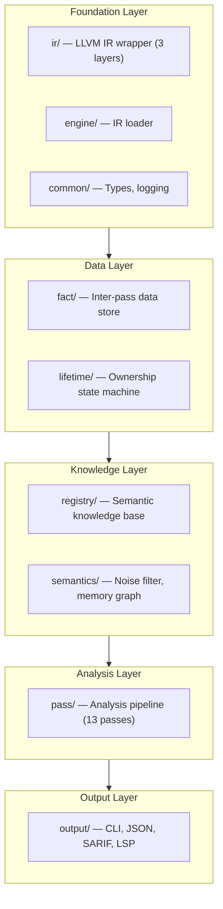

# Module Reference

> "We have 13 directories and 95 files. Somehow it all works. Mostly."

Last updated: 2026-05-29 | Version: v0.2.0

## Architecture Layers

OmniScope is organized in layers. Data flows bottom-up: IR in, issues out.



## Module Index

| Module | Files | What It Does |
|--------|-------|-------------|
| [common/](#common) | types.zig, log.zig | Global type definitions and logging. The "single source of truth" for IssueKind, Severity, ZoneTag. |
| [ir/](#ir) | llvm_raw.zig, llvm_safe.zig, view.zig, location.zig, debug_info.zig | Three-layer LLVM C API wrapper: raw bindings → safe wrapper → thin view. Like Russian nesting dolls, but for pointers. |
| [semantics/](#semantics) | 14 files | The brain. Noise filtering (3 layers), memory graph, call graph, zone classification, language detection, allocator knowledge base. |
| [registry/](#registry) | 12 files | Multi-layer FFI semantic knowledge base (L1-L6). Knows that `system()` is dangerous and `__rust_alloc` is not noise. (We learned that the hard way.) |
| [pass/](#pass) | 30+ files | The pipeline. Foundation (CFG/DFG) → Analysis (13 passes) → Filter (FP guard) → Instrumentation. |
| [fact/](#fact) | store.zig, query.zig, fact.zig | SoA fact store with lazy inverted index. How passes talk to each other without shouting. |
| [lifetime/](#lifetime) | engine.zig, boundary.zig | Language-agnostic resource ownership state machine. Tracks who owns what, and who forgot to free it. |
| [ffi/](#ffi) | ffi_matcher.zig, lib.zig | Matches declare/define pairs across languages. Finds the FFI boundaries. |
| [output/](#output) | formatter.zig, cli.zig, sarif.zig, lsp.zig | Four output formats: CLI (colored), JSON, SARIF (for CI), LSP (for IDE). Pick your poison. |
| [perf/](#perf) | profiler.zig, memory_pool.zig, bench_compare.zig | High-precision timer, fixed-size memory pool, benchmark comparison. Because "it's slow" isn't a useful bug report. |
| [report/](#report) | ci_integration.zig | CI/CD integration for GitHub Actions, GitLab CI, Azure Pipelines, Jenkins. |
| [visual/](#visual) | graph_visualizer.zig | Generates self-contained HTML/SVG files for memory graph and call graph visualization. |
| [engine/](#engine) | loader.zig | LLVM IR loader. Reads .bc files, manages LLVM lifecycle. |

## common/

**Files**: `types.zig`, `log.zig`

The foundation. Every `IssueKind`, `Severity`, `ZoneTag`, and `Tag` is defined here. If you need a type, check here first. If it's not here, maybe it should be.

```zig
pub const Severity = enum { info, warning, error, critical };
pub const ZoneTag = enum { safe, unsafe, ffi, unknown };
```

## ir/

**Files**: `llvm_raw.zig`, `llvm_safe.zig`, `view.zig`, `location.zig`, `debug_info.zig`

Three layers of abstraction:

1. **llvm_raw.zig**: Raw `@cImport` bindings to LLVM-C. Don't use directly.
2. **llvm_safe.zig**: Safe wrapper with error handling and lifetime management. Use this for setup/teardown.
3. **view.zig**: Zero-cost thin pointer wrappers (`ValueRef`, `BasicBlockRef`, `ModuleRef`). Use this everywhere else.

Plus `location.zig` for source locations and `debug_info.zig` for DWARF debug info.

## semantics/

**Files**: 14 files

This is where the magic happens. Organized into sub-systems:

### Noise Filtering (3 layers)
- **noise_filter.zig** (Layer 1): Name-based. Is this `llvm.memcpy`? Skip it.
- **path_filter.zig** (Layer 2): Path-based. Is this from `/usr/include/`? Skip it.
- **behavior_filter.zig** (Layer 3): Behavior-based. Is this Rust drop glue? Skip it.
- **intrinsic_filter.zig**: O(1) prefix matching for LLVM intrinsics.

### Core Analysis
- **memory_graph.zig**: The heart. Tracks pointer identity, aliases, alloc/free pairs, cross-function validation.
- **call_graph.zig**: Inter-procedural call graph with argument mapping.
- **zone_classifier.zig**: Classifies functions as safe/unsafe/ffi/unknown per language rules.
- **language_detector.zig**: Unified language detection (name patterns + module-level sampling).

### Knowledge
- **allocator_kb.zig**: Knows about `sqlite3_malloc`, `OPENSSL_malloc`, `objc_alloc`, etc.
- **output_param_classifier.zig**: Identifies C API output parameters (often misclassified as escapes).
- **memory_relations.zig**: Zero-copy single-pass memory tracking.
- **memory_graph_types.zig**: Type definitions for MemoryGraph.
- **memory_graph_fuzzy.zig**: Fuzzy matching for alloc/free function names.

## registry/

**Files**: 12 files

Multi-layer semantic knowledge base:

- **layer1_reg.zig**: C standard library (system, malloc, free, strcpy, mmap...)
- **layer2_reg.zig**: Rust ownership patterns (into_raw, from_raw, __rust_alloc...)
- **layer3_reg.zig** through **layer6_reg.zig**: JNI, Python C API, POSIX threads, dynamic loading, sanitizers
- **hooks.zig**: Language-specific analysis hooks (Rust ownership state machine, Go escape, Python refcount)
- **types.zig**: Type definitions for FunctionSemantics, RiskKind
- **semantic_registry.zig**: The unified registry. Look up any function, get its semantics.
- **config_loader.zig**: Load custom function semantics from JSON

## pass/

**Files**: 30+ files

See [developer_guide.md](developer_guide.md) for the pass template and coding standards.

### Foundation
- **foundation/cfg.zig**: Control flow graph
- **foundation/dfg.zig**: Data flow graph (depends on CFG)

### Analysis (13 passes)
See the [Pass Reference](passes.md) for details.

### Filter
- **filter/fp_precision_guard.zig**: Won't remove FP filters unless MemoryGraph precision is good enough
- **filter/fp_whitelist.zig**: Known false positive patterns from real-world audits

### Instrumentation
- **instrumentation/planner.zig**: Runtime probe insertion planner

## fact/

**Files**: store.zig, query.zig, fact.zig

- **fact.zig**: `FactKind` enum — the vocabulary passes use to communicate
- **store.zig**: SoA (Structure of Arrays) layout, append-only, thread-safe
- **query.zig**: Lazy inverted index for O(1) single-dimension lookups

## lifetime/

**Files**: engine.zig, boundary.zig

- **engine.zig**: Language-agnostic ownership state machine. Tracks owner, state transitions.
- **boundary.zig**: FFI boundary contract checker. Detects ownership mismatches, borrow escapes, double frees.

## ffi/

**Files**: ffi_matcher.zig, lib.zig

Matches `declare` (in one language) with `define` (in another) by name. This is how we find FFI boundaries.

## output/

**Files**: formatter.zig, cli.zig, sarif.zig, lsp.zig

Four formats, one analysis:

- **cli.zig**: Colored terminal output. What you see when you run `./omniscope file.ll`
- **formatter.zig**: The `OutputFormat` enum and core formatting logic
- **sarif.zig**: SARIF v2.1.0 output for CI/CD integration
- **lsp.zig**: Language Server Protocol diagnostics for IDE integration

## perf/

**Files**: profiler.zig, memory_pool.zig, bench_compare.zig

- **profiler.zig**: `Timer` — start/stop/elapsed. Use it everywhere.
- **memory_pool.zig**: `MemoryPool(T)` — pre-allocated fixed-size pool. Reduces allocation overhead.
- **bench_compare.zig**: Before/after performance comparison.

## report/

**Files**: ci_integration.zig

CI/CD integration for automated security scanning. Supports GitHub Actions, GitLab CI, Azure Pipelines, Jenkins.

## visual/

**Files**: graph_visualizer.zig

Generates self-contained HTML/SVG files. Visualizes memory graph and call graph with FFI boundary highlighting. Open in any browser.

## engine/

**Files**: loader.zig

Loads `.bc` (LLVM bitcode) files. Creates IR View instances. Manages LLVM context lifecycle. The entry point for all analysis.
