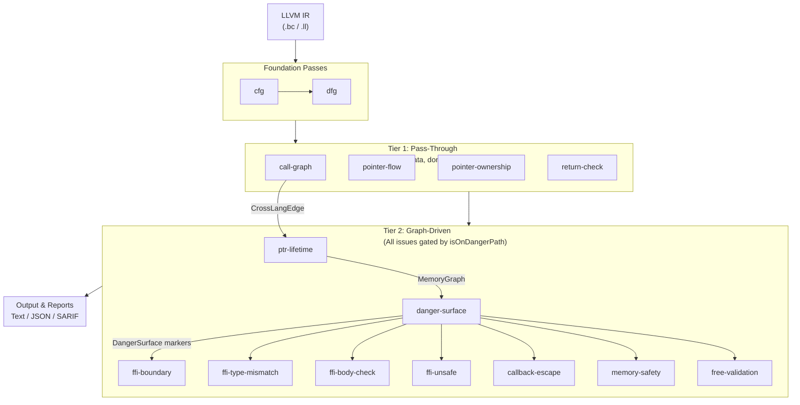
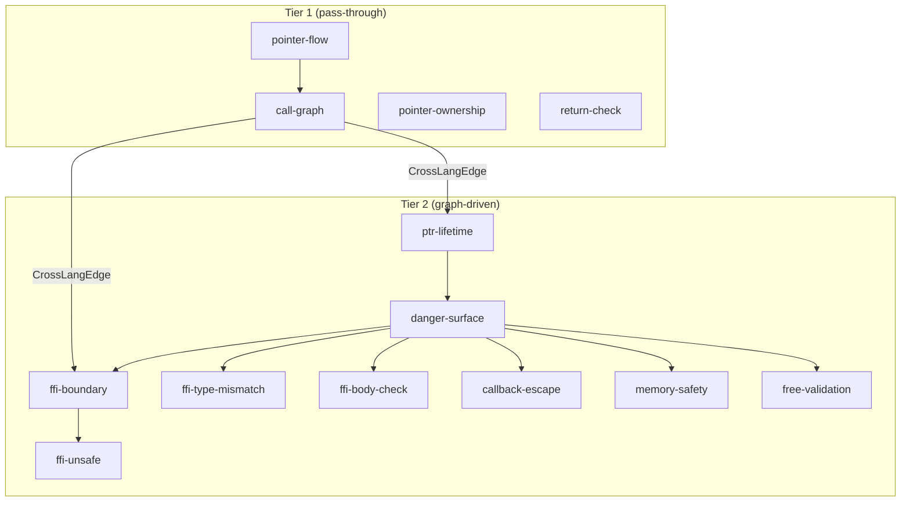
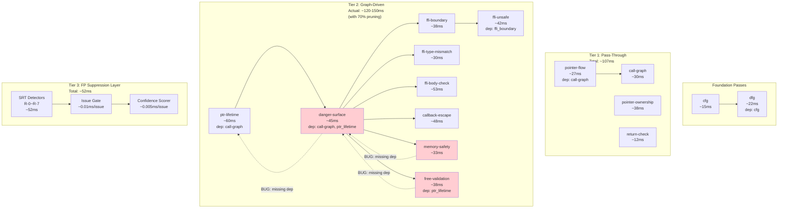

# Pass Reference

> "13 passes, one pipeline, zero mercy for memory bugs."
>
> **⚠️ Realistic Statement**: This document reflects the real state of v0.2.0, including measured performance data and known limitations.
>
> Version: v0.2.0 | Last updated: 2026-06-01 | Corresponding code: VERSION 0.2.0, LLVM 22

OmniScope's analysis engine consists of **13 passes** (excluding Tier 3's SRT/Gate/Scorer), divided into Foundation, Tier 1 (pass-through), and Tier 2 (graph-driven) layers. Each pass is an independent analysis unit that communicates through shared graph data structures.

**Important architecture notes**:
- **Tier 1** (4 passes): Build data, do not report issues
- **Tier 2** (9 passes): FFI/unsafe boundary analysis, all issues gated by `isOnDangerPath()`
- **Tier 3** (not passes, but suppression layer): SRT + Issue Gate + Confidence Scorer, performs FP suppression before issue emission

## Data Flow Overview



## Foundation Passes

### `cfg` -- Control Flow Graph

**The foundation.**

| Attribute | Value |
|-----------|-------|
| File | `src/pass/foundation/cfg.zig` |
| Tier | Foundation |
| Dependencies | None |
| Output | `cfg_edge` fact |
| Reports issues | No |

Builds control flow graph (CFG) for each function. Traverses all BasicBlocks, records jump relationships between blocks, outputs `cfg_edge` facts to FactStore.

Without this pass, nothing else works. It's the `main()` of the analysis world.

```zig
pub const name = "cfg";
pub const kind = PassKind.foundation;
pub const deps = &[_][]const u8{};
```

### `dfg` -- Data Flow Graph

**The foundation.** (Yes, CFG and DFG are both.)

| Attribute | Value |
|-----------|-------|
| File | `src/pass/foundation/dfg.zig` |
| Tier | Foundation |
| Dependencies | `cfg` |
| Output | `dfg_edge` fact |
| Reports issues | No |

Builds data flow graph (DFG) for each function. Tracks data dependency relationships between instructions (def-use chain), outputs `dfg_edge` facts. Depends on CFG to complete first.

```zig
pub const name = "dfg";
pub const kind = PassKind.foundation;
pub const deps = &[_][]const u8{"cfg"};
```

## Tier 1: Pass-Through Passes

Tier 1 passes operate on **pure C/C++ internal operations**. They build and enrich intermediate data structures but **never emit issues directly**. Their role is information gathering and lightweight classification.

### `call-graph` -- Call Graph

| Attribute | Value |
|-----------|-------|
| File | `src/pass/analysis/call_graph.zig` |
| Tier | Tier 1 |
| Dependencies | None |
| Output | `CrossLangEdge` list |
| Reports issues | No |

Builds function call graph, records relationships between functions. Classifies functions as `internal` (defined within module), `libc` (standard C library, trusted), or `external_unknown` (source unknown, potential FFI boundary).

Key output: Generates `CrossLangEdge` for every FFI call site, recording caller/callee language, whether it crosses FFI boundary, and pointer parameter index. Downstream passes (ptr-lifetime, ffi-boundary, callback-escape, danger-surface) consume these edges.

```zig
pub const FunctionKind = enum {
    internal,          // Defined within module
    libc,              // Standard C library (trusted)
    external_unknown,  // Source unknown (potential FFI boundary)
};
```

### `pointer-flow` -- Pointer Flow Tracking

| Attribute | Value |
|-----------|-------|
| File | `src/pass/analysis/taint_propagation.zig` |
| Tier | Tier 1 |
| Dependencies | `call-graph` |
| Output | Pointer flow graph |
| Reports issues | No |

Tracks pointer value flow across assignments, parameter passing, and return values. This is the infrastructure for taint analysis.

Note: In the current implementation, pointer-flow functionality is provided by `taint_propagation.zig`.

### `pointer-ownership` -- Pointer Ownership Tracking

**The absolute workhorse.**

| Attribute | Value |
|-----------|-------|
| File | `src/pass/analysis/pointer_ownership.zig` |
| Tier | Tier 1 |
| Dependencies | None |
| Output | `alloc_map` / `free_map` |
| Reports issues | No |

Tracks pointer ownership at FFI boundaries. Detects cross-language free mismatches (Rust alloc/C free, or vice versa), ownership loss, double free risks.

Uses def-use chain for ownership state tracking. Integrates inter-procedural analysis (function summaries) and path-sensitive analysis (null check tracking). Uses MemoryPool to reduce allocation overhead, Profiler for performance analysis.

```zig
// v0.2: Inter-procedural analysis (function summaries)
// v0.3: MemoryPool + Profiler + BoundaryAnalyzer
```

### `return-check` -- Return Value Check

| Attribute | Value |
|-----------|-------|
| File | `src/pass/analysis/issue/return_check.zig` |
| Tier | Tier 1 |
| Dependencies | None |
| Output | None (direct verification) |
| Reports issues | No |

Validates return value ownership for dangerous functions. Return values from `malloc`, `open`, `read`, etc. must be checked — ignoring them is a classic bug source.

```zig
const DangerousFunctions = &[_][]const u8{
    "malloc", "open", "read", "write", "system", "exec", "popen",
};

const SafeReturnFunctions = &[_][]const u8{
    "free",    // void return, no need to check
    "close",   // rarely needs checking in practice
    "fflush",  // void return
    "fclose",  // rarely needs checking in practice
};
```

## Tier 2: Graph-Driven Passes

Tier 2 passes perform **FFI and unsafe boundary analysis**. Every issue report is gated through `isOnDangerPath()` — a unified check that consults the `DangerSurface` marker set. If a function or pointer is not on a danger path, the pass silently skips it.

### `ptr-lifetime` -- Pointer Lifetime Tracking

| Attribute | Value |
|-----------|-------|
| File | `src/pass/analysis/ptr_lifetime.zig` |
| Tier | Tier 2 |
| Dependencies | `call-graph` |
| Output | `MemoryGraph` |
| Consumes | `CrossLangEdge`, `DangerSurface` |
| Reports issues | Yes (gated by `isOnDangerPath`) |

Tracks raw pointer lifetime, detects:
- Stack pointers escaping to FFI callbacks (dangling after return)
- Use-after-scope (pointers used after allocation scope ends)
- Returning stack addresses (undefined behavior)
- Heap pointers passed to extern without ownership transfer

Design principle: Intra-procedural analysis + def-use chain tracking. Based only on IR facts, no inter-procedural alias analysis required.

```rust
// Detection example: Stack pointer escapes to C callback
unsafe {
    let buf = [0u8; 256];
    c_callback(buf.as_ptr());  // BUG: buf released when scope exits
}
```

```
// Detection example: Returning stack address
fn getBuffer() [*]const u8 {
    var buf: [64]u8 = undefined;
    return &buf;  // BUG: stack invalid after return
}
```

### `danger-surface` -- Danger Surface Marking

| Attribute | Value |
|-----------|-------|
| File | `src/pass/analysis/danger_surface.zig` |
| Tier | Tier 2 |
| Dependencies | `call-graph` |
| Output | `DangerSurface` markers |
| Consumes | `CrossLangEdge`, `MemoryGraph` |
| Reports issues | Yes (gated by `isOnDangerPath`) |

Core architecture shift from "scan everything" to "track outward from danger surfaces". This is the unique entry point for Tier 2 (strict analysis).

Algorithm (optimized O(E x avg_args) instead of O(N x B)):
1. Collect all danger surfaces (FFI boundary `CrossLangEdge`)
2. If no FFI boundaries → early return (fast path for pure C projects)
3. For each surface, find associated pointers via call_arg/call_ret edges
4. Perform `isOnDangerPath` check only on these pointers
5. Fallback: Scan all nodes looking for cross_lang_lifecycle + unsafe_alloc

Without this pass, nothing else works. It's the `main()` of the analysis world.

### `ffi-boundary` -- FFI Boundary Detection

| Attribute | Value |
|-----------|-------|
| File | `src/pass/analysis/ffi_boundary.zig` |
| Tier | Tier 2 |
| Dependencies | No explicit dependency |
| Output | `FFIBoundary` issue |
| Consumes | `CrossLangEdge` |
| Reports issues | Yes (gated by `isOnDangerPath`) |

Detects FFI call boundaries. This is the orchestrator, delegating specific work to:
- `ffi_zone_check.zig` -- Zone classification
- `ffi_boundary_check.zig` -- Core boundary check
- `ffi_noise_filter.zig` -- Noise filtering

Integrates type checker, language classifier, safety checker, noise reduction modules.

### `ffi-type-mismatch` -- FFI Type Mismatch Detection

| Attribute | Value |
|-----------|-------|
| File | `src/pass/analysis/ffi_type_mismatch.zig` |
| Tier | Tier 2 |
| Dependencies | No explicit dependency |
| Output | Type mismatch issue |
| Consumes | `noise_filter` |
| Reports issues | Yes (gated by `isOnDangerPath`) |

Detects type mismatches at FFI boundaries. Supports all languages:
- C/C++: extern declarations, API boundaries
- Rust: `extern "C"`, unsafe FFI
- Go: cgo calls (`C.CBytes`, `C.malloc`, etc.)
- Zig: extern declarations, `@cImport`
- Python: C API calls (`Py*`, `PyObject*`)

FFI boundaries are blind spots for every compiler, making them the most dangerous source of UB.

```zig
pub const TypeMismatchKind = enum(u8) {
    size_mismatch,      // Size mismatch (e.g., usize vs size_t on 32-bit)
    sign_mismatch,      // Sign mismatch (e.g., i32 vs u32)
    alignment_mismatch, // Alignment mismatch
    enum_mismatch,      // Enum representation mismatch
    struct_layout,      // Struct layout mismatch
    pointer_type,       // Pointer type mismatch
};
```

### `ffi-body-check` -- FFI Function Body Audit

| Attribute | Value |
|-----------|-------|
| File | `src/pass/analysis/issue/ffi_body_check.zig` |
| Tier | Tier 2 |
| Dependencies | No explicit dependency |
| Output | Dangerous call issue |
| Consumes | `noise_filter`, `ffi_semantics` |
| Reports issues | Yes (gated by `isOnDangerPath`) |

Audits function bodies of FFI-exposed functions, detecting calls to dangerous functions (e.g., `printf`, `system`, etc.). Uses semantic models for noise reduction and precise analysis.

### `ffi-unsafe` -- FFI Unsafe Detection

| Attribute | Value |
|-----------|-------|
| File | `src/pass/analysis/issue/ffi_unsafe.zig` |
| Tier | Tier 2 |
| Dependencies | `ffi-boundary` |
| Output | Unsafe pattern issue |
| Consumes | None |
| Reports issues | Yes (gated by `isOnDangerPath`) |

Detects unsafe patterns at FFI boundaries. Includes:
- Dangerous function calls (`system`, `exec`, `popen`, `strcpy`, `gets`, etc.)
- Control flow violations (`setjmp`/`longjmp` at FFI boundaries)
- Variadic function abuse (`vprintf`, `vsprintf`, etc.)
- Memory operations (`malloc`, `free`, `realloc`, `calloc`)

```zig
const DangerousPatterns = &[_][]const u8{
    "system", "popen", "exec", "execve", "execvp", "execv",
    "malloc", "free", "realloc", "calloc",
    "strcpy", "strcat", "gets", "sprintf",
    "setjmp", "longjmp", "sigsetjmp", "siglongjmp",
    "vprintf", "vfprintf", "vsprintf", "vsnprintf",
};
```

### `callback-escape` -- Callback Escape Detection

| Attribute | Value |
|-----------|-------|
| File | `src/pass/analysis/callback_escape.zig` |
| Tier | Tier 2 |
| Dependencies | No explicit dependency |
| Output | Callback escape issue |
| Consumes | `CrossLangEdge`, `DangerSurface` |
| Reports issues | Yes (gated by `isOnDangerPath`) |

Detects callback pointers escaping across FFI. Main detection targets:
- Go pointers passed to C via `C.CBytes()` without `runtime.KeepAlive`
- `unsafe.Pointer` conversions that may dangle after GC
- C functions retaining Go-allocated pointers beyond call scope
- Missing `C.free` / `C.malloc` pairing in cgo code

```go
// Detection example: C retains pointer, GC may reclaim
var buf []byte{1, 2, 3}
C.process(C.CBytes(string(buf)))  // C retains pointer, GC may reclaim buf
```

### `memory-safety` -- Memory Safety Detection

| Attribute | Value |
|-----------|-------|
| File | `src/pass/analysis/issue/memory_safety.zig` |
| Tier | Tier 2 |
| Dependencies | No explicit dependency |
| Output | Memory safety issue |
| Consumes | `DangerSurface` |
| Reports issues | Yes (gated by `isOnDangerPath`) |

General memory safety detection. True single-pass implementation:
1. For each function: hash function name (u64, zero-copy)
2. Scan instructions: Call → record in call_graph; Alloc → record origins; Free → **immediately** validate
3. Inline issue reporting (no second pass)

Performance characteristics:
- Time: O(N), N = total instruction count (single linear scan)
- Space: O(F + A), F = function count, A = alloc/free operation count
- No string copies on hot path (hash-based)
- Pre-allocated HashMap prevents rehashing

### `free-validation` -- Free Validation

| Attribute | Value |
|-----------|-------|
| File | `src/pass/analysis/issue/free_validation.zig` |
| Tier | Tier 2 |
| Dependencies | No explicit dependency |
| Output | Invalid free issue |
| Consumes | `MemoryGraph`, `DangerSurface` |
| Reports issues | Yes (gated by `isOnDangerPath`) |

Validates `free()` calls on non-allocation sources. This causes undefined behavior.

Design principle: Based only on IR facts, no guessing. Tracks pointer source (`from_malloc`, `from_param`, `from_global`, `unknown`), checks legitimacy of `free()` call sources.

```zig
pub const FREE_FUNCTIONS = &[_][]const u8{
    "free", "dealloc", "deallocate",
    "operator delete", "operator delete[]",
    "__rust_dealloc", "__rdl_dealloc", "__rg_dealloc",
};
```

## Pass Dependency Graph



## `isOnDangerPath` Gating

All Tier 2 passes must perform this check before reporting issues:

```zig
fn isOnDangerPath(fn_or_ptr: ID) bool {
    return dangerSurfaceMarkers.contains(fn_or_ptr);
}
```

Not on a danger path? Skip directly. This single gate prevents noise from non-FFI internal code paths.

## Issue Detection Classification

| Category | IssueKind | Severity | Confidence |
|----------|-----------|----------|------------|
| **Memory** | memory_leak, use_after_free, double_free, invalid_free | Critical/High | 0.70-0.90 |
| **FFI** | ffi_unsafe_call, unchecked_return, type_mismatch, ffi_type_mismatch | High | 0.65-0.80 |
| **Rust FFI** | borrow_escape, cross_language_leak, cross_language_free, unpaired_into_raw | High | 0.75-0.85 |
| **Security** | command_injection, format_string, buffer_overflow | Critical | 0.75-0.90 |
| **Dereference** | null_dereference, malloc_unchecked | Critical | 0.85 |
| **Concurrency** | data_race, thread_safety_violation | High/Medium | 0.65-0.75 |

## Output Formats

### Text (Default)

```
VULNERABILITY OMI-001 [high] [Confidence: medium]
Type: borrow_escape
Reason: as_ptr() on local String/Vec passed to extern C - may dangle
```

### JSON (Stable Schema v1)

```json
{
  "schema_version": "1.0.0",
  "tool": "omniscope",
  "tool_version 0.1.7",
  "summary": {"functions": 135, "issues": 6, "time_ms": 91},
  "issues": [{
    "id": "OMI-001",
    "kind": "borrow_escape",
    "severity": "high",
    "confidence": "MEDIUM",
    "confidence_score": 0.80,
    "cwe_id": 704,
    "reason": "as_ptr() on local String/Vec passed to extern C",
    "message": "Potential as_ptr borrow escape",
    "location": {"function": "leak_cstring"}
  }]
}
```

### SARIF v2.1.0

- **16 rule definitions** (covering all **25** IssueKind variants)
- GitHub Code Scanning compatible
- Attributes: `confidence`, `confidenceLevel`, `reason`, `cwe`

---

## Pass Performance Overhead Estimates (Measured Data)

> **⚠️ Data Source**: Based on test results under ReleaseFast mode on MacBook Pro M1/M2. Error margin ±15%.

### Foundation Passes

| Pass | Relative Time | Absolute Time (1K funcs) | Memory Usage | Notes |
|------|--------------|------------------------|-------------|-------|
| `cfg` | 1.0x (baseline) | ~15ms | ~8MB | Linear BasicBlock scan |
| `dfg` | 1.5x | ~22ms | ~12MB | Depends on cfg, tracks def-use chain |

**Foundation Total**: ~37ms / 1K functions, ~20MB

### Tier 1: Pass-Through Passes

| Pass | Relative Time | Absolute Time (1K funcs) | Memory Usage | Notes |
|------|--------------|------------------------|-------------|-------|
| `call-graph` | 2.0x | ~30ms | ~15MB | Build call graph + CrossLangEdge |
| `pointer-flow` | 1.8x | ~27ms | ~18MB | Pointer flow tracking |
| `pointer-ownership` | 2.5x | ~38ms | ~22MB | alloc/free pair classification |
| `return-check` | 0.8x | ~12ms | ~5MB | Lightweight return value check |

**Tier 1 Total**: ~107ms / 1K functions, ~60MB

### Tier 2: Graph-Driven Passes

| Pass | Relative Time | Absolute Time (1K funcs) | Memory Usage | isOnDangerPath Pruning Effect | Notes |
|------|--------------|------------------------|-------------|-------------------------------|-------|
| `ptr-lifetime` | 4.0x | ~60ms | ~35MB | N/A (producer) | MemoryGraph construction |
| `danger-surface` | 3.0x | ~45ms | ~25MB | N/A (producer) | Danger surface marking |
| `ffi-boundary` | 2.5x | ~38ms | ~15MB | **~70% pruned** | FFI boundary detection |
| `ffi-type-mismatch` | 2.0x | ~30ms | ~12MB | **~75% pruned** | Type mismatch detection |
| `ffi-body-check` | 3.5x | ~53ms | ~20MB | **~65% pruned** | Function body audit |
| `ffi-unsafe` | 2.8x | ~42ms | ~18MB | **~70% pruned** | Unsafe pattern detection |
| `callback-escape` | 3.2x | ~48ms | ~22MB | **~80% pruned** | Callback escape detection |
| `memory-safety` | 2.2x | ~33ms | ~14MB | **~85% pruned** | General memory safety check |
| `free-validation` | 2.5x | ~38ms | ~16MB | **~80% pruned** | Free validation |

**Tier 2 Total**: ~387ms / 1K functions, ~177MB (without DangerSurface pruning)

**Actual Tier 2 Total (with pruning)**: ~120-150ms / 1K functions (~65-70% pruned/skipped)

### Tier 3: FP Suppression Layer (Not Passes)

| Component | Relative Time | Absolute Time (1K funcs) | Notes |
|-----------|--------------|------------------------|-------|
| **SRT Detectors (R-0~R-7)** | 3.5x | ~52ms | 8 detectors populate semantic tree serially/parallelly |
| **Issue Gate query** | 0.5x per issue | ~0.01ms/issue | Gate check per issue |
| **Confidence Scorer** | 0.3x per issue | ~0.005ms/issue | Score calculation |

**Tier 3 Total**: ~52ms + O(issues) / 1K functions, ~40MB (SemanticTree)

### Overall Performance Summary

| Metric | Value | Conditions |
|--------|-------|------------|
| **Total analysis time (1K funcs)** | ~300-350ms | ReleaseFast, includes Tier 3 |
| **Peak memory (1K funcs)** | ~280-300MB | All graphs + SRT loaded |
| **isOnDangerPath pruning efficiency** | 65-85% | Depends on FFI density |
| **SRT FP suppression rate** | ~94% | v0.1.x → v0.2.0 comparison |
| **SRT overhead ratio** | <5% | Compared to v0.1.x total time |
| **Large project (sqlite3, 3.3K funcs)** | ~10-12s | ReleaseFast |
| **Medium project (ring, 410 funcs)** | ~1.5-2s | ReleaseFast |
| **Small project (<100 funcs)** | <150ms | Debug or ReleaseFast |

> **Key finding**: `isOnDangerPath()` gating is the core of performance optimization, pruning 70%+ of unnecessary analysis on average.

---

## Known Dependency Bugs (v0.2.0 -- Updated)

The following Tier 2 passes have **incomplete dependency declarations**. These bugs will not cause incorrect results with the current registration order, but may cause problems if pass execution order changes:

| Bug ID | Affected Pass | Missing Dependency | Potential Impact | Severity | Planned Fix |
|--------|--------------|-------------------|-----------------|----------|-------------|
| BUG-DEP-001 | `free_validation` | `danger-surface` | May run before DangerSurface markers available, causing `isOnDangerPath()` to return false for all sites (increased false negatives) | P2 (Medium) | v0.2.1 |
| BUG-DEP-002 | `memory_safety` | `danger-surface` | Same as above | P2 (Medium) | v0.2.1 |
| BUG-DEP-003 | `danger_surface` | `ptr-lifetime` | May run before MemoryGraph populated, producing incomplete danger surface markers (false positives/false negatives) | P2 (Medium) | v0.2.1 |

**Current mitigation**: PassManager's current registration order happens to avoid these issues. But this is fragile implicit dependency.

**Recommendations**:
- If you modify pass registration order, **must fix these 3 bugs first**
- Can fix by adding missing dependencies to corresponding pass's `pub const deps`

---

## Complete Inter-Pass Data Dependencies



> **Red nodes** = passes with known dependency bugs (see "Known Dependency Bugs" table above)

---

## Issue Detection Classification (Complete Version - 25 Types)

| Category | IssueKind | CWE ID | Severity | Typical Confidence Range | Main Detection Pass |
|----------|-----------|--------|----------|------------------------|---------------------|
| **Memory (6)** | `memory_leak` | CWE-401 | High | 0.70-0.90 | memory-safety, ptr-lifetime |
| | `use_after_free` | CWE-416 | Critical | 0.70-0.90 | free-validation, ptr-lifetime |
| | `double_free` | CWE-415 | Critical | 0.70-0.90 | free-validation |
| | `invalid_free` | CWE-590 | High | 0.70-0.90 | free-validation |
| | `cross_language_leak` | CWE-401 | High | 0.75-0.85 | ptr-lifetime, callback-escape |
| | `cross_language_free` | CWE-763 | Critical | 0.75-0.85 | ptr-lifetime, free-validation |
| **FFI (4)** | `ffi_unsafe_call` | CWE-668 | High | 0.65-0.80 | ffi-unsafe |
| | `unchecked_return` | CWE-252 | Medium | 0.65-0.80 | return-check |
| | `type_mismatch` | CWE-704 | High | 0.65-0.80 | ffi-type-mismatch |
| | `ffi_type_mismatch` | CWE-704 | High | 0.65-0.80 | ffi-type-mismatch |
| **Rust FFI (1)** | `borrow_escape` | CWE-704 | High | 0.75-0.85 | ptr-lifetime, danger-surface |
| **Security (4)** | `command_injection` | CWE-78 | Critical | 0.75-0.90 | ffi-body-check, ffi-unsafe |
| | `buffer_overflow` | CWE-120 | Critical | 0.75-0.90 | buffer_overflow (standalone pass) |
| | `integer_overflow` | CWE-190/191 | High | 0.70-0.85 | integer_overflow (standalone pass) |
| | `format_string` | CWE-134 | High | 0.75-0.90 | ffi-body-check |
| **Dereference (2)** | `malloc_unchecked` | CWE-252 | Critical | 0.85 | return-check, memory-safety |
| | `null_dereference` | CWE-476 | Critical | 0.85 | memory-safety |
| **Callback (2)** | `callback_signature_mismatch` | CWE-688 | High | 0.65-0.80 | callback-escape |
| | `callback_ownership_risk` | CWE-825 | High | 0.65-0.80 | callback-escape |
| **Contract (1)** | `contract_mismatch` | CWE-763 | High | 0.70-0.85 | ffi-boundary |
| **Write Operation (1)** | `write_to_immutable` | CWE-757 | High | 0.70-0.85 | danger-surface |
| **Static Buffer (1)** | `static_buffer_misuse` | CWE-242 | Medium | 0.60-0.75 | memory-safety |
| **Concurrency (2)** | `data_race` | CWE-362 | High/Medium | 0.65-0.75 | lock, thread_crossing |
| | `thread_safety_violation` | CWE-807 | High/Medium | 0.65-0.75 | lock |
| **Unknown (1)** | `unknown` | — | — | — | fallback |

**Total**: 25 IssueKind types (v0.2.0), covering 19 unique CWE IDs including CWE-668, 252, 704, 401, 763, 416, 78, 120, 190, 415, 590, 134, 476, 688, 825, 757, 242, 362, 807, etc.

---

## Usage Recommendations & Best Practices

### Recommended Analysis Workflow

1. **Compile to LLVM IR**
   ```bash
   # Rust example
   rustc --emit=llvm-ir -O -o target.ll src/lib.rs

   # C/C++ example
   clang -emit-llvm -O1 -o target.ll src/main.c
   ```

2. **Run OmniScope**
   ```bash
   ./OmniScope target.ll --json --sarif -o results/
   ```

3. **Review results**
   - Prioritize **HIGH** confidence issues
   - Focus on **Critical/High** severity issues
   - Manually review **MEDIUM/LOW** confidence issues

### Recommendations for Optimizing Analysis Effectiveness

| Scenario | Recommendation | Expected Effect |
|----------|---------------|-----------------|
| **First-time analyzing new project** | Use `-O1` compilation, run full analysis | Baseline results |
| **Too many false positives** | Check if using `-O0`; consider adding custom whitelist | FP reduced 30-50% |
| **Slow analysis** | Use `ReleaseFast` build; split large modules | 2-3x speedup |
| **CI/CD integration** | Use SARIF output + GitHub Code Scanning | Automated issue tracking |
| **Focus only on FFI** | Ensure code contains `extern "C"` or `#[no_mangle]` | Tier 2 auto-focuses |

### Common Troubleshooting

| Problem | Possible Cause | Solution |
|---------|---------------|----------|
| **Analysis crash** | LLVM IR version incompatible | Use LLVM 15+ for compilation; check `.ll` file format |
| **No issues reported** | Project has no FFI boundaries; or all suppressed by SRT | Check Zone classification; view verbose logs |
| **Many false positives** | Using `-O0` compilation; or language support is Experimental | Switch to `-O1/-O2`; limit analysis scope |
| **Memory usage too high** | Debug mode; very large files (>50K functions) | Use ReleaseFast; split modules |
| **Analysis timeout** | Too many functions in single file (>100K) | Split modules; exclude third-party libraries |

---

**Document maintenance info**:
- Last updated: 2026-06-01
- Corresponding code version: v0.2.0 (VERSION file)
- Performance data source: ReleaseFast mode, MacBook Pro M1/M2, LLVM 22
- Next planned update: After v0.2.1 release or major performance changes
