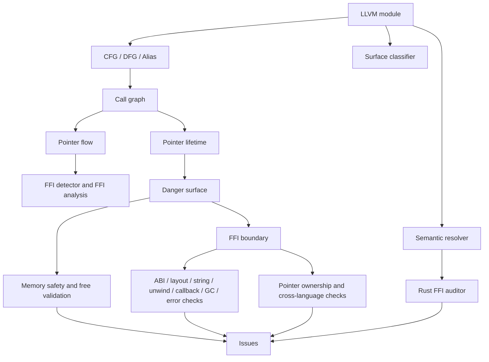
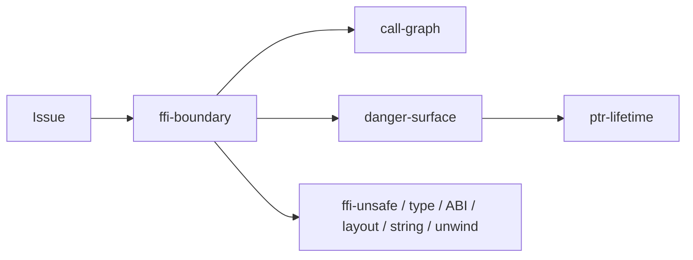
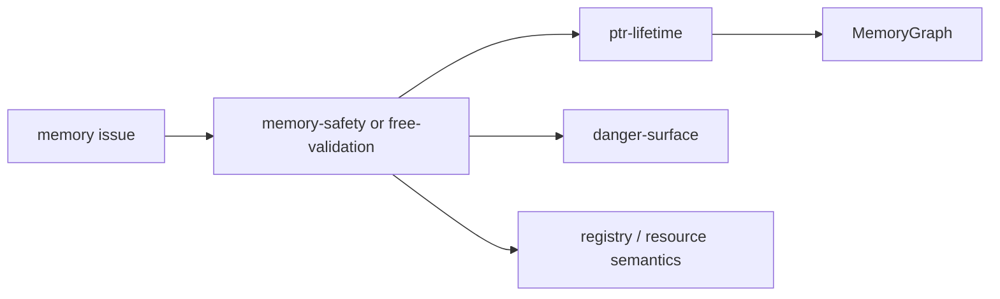
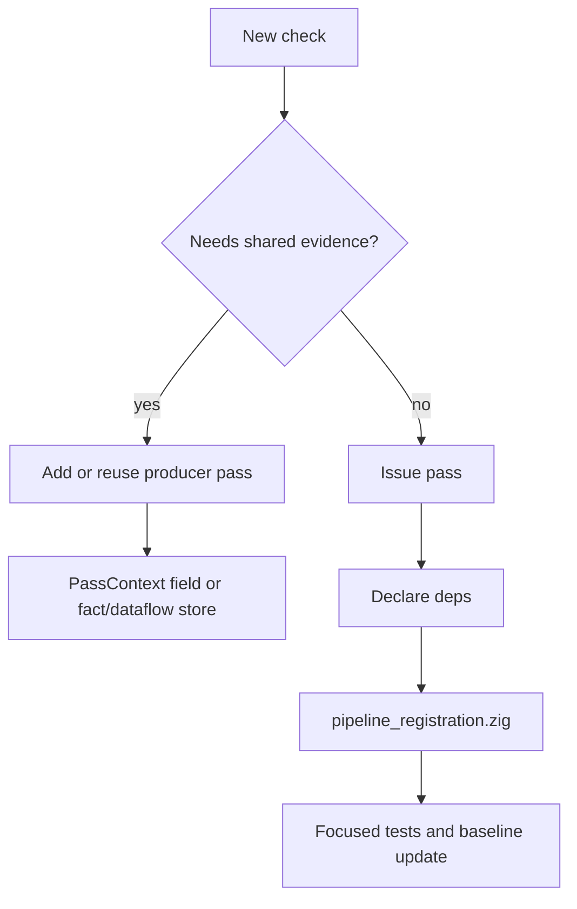

# Pass Guide By Design

This document describes the passes that are registered by `src/pipeline_registration.zig` for the full pipeline in version `0.2.0`. It is written as a code-reading guide, not as an accuracy claim.

Each pass section answers four questions:

- What problem does this pass try to isolate?
- What is the design idea in the current code?
- What does it read or produce through `PassContext`?
- Which other passes does it normally cooperate with?

The safety-only path in `src/pipeline.zig` registers a smaller subset: `call-graph`, `malloc-check`, `buffer-overflow`, `integer-overflow`, `ptr-lifetime`, `danger-surface`, `memory-safety`, `free-validation`, and `callback-escape`.

## Pipeline Shape

The graph is conceptual. Actual execution order is resolved by `src/pass/manager.zig` from each pass's `deps`; when a pass has no dependency, the registration order in `src/pipeline_registration.zig` still matters for the current behavior.

## Shared Contracts

| Contract | Where to look | Why it matters |
| --- | --- | --- |
| Pass metadata | each pass's `name`, `kind`, `deps` | Drives dependency resolution. |
| Context | `src/pass/pass.zig`, `src/types/pass_types.zig`, `src/pass/pass_context_impl.zig` | Shared module, IR store, facts, data-flow graph, memory graph, semantic state, and issue insertion. |
| Registration | `src/pipeline_registration.zig` | Defines the full pipeline pass set. |
| Safety-only registration | `src/pipeline.zig` | Defines the smaller single-language safety path. |
| Issue model | `src/diag/issue.zig` | Normalizes kind, severity, confidence, trace, and location. |

## Foundation And Context Passes

### `cfg`

| Field | Value |
| --- | --- |
| File | `src/pass/foundation/cfg.zig` |
| Kind | `foundation` |
| Dependencies | none |
| Standard issue output | no |

Problem: later checks need basic block relationships without each pass walking terminators differently.

Design: scan functions and basic blocks from the LLVM module and record control-flow edges as facts. The pass is intentionally low-level; it should not decide whether a path is dangerous.

Cooperates with: `dfg` and `alias`, which depend on stable block and instruction structure. Diagnostic passes should use the shared context rather than rebuild CFG state.

### `dfg`

| Field | Value |
| --- | --- |
| File | `src/pass/foundation/dfg.zig` |
| Kind | `foundation` |
| Dependencies | `cfg` |
| Standard issue output | no |

Problem: value dependencies are needed by pointer, taint, and ownership checks, but def-use traversal is easy to duplicate.

Design: traverse instruction operands and emit data-flow facts. PHI handling is kept in this layer so higher passes can reason about values rather than raw operand mechanics.

Cooperates with: `alias`, `ffi-detector`, and `ownership-violation`, which declare `dfg` or consume value-flow evidence.

### `alias`

| Field | Value |
| --- | --- |
| File | `src/pass/analysis/alias.zig` |
| Kind | `analysis` |
| Dependencies | `cfg`, `dfg` |
| Standard issue output | no |

Problem: memory checks often need to know whether two values may refer to the same storage.

Design: build alias evidence from CFG/DFG-level facts and store it in shared structures. It does not try to be a whole-program alias engine; it gives later passes a common local signal.

Cooperates with: `ptr-lifetime`, `memory-safety`, `free-validation`, and instrumentation planning when they need pointer equivalence or conservative uncertainty.

### `surface-classifier`

| Field | Value |
| --- | --- |
| File | `src/pass/analysis/surface_classifier_pass.zig` |
| Kind | `foundation` |
| Dependencies | none |
| Standard issue output | no |

Problem: raw function names do not say whether code is user code, runtime glue, platform code, or a boundary-facing surface.

Design: classify functions using `semantics/surface_classifier*` helpers and attach that context to `PassContext`.

Cooperates with: issue filtering, FFI passes, `ptr-lifetime`, and output decisions that need to separate user-facing evidence from runtime/internal noise.

### `SemanticResolver`

| Field | Value |
| --- | --- |
| File | `src/pass/analysis/semantic_resolver_pass.zig` |
| Kind | `analysis` |
| Dependencies | none |
| Standard issue output | no |

Problem: some symbols need semantic interpretation before a pass can decide whether they are allocators, release functions, runtime glue, or language constructs.

Design: build semantic resolution state from `semantics/` and `registry/` knowledge and place it on the shared context.

Cooperates with: `rust-ffi-filter`, noise filters, memory checks, and resource checks that need meaning beyond string matching.

## General Safety Passes

### `malloc-check`

| Field | Value |
| --- | --- |
| File | `src/pass/analysis/issue/malloc_check.zig` |
| Kind | `analysis` |
| Dependencies | none |
| Standard issue output | yes |

Problem: unchecked allocation results can become null dereferences or error-handling bugs.

Design: scan calls to allocation-like functions and check whether the result is guarded before use. The pass is deliberately simple and should be read with `null_check_guard.zig` and output filtering in mind.

Cooperates with: `memory-safety` and `free-validation`, which may later reason about the same allocation as a lifetime or release event.

### `buffer-overflow`

| Field | Value |
| --- | --- |
| File | `src/pass/analysis/buffer_overflow.zig` |
| Kind | `analysis` |
| Dependencies | none |
| Standard issue output | yes |

Problem: known unsafe copy/format patterns can cross into memory corruption when buffer size evidence is weak or missing.

Design: look for risky buffer operations in IR call sites and report candidates with available context. This pass is pattern-oriented; it does not replace dynamic bounds checking.

Cooperates with: `surface-classifier`, `ffi-boundary`, and issue filters so reports can be narrowed to boundary-relevant code when configured.

### `integer-overflow`

| Field | Value |
| --- | --- |
| File | `src/pass/analysis/issue/integer_overflow.zig` |
| Kind | `analysis` |
| Dependencies | none |
| Standard issue output | yes |

Problem: arithmetic used for sizes, counts, or allocation lengths can overflow before a memory operation.

Design: scan integer operations and related call contexts for overflow-sensitive patterns. The pass reports candidates where the IR suggests risk; it does not prove every arithmetic path.

Cooperates with: `buffer-overflow`, `malloc-check`, and `memory-safety` because size computation often feeds allocation and copy behavior.

### `return-check`

| Field | Value |
| --- | --- |
| File | `src/pass/analysis/issue/return_check.zig` |
| Kind | `analysis` |
| Dependencies | none |
| Standard issue output | yes |

Problem: ignoring return values from APIs such as allocation, I/O, or system calls can hide failed operations.

Design: match known return-sensitive functions and inspect whether the returned value is consumed or checked.

Cooperates with: `ffi-body-check` and `ffi-unsafe`, which may classify the same call as risky for boundary or unsafe API reasons.

### `memory-safety`

| Field | Value |
| --- | --- |
| File | `src/pass/analysis/issue/memory_safety.zig` |
| Kind | `analysis` |
| Dependencies | `danger-surface`, `ptr-lifetime` |
| Standard issue output | yes |

Problem: double free, use-after-free, leak-like behavior, and unsafe release patterns need shared allocation/free state.

Design: read `PassContext` memory state, danger relevance, and function information to report memory-safety candidates. Current behavior should be understood together with the memory graph rather than as a standalone theorem prover.

Cooperates with: `ptr-lifetime` as the producer of lifetime/memory graph evidence, `danger-surface` as relevance gate, and `free-validation` for release-specific checks.

### `free-validation`

| Field | Value |
| --- | --- |
| File | `src/pass/analysis/issue/free_validation.zig` |
| Kind | `analysis` |
| Dependencies | `danger-surface`, `ptr-lifetime` |
| Standard issue output | yes |

Problem: freeing stack, global, foreign-owned, or mismatched-family memory is different from simply seeing a call named `free`.

Design: classify allocation sources and release calls, then validate whether the release family and pointer origin are compatible enough to report.

Cooperates with: `ptr-lifetime`, `pointer-ownership`, `registry/`, `resource/`, and `semantics/resource/` for ownership and allocator-family knowledge.

### `lock`

| Field | Value |
| --- | --- |
| File | `src/pass/analysis/lock.zig` |
| Kind | `analysis` |
| Dependencies | none |
| Standard issue output | yes |

Problem: lock/unlock imbalance and thread-safety violations are often visible as call patterns even when source-level types are gone.

Design: inspect lock-related calls and track local lock state enough to report suspicious patterns.

Cooperates with: `thread_crossing` support code, issue filtering, and surface classification when concurrency reports should be scoped to user or boundary code.

## Call, Flow, And Lifetime Passes

### `call-graph`

| Field | Value |
| --- | --- |
| File | `src/pass/analysis/call_graph.zig` |
| Kind | `foundation` |
| Dependencies | none |
| Standard issue output | no |

Problem: most checks need to know which function calls which symbol and whether that call may cross a boundary.

Design: scan call instructions, classify callee categories, and populate call relationships and cross-language edges in context.

Cooperates with: `pointer-flow`, `ffi-type-mismatch`, `ptr-lifetime`, `danger-surface`, `ffi-boundary`, `callback-escape`, `gc-safety`, and error/callback checks.

### `pointer-flow`

| Field | Value |
| --- | --- |
| File | `src/pass/analysis/taint/taint_propagation.zig` |
| Kind | `foundation` |
| Dependencies | `call-graph` |
| Standard issue output | no |

Problem: FFI and ownership checks need to know how pointer-like values move through arguments, returns, and assignments.

Design: propagate pointer/taint-style state through the shared data-flow graph and call records.

Cooperates with: `ffi-detector`, `ownership-violation`, and `cross-lang-dataflow`, which explicitly depend on pointer-flow evidence.

### `ptr-lifetime`

| Field | Value |
| --- | --- |
| File | `src/pass/analysis/ptr_lifetime/ptr_lifetime.zig` |
| Kind | `analysis` |
| Dependencies | `call-graph` |
| Standard issue output | yes |

Problem: raw pointers can outlive stack storage, escape through callbacks, or be freed through the wrong language/runtime family.

Design: analyze functions from `ir_store`, update the shared memory graph, record allocation/free/escape evidence, and report lifetime violations when evidence is strong enough for the current rules.

Cooperates with: `danger-surface`, `memory-safety`, `free-validation`, `callback-escape`, resource family registries, and semantic filters.

### `danger-surface`

| Field | Value |
| --- | --- |
| File | `src/pass/analysis/danger_surface.zig` |
| Kind | `analysis` |
| Dependencies | `call-graph`, `ptr-lifetime` |
| Standard issue output | no |

Problem: if every internal helper is treated like an FFI boundary, reports become hard to review.

Design: mark functions, pointers, or paths that are close to FFI or other dangerous surfaces. The pass uses call graph and memory graph evidence, then exposes relevance helpers through `PassContext`; it is mainly a relevance producer for later reporting passes.

Cooperates with: `ffi-boundary`, `callback-escape`, `memory-safety`, and `free-validation`, which use danger-surface state before reporting.

### `pointer-ownership`

| Field | Value |
| --- | --- |
| File | `src/pass/analysis/pointer_ownership.zig` |
| Kind | `analysis` |
| Dependencies | `ffi-boundary` |
| Standard issue output | no |

Problem: ownership may be transferred at FFI boundaries, but LLVM IR does not encode that policy directly.

Design: track allocation and release behavior around FFI boundaries and keep ownership evidence available for downstream checks. In the current code this pass does not write standard issues directly.

Cooperates with: `ffi-boundary` as the boundary producer, `ptr-lifetime` and `free-validation` for memory evidence, and registries for allocator/release semantics.

## FFI Boundary Passes

### `ffi-detector`

| Field | Value |
| --- | --- |
| File | `src/pass/analysis/ffi/ffi_detector.zig` |
| Kind | `analysis` |
| Dependencies | `cfg`, `dfg`, `pointer-flow` |
| Standard issue output | no |

Problem: FFI evidence is spread across declarations, calls, signatures, names, and pointer flow.

Design: combine graph and pointer-flow evidence with FFI-specific classifiers to find candidate boundary vulnerabilities. In the current code it records internal vulnerability data and diagnostic logs rather than writing standard issues through `ctx.addIssue`.

Cooperates with: `ffi-boundary`, `ffi-analysis`, `ffi-type-mismatch`, and output filtering. It should be treated as a candidate producer, not the only source of boundary truth.

### `ffi-boundary`

| Field | Value |
| --- | --- |
| File | `src/pass/analysis/ffi/ffi_boundary.zig` |
| Kind | `foundation` |
| Dependencies | `call-graph`, `danger-surface` |
| Standard issue output | yes |

Problem: downstream FFI checks need a shared definition of “this call/function is at a boundary.”

Design: use call graph, danger-surface state, language classification, and FFI helper modules to identify boundary points and attach boundary metadata to issues/context.

Cooperates with: `pointer-ownership`, `ffi-unsafe`, `ffi-body-check`, `abi-compat-checker`, `cross-lang-dataflow`, `callback-lifecycle`, `gc-safety`, `error-propagation-tracer`, and `jni-leak-detector`.

### `ffi-type-mismatch`

| Field | Value |
| --- | --- |
| File | `src/pass/analysis/ffi/ffi_type_mismatch.zig` |
| Kind | `analysis` |
| Dependencies | `call-graph` |
| Standard issue output | yes |

Problem: source languages may disagree about integer width, signedness, pointer type, enum representation, or struct layout.

Design: inspect FFI call/signature evidence and report mismatches visible at the IR level. It is conservative where IR does not preserve source layout intent.

Cooperates with: `call-graph`, `ffi-boundary`, `abi-compat-checker`, and `layout_mismatch`.

### `abi-compat-checker`

| Field | Value |
| --- | --- |
| File | `src/pass/analysis/ffi/abi_compat_checker.zig` |
| Kind | `analysis` |
| Dependencies | `call-graph`, `ffi-boundary` |
| Standard issue output | yes |

Problem: even if a type name looks compatible, ABI details can still make a boundary unsafe.

Design: examine ABI-sensitive signatures and call boundary metadata for compatibility problems.

Cooperates with: `ffi-type-mismatch`, `layout_mismatch`, and `ffi-boundary`; these passes split type, layout, and ABI concerns so a report can point to a narrower cause.

### `ffi-body-check`

| Field | Value |
| --- | --- |
| File | `src/pass/analysis/issue/ffi_body_check.zig` |
| Kind | `analysis` |
| Dependencies | `ffi-boundary` |
| Standard issue output | yes |

Problem: code inside an exported or boundary-facing function may call dangerous APIs even if the boundary signature itself looks ordinary.

Design: inspect function bodies reachable from FFI boundary context and report risky calls or patterns.

Cooperates with: `ffi-boundary`, `ffi-unsafe`, semantic filters, and surface classification.

### `ffi-unsafe`

| Field | Value |
| --- | --- |
| File | `src/pass/analysis/issue/ffi_unsafe.zig` |
| Kind | `analysis` |
| Dependencies | `ffi-boundary` |
| Standard issue output | yes |

Problem: some calls are risky mainly because they happen at or near an FFI boundary.

Design: match known unsafe APIs or control-flow patterns after boundary context exists, then report through the normal issue path.

Cooperates with: `ffi-body-check`, `return-check`, `buffer-overflow`, and issue filters.

### `ownership-violation`

| Field | Value |
| --- | --- |
| File | `src/pass/analysis/ffi/ffi_analysis.zig` |
| Kind | `analysis` |
| Dependencies | `cfg`, `dfg`, `pointer-flow` |
| Standard issue output | no |

Problem: ownership violations can be visible as pointer-flow and allocation/free behavior even before specialized resource-family checks run.

Design: run FFI ownership analysis over CFG/DFG/pointer-flow evidence and collect ownership findings in the pass-local analysis state. Specialized memory and cross-language passes are the normal path for standard issue emission.

Cooperates with: `pointer-flow`, `pointer-ownership`, `ptr-lifetime`, `free-validation`, and `cross-lang-dataflow`.

### `cross-lang-dataflow`

| Field | Value |
| --- | --- |
| File | `src/pass/analysis/ffi/cross_lang_dataflow.zig` |
| Kind | `analysis` |
| Dependencies | `ffi-boundary`, `pointer-flow` |
| Standard issue output | yes |

Problem: a value may be created in one language/runtime and consumed in another after several calls.

Design: combine boundary metadata with pointer-flow edges to find cross-language propagation and ownership-transfer candidates.

Cooperates with: `ffi-boundary`, `pointer-flow`, `ptr-lifetime`, `pointer-ownership`, and resource contract checks.

### `layout_mismatch`

| Field | Value |
| --- | --- |
| File | `src/pass/analysis/ffi/layout_mismatch_detector.zig` |
| Kind | `analysis` |
| Dependencies | none |
| Standard issue output | yes |

Problem: struct layout, padding, alignment, or representation can differ across language boundaries.

Design: inspect layout-relevant IR and known FFI patterns for mismatch candidates. The lack of explicit dependencies means readers should check registration order and helper usage before moving it.

Cooperates with: `ffi-type-mismatch`, `abi-compat-checker`, and `ffi-boundary` conceptually, even though the current metadata does not declare those dependencies.

### `string_safety_ffi`

| Field | Value |
| --- | --- |
| File | `src/pass/analysis/ffi/string_safety_ffi.zig` |
| Kind | `analysis` |
| Dependencies | none |
| Standard issue output | yes |

Problem: strings crossing FFI boundaries may lose length, encoding, termination, or ownership information.

Design: scan string-related FFI call patterns and report suspicious conversions or uses.

Cooperates with: `ffi-boundary`, `ffi-type-mismatch`, and `ptr-lifetime` conceptually; verify the code before assuming dependency ordering because `deps` is empty.

### `unwind-boundary`

| Field | Value |
| --- | --- |
| File | `src/pass/analysis/ffi/unwind_boundary_checker.zig` |
| Kind | `analysis` |
| Dependencies | none |
| Standard issue output | yes |

Problem: exceptions or panics crossing a C ABI boundary can violate language/runtime expectations.

Design: look for unwind-sensitive boundary patterns in IR and report candidates where language/runtime behavior may escape across FFI.

Cooperates with: `ffi-boundary`, `rust-ffi-filter`, and language detection conceptually; dependency metadata is currently empty.

## Language And Runtime Specific Passes

### `jni-leak-detector`

| Field | Value |
| --- | --- |
| File | `src/pass/analysis/issue/jni_leak_detector.zig` |
| Kind | `analysis` |
| Dependencies | `ffi-boundary` |
| Standard issue output | yes |

Problem: JNI has local/global reference rules that are easy to miss when looking only at generic C calls.

Design: inspect JNI-style calls and reference management around boundary context.

Cooperates with: `ffi-boundary`, registry entries for JNI, `ptr-lifetime`, and output filtering.

### `rust-ffi-filter`

| Field | Value |
| --- | --- |
| File | `src/pass/analysis/rust_ffi/rust_ffi_auditor.zig` |
| Kind | `analysis` |
| Dependencies | `SemanticResolver` |
| Standard issue output | yes |

Problem: Rust FFI patterns such as ownership transfer, `into_raw`/`from_raw`, borrow escape, and drop glue need Rust-specific interpretation.

Design: use semantic resolution and Rust FFI helper rules to distinguish candidate FFI issues from common Rust-generated patterns.

Cooperates with: `SemanticResolver`, `ptr-lifetime`, `free-validation`, `ffi-boundary`, and Rust-specific semantic filters.

### `gc-safety`

| Field | Value |
| --- | --- |
| File | `src/pass/analysis/ffi/gc_safety_analyzer.zig` |
| Kind | `foundation` |
| Dependencies | `ffi-boundary`, `call-graph` |
| Standard issue output | yes |

Problem: GC-managed languages have pointer lifetime rules that differ from C ownership rules.

Design: inspect boundary calls and call graph context for GC-sensitive pointer passing and retention patterns.

Cooperates with: `callback-escape`, `cross-lang-dataflow`, language adapters, and `ffi-boundary`.

### `error-propagation-tracer`

| Field | Value |
| --- | --- |
| File | `src/pass/analysis/ffi/error_propagation_tracer.zig` |
| Kind | `analysis` |
| Dependencies | `ffi-boundary`, `call-graph` |
| Standard issue output | yes |

Problem: error values can be dropped or translated incorrectly when moving across FFI.

Design: trace error-like return values or calls through boundary-aware call graph context.

Cooperates with: `return-check`, `ffi-body-check`, `ffi-boundary`, and language/runtime registries.

## Callback Passes

### `callback-escape`

| Field | Value |
| --- | --- |
| File | `src/pass/analysis/callback_escape.zig` |
| Kind | `analysis` |
| Dependencies | `call-graph`, `danger-surface` |
| Standard issue output | yes |

Problem: callbacks can retain pointers or closures after their original language frame has ended.

Design: inspect call graph and danger-surface evidence for callback arguments and escape patterns.

Cooperates with: `ptr-lifetime`, `gc-safety`, `callback-lifecycle`, and `ffi-boundary`.

### `callback-lifecycle`

| Field | Value |
| --- | --- |
| File | `src/pass/analysis/ffi/callback_lifecycle_checker.zig` |
| Kind | `analysis` |
| Dependencies | `ffi-boundary`, `call-graph` |
| Standard issue output | yes |

Problem: registering a callback is only part of the lifecycle; unregistering, retaining context, and call timing also matter.

Design: inspect boundary-aware callback registration and lifecycle patterns from the call graph.

Cooperates with: `callback-escape`, `gc-safety`, `ptr-lifetime`, and `ffi-boundary`.

## Practical Reading Paths

### Why did a boundary issue appear?

Start from the reporting pass, then read the boundary and surface evidence it consumed.

### Why did a memory issue appear?

The formatter is usually not where the decision was made. Check `ctx.addIssue` call sites and the evidence used immediately before them.

### How should a new pass fit?

Add dependencies for the data you read. Do not rely on registration order when a pass requires another pass's output.
