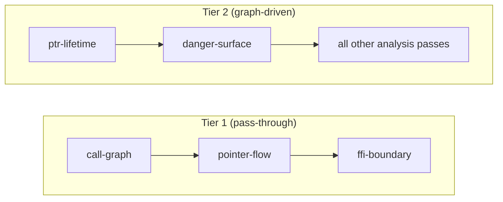
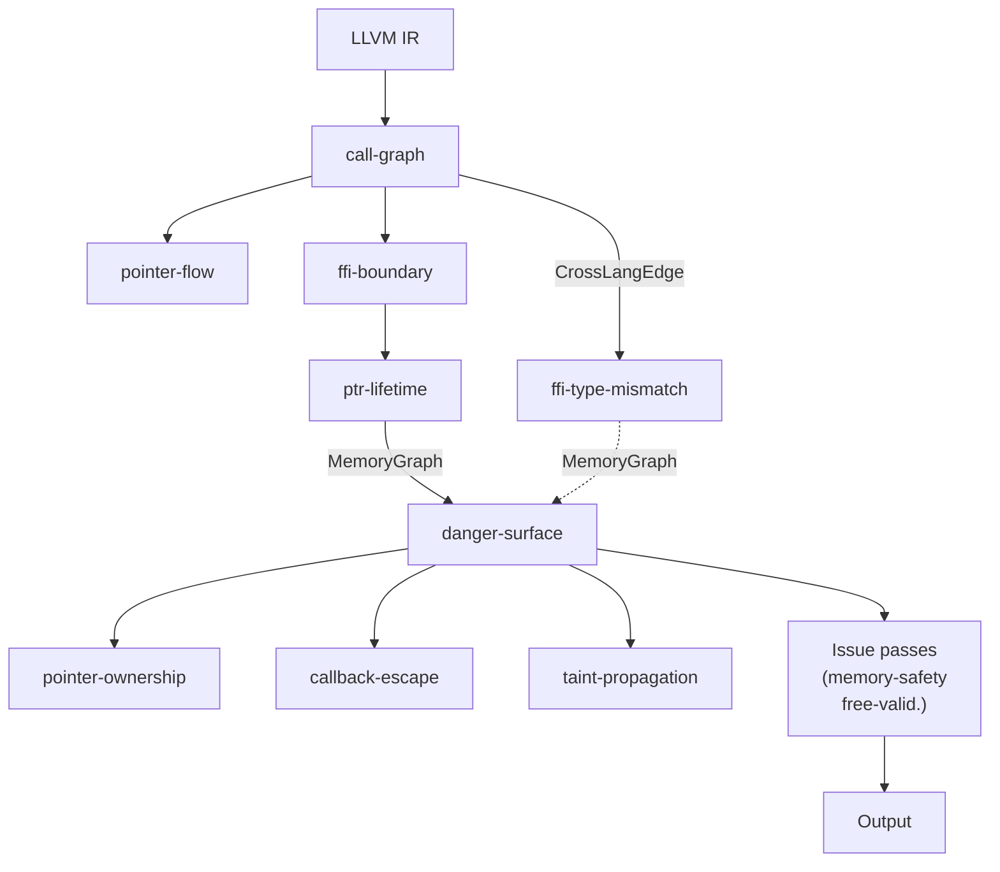

# Pass Reference

> "13 passes, one pipeline, zero mercy for memory bugs."

Last updated: 2026-05-29 | Version: v0.2.0

## Pipeline Overview

Passes execute in topological order based on their `deps` declarations. The pipeline has two tiers:

- **Tier 1** (pass-through): Build data structures, don't report issues. Trust the compiler.
- **Tier 2** (graph-driven): Analyze FFI/unsafe boundaries. All issue reporting gated by `isOnDangerPath()`.

## Foundation Passes

### cfg
- **File**: `src/pass/foundation/cfg.zig`
- **Kind**: foundation
- **Deps**: `[]`
- **What**: Builds control flow graph for each function
- **Output**: `cfg_edge` facts

### dfg
- **File**: `src/pass/foundation/dfg.zig`
- **Kind**: foundation
- **Deps**: `["cfg"]`
- **What**: Builds data flow graph, depends on CFG
- **Output**: `dfg_edge` facts

## Analysis Passes

### call-graph
- **File**: `src/semantics/call_graph.zig`
- **Kind**: analysis
- **Deps**: `[]`
- **What**: Builds inter-procedural call graph with argument mapping. The foundation of everything.
- **Produces**: `CrossLangEdge` — consumed by ptr-lifetime, ffi-boundary, callback-escape, danger-surface
- **Fun fact**: Without this pass, nothing else works. It's the `main()` of the analysis world.

### pointer-flow
- **File**: `src/pass/analysis/flow_path.zig`
- **Kind**: analysis
- **Deps**: `["call-graph"]`
- **What**: Tracks pointer flow across function boundaries
- **Note**: Foundation for cross-function alias tracking

### ffi-boundary
- **File**: `src/pass/analysis/ffi_boundary.zig`
- **Kind**: analysis
- **Deps**: `["call-graph"]`
- **What**: Identifies FFI boundary functions and classifies their safety
- **Consumes**: `CrossLangEdge` from call-graph
- **Note**: Uses ffi_matcher to find declare/define pairs across languages

### ffi-type-mismatch
- **File**: `src/pass/analysis/ffi_type_mismatch.zig`
- **Kind**: analysis
- **Deps**: `["call-graph"]`
- **What**: Detects type mismatches at FFI boundaries (e.g., passing i32 where i64 expected)
- **Consumes**: `CrossLangEdge` from call-graph
- **Fixed in v0.1.7**: Added `getCrossEdgeByCallee()` lookup (was only using name mangling)

### ptr-lifetime
- **File**: `src/pass/analysis/ptr_lifetime.zig` (+ ptr_lifetime_types.zig, ptr_lifetime_track.zig, ptr_lifetime_check.zig, ptr_lifetime_classify.zig, ptr_lifetime_report.zig)
- **Kind**: analysis
- **Deps**: `["call-graph", "danger-surface"]`
- **What**: The workhorse. Tracks pointer allocations, aliases, frees, and cross-function propagation.
- **Produces**: `MemoryGraph` data — consumed by danger-surface, free-validation
- **Key functions**: `isFreeFunction()` (identifies deallocators), `propagateOrigin()` (alias chain tracking)
- **Known issue**: Has its own copy of `isFreeFunction` instead of importing from ptr_lifetime_classify.zig

### danger-surface
- **File**: `src/pass/analysis/danger_surface.zig`
- **Kind**: analysis
- **Deps**: `["call-graph"]` (should be `["call-graph", "ptr-lifetime"]`)
- **What**: Marks functions and allocations that are on "danger paths" — paths that cross FFI boundaries
- **Produces**: `danger_surface_relevant_functions` and `danger_surface_relevant_allocs` — consumed by almost every Tier 2 pass
- **Key function**: `isOnDangerPath()` — the unified gate for all Tier 2 issue reporting

### pointer-ownership
- **File**: `src/pass/analysis/pointer_ownership.zig`
- **Kind**: analysis
- **Deps**: `["call-graph", "ptr-lifetime"]`
- **What**: Tracks ownership transfer across FFI boundaries (into_raw/from_raw patterns)

### callback-escape
- **File**: `src/pass/analysis/callback_escape.zig`
- **Kind**: analysis
- **Deps**: `["call-graph", "danger-surface"]`
- **What**: Detects pointers that escape through callback registrations
- **Fixed in v0.1.7**: `GetStructName` null handling for function types

### return-check
- **File**: `src/pass/analysis/lifetime_reporting.zig`
- **Kind**: analysis
- **Deps**: `["call-graph", "ptr-lifetime"]`
- **What**: Validates return value safety across FFI boundaries

### memory-safety
- **File**: `src/pass/analysis/issue/memory_safety.zig`
- **Kind**: analysis (issue validation)
- **Deps**: `[]` (should be `["danger-surface"]`)
- **What**: Validates and deduplicates memory safety issues

### free-validation
- **File**: `src/pass/analysis/issue/free_validation.zig`
- **Kind**: analysis (issue validation)
- **Deps**: `[]` (should be `["danger-surface"]`)
- **What**: Validates free operations against MemoryGraph data

### taint-propagation
- **File**: `src/pass/analysis/taint_propagation.zig`
- **Kind**: analysis
- **Deps**: `["call-graph"]`
- **What**: Tracks taint flow from untrusted sources to sensitive sinks
- **Fixed in v0.1.7**: `LLVMInvoke` correctly classified as `.call` (not `.control_flow`)

### noise-reduction
- **File**: `src/pass/analysis/noise_reduction.zig` (via noise_reduction_test.zig)
- **Kind**: analysis
- **Deps**: `[]`
- **What**: Multi-layer noise reduction (name + path + behavior patterns)
- **Fixed in v0.1.7**: Removed `__rust_alloc`/`__rust_dealloc`/`__rust_realloc` from noise patterns (they're what we're trying to detect!)

## Filter Passes

### fp-precision-guard
- **File**: `src/pass/filter/fp_precision_guard.zig`
- **What**: Prevents removing FP filters unless MemoryGraph precision meets threshold

### fp-whitelist
- **File**: `src/pass/filter/fp_whitelist.zig`
- **What**: Known false positive patterns from real-world audits (BLST, Wasmtime, SQLite3)

## Instrumentation Passes

### planner
- **File**: `src/pass/instrumentation/planner.zig`
- **What**: Plans runtime probe insertion based on static analysis results

## Data Flow Diagram

