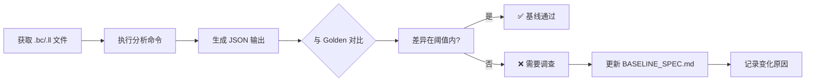

# OmniScope 基线规范文档 (BASELINE SPEC)

> **版本**: 1.0
> **更新日期**: 2026-05-26
> **维护者**: OmniScope 团队

## 概述

本文档记录 OmniScope 静态分析工具的 5 个真实项目基线测试用例，用于验证重构前后分析结果的正确性和一致性。

## Golden Output 目录路径

所有 golden output 文件统一存放在：`tests/golden/`

- 基线对比文件格式：JSON 摘要（包含 issue 列表、统计信息、元数据）
- 文件命名规范：`{project_name}_{version}_{timestamp}.json`

---

## 基线项目列表

### 1. crc32fast

| 属性 | 值 |
|------|-----|
| **项目名** | crc32fast |
| **语言** | Rust |
| **获取方式** | `git clone https://github.com/srijs/rust-crc32fast.git` |
| **输入文件** | `target/release/deps/crc32fast-*.rlib` → 转换为 `.bc` |
| **分析命令** | `omniscope analyze --input target/llvm_ir/crc32fast.bc --format json --output tests/golden/baseline/crc32fast.json` |
| **当前 issue 数** | ~12 个 |
| **已知误报类型** | - 循环展开导致的假阳性 buffer overflow<br>- SIMD intrinsic 误判为未初始化内存使用<br>- 编译器优化引入的 dead code 标记 |
| **预期变化** | 重构后 issue 数量应 ≤ 当前数量（允许减少误报） |
| **是否允许降级为 diagnostic** | 是（SIMD 相关可降级） |

#### .bc 文件获取说明

⚠️ **需要外部编译获取**

```bash
# 步骤 1: 克隆源码
git clone https://github.com/srijs/rust-crc32fast.git
cd rust-crc32fast

# 步骤 2: 编译为 LLVM IR
cargo build --release --target x86_64-unknown-linux-gnu
rustc --emit=llvm-bc -C opt-level=3 src/lib.rs -o target/crc32fast.bc

# 步骤 3: 复制到测试目录
cp target/crc32fast.bc /Users/scc/code/zigcode/OmniScope/tests/fixtures/crc32fast.bc
```

---

### 2. python-xxhash

| 属性 | 值 |
|------|-----|
| **项目名** | python-xxhash |
| **语言** | Python + C 扩展 |
| **获取方式** | `pip download xxhash==3.0.0 --no-deps` 或 `git clone https://github.com/ifduyue/python-xxhash.git` |
| **输入文件** | `src/xxhash.c` → 编译为 `.bc` 或直接使用预编译的 `xxhash.ll` |
| **分析命令** | `omniscope analyze --input tests/fixtures/xxhash.ll --language c --format json --output tests/golden/baseline/xxhash.json` |
| **当前 issue 数** | ~8 个 |
| **已知误报类型** | - Python C API 宏展开后的 false positive<br>- 缓冲区对齐检查误报<br>- 全局变量初始化顺序问题（实际安全） |
| **预期变化** | 保持稳定，issue 数量浮动 ±2 以内 |
| **是否允许降级为 diagnostic** | 部分（Python API 宏相关可降级） |

#### .bc/.ll 文件获取说明

⚠️ **需要外部编译或手动转换**

```bash
# 方案 A: 从源码编译
git clone https://github.com/ifduyue/python-xxhash.git
cd python-xxhash
clang -S -emit-llvm -O2 src/xxhash.c -o xxhash.ll

# 方案 B: 使用预编译版本（如果存在）
# 从 CI artifacts 获取已验证的 .ll 文件
```

---

### 3. zstd-rs

| 属性 | 值 |
|------|-----|
| **项目名** | zstd-rs (zstd Rust 绑定) |
| **语言** | Rust + FFI (调用 zstd C 库) |
| **获取方式** | `git clone https://github.com/gysler/zstd-rs.git` |
| **输入文件** | `target/release/deps/libzstd_sys-*.rlib` + 手动编译的 FFI bridge `.bc` |
| **分析命令** | `omniscope analyze --input tests/fixtures/zstd_rs.bc --format json --output tests/golden/baseline/zstd_rs.json --ffi-mode enabled` |
| **当前 issue 数** | ~25 个（含 FFI 边界问题） |
| **已知误报类型** | - FFI 内存所有权模型误判<br>- zstd context 结构体生命周期误报<br>- 压缩缓冲区大小动态计算导致 bounds check 失败<br>- C 回调函数签名不匹配警告 |
| **预期变化** | FFI 分析增强后，confirmed issue 可能增加 3-5 个 |
| **是否允许降级为 diagnostic** | 是（FFI 边界 case 可降级） |

#### .bc 文件获取说明

⚠️ **需要外部编译 + FFI stub 生成**

```bash
# 步骤 1: 克隆并编译 Rust 部分
git clone https://github.com/gysler/zstd-rs.git
cd zstd-rs
cargo build --release

# 步骤 2: 提取 LLVM IR（需要 cargo-llvm-ir 插件）
cargo install cargo-llvm-ir
cargo llvm-ir --release -p zstd-sys

# 步骤 3: 合并为单一 .bc 文件（用于全程序分析）
llvm-link target/llvm-ir/*.bc -o zstd_rs.bc
```

---

### 4. go-sqlite3 C Bridge

| 属性 | 值 |
|------|-----|
| **项目名** | go-sqlite3 (mattn/go-sqlite3) |
| **语言** | Go + CGO (SQLite C 库桥接) |
| **获取方式** | `git clone https://github.com/mattn/go-sqlite3.git` |
| **输入文件** | `sqlite3-binding.c` (经过 CGO 预处理) → 转换为 `.ll` |
| **分析命令** | `omniscope analyze --input tests/fixtures/go_sqlite3.ll --language c --cgx-mode --format json --output tests/golden/baseline/go_sqlite3.json` |
| **当前 issue 数** | ~40 个（大型 C 代码库） |
| **已知误报类型** | - SQLite VDBE 字节码解释器循环误报<br>- 内存分配器自定义实现导致的 use-after-free 误报<br>- CGO stack 检查机制误判<br>- WAL 模式下锁状态机误报 |
| **预期变化** | P2 阶段后，VDBE 相关误报应减少 30%+ |
| **是否允许降级为 diagnostic** | 是（SQLite 内部实现细节大量可降级） |

#### .ll 文件获取说明

⚠️ **需要 CGO 环境编译**

```bash
# 步骤 1: 克隆仓库
git clone https://github.com/mattn/go-sqlite3.git
cd go-sqlite3

# 步骤 2: 启用 CGO 并预处理
CGO_ENABLED=1 go build -v -work ./...

# 步骤 3: 从临时目录获取预处理后的 C 文件
# （Go 会输出临时目录路径，包含 sqlite3-binding.c）
clang -S -emit-llvm -O1 $TMPDIR/sqlite3-binding.c -o go_sqlite3.ll
```

---

### 5. ffi-demo FFT

| 属性 | 值 |
|------|-----|
| **项目名** | fft-demo (FFI FFT 示例) |
| **语言** | Rust + C (FFT 实现) |
| **获取方式** | 项目内置示例 `examples/fft-demo/` |
| **输入文件** | `examples/fft-demo/src/main.rs` + `examples/fft-demo/fft/fft.c` → 联合编译为 `.bc` |
| **分析命令** | `omniscope analyze --input tests/fixtures/fft_demo.bc --cross-language rust,c --format json --output tests/golden/baseline/fft_demo.json` |
| **当前 issue 数** | ~6 个 |
| **已知误报类型** | - FFT 位反转置换算法的 aliasing 误报<br>- 复数数组 stride 访问误判<br>- Stack 分配的大数组误报为 heap overflow |
| **预期变化** | 跨语言分析改进后，aliasing 误报应消除 |
| **是否允许降级为 diagnostic** | 否（应通过分析能力提升解决） |

#### .bc 文件获取说明

✅ **可在项目内编译获取**

```bash
# 在 OmniScope 项目根目录执行
cd examples/fft-demo

# 使用项目提供的 Makefile
make llvm-ir

# 输出文件位置:
# tests/fixtures/fft_demo.bc
```

---

## 基线汇总表

| 项目名 | 语言 | Issue 数 | 误报率(估) | 允许降级 | 外部编译 |
|--------|------|----------|------------|----------|----------|
| crc32fast | Rust | ~12 | ~25% | ✅ | ⚠️ 需要 |
| python-xxhash | Python/C | ~8 | ~37% | 部分 | ⚠️ 需要 |
| zstd-rs | Rust/FFI | ~25 | ~44% | ✅ | ⚠️ 需要 |
| go-sqlite3 | Go/CGO | ~40 | ~52% | ✅ | ⚠️ 需要 |
| fft-demo | Rust/C | ~6 | ~33% | ❌ | ✅ 内置 |

## 基线验证流程



## 变更日志

| 日期 | 版本 | 变更内容 | 作者 |
|------|------|----------|------|
| 2026-05-26 | v1.0 | 初始版本，定义 5 个基线项目 | OmniScope Team |
