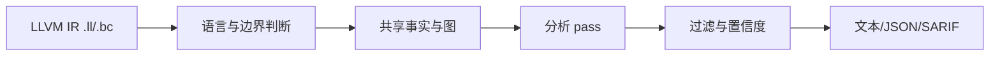

# OmniScope 中文文档入口

OmniScope 是一个基于 LLVM IR 的安全审计工具，主要关注跨语言 FFI 边界上的内存和资源所有权问题。它更适合回答“这个指针或资源跨过语言边界后，分配、释放、借用和回调生命周期是否还能说清楚”，而不是替代编译器、lint、通用静态分析器或形式化验证工具。

当前仓库版本是 `0.2.0`，对应根目录 `VERSION`、`build.zig.zon`、CLI `--version`、JSON 输出和 SARIF 输出。

## 先判断你是否需要它

如果你的问题是下面这类，OmniScope 值得尝试：

- Rust、Zig、Go、Python、Java/C JNI、C/C++ 等代码通过 FFI 共享指针、buffer、handle 或回调。
- 你已经能生成 `.ll` 或 `.bc`，希望从编译后的 IR 层看跨语言边界。
- 你希望得到 JSON/SARIF 结果，再接入审计流程或 CI。
- 你愿意把报告当作“需要复核的证据链”，而不是自动确认的漏洞清单。

如果你的问题是下面这类，应该先用别的工具：

- 只想做源码级查询，不想编译到 LLVM IR。
- 需要完整类型检查、借用检查或语言 lint。
- 需要证明程序没有漏洞。
- 需要性能 profiling 或自动修复。

## 项目实际做什么

OmniScope 的输入是 LLVM IR 文件，输出是 issue 报告。当前代码中的 issue 类型定义在 `src/common/types.zig`，包括 FFI unsafe call、unchecked return、type mismatch、cross-language leak/free、memory leak、use-after-free、buffer overflow、integer overflow、double free、malloc unchecked、null dereference、borrow escape、callback 风险、invalid free、data race 等。

更重要的是判断路径：

1. 先识别模块语言和可能的跨语言提示。
2. 再构建 call site、data flow、memory graph、semantic resolution 等共享事实。
3. 各个 pass 在共享事实上生成候选 issue。
4. 输出前按 surface、severity、confidence、白名单和 CLI 选项过滤。



## 适合谁

面向使用者：

- FFI 绑定库维护者：检查跨语言分配/释放是否混用。
- 安全审计人员：快速定位需要人工复核的 FFI 边界。
- CI 维护者：把 JSON 或 SARIF 作为增量审计输入。
- 编译器/IR 方向研究者：观察不同语言编译到 LLVM IR 后的边界模式。

面向贡献者：

- 新增 pass 前，先读 `docs/zh/architecture.md`，确认应该写事实、图、语义解析还是 issue pass。
- 调准确率前，先看 `tests/BASELINE.md`、`tests/integration/inline_ir_matrix.zig` 和相关 fixture，确认 baseline、fixture、误报/漏报口径。

## 怎么开始

第一步是构建。构建配置在 `build.zig`，默认链接 LLVM 22；macOS 默认路径是 `/opt/homebrew/opt/llvm`，Linux 默认路径是 `/usr/lib/llvm-22`，也可以通过 `-Dllvm-path` 和 `-Dllvm-version` 覆盖。

```bash
zig build
```

第二步是准备 IR。OmniScope 读取 `.ll` 或 `.bc`，加载逻辑在 `src/engine/loader.zig`。

第三步是运行分析。

```bash
./zig-out/bin/OmniScope path/to/input.bc
./zig-out/bin/OmniScope path/to/input.bc --json -o result.json
./zig-out/bin/OmniScope path/to/input.bc --sarif -o result.sarif
```

如果你知道某些符号的语言归属，可以用语言覆盖降低误判：

```bash
./zig-out/bin/OmniScope input.bc --lang-prefix sqlite3_=c --default-lang rust
```

如果你只想先看边界上的高优先级问题，可以从更窄的输出开始：

```bash
./zig-out/bin/OmniScope input.bc --boundary-only --min-severity high
```

## 怎样读结果

不要先看 issue 总数，先问三个问题：

1. 这个 issue 是否在 FFI boundary、FFI producer 或从 boundary 可达的路径上？
2. 报告里是否能看出分配方、释放方、调用链或语义证据？
3. confidence 是 `HIGH`/`MEDIUM`，还是 `HEURISTIC`/`EXPERIMENTAL`？

如果一个结果只来自函数名模式或缺少跨边界证据，应按候选处理。反过来，如果它同时有边界、所有权来源、释放 family 和可达路径，人工复核优先级更高。

## 下一步读什么

- 想理解模块和数据流：读 `docs/zh/architecture.md`。
- 想理解 issue 分类：读 `docs/zh/ISSUE_CLASSIFICATION.md`。
- 想理解报告字段：读 `docs/zh/REPORT_INTERPRETATION.md`。
- 想参与开发：读 `docs/zh/developer_guide.md`、`docs/zh/modules.md`、`docs/zh/passes.md`。

## 当前应保持的预期

OmniScope 可以帮助你把审计注意力集中到跨语言边界和内存/资源所有权风险上。它不会替你证明代码安全，也不应该把所有低置信候选都变成发布阻断项。更稳妥的使用方式是：先用边界和严重级别缩小范围，再用源码、IR、测试 fixture 和人工复核确认问题。
