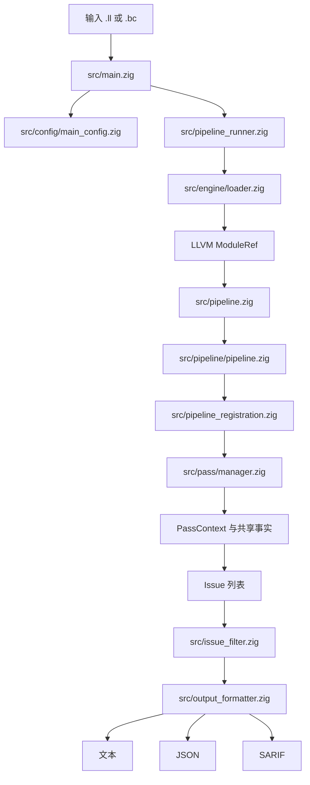
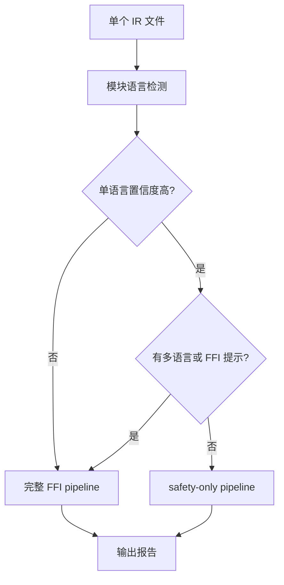
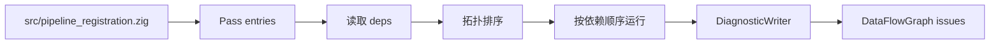
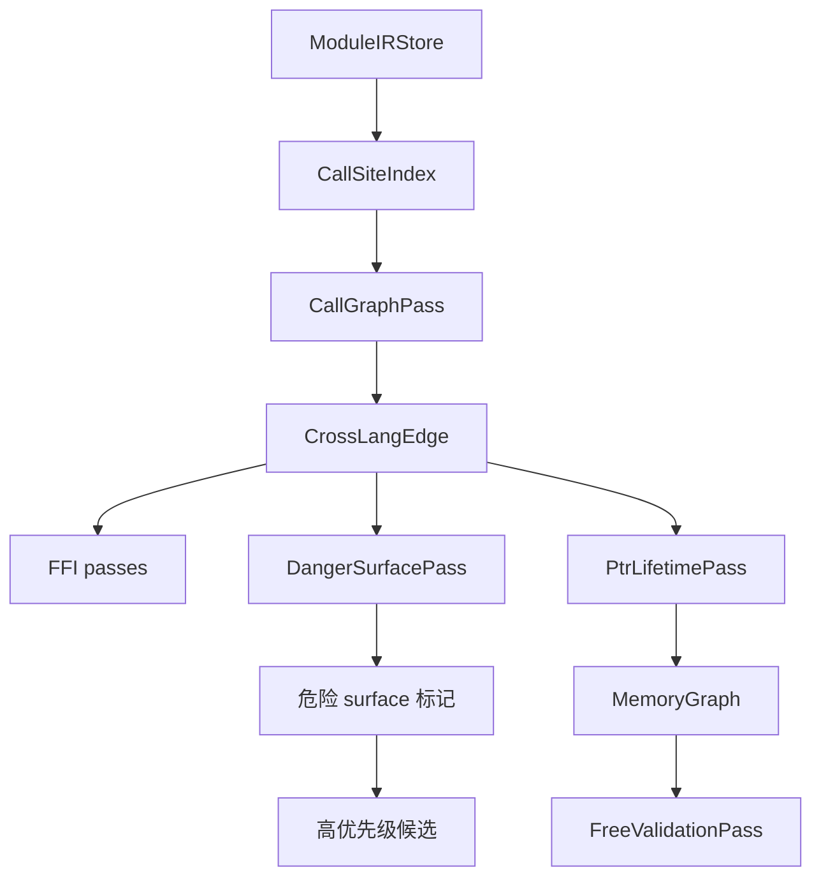

# OmniScope 架构文档

本文按一个问题展开：当输入是一份 LLVM IR 时，OmniScope 怎样判断“这里是否值得报出一个 FFI 或内存安全风险”？

读架构时先抓三条主线：

1. 输入不是源码，而是 `.ll` 或 `.bc` 形式的 LLVM IR。
2. 分析先建立共享事实，再由多个 pass 消费这些事实。
3. 输出前还会经过过滤、置信度和格式化，不应把每个候选都理解成已确认漏洞。

## 当前边界

OmniScope 当前更接近“跨语言 FFI 安全审计工具”，不是通用静态分析器，也不是形式化验证器。代码中的 issue 类型覆盖内存泄漏、跨语言释放、FFI 类型不匹配、空指针解引用、缓冲区风险、回调生命周期等类别，定义见 `src/common/types.zig`。这表示工具具备对应的报告通道和若干检测 pass，不等于所有语言、所有项目形态都有同等成熟度。

版本口径也需要注意：仓库根目录 `VERSION`、`build.zig.zon`、`src/main.zig` 的 `--version` 输出、JSON version 和 SARIF tool version 当前都应保持 `0.2.0`。

## 总览

先看数据如何流动，再看每层职责。

这个图对应的判断路径是：

1. CLI 负责读参数和配置。
2. loader 只负责把 IR 安全地装入 LLVM module。
3. pipeline 构造共享上下文和基础索引。
4. pass manager 按依赖顺序运行分析 pass。
5. formatter 再根据输出模式生成报告。

## 入口与配置

入口文件是 `src/main.zig`。它做的事情很少：初始化 allocator、初始化 zone cache、解析 CLI、加载配置、设置日志级别，然后按输入文件数量分发。

命令行参数定义在 `src/config/main_config.zig`。当前可见的主要开关包括：

- 输出：`--json`、`--sarif`、`-o/--output`
- 范围：`--focus-user-code`、`--no-focus-user-code`、`--boundary-only`、`--ffi-only`、`--include-stdlib`
- 阈值：`--leak-threshold`、`--min-severity`
- 性能：`--perf-stats`、`--perf-json`
- 语言覆盖：`--lang`、`--lang-prefix`、`--lang-suffix`、`--source-lang`、`--default-lang`
- 配置文件：`--config`、`--init-config`

配置文件加载和默认配置生成在 `src/config/file_config.zig`。语言覆盖会在 `src/pipeline.zig` 中合并为 `LanguageOverrideRegistry`，再注入 pipeline。

## IR 加载

`src/engine/loader.zig` 封装 `IRLoader`，负责加载 `.ll` 或 `.bc`，并持有 LLVM 资源生命周期。它的设计原则是单一所有者：`IRLoader` 释放资源，`ModuleRef`、`FunctionRef` 等视图只是借用引用。

这意味着后续 pass 不直接拥有 LLVM module。它们通过 `PassContext` 访问 module、IR store、fact store、memory graph 等共享结构。

## 单文件与多文件路径

单文件分析由 `src/pipeline_runner.zig` 的 `runSingleFileAnalysis` 驱动。它先调用语言检测，然后决定走完整分析还是单语言 safety-only 分析。

关键判断是：如果模块语言置信度很高，并且没有其它语言符号、JNI/Python/CGO 等外部声明提示，就运行 `runSafetyOnlyPipeline`；否则运行完整 `runModulePipeline`。

多文件分析由 `src/pipeline.zig` 的 `runMultiFileAnalysis` 驱动。它会逐个文件运行单模块 pipeline，然后用 `src/ffi/ffi_matcher.zig` 的 `FFIMatcher` 对 declare/define 函数做跨文件匹配，并通过 `src/ffi_precision.zig` 把危险匹配转换为 issue。

## Pipeline 核心上下文

核心实现位于 `src/pipeline/pipeline.zig`。`Pipeline.init` 创建这些共享结构：

- `FactStore` 与 `QueryEngine`：事实存储与查询，见 `src/fact/store.zig`、`src/fact/query.zig`
- `DataFlowGraph`：数据流图与 issue 容器，见 `src/dataflow/graph.zig`
- `PassManager`：pass 注册、依赖排序和执行，见 `src/pass/manager.zig`
- `InstCache`、`ModuleIRStore`：IR 访问缓存与预收集结构，见 `src/ir/inst_cache.zig`、`src/ir/ir_store.zig`

`Pipeline.run` 会构造 `PassContext`。它不是单纯的参数对象，而是 pass 之间共享事实的主要接口，类型定义从 `src/types/pass_types.zig` 导出，在 `src/pass/pass.zig` 里重新暴露。

## Pass 注册与调度

所有完整 pipeline 的 pass 注册集中在 `src/pipeline_registration.zig`。当前注册顺序包括 foundation、语义分类、基础 issue、FFI、生命周期、资源/GC/错误传播和若干新增 FFI 检查器。

调度不完全依赖注册顺序。每个 pass 类型需要提供 `name`、`kind`、`deps` 和 `run`，`src/pass/manager.zig` 使用拓扑排序解析依赖。如果依赖缺失或存在环，会在调度阶段报错。

## 主要分析模块

可以按“先建事实，再找风险，再过滤输出”来理解模块关系。

| 模块 | 主要路径 | 作用 |
|------|----------|------|
| IR 层 | `src/ir/*` | LLVM C API 包装、IR store、debug info、mangling 和 instruction cache |
| 事实层 | `src/fact/*` | 保存 taint、关系、分类等 pass 间事实 |
| 数据流 | `src/dataflow/*` | 图节点、边、路径条件、summary propagation |
| Pass 框架 | `src/pass/pass.zig`, `src/pass/manager.zig` | pass 接口、上下文、依赖调度、诊断写入 |
| 语义识别 | `src/semantics/*` | 语言检测、zone 分类、surface classifier、noise filter、semantic tree |
| FFI 分析 | `src/pass/analysis/ffi/*` | FFI boundary、type/layout/string/unwind、GC safety、callback lifecycle 等 |
| Issue 分析 | `src/pass/analysis/issue/*` | malloc、return、free validation、memory safety、JNI leak、FFI unsafe 等 |
| 指针生命周期 | `src/pass/analysis/ptr_lifetime/*` | 指针来源、逃逸、释放、生命周期报告 |
| 资源契约 | `src/semantics/resource/*`, `src/pass/analysis/resource/*` | 资源 family、summary、候选 issue 和 verifier |
| 输出 | `src/output_formatter.zig` | 文本、JSON、SARIF 输出 |

## 语言检测、Zone 与 Surface

语言检测不只决定展示名称，也会影响后续分析路径。

- `src/semantics/language_detector.zig` 检测模块语言。
- `src/semantics/zone_classifier.zig` 把函数划到 safe/runtime/unsafe/ffi/unknown 等区域。
- `src/pass/analysis/surface_classifier_pass.zig` 和 `src/semantics/surface_classifier/*` 产出更细的 function surface。
- `src/issue_filter.zig` 在输出前根据 surface 和 CLI 选项过滤 issue。

判断上可以这样看：如果一个候选风险只落在 runtime/internal surface，它通常不应和用户代码 FFI 边界同等优先；如果它在 boundary 或 FFI producer 上，才更接近 OmniScope 的核心审计目标。

## MemoryGraph、CallSiteIndex 与 CrossLangEdge

`Pipeline.run` 会先构建 `ModuleIRStore`，再基于函数调用构建 `CallSiteIndex`。这一步把“callee 名称到 call site”的查询从反复扫描变成共享索引。

随后不同 pass 会补充：

- `cross_lang_edges`：跨语言调用边，主要由 call graph/FFI 相关 pass 使用
- `memory_graph`：分配、释放、别名、调用参数和返回值关系
- `danger_surface_relevant`、`ffi_auto_relevant`、`relevant_functions`：用于限制高成本或高噪声分析范围
- `semantic_resolution`：语义解析结果，供部分 pass 查询

## 语义解析与误报抑制

`src/pass/analysis/semantic_resolver_pass.zig` 会接入 `src/semantics/resolution_engine.zig` 和若干语义模式，例如 heap provenance、into_raw transfer、library alloc pairs 等。`src/semantics/semantic_tree.zig` 定义了 SemanticKind，覆盖 LLVM 参数属性、heap/global provenance、interior mutability、RAII drop、POSIX 操作、Rust raw transfer、库级 release、Python/Go/C# 和通用 FFI 语义等。

Issue 输出前还可能经过：

- `src/pass/filter/issue_gate.zig`：统一 gate verdict
- `src/pass/filter/fp_precision_guard.zig`：精度保护
- `src/pass/filter/fp_whitelist.zig`：白名单
- `src/pass/analysis/noise/*`：噪声抑制规则
- `src/diag/aggregator.zig`：跨 pass 去重与聚合

架构上要避免一个误解：SRT 和 gate 不是“证明无漏洞”，而是把已知语言语义、runtime 模式、所有权转移等证据纳入判断，减少把正常编译器或运行时行为报成漏洞。

## 输出与可消费结果

`src/output_formatter.zig` 负责输出：

- 默认文本报告
- `--json` 机器可读报告
- `--sarif` 供 GitHub Code Scanning 等系统消费

输出前会调用 `src/issue_filter.zig`，根据 `--boundary-only`、`--ffi-only`、`--min-severity`、surface filter 等配置筛选 issue。报告中的 `confidence` 来自 `src/common/types.zig` 的分级：`HIGH`、`MEDIUM`、`HEURISTIC`、`EXPERIMENTAL`。

## 架构阅读顺序

如果要验证某个 issue 为什么出现，建议按这个顺序读代码：

1. `src/common/types.zig`：确认 issue kind、severity、confidence 的定义。
2. 对应 pass，例如 `src/pass/analysis/issue/free_validation.zig` 或 `src/pass/analysis/ffi/ffi_boundary.zig`：确认候选如何生成。
3. `src/types/pass_types.zig` 和 `src/pipeline/pipeline.zig`：确认 pass 读写了哪些共享事实。
4. `src/pass/filter/*`、`src/pass/analysis/noise/*`、`src/issue_filter.zig`：确认候选是否被 gate、降级、过滤或去重。
5. `src/output_formatter.zig`：确认最终字段如何序列化。

如果要新增一个检测能力，建议先判断它属于哪类事实：

- 只是提供上下文：优先放在 fact、graph、semantic resolution 或 surface classifier。
- 会报告 issue：需要明确 issue kind、severity、confidence、证据链和过滤路径。
- 依赖其它 pass：必须在 pass 类型的 `deps` 中声明，并通过 `src/pipeline_registration.zig` 注册。
