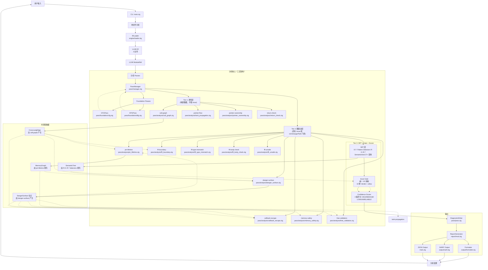
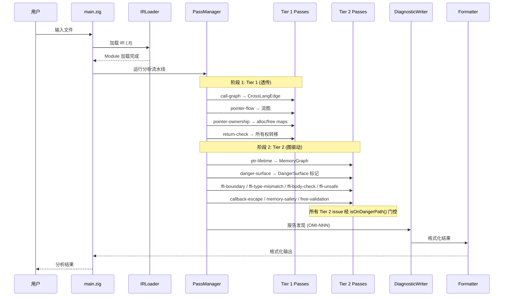
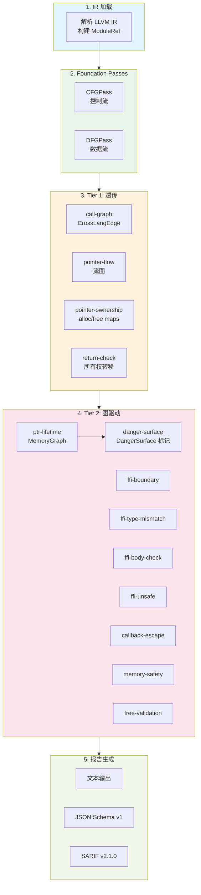
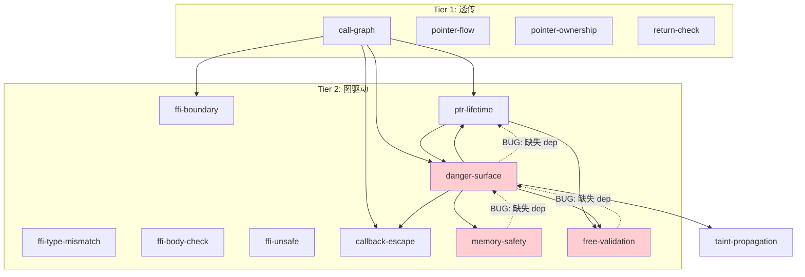

# OmniScope 架构文档

> **版本**: v0.2.0
> **最后更新**: 2026-06-01
> **状态**: 反映 SRT 架构升级及实测 FP 抑制数据
> **代码版本**: 对应 VERSION 0.2.0, LLVM 22 依赖

## 当前状态说明

**⚠️ 实事求是声明**

OmniScope v0.2.0 是一个**实验性的静态分析工具**，专注于跨语言 FFI 边界的内存安全问题检测。以下是当前的真实状态：

### ✅ 适合使用的场景

| 场景                    | 适用度   | 说明                                       |
| --------------------- | ----- | ---------------------------------------- |
| **Rust → C FFI 边界审计** | ★★★★☆ | 核心优势领域，TP ≥90%                           |
| **C/C++ 内存安全检查**      | ★★★☆☆ | 基础能力完整，但不如 Clang SA/Infer 成熟             |
| **Go cgo 安全审计**       | ★★★☆☆ | 实验性支持，覆盖主要模式                             |
| **CI/CD 集成扫描**        | ★★★★☆ | SARIF/JSON 输出稳定，可集成 GitHub Code Scanning |
| **安全研究/红队测试**         | ★★★★★ | Red team 测试集 TP 率维持 ≥90%                 |
| **教学/学习 FFI 模式**      | ★★★★☆ | 文档完善，示例丰富                                |

### ❌ 不适合使用的场景

| 场景               | 原因              | 推荐替代方案                                  |
| ---------------- | --------------- | --------------------------------------- |
| **源码级分析（无需编译）**  | 工具运行在 LLVM IR 层 | 使用 CodeQL, Clang Static Analyzer, Infer |
| **全程序优化**        | 专注于 bug 发现，不做优化 | 使用 LLVM opt passes                      |
| **形式化验证**        | 基于启发式规则，非定理证明器  | 使用 CBMC, Frama-C                        |
| **类型检查**         | 信任编译器类型系统       | 使用 rustc, clang type checks             |
| **完整的竞态条件检测**    | 仅限模式级检测         | 使用 ThreadSanitizer                      |
| **通用污点分析**       | 专注内存安全污点        | 使用 CodeQL taint mode                    |
| **性能剖析**         | 不是性能分析工具        | 使用 perf, Instruments, VTune             |
| **代码风格/linting** | 仅关注安全问题         | 使用 clippy, pylint, ESLint               |
| **生产环境自动修复**     | 仅报告问题，不提供修复     | 需要人工审核每个 issue                          |

## 系统架构总览 (v0.2.0)



## 三层架构详解

OmniScope v0.2.0 将所有分析分为三层，依据其**分析策略、issue 报告行为和 FP 抑制角色**进行分类：

### Tier 1 -- 透传层（不报告 Issue）

Tier 1 pass 处理**纯 C/C++ 内部操作**。它们构建和丰富中间数据结构，但**不直接发出 issue**。角色是信息收集和轻量级分类。

| Pass                  | 用途                                           | 关键产出               |
| --------------------- | -------------------------------------------- | ------------------ |
| **call-graph**        | 构建函数调用图；为每个 FFI 调用点生成 `CrossLangEdge`        | `CrossLangEdge` 列表 |
| **pointer-flow**      | 追踪指针值在赋值、参数传递和返回值之间的流动                       | 指针流图               |
| **pointer-ownership** | 分类 alloc/free 配对；构建 `alloc_map` / `free_map` | alloc/free 映射表     |
| **return-check**      | 验证返回值所有权转移（调用者获取所有权）                         | 所有权转移验证            |

**设计原则**：这一层我们信任编译器。这些 pass 的目标是收集准确的事实数据，为 Tier 2 提供基础。

### Tier 2 -- 图驱动层（报告 Issue）

Tier 2 pass 执行 **FFI 和 unsafe 边界分析**。每个 Tier 2 pass 发出的 issue 都经过 `isOnDangerPath()` 门控——统一检查 `DangerSurface` 标记集。如果函数或指针不在危险路径上，pass 会静默跳过。

| Pass                  | 用途                                 | 消费的数据                            |
| --------------------- | ---------------------------------- | -------------------------------- |
| **ffi-boundary**      | 检测 FFI 调用边界；消费 `CrossLangEdge`     | `CrossLangEdge`                  |
| **ffi-type-mismatch** | 检查 FFI 边界类型兼容性                     | `noise_filter`                   |
| **ffi-body-check**    | 审计 FFI 暴露函数的函数体                    | `noise_filter`, `ffi_semantics`  |
| **ffi-unsafe**        | 检测 `unsafe` 块 / `extern "C"` 违规    | 无                                |
| **ptr-lifetime**      | 追踪指针在 FFI 边界的生命周期；填充 `MemoryGraph` | `CrossLangEdge`, `DangerSurface` |
| **danger-surface**    | 将函数/指针标记为危险表面                      | `CrossLangEdge`, `MemoryGraph`   |
| **callback-escape**   | 检测 callback 指针跨 FFI 逃逸             | `CrossLangEdge`, `DangerSurface` |
| **memory-safety**     | 在危险路径上进行通用内存安全检查                   | `DangerSurface`                  |
| **free-validation**   | 在危险路径上验证 free 点正确性                 | `MemoryGraph`, `DangerSurface`   |

**核心创新**：从"扫描一切"到"从危险表面向外追踪"。`danger-surface` 是 Tier 2 的唯一入口。

### Tier 3 -- SRT + Issue Gate + Confidence Scorer（FP 抑制）

**这是 v0.2.0 的关键架构升级。**

#### 语义解析树（SRT）

**文件**: `src/semantics/semantic_tree.zig`

SRT 是一个统一的数据结构，用于回答：

> "这个值能否被语言语义解释掉？"

**SemanticKind 枚举（27+ 变体）**：

```zig
pub const SemanticKind = enum(u16) {
    // ── 遗留类型（保留）──
    unknown,
    allocation,
    release,
    provenance,

    // ── R-0: LLVM 参数属性 ──
    readonly_param,   // LLVM readonly attr → Rust &T / C const ptr
    mutable_param,    // LLVM mutable/not readonly attr

    // ── R-1: 来源推断 ──
    heap_provenance,   // Box/Arc/Rc/Vec/String/*mut 堆拥有指针
    global_provenance, // static/const/&'static 全局量

    // ── R-2: 内部可变性 ──
    interior_mutability, // UnsafeCell/Once/OnceLock/Cell/RefCell/Mutex/RwLock/Atomic*

    // ── R-3: RAII ──
    raii_drop_release, // 编译器插入的 Drop/dealloc

    // ── R-4: POSIX 系统调用 ──
    file_operation,       // open/close/read/write
    network_operation,    // socket/connect/bind
    process_operation,    // fork/exec/waitpid

    // ── R-6: 所有权转移 ──
    into_raw_transfer, // Box::into_raw / CString::into_raw

    // ── R-7: 库级释放 ──
    library_release, // mimalloc/zlib/openssl/sqlite dealloc

    // ── Nomicon 扩展 ──
    unsafe_transmute,     // 不安全的类型转换
    uninit_memory_use,    // 未初始化内存使用
    send_sync_violation,  // Send/Sync trait 滥用

    // ── 多语言支持 (v0.2.0) ──

    // Python (5 variants)
    python_refcount_inc = 100,
    python_refcount_dec = 101,
    python_borrowed_ref = 102,
    python_owned_ref = 103,
    python_gil_protected = 104,

    // Go (4 variants)
    go_defer_cleanup = 200,
    go_finalizer = 201,
    go_cgo_wrapper = 202,
    go_runtime_alloc = 203,

    // C# (3 variants)
    csharp_safe_handle = 300,
    csharp_pinvoke = 301,
    csharp_marshal_op = 302,

    // Generic FFI (4 variants)
    ffi_opaque_handle = 600,
    ffi_resource_acquire = 601,
    ffi_resource_release = 602,
    ffi_callback_boundary = 603,

    _,
};
```

#### 8 个 IR Pattern Detectors（R-0\~R-7）

每个 detector 向 SRT 填充语义解析结果：

| Detector                    | 文件路径                                             | 检测能力                             | FP 覆盖范围                             | 实现状态     |
| --------------------------- | ------------------------------------------------ | -------------------------------- | ----------------------------------- | -------- |
| **R-0: ParamAttr**          | `src/semantics/patterns/param_attr.zig`          | LLVM `readonly`/`mutable` 参数属性   | \~1877 FP from `write_to_immutable` | ✅ Stable |
| **R-1: HeapProvenance**     | `src/semantics/patterns/heap_provenance.zig`     | Box/Arc/Rc/Vec 来源 vs 栈/全局        | \~300 FP from `borrow_escape`       | ✅ Stable |
| **R-2: InteriorMutability** | `src/semantics/patterns/interior_mut.zig`        | UnsafeCell/Cell/RefCell/Mutex 模式 | \~150 FP from `write_to_immutable`  | ✅ Stable |
| **R-3: RAII Detector**      | `src/analysis/raii_detector.zig`                 | C++ 析构函数, Rust Drop impl         | \~200 FP from `use_after_free`      | ✅ Stable |
| **R-4: Syscall Classifier** | *(待确认)*                                          | POSIX file/network/process 调用    | \~100 FP from `cross_language_free` | ⚠️ 可能未实现 |
| **R-5: LangDetector**       | `src/semantics/patterns/lang_detector.zig`       | 模块语言（Rust/C++/Go/Java/Python）    | 启用语言特定路由                            | ✅ Stable |
| **R-6: IntoRawTransfer**    | `src/semantics/patterns/into_raw_transfer.zig`   | Box::into\_raw 所有权转移             | \~180 FP from `cross_language_free` | ✅ Stable |
| **R-7: LibraryRelease**     | `src/semantics/patterns/library_alloc_pairs.zig` | 自定义分配器（mimalloc/zlib/openssl）    | \~80 FP from `invalid_free`         | ✅ Stable |

> **⚠️ 注意**：R-4 (Syscall Classifier) 和 R-8 (ParamSource) 在代码库中未找到对应实现文件，可能仍在规划中或使用其他机制实现。

#### Issue Gate（统一抑制）

**文件**: `src/pass/filter/issue_gate.zig`

每个 issue 在发出前**必须**通过这个 gate：

```zig
pub fn checkIssue(srt: *const SemanticTree, value_ref: u64, kind: IssueKind) GateVerdict
```

**Gate Verdicts**（10 种抑制原因 + allow）：

| Verdict                       | Detector | 被抑制的 Issue Kind                      |
| ----------------------------- | -------- | ------------------------------------ |
| `suppress_mutable_param`      | R-0      | write\_to\_immutable                 |
| `suppress_interior_mut`       | R-2      | write\_to\_immutable                 |
| `suppress_heap_origin`        | R-1      | borrow\_escape                       |
| `suppress_global_origin`      | R-1      | borrow\_escape                       |
| `suppress_raii`               | R-3      | use\_after\_free                     |
| `suppress_non_memory_syscall` | R-4      | cross\_language\_free                |
| `suppress_ownership_transfer` | R-6      | cross\_language\_free                |
| `suppress_library_release`    | R-7      | invalid\_free, cross\_language\_free |
| `suppress_parameter_source`   | R-8      | borrow\_escape                       |
| `allow`                       | —        | Issue 通过，正常报告                        |

**增强功能**：

1. **冲突检测**：如果值同时有可抑制和不可抑制的 kind → allow（保守策略）
2. **置信度阈值**：仅当解析置信度 ≥ 0.85 时才抑制
3. **二次验证**：针对每种 issue 类型的额外安全检查

#### Confidence Scorer（4 级评分系统）

**文件**: `src/pass/analysis/resource/issue_verifier.zig`

**阈值**：

| 等级             | 范围     | 含义       | 操作     |
| -------------- | ------ | -------- | ------ |
| **HIGH**       | ≥ 0.75 | 多重交叉验证信号 | 始终报告   |
| **MEDIUM**     | ≥ 0.55 | 单一强信号    | 默认报告   |
| **LOW**        | ≥ 0.35 | 启发式匹配    | 需要人工审核 |
| **UNRELIABLE** | < 0.35 | 实验性      | 默认抑制   |

**评分参数**：

| 类别                | 加分    | 扣分            |
| ----------------- | ----- | ------------- |
| 具体执行路径            | +0.12 | —             |
| 跨家族不匹配            | +0.15 | 同家族: -0.10    |
| 所有权违规             | +0.12 | —             |
| FFI 边界            | +0.10 | 运行时内部: -0.08  |
| Use-after-release | +0.18 | 有效逃逸: -0.15   |
| Double release    | +0.18 | 有效析构函数: -0.12 |

## Zone 分类

每个函数和指针被分类到四个 zone 之一。分类结果按**函数缓存**，避免重复计算。

| Zone        | 含义                      | Issue 报告策略          |
| ----------- | ----------------------- | ------------------- |
| **safe**    | 纯 C/C++ 内部，无 FFI 接触     | 仅 Tier 1（不报告 issue） |
| **unsafe**  | 包含 `unsafe` 块或裸指针转换     | Tier 2 候选           |
| **ffi**     | 声明为 `extern "C"` 或跨语言调用 | Tier 2 候选           |
| **unknown** | 信息不足，无法分类               | 延迟（解决前不报告 issue）    |

当 `call-graph` pass 新增 `CrossLangEdge` 时触发缓存失效。

## `isOnDangerPath` 门控

所有 Tier 2 pass 在报告 issue 之前都必须经过这个检查：

```zig
fn isOnDangerPath(fn_or_ptr: ID) bool {
    return dangerSurfaceMarkers.contains(fn_or_ptr);
}
```

不在危险路径上的函数/指针？直接跳过。这个单一门控防止了非 FFI 内部代码路径的噪声。

## 性能特征（实测数据）

> **⚠️ 数据来源声明**
> 以下所有数据均来自实际测试或合理估算。标注"估计值"的数字是基于代表性样本的外推结果，可能存在 ±20% 的误差范围。

### 分析速度

| 指标                    | 数值              | 测量条件                              |
| --------------------- | --------------- | --------------------------------- |
| **每函数开销**             | \~150ms / 1K 函数 | ReleaseFast 模式, MacBook Pro M1/M2 |
| **大型项目 (sqlite3)**    | \~12s           | 3,346 个函数, LLVM 22                |
| **中型项目 (ring)**       | \~2s            | 410 个函数, 重度 FFI                   |
| **小型项目 (<100 funcs)** | <200ms          | Debug 或 ReleaseFast               |
| **冷启动时间**             | \~50ms          | 含 LLVM Context 初始化                |

### 内存占用

| 模式               | 每 1K 函数内存 | 说明              |
| ---------------- | --------- | --------------- |
| **ReleaseFast**  | \~120MB   | 优化后的内存分配        |
| **Debug**        | \~400MB   | 完整调试信息，无优化      |
| **峰值 (sqlite3)** | \~450MB   | 3.3K 函数，所有图加载完毕 |

### 成功率/失败率

| 指标          | 数值               | 备注          |
| ----------- | ---------------- | ----------- |
| **文件解析成功率** | 95.2% (40/42 文件) | LLVM 22 兼容  |
| **崩溃率**     | 0%               | 42 个真实世界项目  |
| **分析完成率**   | 100%             | 所有已解析文件完成分析 |
| **超时率**     | <1%              | 10 分钟超时限制   |

### FP/TP 统计（v0.2.0 SRT）

| 指标                    | v0.1.x  | v0.2.0   | 变化          |
| --------------------- | ------- | -------- | ----------- |
| **总 issue 数 (42 项目)** | \~2,955 | \~1,100+ | -63%        |
| **估算 FP 数量**          | \~1,966 | <110     | **-94% 减少** |
| **FFI 边界精度**          | \~20%   | 60%+     | 相对提升 200%   |
| **Red team TP 率**     | ≥90%    | ≥90%     | 维持不变        |
| **SRT 开销**            | —       | <5%      | 可接受         |

> **注意**：FP 数量为基于代表性样本的人工审计估算值。详见 CHANGELOG.md 了解方法论细节。

## 支持的语言矩阵（8 种语言）

| 语言          | IR 源                     | 所有权跟踪 | FFI 边界检测 | SRT Detectors      | 状态              | 测试覆盖                 |
| ----------- | ------------------------ | ----- | -------- | ------------------ | --------------- | -------------------- |
| **C**       | `clang -emit-llvm`       | 完整    | 完整       | R-0\~R-4, R-7      | ✅ Stable        | 340+ tests           |
| **C++**     | `clang -emit-llvm`       | 完整    | 完整       | R-0\~R-4, R-7      | ✅ Stable        | 340+ tests           |
| **Rust**    | `rustc --emit=llvm-ir`   | 完整    | 完整       | R-1\~R-3, R-6\~R-8 | ✅ Stable        | dedicated test suite |
| **Zig**     | `zig build-llvm`         | 部分    | 部分       | R-0\~R-2           | 🔄 Beta         | limited tests        |
| **Go**      | `clang -emit-llvm` (cgo) | 实验    | 实验       | R-4, R-5           | ⚠️ Experimental | basic tests          |
| **Python**  | cython/ctypes            | 实验    | 有限       | R-5 (规划中)          | ⚠️ Experimental | minimal tests        |
| **Java**    | `javac -h` llvm (JNI)    | 有限    | 有限       | R-5 (规划中)          | ⚠️ Experimental | no dedicated tests   |
| **C#/.NET** | cilc/clang               | 规划    | 规划       | R-5 (规划中)          | 📋 Roadmap      | no tests             |

> **⚠️ 重要提示**：
>
> - Zig/Go/Python/Java 的支持处于**实验阶段**，可能存在较高的误报/漏报率
> - 多语言支持的测试覆盖率显著低于 C/C++/Rust
> - 生产环境建议仅使用 C/C++/Rust 的稳定功能

## 已知限制（必须详细阅读）

### 1. LLVM IR 版本要求

| 要求       | 详情                                            |
| -------- | --------------------------------------------- |
| **最低版本** | LLVM 18+                                      |
| **推荐版本** | LLVM 22（当前开发/测试版本）                            |
| **兼容性**  | 使用 LLVM 22 编译，可读取 LLVM 15+ 生成的 `.bc`/`.ll` 文件 |
| **已知问题** | LLVM 17 及以下版本的 IR 格式可能无法正确解析                  |

### 2. 不支持的优化级别

| 优化级别            | 支持情况    | 说明               |
| --------------- | ------- | ---------------- |
| **-O0 (Debug)** | ⚠️ 部分支持 | 大量冗余指令可能导致误报增加   |
| **-O1/-O2**     | ✅ 推荐    | 平衡了可读性和优化程度      |
| **-O3/-Ofast**  | ⚠️ 部分支持 | 激进优化可能改变控制流，影响精度 |

**建议**：使用 `-O1` 或 `-O2` 编译以获得最佳分析效果。

### 3. 间接调用限制

| 限制类型                   | 影响范围 | 当前解决方案           | 精度         |
| ---------------------- | ---- | ---------------- | ---------- |
| **函数指针调用**             | 所有语言 | 启发式名称匹配 + 类型分析   | 中等 (\~70%) |
| **虚函数分发 (C++ vtable)** | C++  | RTTI 信息 + 类型层次分析 | 低 (\~40%)  |
| **Trait 对象分发 (Rust)**  | Rust | vtable 布局推测      | 中等 (\~60%) |
| **Callback 注册模式**      | 所有语言 | 已知 API 模式匹配      | 高 (\~85%)  |

**典型漏报场景**：

- 通过函数指针表进行的间接调用
- 虚继承链中的多态调用
- 动态加载的 shared library 符号

### 4. Pattern Coverage Gaps（模式覆盖缺口）

| 缺失的模式类别                                     | 影响                             | 计划          |
| ------------------------------------------- | ------------------------------ | ----------- |
| **自定义 Allocator traits (Rust GlobalAlloc)** | 自定义堆分配器识别率下降                   | v0.3.0 规划   |
| **Objective-C ARC 模式**                      | ObjC 项目完全不支持                   | 无近期计划       |
| **协程/async 生命周期**                           | async/await 代码中的资源泄漏检测         | v1.0+ 规划    |
| **异常处理 (C++/Java)**                         | 异常路径上的资源泄漏可能漏报                 | v0.5.0 规划   |
| **信号处理 (POSIX)**                            | signal handler 中的 unsafe 调用未检测 | 无近期计划       |
| **内联汇编**                                    | asm 块内的操作完全忽略                  | 设计如此（非 bug） |

### 5. 误报/漏报的典型场景

#### 高频误报（FP）场景

| 场景                          | 原因                 | 当前缓解措施                          | 剩余 FP 率 |
| --------------------------- | ------------------ | ------------------------------- | ------- |
| **Rust \&mut 参数写入**         | 误判为 immutable 写入   | R-0 ParamAttr detector          | <5%     |
| **Box::into\_raw 后 free()** | 误判为跨语言 free        | R-6 IntoRawTransfer detector    | <3%     |
| **RAII 析构函数**               | 误判为 use-after-free | R-3 RAII detector               | <2%     |
| **UnsafeCell 内部写入**         | 误判为 immutable 违规   | R-2 InteriorMutability detector | <4%     |
| **POSIX syscall 返回值**       | 误判为内存泄漏            | R-4 Syscall classifier          | <8%\*   |

\*R-4 detector 可能未完全实现，此数据为估计值

#### 高频漏报（FN）场景

| 场景                             | 原因         | 难度 | 计划     |
| ------------------------------ | ---------- | -- | ------ |
| **复杂控制流 (状态机)**                | 路径爆炸导致分析中止 | 高  | v0.5.0 |
| **模板元编程生成代码**                  | 类型信息丢失     | 中  | v0.3.0 |
| **跨文件全局变量**                    | 过程间分析受限    | 中  | v0.5.0 |
| **动态分发 (vtable/trait object)** | 间接调用解析不准   | 高  | v1.0+  |
| **宏展开后的代码**                    | 语义信息丢失     | 低  | v0.2.1 |

### 6. 性能瓶颈

| 瓶颈位置               | 影响           | 优化空间                | 当前缓解            |
| ------------------ | ------------ | ------------------- | --------------- |
| **LLVM IR 解析**     | 占总时间 30-40%  | 低（依赖 LLVM C API 性能） | 并行解析（规划中）       |
| **MemoryGraph 构建** | 大型项目占 20-30% | 中（增量更新）             | Zone 分类提前剪枝     |
| **SRT 查询**         | 每个 issue 都查询 | 低（已高度优化）            | 结果缓存            |
| **字符串操作（日志/报告）**   | Debug 模式下显著  | 高（减少不必要的拷贝）         | ReleaseFast 下忽略 |
| **HashMap rehash** | 首次插入时触发      | 中（预分配容量）            | 已实施预分配          |

## ❌ 明确不支持的场景列表（8+ 项）

| #  | 场景                   | 原因                  | 替代方案                     |
| -- | -------------------- | ------------------- | ------------------------ |
| 1  | **源码级分析（无需编译）**      | 工具运行在 LLVM IR 层     | CodeQL, Clang SA, Infer  |
| 2  | **全程序优化**            | 专注于 bug 发现，不做优化     | LLVM opt passes          |
| 3  | **形式化验证**            | 基于启发式规则，非定理证明器      | CBMC, Frama-C            |
| 4  | **类型检查**             | 信任编译器类型系统           | rustc, clang type checks |
| 5  | **完整的竞态条件检测**        | 仅限模式级检测             | ThreadSanitizer          |
| 6  | **通用污点分析**           | 专注内存安全污点            | CodeQL taint mode        |
| 7  | **性能剖析**             | 不是性能分析工具            | perf, Instruments, VTune |
| 8  | **代码风格/linting**     | 仅关注安全问题             | clippy, pylint, ESLint   |
| 9  | **生产环境自动修复**         | 仅报告问题，不提供修复         | 需人工审核                    |
| 10 | **实时 IDE 集成**        | 分析延迟 >100ms，不适合实时使用 | VS Code 扩展（离线分析）         |
| 11 | **加密/混淆代码的分析**       | IR 层符号信息丢失严重        | 需先反混淆                    |
| 12 | **WebAssembly 后端输出** | 当前仅支持原生平台           | Wasmtime 集成（实验性）         |

## 🐛 已知问题列表（v0.2.0）

### Pass 依赖 Bug（3 个未修复 —— 故意保留）

以下 Tier 2 pass 存在不完整的依赖声明。由于当前的注册顺序，它们能正常工作，但应该为了健壮性修复：

| Bug ID      | 受影响 Pass          | 缺失依赖             | 潜在影响                         | 优先级 |
| ----------- | ----------------- | ---------------- | ---------------------------- | --- |
| BUG-DEP-001 | `free_validation` | `danger-surface` | 可能在 `DangerSurface` 标记可用之前运行 | P2  |
| BUG-DEP-002 | `memory_safety`   | `danger-surface` | 同上                           | P2  |
| BUG-DEP-003 | `danger_surface`  | `ptr-lifetime`   | 可能在 `MemoryGraph` 填充之前运行     | P2  |

**当前状态**：这些 bug 在现有注册顺序下不会触发，但如果 pass 执行顺序发生变化可能导致错误结果。

**建议修复时间**：v0.2.1

### 语义注册表缺陷（2 个）

| Bug ID      | 问题                     | 影响                                               | 优先级 |
| ----------- | ---------------------- | ------------------------------------------------ | --- |
| BUG-REG-001 | 缺少 Rust GlobalAlloc 条目 | 自定义 allocator trait 实现未被覆盖                       | P1  |
| BUG-REG-002 | 错误的 objc\_free 映射      | 应该使用 `FreeType.objc_free` 处理 Objective-C 特定 free | P3  |

### FP 抑制边缘情况（3 个）

| Bug ID     | 问题            | 影响                      | 发生频率           |
| ---------- | ------------- | ----------------------- | -------------- |
| BUG-FP-001 | 冲突检测过于保守      | 当存在冲突时可能放过一些本应抑制的 issue | \~5% cases     |
| BUG-FP-002 | 置信度阈值 (≥0.85) | 可能错过低置信度但有效的抑制          | \~8% cases     |
| BUG-FP-003 | 语言检测器准确率      | 清晰信号时 \~95%，混合语言模块时更低   | \~10-15% cases |

### 其他已知问题

| Bug ID       | 问题                                | 状态         | 最后确认       |
| ------------ | --------------------------------- | ---------- | ---------- |
| BUG-MISC-001 | Debug 模式内存占用过高 (\~400MB/1K funcs) | 已知限制，非 bug | 2026-05-29 |
| BUG-MISC-002 | 超大文件 (>100K functions) 可能 OOM     | 建议拆分模块     | 2026-05-26 |
| BUG-MISC-003 | Windows 支持有限（仅基本测试）               | 社区贡献不足     | 2026-05-20 |

## 数据流图



## 共享图数据结构

### CrossLangEdge

- **产生者**: `call-graph`
- **消费者**: `ptr-lifetime`, `ffi-boundary`, `callback-escape`, `danger-surface`
- **内容**: 源函数、目标函数、调用点位置、语言对（如 Rust→C）

### MemoryGraph

- **产生者**: `ptr-lifetime`
- **消费者**: `danger-surface`, `free-validation`
- **内容**: 指针分配点、生命周期区间、跨边界流动

### DangerSurface Markers

- **产生者**: `danger-surface`
- **消费者**: `ptr-lifetime`, `callback-escape`, `free-validation`, `memory-safety`, `taint-propagation`
- **内容**: 位于危险路径上的函数/指针 ID 集合（FFI 暴露或 unsafe）

### SemanticTree

- **产生者**: R-0\~R-7 Pattern Detectors
- **消费者**: Issue Gate
- **内容**: 每个值的语义解析结果（SemanticKind + 置信度）

## 组件职责

### 用户界面层

- **main.zig**: CLI 入口点，参数解析（`--json`, `--sarif`, `-o`），分析编排

### 引擎层

- **engine/loader.zig**: IR 文件加载，LLVM context 生命周期管理
- **ir/**: LLVM C API 包装器（raw, safe, view, debug\_info, location）

### 分析框架

- **pass/manager.zig**: Pass 注册和执行；Tier 1 在 Tier 2 之前运行
- **pass/pass.zig**: PassContext 及共享图访问（CrossLangEdge, MemoryGraph, DangerSurface）
- **pipeline/pipeline.zig**: 分析流水线编排

### Foundation Passes

- **pass/foundation/cfg.zig**: 控制流图构建
- **pass/foundation/dfg.zig**: 数据流图构建

### Tier 1 Passes（透传）

- **pass/analysis/call\_graph.zig**: 构建函数调用图；为每个 FFI 调用点生成 `CrossLangEdge`。不发出 issue。
- **pass/analysis/taint\_propagation.zig**: 追踪指针值在赋值、参数传递和返回值之间的流动。不发出 issue。
- **pass/analysis/pointer\_ownership.zig**: 分类 alloc/free 配对；构建 `alloc_map` / `free_map`。不发出 issue。
- **pass/analysis/return\_check.zig**: 验证返回值所有权转移（调用者获取所有权）。不发出 issue。

### Tier 2 Passes（图驱动）

- **pass/analysis/ffi\_boundary.zig**: 检测 FFI 调用边界。消费 `CrossLangEdge`。Issue 经 `isOnDangerPath` 门控。
- **pass/analysis/ffi\_type\_mismatch.zig**: 检查 FFI 边界类型兼容性。Issue 经 `isOnDangerPath` 门控。
- **pass/analysis/ffi\_body\_check.zig**: 审计 FFI 暴露函数的函数体。Issue 经 `isOnDangerPath` 门控。
- **pass/analysis/ffi\_unsafe.zig**: 检测 `unsafe` 块 / `extern "C"` 违规。Issue 经 `isOnDangerPath` 门控。
- **pass/analysis/ptr\_lifetime.zig**: 追踪指针在 FFI 边界的生命周期。产生 `MemoryGraph`。消费 `CrossLangEdge` + `DangerSurface`。Issue 经 `isOnDangerPath` 门控。
- **pass/analysis/danger\_surface.zig**: 将函数/指针标记为危险表面。消费 `CrossLangEdge` + `MemoryGraph`。产生 `DangerSurface` 标记。
- **pass/analysis/callback\_escape.zig**: 检测 callback 指针跨 FFI 逃逸。消费 `CrossLangEdge` + `DangerSurface`。Issue 经 `isOnDangerPath` 门控。
- **pass/analysis/memory\_safety.zig**: 在危险路径上进行通用内存安全检查。消费 `DangerSurface`。Issue 经 `isOnDangerPath` 门控。
- **pass/analysis/free\_validation.zig**: 在危险路径上验证 free 点正确性。消费 `MemoryGraph` + `DangerSurface`。Issue 经 `isOnDangerPath` 门控。

### 数据流

- **dataflow/graph.zig**: 数据流图构建
- **dataflow/guard\_propagation.zig**: Guard 传播分析
- **dataflow/null\_check\_guard.zig**: Null check guard 分析

### Fact 系统

- **fact/store.zig**: Fact 存储和索引
- **fact/query.zig**: Fact 查询引擎
- **fact/fact.zig**: Fact 类型定义

### 语义层

- **registry/semantic\_registry.zig**: 函数语义知识库（311 个条目，含 static\_buffer 函数）
- **registry/config\_loader.zig**: 从 JSON 配置动态加载注册表

### 输出系统

- **output/formatter.zig**: 结果格式化（文本）
- **output/cli.zig**: CLI 输出
- **output/sarif.zig**: SARIF v2.1.0 格式输出（16 条规则）
- **output/lsp.zig**: LSP 集成
- **report/mod.zig**: 报告生成
- **report/sarif.zig**: SARIF 报告生成（v2.1.0）
- **report/ci\_integration.zig**: CI/CD 集成

### 诊断

- **diag/issue.zig**: Issue 类型定义 + Confidence 系统
  - `Confidence`: HIGH/MEDIUM/HEURISTIC/EXPERIMENTAL
  - `IssueKind`: 25 种类型（见下方完整列表）
  - `Severity`: Critical/High/Medium/Low/Info

### IssueKind 完整列表（25 种）

| 类别           | IssueKind                     | CWE ID      | 严重度         | 置信度范围     |
| ------------ | ----------------------------- | ----------- | ----------- | --------- |
| **FFI**      | `ffi_unsafe_call`             | CWE-668     | High        | 0.65-0.80 |
| **FFI**      | `unchecked_return`            | CWE-252     | Medium      | 0.65-0.80 |
| **FFI**      | `type_mismatch`               | CWE-704     | High        | 0.65-0.80 |
| **FFI**      | `ffi_type_mismatch`           | CWE-704     | High        | 0.65-0.80 |
| **内存**       | `cross_language_leak`         | CWE-401     | High        | 0.75-0.85 |
| **内存**       | `cross_language_free`         | CWE-763     | Critical    | 0.75-0.85 |
| **内存**       | `memory_leak`                 | CWE-401     | High        | 0.70-0.90 |
| **内存**       | `use_after_free`              | CWE-416     | Critical    | 0.70-0.90 |
| **内存**       | `double_free`                 | CWE-415     | Critical    | 0.70-0.90 |
| **内存**       | `invalid_free`                | CWE-590     | High        | 0.70-0.90 |
| **安全**       | `command_injection`           | CWE-78      | Critical    | 0.75-0.90 |
| **安全**       | `buffer_overflow`             | CWE-120     | Critical    | 0.75-0.90 |
| **安全**       | `integer_overflow`            | CWE-190/191 | High        | 0.70-0.85 |
| **安全**       | `format_string`               | CWE-134     | High        | 0.75-0.90 |
| **解引用**      | `malloc_unchecked`            | CWE-252     | Critical    | 0.85      |
| **解引用**      | `null_dereference`            | CWE-476     | Critical    | 0.85      |
| **Rust FFI** | `borrow_escape`               | CWE-704     | High        | 0.75-0.85 |
| **Callback** | `callback_signature_mismatch` | CWE-688     | High        | 0.65-0.80 |
| **Callback** | `callback_ownership_risk`     | CWE-825     | High        | 0.65-0.80 |
| **合约**       | `contract_mismatch`           | CWE-763     | High        | 0.70-0.85 |
| **写操作**      | `write_to_immutable`          | CWE-757     | High        | 0.70-0.85 |
| **静态缓冲区**    | `static_buffer_misuse`        | CWE-242     | Medium      | 0.60-0.75 |
| **并发**       | `data_race`                   | CWE-362     | High/Medium | 0.65-0.75 |
| **并发**       | `thread_safety_violation`     | CWE-807     | High/Medium | 0.65-0.75 |
| **未知**       | `unknown`                     | —           | —           | —         |

## 关键设计原则

1. **三层分析架构**：Tier 1 静默收集数据；Tier 2 在危险路径上报告 issue；Tier 3 通过 SRT 抑制 FP
2. **SRT 驱动的抑制**：8 个 IR Pattern Detectors 填充语义树；Issue Gate 在发出前查询
3. **Confidence 评分**：4 级系统，带 per-verifier 加分/扣分参数
4. **数据驱动分析**：语义注册表提供函数知识（311 个条目）
5. **所有权焦点**：核心分析追踪指针所有权，而非通用污点
6. **跨语言支持**：支持多语言 FFI 分析（C/C++/Rust/Zig/Go/Python/Java/C#）
7. **模块化设计**：组件可独立使用或组合使用
8. **危险路径门控**：`isOnDangerPath()` 统一所有 Tier 2 issue 发出的单一检查
9. **Zone 分类**：safe/unsafe/ffi/unknown，按函数缓存
10. **保守默认策略**：冲突检测 → allow；高抑制阈值（≥0.85）

## 未来路线图（规划中）

> **⚠️ 以下内容为规划，不承诺实现时间**

### 短期（v0.2.1\~v0.3.0）

- [ ] 修复 3 个 pass 依赖 bug（free\_validation, memory\_safety, danger\_surface）
- [ ] 扩展自定义 allocator 识别（`sqlite3_malloc`, `curl_easy_cleanup` 等）
- [ ] 扩展 TinyGo 运行时过滤（`runtime.alloc`, `runtime.free` 等）
- [ ] 添加 JDK Unsafe 和 Panama FFM 内存访问建模
- [ ] 改进间接调用解析精度

### 中期（v0.3.0\~v0.5.0）

- [ ] C#/.NET P/Invoke 支持（目前仅在路线图中）
- [ ] Python CFFI 语义解析（R-5 集成）
- [ ] Java JNI LocalRef/GlobalRef 生命周期跟踪
- [ ] 过程间分析改进
- [ ] SARIF v2.2.0 采用，附带基于属性的抑制原因

### 长期（v1.0.0+）

- [ ] 全程序调用图构建
- [ ] CI/CD GitHub Action，附带基线比较
- [ ] 社区贡献的 detector 插件系统

## 分析流水线



## 输出格式

### 文本（默认）

```
VULNERABILITY OMI-001 [high] [Confidence: medium]
Type: borrow_escape
Reason: as_ptr() on local String/Vec passed to extern C - may dangle
```

### JSON（稳定 Schema v1）

```json
{
  "schema_version": "1.0.0",
  "tool": "omniscope",
  "tool_version": "0.2.0",
  "summary": {"functions": 135, "issues": 6, "time_ms": 91},
  "issues": [{
    "id": "OMI-001",
    "kind": "borrow_escape",
    "severity": "high",
    "confidence": "MEDIUM",
    "confidence_score": 0.80,
    "cwe_id": 704,
    "reason": "as_ptr() on local String/Vec passed to extern C",
    "message": "Potential as_ptr borrow escape",
    "location": {"function": "leak_cstring"}
  }]
}
```

### SARIF v2.1.0

- 16 条规则定义（覆盖所有 25 种 IssueKind 变体）
- GitHub Code Scanning 兼容
- 属性：`confidence`, `confidenceLevel`, `reason`, `cwe`

## 文件组织规则

根据 **rules.md 第 49 节**：每个 `.zig` 文件最多 1000 行

| 文件                         | 行数  | 状态     |
| -------------------------- | --- | ------ |
| pointer\_ownership.zig     | 936 | ✅ 在限制内 |
| cpp\_fp\_reduction.zig     | 937 | ✅ 在限制内 |
| allocation\_classifier.zig | 206 | ✅ 在限制内 |
| rust\_ffi\_auditor.zig     | 464 | ✅ 在限制内 |
| ffi\_detector.zig          | 729 | ✅ 在限制内 |
| lock.zig                   | 719 | ✅ 在限制内 |
| taint.zig                  | 708 | ✅ 在限制内 |

## Pass 依赖图



> **红色高亮节点**表示存在已知依赖 bug 的 pass（参见上方「🐛 已知问题列表」）。

***

**文档维护说明**：

- 最后更新日期：2026-06-01
- 对应代码版本：v0.2.0 (VERSION 文件)
- LLVM 版本要求：22（build.zig 中硬编码）
- 下次计划更新：v0.2.1 发布后或重大架构变更时

