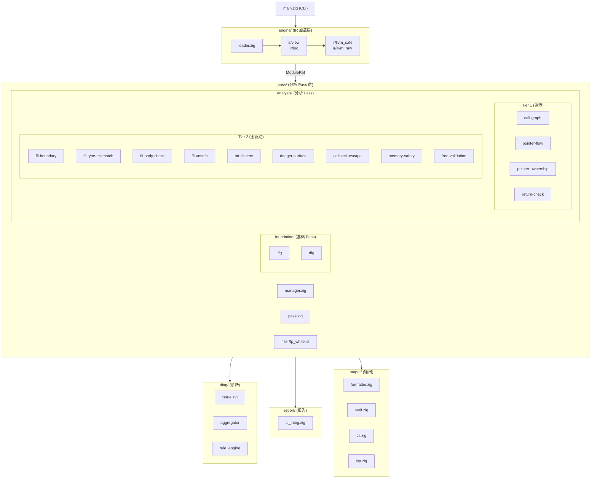
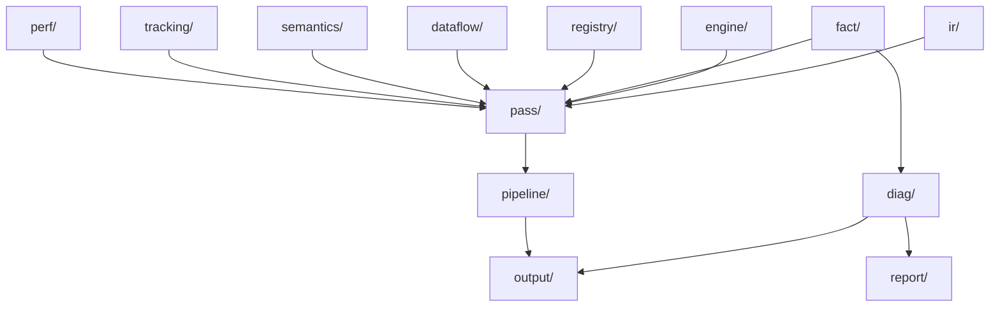

# 模块索引

> "居然都能跑起来。大部分时候。"

> 版本: v0.2.0 | 最后更新: 2026-05-29

OmniScope 由若干个模块组成，每个模块各司其职。下面是完整的模块地图。

## 架构总览



## 模块详解

### `ir/` -- LLVM IR 包装层

**一切的基础。**

对 LLVM C API 的 Zig 包装。我们不想让 unsafe 的 C 指针到处乱飞，所以做了这一层。

| 文件 | 职责 |
|------|------|
| `llvm_raw.zig` | LLVM C API 的原始绑定。unsafe，但诚实。 |
| `llvm_safe.zig` | 安全包装。资源生命周期由 IRLoader 管理。 |
| `view.zig` | 高层视图类型：`ModuleRef`、`FunctionRef`、`ValueRef`、`BasicBlockRef` |
| `location.zig` | 源码位置追踪（文件名、行号、列号） |
| `debug_info.zig` | LLVM Debug Info 解析，用于源码级定位 |

### `engine/` -- IR 加载引擎

| 文件 | 职责 |
|------|------|
| `loader.zig` | 加载 `.bc` / `.ll` 文件，管理 LLVM Context 生命周期。遵循"单一所有者"原则：只有 IRLoader 能释放资源。 |

### `pass/` -- 分析 Pass 层

**大脑。**

所有分析逻辑都在这里。每个 pass 是一个独立的分析单元，通过 `PassManager` 按依赖顺序执行。

#### `pass/pass.zig` -- Pass 上下文与接口

这是 pass 系统的核心。定义了：
- `PassContext` -- 所有 pass 共享的上下文（图数据、issue 报告、zone 缓存）
- `Pass` -- comptime 泛型接口，零运行时开销
- `CrossLangEdge` -- 跨语言调用边
- `GlobalAllocTracker` -- 全局分配追踪器
- `CallSiteIndex` -- 共享的 callee -> call_sites 索引，O(1) 查找

#### `pass/manager.zig` -- Pass 管理器

负责 pass 注册、依赖解析（拓扑排序）和执行调度。检测循环依赖并报错。

#### `pass/foundation/` -- 基础 Pass

| Pass | 文件 | 职责 |
|------|------|------|
| `cfg` | `cfg.zig` | 构建控制流图（CFG），输出 `cfg_edge` fact |
| `dfg` | `dfg.zig` | 构建数据流图（DFG），依赖 cfg。输出 `dfg_edge` fact |

#### `pass/analysis/` -- 分析 Pass（13 个）

详见 [Pass 参考](./passes_zh.md)。

#### `pass/filter/` -- 误报过滤器

| 文件 | 职责 |
|------|------|
| `fp_whitelist.zig` | 白名单过滤，减少已知安全模式的误报 |
| `fp_precision_guard.zig` | 精度守卫，控制报告的精度阈值 |

#### `pass/instrumentation/` -- 插桩

| 文件 | 职责 |
|------|------|
| `planner.zig` | 插桩规划器 |

### `dataflow/` -- 数据流分析框架

**pass 之间不用大喊大叫就能交流的方式。**

| 文件 | 职责 |
|------|------|
| `graph.zig` | 数据流图（DataFlowGraph）实现 |
| `node.zig` | 图节点定义 |
| `edge.zig` | 图边定义 |
| `value_id_map.zig` | LLVM Value -> 内部 ID 的映射 |
| `function_summary.zig` | 函数摘要，用于过程间分析 |
| `path_condition.zig` | 路径条件追踪 |
| `guard_propagation.zig` | Guard 传播分析 |
| `null_check_guard.zig` | Null check guard 分析 |

### `fact/` -- 事实存储系统

**像俄罗斯套娃，不过是套指针。**（好吧，其实是嵌套的事实存储。）

| 文件 | 职责 |
|------|------|
| `fact.zig` | Fact 类型定义（`FactKind` 枚举） |
| `store.zig` | Fact 存储引擎，支持高效索引和查询 |
| `query.zig` | Fact 查询引擎 |

### `semantics/` -- 语义知识库

**这个我们是用血泪换来的。** 每个函数的语义、噪声过滤、zone 分类——全在这里。

| 文件 | 职责 |
|------|------|
| `memory_graph.zig` | 内存图（MemoryGraph）—— 指针分配、生命周期、跨边界流动 |
| `memory_graph_types.zig` | MemoryGraph 类型定义 |
| `memory_graph_fuzzy.zig` | MemoryGraph 模糊匹配 |
| `memory_relations.zig` | 内存关系追踪（alloc/free 配对） |
| `allocator_kb.zig` | 分配器知识库（400+ 函数的语义信息） |
| `noise_filter.zig` | 噪声过滤器——区分真正的 bug 和无害的模式 |
| `zone_classifier.zig` | Zone 分类器：safe / unsafe / ffi / unknown |
| `language_detector.zig` | 语言检测器——判断函数是用什么语言写的 |
| `path_filter.zig` | 路径过滤器 |
| `behavior_filter.zig` | 行为过滤器 |
| `output_param_classifier.zig` | 输出参数分类器 |
| `intrinsic_filter.zig` | LLVM intrinsic 过滤器 |
| `call_graph.zig` | 语义层的调用图 |

### `registry/` -- 语义注册表

函数语义知识库。分层管理，支持动态加载。

| 文件 | 职责 |
|------|------|
| `semantic_registry.zig` | 主注册表，311 函数的语义信息（含 14 个 static_buffer 函数） |
| `config_loader.zig` | 从 JSON 配置动态加载注册表 |
| `hooks.zig` | Hook 注册表（`into_raw` / `from_raw` 配对追踪） |
| `types.zig` | 注册表类型定义 |
| `layer1_reg.zig` ~ `layer6_reg.zig` | 分层注册表（按风险等级） |
| `posix_io_reg.zig` | POSIX I/O 函数注册 |
| `posix_thread_reg.zig` | POSIX 线程函数注册 |
| `jni_reg.zig` | JNI 函数注册 |
| `python_c_api_reg.zig` | Python C API 注册 |
| `sanitizer_registry.zig` | Sanitizer 注册 |
| `dynamic_loading_reg.zig` | 动态加载函数注册 |

### `diag/` -- 诊断系统

| 文件 | 职责 |
|------|------|
| `issue.zig` | Issue 类型定义 + Confidence 系统（HIGH/MEDIUM/HEURISTIC/EXPERIMENTAL） |
| `aggregator.zig` | Issue 聚合器 |
| `rule_engine.zig` | 规则引擎 |

### `output/` -- 输出系统

**因为'太慢了'不是一个有用的 bug 报告。** 所以我们提供了多种精确的输出格式。

| 文件 | 职责 |
|------|------|
| `formatter.zig` | 文本格式化输出 |
| `cli.zig` | CLI 输出 |
| `sarif.zig` | SARIF v2.1.0 格式输出（14 条规则，GitHub Code Scanning 兼容） |
| `lsp.zig` | LSP 集成 |
| `lib.zig` | 输出模块入口 |

### `report/` -- 报告生成

| 文件 | 职责 |
|------|------|
| `ci_integration.zig` | CI/CD 集成 |

### `pipeline/` -- 流水线编排

| 文件 | 职责 |
|------|------|
| `pipeline.zig` | 分析流水线编排。初始化 `PassContext`，按拓扑序执行所有 pass |

### `tracking/` -- 内存追踪

| 文件 | 职责 |
|------|------|
| `mod.zig` | 内存分配追踪 |

### `perf/` -- 性能分析

| 文件 | 职责 |
|------|------|
| `profiler.zig` | 性能分析器（`Profiler`、`ScopedTimer`） |
| `memory_pool.zig` | 内存池，减少分配开销 |

### `ffi/` -- FFI 类型系统

| 文件 | 职责 |
|------|------|
| （各类型定义文件） | FFI 边界类型系统 |

### `lifetime/` -- 生命周期追踪

| 文件 | 职责 |
|------|------|
| `root.zig` | 生命周期追踪根模块 |

### `common/` -- 共享工具

日志、工具函数等。

### `visual/` -- 可视化辅助

可视化工具函数。

## 模块依赖关系



## 共享图数据结构

这些是 pass 之间传递数据的核心结构：

| 结构 | 产生者 | 消费者 | 说明 |
|------|--------|--------|------|
| `CrossLangEdge` | call-graph | ptr-lifetime, ffi-boundary, callback-escape, danger-surface | 跨语言调用边 |
| `MemoryGraph` | ptr-lifetime | danger-surface, free-validation | 指针分配和生命周期图 |
| `DangerSurface` markers | danger-surface | ptr-lifetime, callback-escape, free-validation, memory-safety, taint-propagation | 危险路径标记 |
| `CallSiteIndex` | pipeline (预构建) | call-graph, ffi-boundary | callee -> call_sites O(1) 索引 |
| `GlobalAllocTracker` | pipeline | 各分析 pass | 全局分配追踪 |

## Zone 分类

每个函数和指针被分类到四个 zone 之一：

| Zone | 含义 | Issue 报告 |
|------|------|------------|
| **safe** | 纯 C/C++ 内部，无 FFI 接触 | 仅 Tier 1（不报告 issue） |
| **unsafe** | 包含 `unsafe` 块或裸指针转换 | Tier 2 候选 |
| **ffi** | 声明为 `extern "C"` 或跨语言调用 | Tier 2 候选 |
| **unknown** | 信息不足，无法分类 | 延迟（解决前不报告 issue） |

分类结果按函数缓存，避免重复计算。当 `call-graph` pass 新增 `CrossLangEdge` 时触发缓存失效。

## `isOnDangerPath` 门控

所有 Tier 2 pass 在报告 issue 之前都必须经过这个检查：

```zig
fn isOnDangerPath(fn_or_ptr: ID) bool {
    return dangerSurfaceMarkers.contains(fn_or_ptr);
}
```

不在危险路径上的函数/指针？直接跳过。这个单一门控防止了非 FFI 内部代码路径的噪声。

## 支持的语言

| 语言 | IR 分析 | Ownership 追踪 | FFI 边界 |
|------|---------|----------------|----------|
| C | 完整 | 完整 | 完整 |
| C++ | 完整 | 完整 | 完整 |
| Rust | 完整 (LLVM IR) | 完整 | 完整 (Tier 2) |
| Zig | Beta | Beta | Beta |
| Go | 实验 | 实验 | 实验 |
