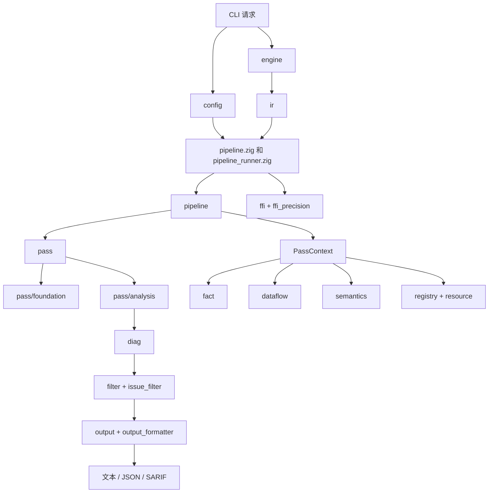
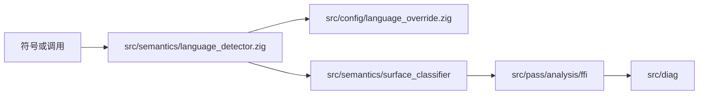
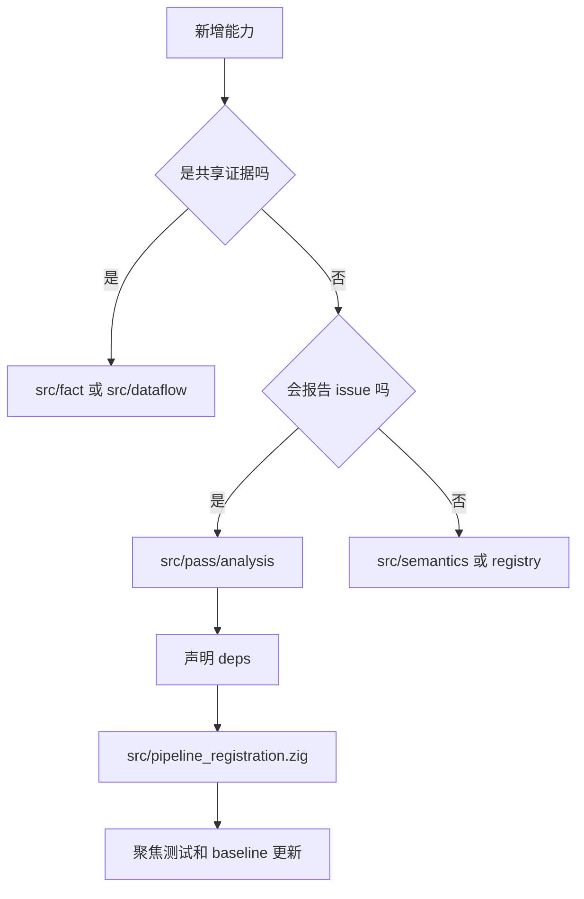

# 按问题理解模块

本文按 OmniScope 实际要解决的问题解释模块。这里的“模块”指 Zig 顶层目录、`src/root.zig` 中的公开导出，或关键顶层文件；它不是 Rust workspace。

如果你已经知道问题，但不知道该看哪个文件，从这里开始。每节都说明：问题是什么、项目怎么处理、主要文件在哪里、和哪些模块配合。

## 系统地图

整个系统围绕 `PassContext` 展开。pass 通常应该从这个上下文读取 IR、facts、图、语义状态和资源摘要，而不是自己再建一套私有模型。

## 发布状态背景

仓库版本口径是 `0.2.0`，但当前工作区更适合作为 release candidate。`zig build` 可以通过，`zig build test` 当前未通过，`tests/BASELINE.md` 仍是 pre-fix 口径。模块文档不应暗示它已经可以直接发布最终版本。

## 入口与配置

### 问题

用户从命令行参数和一个或多个 IR 文件开始。分析器需要把这些输入变成一次配置明确的分析运行，同时避免下游模块都去解析 CLI。

### 处理方式

`src/main.zig` 负责 CLI 入口。它通过 `src/config/main_config.zig` 解析参数，初始化日志和配置，然后分发到单文件或多文件分析。

语言覆盖参数在 config 中解析，再注入 pipeline。这样项目特定符号知识不会污染底层语言检测器。

### 主要文件

| 文件或目录 | 作用 |
| --- | --- |
| `src/main.zig` | 程序入口、help/version、输入分发。 |
| `src/config/main_config.zig` | CLI flag、输出格式、严重级别阈值、语言覆盖。 |
| `src/config/file_config.zig` | 配置文件加载。 |
| `src/config/language_override.zig` | 精确名、前缀、后缀、source、default language 覆盖。 |
| `src/pipeline_runner.zig` | 单文件运行和语言 profile 路由。 |

### 协作模块

`engine/` 加载文件，`pipeline.zig` 运行分析，`output_formatter.zig` 输出报告，`semantics/language_detector.zig` 受语言覆盖影响。

### 什么时候读

新增 CLI 参数、调整默认过滤、接配置文件选项，或排查为什么某个文件走了 safety-only 而不是完整 FFI pipeline。

## IR 加载与视图

### 问题

LLVM 值本质上是 C 指针，有明确生命周期。如果每个 pass 都自己持有或释放 LLVM 对象，分析器会很脆弱。

### 处理方式

`engine/loader.zig` 负责 LLVM 加载和释放。`ir/` 提供原始绑定、安全包装、借用视图、debug info、指令缓存、mangling helper 和预收集的 module store。

pass 应该读取借用视图和缓存结构，而不是管理 LLVM 生命周期。

### 主要文件

| 文件或目录 | 作用 |
| --- | --- |
| `src/engine/loader.zig` | 加载 `.ll` / `.bc`，持有 LLVM context/module 生命周期。 |
| `src/ir/llvm_raw.zig` | LLVM-C 直接绑定。 |
| `src/ir/llvm_safe.zig` | LLVM 加载和解析的安全包装。 |
| `src/ir/view.zig` | 借用的 `ModuleRef`、`FunctionRef`、value/block 视图。 |
| `src/ir/ir_store.zig` | 预收集函数、指令和调用记录。 |
| `src/ir/inst_cache.zig` | 指令级缓存。 |
| `src/ir/debug_info.zig`、`src/ir/location.zig` | debug/source location。 |
| `src/ir/mangling.zig`、`src/ir/ir_helpers.zig` | 符号名和通用 IR helper。 |

### 协作模块

`pipeline/` 构建 `ModuleIRStore`，`pass/analysis/*` 消费函数和指令，`semantics/` 分类符号，`diag/` 使用位置信息。

### 什么时候读

IR 文件加载失败、pass 需要遍历函数/指令、源码位置不对，或某个 pass 因重复扫描 LLVM 变得难维护。

## Pipeline 与共享上下文

### 问题

很多检查都需要同一个 module、fact、数据流图、MemoryGraph、语言 profile、资源摘要和 issue 列表。每个 pass 自己重建会导致结果不一致。

### 处理方式

顶层 `src/pipeline.zig` 提供公开编排函数。`src/pipeline/pipeline.zig` 创建核心 `Pipeline`、共享 store、`PassManager`、`PassContext` 和结果收集。

完整 pass 列表集中在 `src/pipeline_registration.zig`；safety-only 路径在 `src/pipeline.zig` 中有更小的注册列表。

### 主要文件

| 文件或目录 | 作用 |
| --- | --- |
| `src/pipeline.zig` | `runModulePipeline`、`runSafetyOnlyPipeline`、`runMultiFileAnalysis`。 |
| `src/pipeline/pipeline.zig` | 核心 pipeline 状态和 `PassContext` 构造。 |
| `src/pipeline/traversal_index.zig` | 共享调用遍历和索引记录。 |
| `src/pipeline/parallel.zig` | 并行辅助。 |
| `src/pipeline_registration.zig` | 完整 pipeline 的 pass 注册。 |
| `src/types/pass_types.zig`、`src/types/pass_defs.zig` | pass/context 共享类型。 |

### 协作模块

`engine/` 和 `ir/` 提供 module；`pass/manager.zig` 跑 pass；`fact/`、`dataflow/`、`semantics/`、`resource/`、`diag/` 挂到 context 上。

### 什么时候读

想知道 `PassContext` 里有什么、某个 pass 为什么运行或没运行、单文件和多文件执行有什么区别。

## Pass 系统

### 问题

分析逻辑分散在很多检查中。它们需要顺序、依赖、诊断和统一接口。

### 处理方式

每个 pass 类型暴露 `name`、`kind`、`deps` 和 `run`。manager 解析依赖后，用共享 context 和 diagnostic writer 调用每个 pass。是否进入默认 pipeline 取决于注册列表。

### 主要文件

| 区域 | 作用 |
| --- | --- |
| `src/pass/pass.zig` | 重新导出 pass 接口和 context 类型。 |
| `src/pass/manager.zig` | 依赖解析、pass 执行、可选统计。 |
| `src/pass/pass_context_impl.zig` | context helper，包括 issue 写入/过滤路径。 |
| `src/pass/foundation/cfg.zig`、`src/pass/foundation/dfg.zig` | 基础图 pass。 |
| `src/pass/analysis/` | 主要分析检查。 |
| `src/pass/filter/` | pass 侧 issue gate、precision guard、whitelist。 |
| `src/pass/instrumentation/planner.zig` | 插桩规划。 |

### 分析区域

| 区域 | 负责的问题 |
| --- | --- |
| `call_graph.zig`、`taint/`、`alias.zig` | 调用关系、指针/数据流、alias 证据。 |
| `ffi/` | FFI 边界、类型、layout、string、unwind、GC safety、错误传播。 |
| `issue/` | return check、malloc check、memory safety、free validation 等 issue 型检查。 |
| `ptr_lifetime/` | 指针生命周期、分配来源、逃逸、返回值、释放追踪。 |
| `rust_ffi/` | Rust FFI 规则和 auditor helper。 |
| `resource/` | 资源契约图、候选、验证器、路径分析。 |
| `noise/` | 误报抑制、严重级别和噪声规则。 |
| `surface_classifier_pass.zig`、`semantic_resolver_pass.zig` | 给后续检查提供上下文的 pass。 |

### 协作模块

几乎所有模块：`ir/` 遍历，`fact/` 和 `dataflow/` 存证据，`semantics/` 给语义，`registry/` 和 `resource/` 给已知契约，`diag/` 创建 issue。

### 什么时候读

新增检查、调整依赖、排查重复报告，或追踪原始候选如何变成 issue。

## Facts 与 Data Flow

### 问题

一个 pass 发现的证据，后续 pass 可能要用。证据需要结构化，否则 pass 之间会强耦合。

### 处理方式

`fact/` 保存 typed facts 并支持查询。`dataflow/` 保存图节点、边、摘要、路径条件、value ID 和 guard 信息。它们组成共享证据层。

### 主要文件

| 文件或目录 | 作用 |
| --- | --- |
| `src/fact/fact.zig` | fact 词表。 |
| `src/fact/store.zig` | fact 存储。 |
| `src/fact/query.zig` | 查询 helper。 |
| `src/dataflow/graph.zig` | 主数据流图和 issue 收集路径。 |
| `src/dataflow/node.zig`、`src/dataflow/edge.zig` | 图实体。 |
| `src/dataflow/value_id_map.zig` | LLVM value 到内部 ID 的映射。 |
| `src/dataflow/function_summary.zig`、`summary_propagation.zig` | 摘要传播。 |
| `src/dataflow/path_condition.zig`、`null_check_guard.zig` | 路径和 guard 证据。 |
| `src/dataflow/graph_algorithms.zig` | 可达性和图算法。 |

### 协作模块

foundation pass 填基础结构；analysis pass 读写 fact 和图边；`diag/`、`output/` 消费最终 issue 数据。

### 什么时候读

检查依赖“值能否到达 sink”、“是否做过 null check”、“后续 pass 为什么缺少前序证据”时读这里。

## 语义、Surface 与噪声

### 问题

LLVM IR 自身不会告诉你一个函数是编译器/运行时 glue、用户代码、FFI producer 还是 boundary。只按名字匹配会产生噪声。

### 处理方式

`semantics/` 提供语言检测、zone 分类、surface 分类、语义解析、MemoryGraph、平台/运行时识别、allocator knowledge 和噪声过滤。

### 主要文件

| 区域 | 作用 |
| --- | --- |
| `language_detector.zig`、`language_detector_data.zig` | module/function 语言提示。 |
| `zone_classifier.zig`、`zone_lang_*.zig`、`zone_llvm_path.zig` | safe/runtime/FFI/unknown 类型分类。 |
| `surface_classifier.zig`、`surface_classifier/` | function surface 和边界上下文。 |
| `semantic_tree.zig`、`semantic_patterns.zig`、`resolution_engine.zig` | 语义证据和解释。 |
| `patterns/`、`nomicon/` | 具体语义模式。 |
| `memory_graph*.zig`、`memory_relations.zig` | 分配、释放、逃逸、调用内存模型。 |
| `allocator_kb.zig`、`output_param_classifier.zig`、`container_inference.zig` | 领域辅助知识。 |
| `noise_filter.zig`、`path_filter.zig`、`behavior_filter.zig`、`intrinsic_filter.zig` | 噪声和 runtime 过滤。 |
| `platform_*.zig` | 平台/runtime 归一化和 profile。 |

### 协作模块

`pass/analysis/*` 向 semantics 查询含义；`filter/` 和 `pass/filter/` 在报告前使用语义上下文；`registry/` 提供已知函数语义。

### 什么时候读

finding 看起来像 runtime 噪声、语言识别不对，或某个 pass 需要知道函数名有没有语言/运行时含义。

## Registry 与资源契约

### 问题

有些函数必须依赖外部知识才能解释：`malloc` 分配，`free` 释放，`SSL_new` 应该配 OpenSSL 的释放函数，JNI 和 Python API 有自己的所有权规则。

### 处理方式

`registry/` 保存函数级语义和 hook。`resource/` 保存 FFI contract 数据库和生成数据。`semantics/resource/` 生成 pass 可消费的 summary 和资源所有权状态。

### 主要文件

| 区域 | 作用 |
| --- | --- |
| `src/registry/semantic_registry.zig` | 主语义查询。 |
| `src/registry/layer*_reg.zig` | 分层内置 registry。 |
| `src/registry/jni_reg.zig`、`python_c_api_reg.zig`、`posix_*_reg.zig` | 领域 registry。 |
| `src/registry/config_loader.zig` | 动态 registry 配置。 |
| `src/registry/hooks.zig` | hook 模式。 |
| `src/resource/ffi_contract_db.zig` | 契约数据库 API。 |
| `src/resource/ffi_contract_db_data.zig`、`ffi_contract_data.zig` | 契约数据。 |
| `src/semantics/resource/` | 资源 family、summary、transfer 推断、ownership state。 |

### 协作模块

`pass/analysis/resource/`、`free_validation`、`cross_lang_dataflow`、`semantics/memory_graph` 和过滤逻辑。

### 什么时候读

已知库配对缺失、contract mismatch 看起来不对，或检查需要库/资源语义而不是单纯符号匹配。

## FFI 与语言适配

### 问题

FFI 证据可能来自调用、声明、定义、mangled name、运行时函数或项目特定命名。多文件分析还要把一个 module 的声明和另一个 module 的定义配起来。

### 处理方式

`pass/analysis/ffi/` 包含大多数单 module FFI 检查。`ffi/ffi_matcher.zig` 处理跨文件 declare/define 匹配。`lang/` 提供当前存在的 C/C++、Go、Python adapter。

### 主要文件

| 区域 | 作用 |
| --- | --- |
| `src/pass/analysis/ffi/ffi_boundary.zig` | boundary pass。 |
| `ffi_detector.zig`、`ffi_call_analyzer.zig`、`ffi_language_classifier.zig` | FFI 识别 helper。 |
| `ffi_type_mismatch.zig`、`abi_compat_checker.zig`、`layout_mismatch_detector.zig` | 类型、layout、ABI 检查。 |
| `string_safety_ffi.zig`、`unwind_boundary_checker.zig`、`gc_safety_analyzer.zig` | 专项 FFI safety 检查。 |
| `callback_lifecycle_checker.zig`、`cross_lang_dataflow.zig` | 回调和跨语言数据流行为。 |
| `error_propagation_tracer.zig`、`ffi_analysis.zig` | 其它分析 pass。 |
| `src/ffi/ffi_matcher.zig`、`src/ffi_precision.zig` | 多文件匹配和匹配后过滤。 |
| `src/lang/` | 语言 adapter 类型和 C++/Go/Python adapter。 |
| `src/lifetime/` | 所有权状态和边界 helper。 |

### 协作模块

`semantics/language_detector.zig`、`config/language_override.zig`、`registry/`、`resource/`、`dataflow/`、`diag/`。

### 什么时候读

边界漏报、语言误判、类型 mismatch 可疑，或多文件 FFI 结果不符合预期。

## 诊断、过滤与输出

### 问题

原始候选本身不适合直接给用户。用户需要 issue kind、severity、confidence、location、trace、FFI 上下文和机器可读输出。

### 处理方式

`diag/` 定义 issue 和聚合。`pass_context_impl.zig`、`pass/filter/`、`filter/`、`issue_filter.zig` 共同影响最终 issue 列表。`output_formatter.zig` 和 `output/` 产生文本、JSON、SARIF。

### 主要文件

| 区域 | 作用 |
| --- | --- |
| `src/diag/issue.zig` | Issue 模型、kind、severity、location、FFI boundary 元数据。 |
| `src/diag/aggregator.zig` | 聚合/去重辅助。 |
| `src/pass/pass_context_impl.zig` | issue 写入路径和 context helper。 |
| `src/pass/filter/issue_gate.zig`、`fp_precision_guard.zig`、`fp_whitelist.zig` | pass 级过滤。 |
| `src/filter/` | 通用分类、pattern registry、规则定制。 |
| `src/issue_filter.zig` | 输出侧 issue 过滤。 |
| `src/output_formatter.zig` | CLI/JSON/SARIF 主格式化路径。 |
| `src/output/formatter.zig`、`src/output/sarif.zig` | 结构化输出辅助。 |

### 协作模块

所有会报告 issue 的 pass、CLI 选项、severity 阈值、surface filter 和 CI 工具。

### 什么时候读

issue 内部存在但输出里没有、JSON/SARIF 字段不对、severity 过滤异常，或出现重复报告。

## 支撑模块

| 模块 | 解决的问题 | 说明 |
| --- | --- | --- |
| `src/common/` | 日志、arena、string interner、模式匹配、共享类型。 | 被大量模块使用；不要放分析策略。 |
| `src/types/` | 拆出的共享类型定义。 | 子系统跨文件共享 struct/enum 时使用。 |
| `src/analysis/` | escape、RAII 等额外分析 helper。 | 先查调用点，不要当成主 pipeline 入口。 |
| `src/detectors/` | detector helper。 | 支撑角色，不是 pass 注册中心。 |
| `src/whitelists/` | 内部模式白名单。 | 条目应有证据支撑。 |
| `src/utils/` | 小工具函数。 | 只有确实复用时才放这里。 |
| `src/perf/` | profiling、pass stats、memory pool、benchmark compare。 | 查运行时间和内存成本时使用。 |
| `src/visual/` | 代码侧图可视化 helper。 | 文档图仍使用 Mermaid。 |
| `src/root.zig` | 包公开导出面。 | 先查这里，再判断外部是否能 `@import("OmniScope")` 使用某模块。 |

## 阅读路径

### 为什么报了这个 issue？

按这个顺序读，因为输出格式通常不是做出判断的地方。

### 为什么它被判成 FFI？

如果项目符号特殊，先试配置覆盖，再考虑改核心语言检测。

### 如何新增一个检查？

只有应该默认运行的检查才注册进完整 pipeline。
