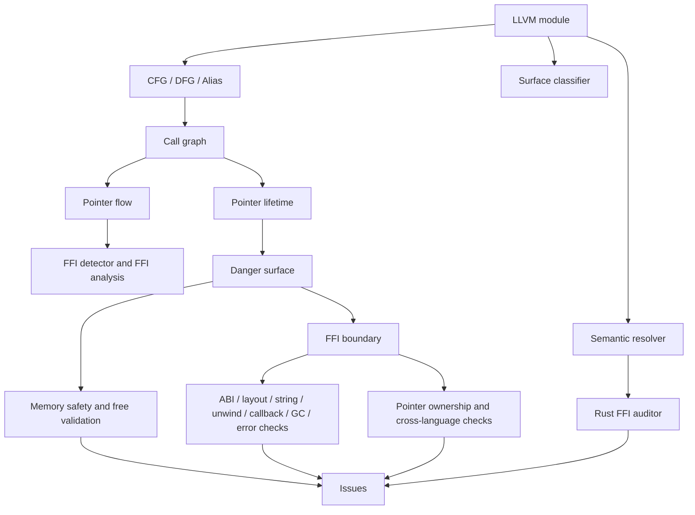
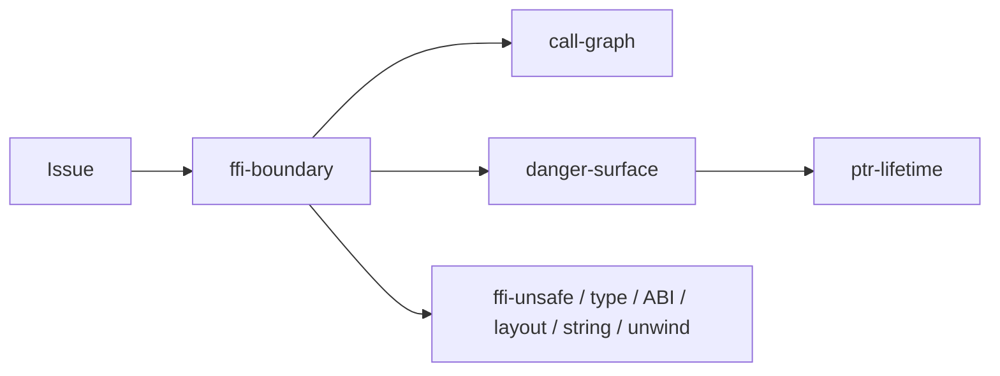
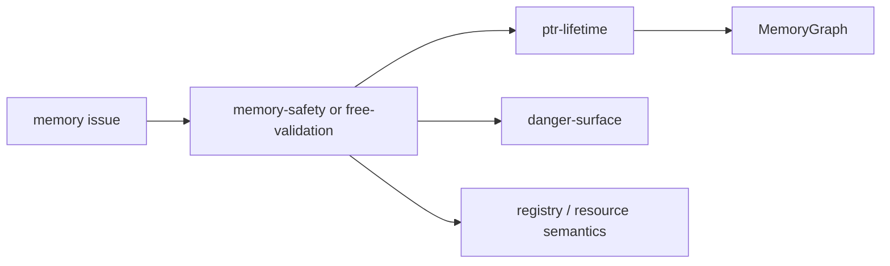
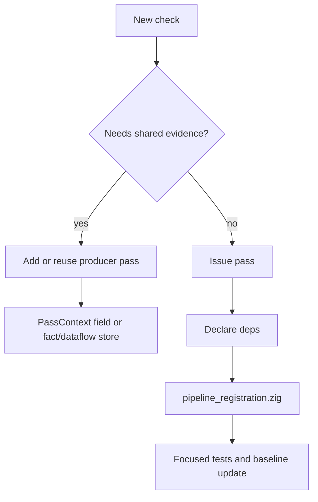

# Pass 设计指南

本文说明 `src/pipeline_registration.zig` 在 `0.2.0` 完整 pipeline 中注册的 pass。它是代码阅读指南，不是准确率或效果承诺。

每个 pass 按四个问题说明：

- 它试图隔离什么问题？
- 当前代码里的设计思路是什么？
- 它通过 `PassContext` 读取或产出什么？
- 它通常和哪些 pass 配合？

`src/pipeline.zig` 里的 safety-only 路径只注册较小子集：`call-graph`、`malloc-check`、`buffer-overflow`、`integer-overflow`、`ptr-lifetime`、`danger-surface`、`memory-safety`、`free-validation`、`callback-escape`。

## Pipeline 形状

这张图是概念图。实际执行顺序由 `src/pass/manager.zig` 根据每个 pass 的 `deps` 解析；如果某个 pass 没声明依赖，当前行为仍会受 `src/pipeline_registration.zig` 注册顺序影响。

## 共享约定

| 约定 | 代码位置 | 为什么重要 |
| --- | --- | --- |
| Pass 元数据 | 每个 pass 的 `name`、`kind`、`deps` | 决定依赖解析。 |
| 上下文 | `src/pass/pass.zig`、`src/types/pass_types.zig`、`src/pass/pass_context_impl.zig` | 共享 module、IR store、facts、data-flow graph、memory graph、语义状态和 issue 写入。 |
| 完整注册表 | `src/pipeline_registration.zig` | 定义完整 pipeline 的 pass 集合。 |
| Safety-only 注册 | `src/pipeline.zig` | 定义单语言安全路径的较小 pass 集合。 |
| Issue 模型 | `src/diag/issue.zig` | 统一 kind、severity、confidence、trace 和 location。 |

## 基础与上下文 Pass

### `cfg`

| 字段 | 值 |
| --- | --- |
| 文件 | `src/pass/foundation/cfg.zig` |
| 类型 | `foundation` |
| 依赖 | 无 |
| 标准 issue 输出 | 否 |

问题：后续检查需要基本块之间的关系，但不应该让每个 pass 各自遍历 terminator。

设计：从 LLVM module 扫描函数和基本块，把控制流边记录为 fact。它保持低层职责，不判断某条路径是否危险。

配合：`dfg` 和 `alias` 依赖稳定的 block/instruction 结构。诊断 pass 应通过共享上下文读取，而不是自己重建 CFG。

### `dfg`

| 字段 | 值 |
| --- | --- |
| 文件 | `src/pass/foundation/dfg.zig` |
| 类型 | `foundation` |
| 依赖 | `cfg` |
| 标准 issue 输出 | 否 |

问题：指针、taint、所有权检查都需要值依赖，但 def-use 遍历容易被重复实现。

设计：遍历指令操作数并产出数据流 fact。PHI 处理放在这一层，让上层 pass 关注值关系，而不是 operand 细节。

配合：`alias`、`ffi-detector`、`ownership-violation` 声明依赖 `dfg` 或消费数据流证据。

### `alias`

| 字段 | 值 |
| --- | --- |
| 文件 | `src/pass/analysis/alias.zig` |
| 类型 | `analysis` |
| 依赖 | `cfg`、`dfg` |
| 标准 issue 输出 | 否 |

问题：内存检查经常要知道两个值是否可能指向同一块存储。

设计：基于 CFG/DFG 层事实构建 alias 证据，放入共享结构。它不是全程序 alias 引擎，而是给后续 pass 一个共同的局部信号。

配合：`ptr-lifetime`、`memory-safety`、`free-validation` 和 instrumentation planning 在需要指针等价或保守不确定性时使用它。

### `surface-classifier`

| 字段 | 值 |
| --- | --- |
| 文件 | `src/pass/analysis/surface_classifier_pass.zig` |
| 类型 | `foundation` |
| 依赖 | 无 |
| 标准 issue 输出 | 否 |

问题：函数名本身不能说明它是用户代码、运行时 glue、平台代码，还是面向边界的函数。

设计：调用 `semantics/surface_classifier*` helper，对函数做 surface 分类，并把结果挂到 `PassContext`。

配合：issue 过滤、FFI pass、`ptr-lifetime` 和输出决策会用它区分用户证据与运行时/内部噪声。

### `SemanticResolver`

| 字段 | 值 |
| --- | --- |
| 文件 | `src/pass/analysis/semantic_resolver_pass.zig` |
| 类型 | `analysis` |
| 依赖 | 无 |
| 标准 issue 输出 | 否 |

问题：有些符号要先解释语义，才能判断它是 allocator、release function、runtime glue 还是语言构造。

设计：基于 `semantics/` 和 `registry/` 的知识构建语义解析状态，并放到共享上下文。

配合：`rust-ffi-filter`、噪声过滤、内存检查和资源检查会读取它，避免只靠字符串匹配。

## 通用安全 Pass

### `malloc-check`

| 字段 | 值 |
| --- | --- |
| 文件 | `src/pass/analysis/issue/malloc_check.zig` |
| 类型 | `analysis` |
| 依赖 | 无 |
| 标准 issue 输出 | 是 |

问题：未检查的分配返回值可能演变成空指针解引用或错误处理缺失。

设计：扫描 allocation-like 函数调用，检查返回值使用前是否有 guard。这个 pass 比较直接，阅读时应结合 `null_check_guard.zig` 和输出过滤。

配合：`memory-safety` 和 `free-validation` 可能之后把同一个 allocation 当作生命周期或释放事件继续分析。

### `buffer-overflow`

| 字段 | 值 |
| --- | --- |
| 文件 | `src/pass/analysis/buffer_overflow.zig` |
| 类型 | `analysis` |
| 依赖 | 无 |
| 标准 issue 输出 | 是 |

问题：不安全 copy/format 模式在缺少 buffer size 证据时可能形成内存破坏风险。

设计：在 IR call site 中查找风险 buffer 操作，并带上可见上下文报告候选。它是模式型 pass，不替代动态 bounds checking。

配合：`surface-classifier`、`ffi-boundary` 和 issue filter 用来把报告收敛到配置关注的代码范围。

### `integer-overflow`

| 字段 | 值 |
| --- | --- |
| 文件 | `src/pass/analysis/issue/integer_overflow.zig` |
| 类型 | `analysis` |
| 依赖 | 无 |
| 标准 issue 输出 | 是 |

问题：用于 size、count 或 allocation length 的算术可能在进入内存操作前溢出。

设计：扫描整数运算和相关调用上下文，找出 overflow-sensitive 模式。它报告 IR 中可见的候选，不证明所有算术路径。

配合：`buffer-overflow`、`malloc-check`、`memory-safety`，因为 size 计算经常流向分配和拷贝行为。

### `return-check`

| 字段 | 值 |
| --- | --- |
| 文件 | `src/pass/analysis/issue/return_check.zig` |
| 类型 | `analysis` |
| 依赖 | 无 |
| 标准 issue 输出 | 是 |

问题：忽略 allocation、I/O、系统调用等 API 的返回值会掩盖失败路径。

设计：匹配返回值敏感函数，检查返回值是否被消费或检查。

配合：`ffi-body-check` 和 `ffi-unsafe` 可能把同一调用从边界风险或危险 API 角度再次分类。

### `memory-safety`

| 字段 | 值 |
| --- | --- |
| 文件 | `src/pass/analysis/issue/memory_safety.zig` |
| 类型 | `analysis` |
| 依赖 | `danger-surface`、`ptr-lifetime` |
| 标准 issue 输出 | 是 |

问题：double free、use-after-free、疑似 leak 和不安全释放模式需要共享的 allocation/free 状态。

设计：读取 `PassContext` 中的 memory 状态、danger relevance 和函数信息，报告内存安全候选。当前行为应和 memory graph 一起理解，不应当作独立证明器。

配合：`ptr-lifetime` 产出 lifetime/memory graph 证据，`danger-surface` 提供相关性门控，`free-validation` 做释放专项检查。

### `free-validation`

| 字段 | 值 |
| --- | --- |
| 文件 | `src/pass/analysis/issue/free_validation.zig` |
| 类型 | `analysis` |
| 依赖 | `danger-surface`、`ptr-lifetime` |
| 标准 issue 输出 | 是 |

问题：释放栈、全局、外部拥有或 allocator family 不匹配的内存，不等同于只看到一个叫 `free` 的调用。

设计：分类 allocation source 和 release call，再判断 release family 与 pointer origin 是否兼容到足以报告。

配合：`ptr-lifetime`、`pointer-ownership`、`registry/`、`resource/` 和 `semantics/resource/` 提供所有权和 allocator family 知识。

### `lock`

| 字段 | 值 |
| --- | --- |
| 文件 | `src/pass/analysis/lock.zig` |
| 类型 | `analysis` |
| 依赖 | 无 |
| 标准 issue 输出 | 是 |

问题：lock/unlock 不平衡和线程安全问题在源码类型消失后，仍可能表现为调用模式。

设计：检查 lock 相关调用并追踪局部 lock 状态，报告可疑模式。

配合：thread crossing 支撑代码、issue filter 和 surface classification，帮助把并发报告限制在用户或边界代码中。

## 调用、流与生命周期 Pass

### `call-graph`

| 字段 | 值 |
| --- | --- |
| 文件 | `src/pass/analysis/call_graph.zig` |
| 类型 | `foundation` |
| 依赖 | 无 |
| 标准 issue 输出 | 否 |

问题：多数检查都需要知道哪个函数调用哪个符号，以及这个调用是否可能跨边界。

设计：扫描 call instruction，分类 callee，并在 context 中填充调用关系和跨语言边。

配合：`pointer-flow`、`ffi-type-mismatch`、`ptr-lifetime`、`danger-surface`、`ffi-boundary`、`callback-escape`、`gc-safety` 和 error/callback 检查。

### `pointer-flow`

| 字段 | 值 |
| --- | --- |
| 文件 | `src/pass/analysis/taint/taint_propagation.zig` |
| 类型 | `foundation` |
| 依赖 | `call-graph` |
| 标准 issue 输出 | 否 |

问题：FFI 和所有权检查需要知道 pointer-like 值如何通过参数、返回值和赋值移动。

设计：通过共享 data-flow graph 和 call record 传播 pointer/taint 风格状态。

配合：`ffi-detector`、`ownership-violation`、`cross-lang-dataflow` 明确依赖 pointer-flow 证据。

### `ptr-lifetime`

| 字段 | 值 |
| --- | --- |
| 文件 | `src/pass/analysis/ptr_lifetime/ptr_lifetime.zig` |
| 类型 | `analysis` |
| 依赖 | `call-graph` |
| 标准 issue 输出 | 是 |

问题：raw pointer 可能比栈存储活得更久、通过 callback 逃逸，或被错误的语言/runtime family 释放。

设计：从 `ir_store` 分析函数，更新共享 memory graph，记录 allocation/free/escape 证据，并在当前规则证据足够时报告 lifetime violation。

配合：`danger-surface`、`memory-safety`、`free-validation`、`callback-escape`、资源 family registry 和语义过滤。

### `danger-surface`

| 字段 | 值 |
| --- | --- |
| 文件 | `src/pass/analysis/danger_surface.zig` |
| 类型 | `analysis` |
| 依赖 | `call-graph`、`ptr-lifetime` |
| 标准 issue 输出 | 否 |

问题：如果把所有内部 helper 都当成 FFI 边界，报告会很难审。

设计：标记靠近 FFI 或其它危险表面的函数、指针或路径。它使用 call graph 和 memory graph 证据，再通过 `PassContext` 暴露相关性 helper；它主要是后续报告 pass 的相关性生产者。

配合：`ffi-boundary`、`callback-escape`、`memory-safety`、`free-validation` 在报告前使用 danger-surface 状态。

### `pointer-ownership`

| 字段 | 值 |
| --- | --- |
| 文件 | `src/pass/analysis/pointer_ownership.zig` |
| 类型 | `analysis` |
| 依赖 | `ffi-boundary` |
| 标准 issue 输出 | 否 |

问题：所有权可能在 FFI 边界转移，但 LLVM IR 不会直接编码这个策略。

设计：追踪 FFI 边界附近的分配和释放行为，并把所有权证据留给下游检查使用。当前代码不直接写入标准 issue。

配合：`ffi-boundary` 产出边界，`ptr-lifetime` 和 `free-validation` 提供 memory 证据，registry 提供 allocator/release 语义。

## FFI 边界 Pass

### `ffi-detector`

| 字段 | 值 |
| --- | --- |
| 文件 | `src/pass/analysis/ffi/ffi_detector.zig` |
| 类型 | `analysis` |
| 依赖 | `cfg`、`dfg`、`pointer-flow` |
| 标准 issue 输出 | 否 |

问题：FFI 证据分散在声明、调用、签名、名字和 pointer flow 中。

设计：把图和 pointer-flow 证据与 FFI 分类器结合，找出候选边界问题。当前代码记录 pass 内部 vulnerability 数据和诊断日志，而不是通过 `ctx.addIssue` 写入标准 issue。

配合：`ffi-boundary`、`ownership-violation`、`ffi-type-mismatch` 和输出过滤。它是候选生产者，不是唯一边界真相来源。

### `ffi-boundary`

| 字段 | 值 |
| --- | --- |
| 文件 | `src/pass/analysis/ffi/ffi_boundary.zig` |
| 类型 | `foundation` |
| 依赖 | `call-graph`、`danger-surface` |
| 标准 issue 输出 | 是 |

问题：下游 FFI 检查需要共享的“这是边界”定义。

设计：使用 call graph、danger-surface、语言分类和 FFI helper 识别边界点，并把边界元数据附着到 issue/context。

配合：`pointer-ownership`、`ffi-unsafe`、`ffi-body-check`、`abi-compat-checker`、`cross-lang-dataflow`、`callback-lifecycle`、`gc-safety`、`error-propagation-tracer`、`jni-leak-detector`。

### `ffi-type-mismatch`

| 字段 | 值 |
| --- | --- |
| 文件 | `src/pass/analysis/ffi/ffi_type_mismatch.zig` |
| 类型 | `analysis` |
| 依赖 | `call-graph` |
| 标准 issue 输出 | 是 |

问题：源语言可能在整数宽度、符号、指针类型、enum 表示或 struct layout 上理解不同。

设计：检查 FFI call/signature 证据，报告 IR 层可见的不匹配。IR 不保留源码 layout 意图时，它会保持保守。

配合：`call-graph`、`ffi-boundary`、`abi-compat-checker`、`layout_mismatch`。

### `abi-compat-checker`

| 字段 | 值 |
| --- | --- |
| 文件 | `src/pass/analysis/ffi/abi_compat_checker.zig` |
| 类型 | `analysis` |
| 依赖 | `call-graph`、`ffi-boundary` |
| 标准 issue 输出 | 是 |

问题：即便类型名看起来兼容，ABI 细节仍可能让边界不安全。

设计：检查 ABI 敏感签名和 call boundary 元数据，找兼容性问题。

配合：`ffi-type-mismatch`、`layout_mismatch`、`ffi-boundary`；这些 pass 把类型、layout、ABI 问题拆开，让报告能指向更窄原因。

### `ffi-body-check`

| 字段 | 值 |
| --- | --- |
| 文件 | `src/pass/analysis/issue/ffi_body_check.zig` |
| 类型 | `analysis` |
| 依赖 | `ffi-boundary` |
| 标准 issue 输出 | 是 |

问题：导出函数或边界函数内部可能调用危险 API，即使边界签名本身看起来普通。

设计：检查 FFI boundary 上下文中的函数体，报告风险调用或模式。

配合：`ffi-boundary`、`ffi-unsafe`、语义过滤和 surface classification。

### `ffi-unsafe`

| 字段 | 值 |
| --- | --- |
| 文件 | `src/pass/analysis/issue/ffi_unsafe.zig` |
| 类型 | `analysis` |
| 依赖 | `ffi-boundary` |
| 标准 issue 输出 | 是 |

问题：有些调用主要因为发生在 FFI 边界附近才变得有审计价值。

设计：在 boundary context 存在后匹配已知 unsafe API 或控制流模式，再通过标准 issue 路径报告。

配合：`ffi-body-check`、`return-check`、`buffer-overflow` 和 issue filter。

### `ownership-violation`

| 字段 | 值 |
| --- | --- |
| 文件 | `src/pass/analysis/ffi/ffi_analysis.zig` |
| 类型 | `analysis` |
| 依赖 | `cfg`、`dfg`、`pointer-flow` |
| 标准 issue 输出 | 否 |

问题：所有权违规可能在 pointer-flow 和 allocation/free 行为中可见，即使还没有进入专门的 resource-family 检查。

设计：在 CFG/DFG/pointer-flow 证据上运行 FFI ownership analysis，并在 pass 局部分析状态中收集 ownership finding。标准 issue 输出通常由更专门的内存和跨语言 pass 完成。

配合：`pointer-flow`、`pointer-ownership`、`ptr-lifetime`、`free-validation`、`cross-lang-dataflow`。

### `cross-lang-dataflow`

| 字段 | 值 |
| --- | --- |
| 文件 | `src/pass/analysis/ffi/cross_lang_dataflow.zig` |
| 类型 | `analysis` |
| 依赖 | `ffi-boundary`、`pointer-flow` |
| 标准 issue 输出 | 是 |

问题：一个值可能在一种语言/runtime 中创建，经过多次调用后在另一种语言中消费。

设计：把边界元数据和 pointer-flow edge 结合，寻找跨语言传播和所有权转移候选。

配合：`ffi-boundary`、`pointer-flow`、`ptr-lifetime`、`pointer-ownership` 和资源契约检查。

### `layout_mismatch`

| 字段 | 值 |
| --- | --- |
| 文件 | `src/pass/analysis/ffi/layout_mismatch_detector.zig` |
| 类型 | `analysis` |
| 依赖 | 无 |
| 标准 issue 输出 | 是 |

问题：struct layout、padding、alignment 或 representation 可能跨语言不一致。

设计：检查 layout 相关 IR 和已知 FFI 模式，报告 mismatch 候选。因为没有显式依赖，移动它之前应先检查注册顺序和 helper 使用。

配合：概念上配合 `ffi-type-mismatch`、`abi-compat-checker`、`ffi-boundary`，但当前元数据没有声明这些依赖。

### `string_safety_ffi`

| 字段 | 值 |
| --- | --- |
| 文件 | `src/pass/analysis/ffi/string_safety_ffi.zig` |
| 类型 | `analysis` |
| 依赖 | 无 |
| 标准 issue 输出 | 是 |

问题：字符串跨 FFI 时可能丢失长度、编码、终止符或所有权信息。

设计：扫描字符串相关 FFI 调用模式，报告可疑转换或使用。

配合：概念上配合 `ffi-boundary`、`ffi-type-mismatch`、`ptr-lifetime`；因为 `deps` 为空，不能假设依赖顺序已经表达出来。

### `unwind-boundary`

| 字段 | 值 |
| --- | --- |
| 文件 | `src/pass/analysis/ffi/unwind_boundary_checker.zig` |
| 类型 | `analysis` |
| 依赖 | 无 |
| 标准 issue 输出 | 是 |

问题：exception 或 panic 穿过 C ABI 边界可能违反语言/runtime 预期。

设计：查找 IR 中 unwind-sensitive boundary 模式，并报告可能跨 FFI 逃逸的候选。

配合：概念上配合 `ffi-boundary`、`rust-ffi-filter` 和语言检测；当前依赖元数据为空。

## 语言与运行时专项 Pass

### `jni-leak-detector`

| 字段 | 值 |
| --- | --- |
| 文件 | `src/pass/analysis/issue/jni_leak_detector.zig` |
| 类型 | `analysis` |
| 依赖 | `ffi-boundary` |
| 标准 issue 输出 | 是 |

问题：JNI 有 local/global reference 规则，只看普通 C 调用容易漏掉。

设计：围绕 boundary context 检查 JNI 风格调用和 reference 管理。

配合：`ffi-boundary`、JNI registry、`ptr-lifetime` 和输出过滤。

### `rust-ffi-filter`

| 字段 | 值 |
| --- | --- |
| 文件 | `src/pass/analysis/rust_ffi/rust_ffi_auditor.zig` |
| 类型 | `analysis` |
| 依赖 | `SemanticResolver` |
| 标准 issue 输出 | 是 |

问题：Rust FFI 中的 ownership transfer、`into_raw`/`from_raw`、borrow escape、drop glue 需要 Rust 语义解释。

设计：使用 semantic resolution 和 Rust FFI helper 规则，把候选 FFI 问题与常见 Rust 生成模式区分开。

配合：`SemanticResolver`、`ptr-lifetime`、`free-validation`、`ffi-boundary` 和 Rust 语义过滤。

### `gc-safety`

| 字段 | 值 |
| --- | --- |
| 文件 | `src/pass/analysis/ffi/gc_safety_analyzer.zig` |
| 类型 | `foundation` |
| 依赖 | `ffi-boundary`、`call-graph` |
| 标准 issue 输出 | 是 |

问题：GC 语言的 pointer lifetime 规则不同于 C 所有权规则。

设计：检查 boundary call 和 call graph 上下文中的 GC-sensitive pointer 传递和保留模式。

配合：`callback-escape`、`cross-lang-dataflow`、语言 adapter 和 `ffi-boundary`。

### `error-propagation-tracer`

| 字段 | 值 |
| --- | --- |
| 文件 | `src/pass/analysis/ffi/error_propagation_tracer.zig` |
| 类型 | `analysis` |
| 依赖 | `ffi-boundary`、`call-graph` |
| 标准 issue 输出 | 是 |

问题：错误值跨 FFI 移动时可能被丢弃或错误翻译。

设计：在 boundary-aware call graph 上下文中追踪 error-like 返回值或调用。

配合：`return-check`、`ffi-body-check`、`ffi-boundary` 和语言/runtime registry。

## Callback Pass

### `callback-escape`

| 字段 | 值 |
| --- | --- |
| 文件 | `src/pass/analysis/callback_escape.zig` |
| 类型 | `analysis` |
| 依赖 | `call-graph`、`danger-surface` |
| 标准 issue 输出 | 是 |

问题：callback 可能在原语言栈帧结束后继续持有 pointer 或 closure。

设计：结合 call graph 和 danger-surface 证据检查 callback 参数和逃逸模式。

配合：`ptr-lifetime`、`gc-safety`、`callback-lifecycle`、`ffi-boundary`。

### `callback-lifecycle`

| 字段 | 值 |
| --- | --- |
| 文件 | `src/pass/analysis/ffi/callback_lifecycle_checker.zig` |
| 类型 | `analysis` |
| 依赖 | `ffi-boundary`、`call-graph` |
| 标准 issue 输出 | 是 |

问题：注册 callback 只是生命周期的一部分，还要考虑 unregister、context 保留和调用时机。

设计：从 call graph 中检查 boundary-aware 的 callback 注册与生命周期模式。

配合：`callback-escape`、`gc-safety`、`ptr-lifetime`、`ffi-boundary`。

## 实际阅读路径

### 为什么出现了边界问题？

先从报告 issue 的 pass 开始，再读它消费的 boundary 和 surface 证据。

### 为什么出现了内存问题？

格式化输出通常不是做判断的地方。应检查 `ctx.addIssue` 调用点，以及它前面直接使用的证据。

### 新增 pass 应该怎么接入？

读取哪个 pass 的产物，就声明哪个依赖。不要依赖注册顺序来表达数据依赖。
