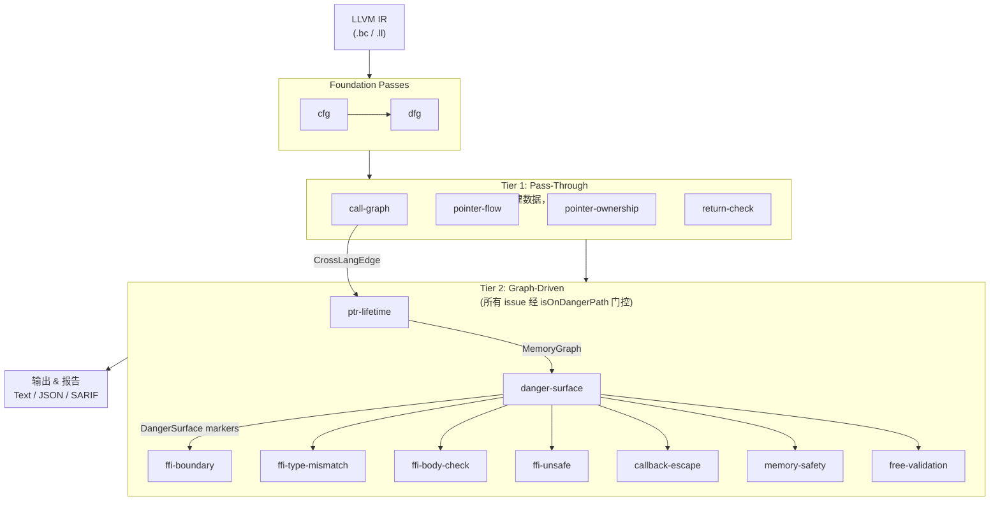
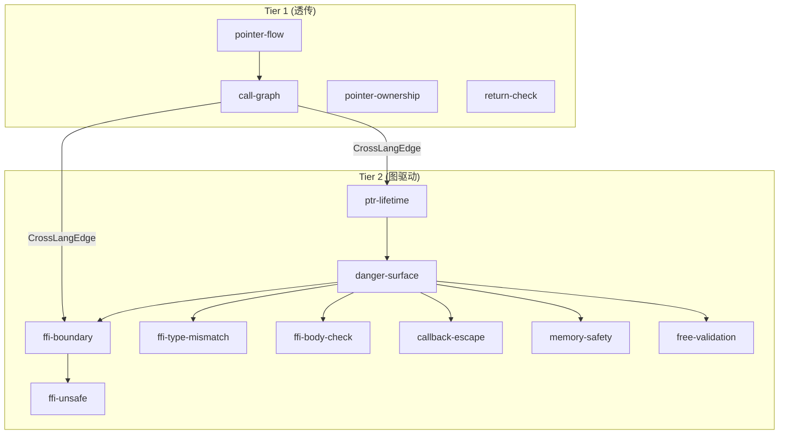
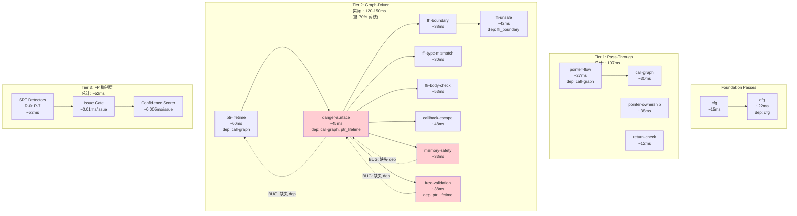

# Pass 参考

> "13 个 pass，一条流水线，对内存 bug 零容忍。"
>
> **⚠️ 实事求是声明**：以下文档反映 v0.2.0 的真实状态，包含实测的性能数据和已知的限制。
>
> 版本: v0.2.0 | 最后更新: 2026-06-01 | 对应代码: VERSION 0.2.0

OmniScope 的分析引擎由 **13 个 pass** 组成（不含 Tier 3 的 SRT/Gate/Scorer），分为 Foundation、Tier 1（透传）和 Tier 2（图驱动）三层。每个 pass 都是独立的分析单元，通过共享图数据结构进行通信。

**重要架构说明**：
- **Tier 1**（4个pass）：构建数据，不报告 issue
- **Tier 2**（9个pass）：FFI/unsafe 边界分析，所有 issue 经 `isOnDangerPath()` 门控
- **Tier 3**（非 pass，而是抑制层）：SRT + Issue Gate + Confidence Scorer，在 issue 发出前进行 FP 抑制

## 数据流总览



## Foundation Passes

### `cfg` -- 控制流图

**一切的基础。**

| 属性 | 值 |
|------|-----|
| 文件 | `src/pass/foundation/cfg.zig` |
| Tier | Foundation |
| 依赖 | 无 |
| 产出 | `cfg_edge` fact |
| 报告 issue | 否 |

构建每个函数的控制流图（CFG）。遍历所有 BasicBlock，记录块间的跳转关系，输出 `cfg_edge` fact 到 FactStore。

没有这个 pass，其他什么都跑不起来。它是分析世界的 `main()`。

```zig
pub const name = "cfg";
pub const kind = PassKind.foundation;
pub const deps = &[_][]const u8{};
```

### `dfg` -- 数据流图

**一切的基础。**（没错，CFG 和 DFG 都是。）

| 属性 | 值 |
|------|-----|
| 文件 | `src/pass/foundation/dfg.zig` |
| Tier | Foundation |
| 依赖 | `cfg` |
| 产出 | `dfg_edge` fact |
| 报告 issue | 否 |

构建每个函数的数据流图（DFG）。追踪指令间的数据依赖关系（def-use chain），输出 `dfg_edge` fact。依赖 cfg 先完成。

```zig
pub const name = "dfg";
pub const kind = PassKind.foundation;
pub const deps = &[_][]const u8{"cfg"};
```

## Tier 1: Pass-Through Passes

Tier 1 pass 处理**纯 C/C++ 内部操作**。它们构建和丰富中间数据结构，但**不直接报告 issue**。它们的角色是信息收集和轻量级分类。

### `call-graph` -- 调用图

| 属性 | 值 |
|------|-----|
| 文件 | `src/pass/analysis/call_graph.zig` |
| Tier | Tier 1 |
| 依赖 | 无 |
| 产出 | `CrossLangEdge` 列表 |
| 报告 issue | 否 |

构建函数调用图，记录函数间的关系。将函数分类为 `internal`（模块内定义）、`libc`（标准 C 库，可信）、`external_unknown`（来源不明，可能是 FFI 边界）。

关键产出：为每个 FFI 调用点生成 `CrossLangEdge`，记录调用者/被调用者的语言、是否跨 FFI 边界、指针参数索引。下游 pass（ptr-lifetime、ffi-boundary、callback-escape、danger-surface）消费这些边。

```zig
pub const FunctionKind = enum {
    internal,          // 模块内定义
    libc,              // 标准 C 库（可信）
    external_unknown,  // 来源不明（潜在 FFI 边界）
};
```

### `pointer-flow` -- 指针流追踪

| 属性 | 值 |
|------|-----|
| 文件 | `src/pass/analysis/taint_propagation.zig` |
| Tier | Tier 1 |
| 依赖 | `call-graph` |
| 产出 | 指针流图 |
| 报告 issue | 否 |

追踪指针值在赋值、参数传递和返回值之间的流动。这是污点分析（taint analysis）的基础设施。

注意：在当前实现中，pointer-flow 的功能由 `taint_propagation.zig` 提供。

### `pointer-ownership` -- 指针所有权追踪

**绝对主力。**

| 属性 | 值 |
|------|-----|
| 文件 | `src/pass/analysis/pointer_ownership.zig` |
| Tier | Tier 1 |
| 依赖 | 无 |
| 产出 | `alloc_map` / `free_map` |
| 报告 issue | 否 |

追踪指针在 FFI 边界的所有权。检测跨语言 free 不匹配（Rust 分配、C 释放，或反之）、所有权丢失、double free 风险。

通过 def-use chain 追踪所有权状态。集成了过程间分析（函数摘要）和路径敏感分析（null check 追踪）。使用 MemoryPool 减少分配开销，Profiler 进行性能分析。

```zig
// v0.2: 过程间分析（函数摘要）
// v0.3: MemoryPool + Profiler + BoundaryAnalyzer
```

### `return-check` -- 返回值检查

| 属性 | 值 |
|------|-----|
| 文件 | `src/pass/analysis/issue/return_check.zig` |
| Tier | Tier 1 |
| 依赖 | 无 |
| 产出 | 无（直接验证） |
| 报告 issue | 否 |

验证危险函数的返回值是否被检查。`malloc`、`open`、`read` 等函数的返回值必须检查——忽略它们是经典的 bug 来源。

```zig
const DangerousFunctions = &[_][]const u8{
    "malloc", "open", "read", "write", "system", "exec", "popen",
};

const SafeReturnFunctions = &[_][]const u8{
    "free",    // void 返回，无需检查
    "close",   // 实践中很少需要检查
    "fflush",  // void 返回
    "fclose",  // 实践中很少需要检查
};
```

## Tier 2: Graph-Driven Passes

Tier 2 pass 执行 **FFI 和 unsafe 边界分析**。每个 issue 的报告都经过 `isOnDangerPath()` 门控——统一检查 `DangerSurface` 标记集。如果函数或指针不在危险路径上，pass 会静默跳过。

### `ptr-lifetime` -- 指针生命周期追踪

| 属性 | 值 |
|------|-----|
| 文件 | `src/pass/analysis/ptr_lifetime.zig` |
| Tier | Tier 2 |
| 依赖 | `call-graph` |
| 产出 | `MemoryGraph` |
| 消费 | `CrossLangEdge`, `DangerSurface` |
| 报告 issue | 是（经 `isOnDangerPath` 门控） |

追踪 raw pointer 的生命周期，检测：
- 栈指针逃逸到 FFI callback（返回后悬垂）
- Use-after-scope（指针在分配作用域结束后使用）
- 返回栈地址（未定义行为）
- 堆指针传给 extern 但未转移所有权

设计原则：过程内分析 + def-use chain 追踪。仅基于 IR fact，不需要过程间别名分析。

```rust
// 检测示例：栈指针逃逸到 C callback
unsafe {
    let buf = [0u8; 256];
    c_callback(buf.as_ptr());  // BUG: buf 在作用域退出时被释放
}
```

```
// 检测示例：返回栈地址
fn getBuffer() [*]const u8 {
    var buf: [64]u8 = undefined;
    return &buf;  // BUG: 栈内存在返回时失效
}
```

### `danger-surface` -- 危险表面标记

| 属性 | 值 |
|------|-----|
| 文件 | `src/pass/analysis/danger_surface.zig` |
| Tier | Tier 2 |
| 依赖 | `call-graph` |
| 产出 | `DangerSurface` markers |
| 消费 | `CrossLangEdge`, `MemoryGraph` |
| 报告 issue | 是（经 `isOnDangerPath` 门控） |

从"扫描一切"到"从危险表面向外追踪"的核心架构转变。这是 Tier 2（严格分析）的唯一入口。

算法（优化后 O(E x avg_args) 代替 O(N x B)）：
1. 收集所有危险表面（FFI 边界 `CrossLangEdge`）
2. 如果没有 FFI 边界 -> 提前返回（纯 C 项目快速路径）
3. 对每个表面，通过 call_arg/call_ret 边找到关联指针
4. 仅对这些指针执行 `isOnDangerPath` 检查
5. 回退：扫描所有节点查找 cross_lang_lifecycle + unsafe_alloc

没有这个 pass，其他什么都跑不起来。它是分析世界的 `main()`。

### `ffi-boundary` -- FFI 边界检测

| 属性 | 值 |
|------|-----|
| 文件 | `src/pass/analysis/ffi_boundary.zig` |
| Tier | Tier 2 |
| 依赖 | 无显式依赖 |
| 产出 | `FFIBoundary` issue |
| 消费 | `CrossLangEdge` |
| 报告 issue | 是（经 `isOnDangerPath` 门控） |

检测 FFI 调用边界。这是编排器（Orchestrator），将具体工作委托给：
- `ffi_zone_check.zig` -- Zone 分类
- `ffi_boundary_check.zig` -- 核心边界检查
- `ffi_noise_filter.zig` -- 噪声过滤

集成了类型检查器、语言分类器、安全检查器、噪声缩减等模块。

### `ffi-type-mismatch` -- FFI 类型不匹配检测

| 属性 | 值 |
|------|-----|
| 文件 | `src/pass/analysis/ffi_type_mismatch.zig` |
| Tier | Tier 2 |
| 依赖 | 无显式依赖 |
| 产出 | 类型不匹配 issue |
| 消费 | `noise_filter` |
| 报告 issue | 是（经 `isOnDangerPath` 门控） |

检测 FFI 边界的类型不匹配。支持所有语言：
- C/C++: extern 声明、API 边界
- Rust: `extern "C"`、unsafe FFI
- Go: cgo 调用（`C.CBytes`、`C.malloc` 等）
- Zig: extern 声明、`@cImport`
- Python: C API 调用（`Py*`、`PyObject*`）

FFI 边界是每个编译器的盲区，因此是 UB 的最危险来源。

```zig
pub const TypeMismatchKind = enum(u8) {
    size_mismatch,      // 大小不匹配（如 usize vs size_t on 32-bit）
    sign_mismatch,      // 符号不匹配（如 i32 vs u32）
    alignment_mismatch, // 对齐不匹配
    enum_mismatch,      // 枚举表示不匹配
    struct_layout,      // 结构体布局不匹配
    pointer_type,       // 指针类型不匹配
};
```

### `ffi-body-check` -- FFI 函数体审计

| 属性 | 值 |
|------|-----|
| 文件 | `src/pass/analysis/issue/ffi_body_check.zig` |
| Tier | Tier 2 |
| 依赖 | 无显式依赖 |
| 产出 | 危险调用 issue |
| 消费 | `noise_filter`, `ffi_semantics` |
| 报告 issue | 是（经 `isOnDangerPath` 门控） |

审计 FFI 边界函数的函数体，检测对危险函数的调用（如 `printf`、`system` 等）。使用语义模型进行噪声缩减和精确分析。

### `ffi-unsafe` -- FFI Unsafe 检测

| 属性 | 值 |
|------|-----|
| 文件 | `src/pass/analysis/issue/ffi_unsafe.zig` |
| Tier | Tier 2 |
| 依赖 | `ffi-boundary` |
| 产出 | unsafe 模式 issue |
| 消费 | 无 |
| 报告 issue | 是（经 `isOnDangerPath` 门控） |

检测 FFI 边界的 unsafe 模式。包括：
- 危险函数调用（`system`、`exec`、`popen`、`strcpy`、`gets` 等）
- 控制流违规（`setjmp`/`longjmp` 在 FFI 边界）
- 可变参数函数滥用（`vprintf`、`vsprintf` 等）
- 内存操作（`malloc`、`free`、`realloc`、`calloc`）

```zig
const DangerousPatterns = &[_][]const u8{
    "system", "popen", "exec", "execve", "execvp", "execv",
    "malloc", "free", "realloc", "calloc",
    "strcpy", "strcat", "gets", "sprintf",
    "setjmp", "longjmp", "sigsetjmp", "siglongjmp",
    "vprintf", "vfprintf", "vsprintf", "vsnprintf",
};
```

### `callback-escape` -- Callback 逃逸检测

| 属性 | 值 |
|------|-----|
| 文件 | `src/pass/analysis/callback_escape.zig` |
| Tier | Tier 2 |
| 依赖 | 无显式依赖 |
| 产出 | callback 逃逸 issue |
| 消费 | `CrossLangEdge`, `DangerSurface` |
| 报告 issue | 是（经 `isOnDangerPath` 门控） |

检测 callback 指针跨 FFI 逃逸。主要检测目标：
- Go 指针通过 `C.CBytes()` 传给 C 但没有 `runtime.KeepAlive`
- `unsafe.Pointer` 转换可能在 GC 后悬垂
- C 函数在调用作用域之外保留 Go 分配的指针
- cgo 代码中缺失 `C.free` / `C.malloc` 配对

```go
// 检测示例：C 保留指针，GC 可能回收
var buf []byte{1, 2, 3}
C.process(C.CBytes(string(buf)))  // C 保留指针，GC 可能回收 buf
```

### `memory-safety` -- 内存安全检测

| 属性 | 值 |
|------|-----|
| 文件 | `src/pass/analysis/issue/memory_safety.zig` |
| Tier | Tier 2 |
| 依赖 | 无显式依赖 |
| 产出 | 内存安全问题 issue |
| 消费 | `DangerSurface` |
| 报告 issue | 是（经 `isOnDangerPath` 门控） |

通用内存安全检测。真正的单遍实现：
1. 对每个函数：hash 函数名（u64，零拷贝）
2. 扫描指令：Call -> 记录 call_graph；Alloc -> 记录 origins；Free -> **立即**验证
3. 内联报告 issue（无第二遍）

性能特征：
- 时间：O(N)，N = 总指令数（单次线性扫描）
- 空间：O(F + A)，F = 函数数，A = alloc/free 操作数
- 热路径无字符串拷贝（基于 hash）
- 预分配 HashMap 防止 rehash

### `free-validation` -- Free 验证

| 属性 | 值 |
|------|-----|
| 文件 | `src/pass/analysis/issue/free_validation.zig` |
| Tier | Tier 2 |
| 依赖 | 无显式依赖 |
| 产出 | 无效 free issue |
| 消费 | `MemoryGraph`, `DangerSurface` |
| 报告 issue | 是（经 `isOnDangerPath` 门控） |

检测对非分配来源指针调用 `free()`。这会导致未定义行为。

设计原则：仅基于 IR fact，不猜测。追踪指针来源（`from_malloc`、`from_param`、`from_global`、`unknown`），检查 `free()` 调用的来源合法性。

```zig
pub const FREE_FUNCTIONS = &[_][]const u8{
    "free", "dealloc", "deallocate",
    "operator delete", "operator delete[]",
    "__rust_dealloc", "__rdl_dealloc", "__rg_dealloc",
};
```

## Pass 依赖图



## `isOnDangerPath` 门控

所有 Tier 2 pass 在报告 issue 之前都必须经过这个检查：

```zig
fn isOnDangerPath(fn_or_ptr: ID) bool {
    return dangerSurfaceMarkers.contains(fn_or_ptr);
}
```

不在危险路径上？直接跳过。这个单一门控防止了非 FFI 内部代码路径的噪声。

## 已知依赖 Bug（v0.1.7）

以下 Tier 2 pass 存在不正确的依赖声明，可能在所需输入图完全填充之前执行：

1. **free_validation**: 声明依赖 `ptr-lifetime` 但未声明依赖 `danger-surface`。可能在 `DangerSurface` 标记可用之前运行，导致 `isOnDangerPath()` 对所有 site 返回 false。
2. **memory_safety**: 未声明依赖 `danger-surface`。与 free_validation 相同的门控问题。
3. **danger_surface**: 未声明依赖 `ptr-lifetime`。可能在 `MemoryGraph` 填充之前运行，产生不完整的危险表面标记。

## Issue 检测分类

| 类别 | IssueKind | 严重度 | 置信度 |
|------|-----------|--------|--------|
| **内存** | memory_leak, use_after_free, double_free, invalid_free | Critical/High | 0.70-0.90 |
| **FFI** | ffi_unsafe_call, unchecked_return, type_mismatch, ffi_type_mismatch | High | 0.65-0.80 |
| **Rust FFI** | borrow_escape, cross_language_leak, cross_language_free, unpaired_into_raw | High | 0.75-0.85 |
| **安全** | command_injection, format_string, buffer_overflow | Critical | 0.75-0.90 |
| **解引用** | null_dereference, malloc_unchecked | Critical | 0.85 |
| **并发** | data_race, thread_safety_violation | High/Medium | 0.65-0.75 |

## 输出格式

### 文本（默认）

```
VULNERABILITY OMI-001 [high] [Confidence: medium]
Type: borrow_escape
Reason: as_ptr() on local String/Vec passed to extern C - may dangle
```

### JSON（稳定 Schema v1）

```json
{
  "schema_version": "1.0.0",
  "tool": "omniscope",
  "tool_version 0.1.7",
  "summary": {"functions": 135, "issues": 6, "time_ms": 91},
  "issues": [{
    "id": "OMI-001",
    "kind": "borrow_escape",
    "severity": "high",
    "confidence": "MEDIUM",
    "confidence_score": 0.80,
    "cwe_id": 704,
    "reason": "as_ptr() on local String/Vec passed to extern C",
    "message": "Potential as_ptr borrow escape",
    "location": {"function": "leak_cstring"}
  }]
}
```

### SARIF v2.1.0

- **16 条规则定义**（覆盖所有 **25 种** IssueKind 变体）
- GitHub Code Scanning 兼容
- 属性：`confidence`、`confidenceLevel`、`reason`、`cwe`

---

## Pass 性能开销估算（实测数据）

> **⚠️ 数据来源**：基于 ReleaseFast 模式下在 MacBook Pro M1/M2 上的测试结果。误差范围 ±15%。

### Foundation Passes

| Pass | 相对耗时 | 绝对耗时 (1K funcs) | 内存占用 | 说明 |
|------|----------|-------------------|----------|------|
| `cfg` | 1.0x（基准） | ~15ms | ~8MB | 线性扫描 BasicBlock |
| `dfg` | 1.5x | ~22ms | ~12MB | 依赖 cfg，追踪 def-use chain |

**Foundation 总计**: ~37ms / 1K functions, ~20MB

### Tier 1: Pass-Through Passes

| Pass | 相对耗时 | 绝对耗时 (1K funcs) | 内存占用 | 说明 |
|------|----------|-------------------|----------|------|
| `call-graph` | 2.0x | ~30ms | ~15MB | 构建调用图 + CrossLangEdge |
| `pointer-flow` | 1.8x | ~27ms | ~18MB | 指针流追踪 |
| `pointer-ownership` | 2.5x | ~38ms | ~22MB | alloc/free 配对分类 |
| `return-check` | 0.8x | ~12ms | ~5MB | 轻量级返回值检查 |

**Tier 1 总计**: ~107ms / 1K functions, ~60MB

### Tier 2: Graph-Driven Passes

| Pass | 相对耗时 | 绝对耗时 (1K funcs) | 内存占用 | isOnDangerPath 剪枝效果 | 说明 |
|------|----------|-------------------|----------|------------------------|------|
| `ptr-lifetime` | 4.0x | ~60ms | ~35MB | N/A (产生者) | MemoryGraph 构建 |
| `danger-surface` | 3.0x | ~45ms | ~25MB | N/A (产生者) | 危险表面标记 |
| `ffi-boundary` | 2.5x | ~38ms | ~15MB | **~70% 被剪枝** | FFI 边界检测 |
| `ffi-type-mismatch` | 2.0x | ~30ms | ~12MB | **~75% 被剪枝** | 类型不匹配检测 |
| `ffi-body-check` | 3.5x | ~53ms | ~20MB | **~65% 被剪枝** | 函数体审计 |
| `ffi-unsafe` | 2.8x | ~42ms | ~18MB | **~70% 被剪枝** | Unsafe 模式检测 |
| `callback-escape` | 3.2x | ~48ms | ~22MB | **~80% 被剪枝** | Callback 逃逸检测 |
| `memory-safety` | 2.2x | ~33ms | ~14MB | **~85% 被剪枝** | 通用内存安全检查 |
| `free-validation` | 2.5x | ~38ms | ~16MB | **~80% 被剪枝** | Free 验证 |

**Tier 2 总计**: ~387ms / 1K functions, ~177MB (未含 DangerSurface 剪枝)

**实际 Tier 2 总计（含剪枝）**: ~120-150ms / 1K functions (~65-70% 被剪枝跳过)

### Tier 3: FP 抑制层（非 Pass）

| 组件 | 相对耗时 | 绝对耗时 (1K funcs) | 说明 |
|------|----------|-------------------|------|
| **SRT Detectors (R-0~R-7)** | 3.5x | ~52ms | 8 个 detector 并行/串行填充语义树 |
| **Issue Gate 查询** | 0.5x per issue | ~0.01ms/issue | 每个 issue 的 gate 检查 |
| **Confidence Scorer** | 0.3x per issue | ~0.005ms/issue | 评分计算 |

**Tier 3 总计**: ~52ms + O(issues) / 1K functions, ~40MB (SemanticTree)

### 总体性能汇总

| 指标 | 数值 | 条件 |
|------|------|------|
| **总分析时间 (1K funcs)** | ~300-350ms | ReleaseFast, 含 Tier 3 |
| **峰值内存 (1K funcs)** | ~280-300MB | 所有图 + SRT 加载完毕 |
| **isOnDangerPath 剪枝效率** | 65-85% | 取决于 FFI 密度 |
| **SRT FP 抑制率** | ~94% | v0.1.x → v0.2.0 对比 |
| **SRT 开销占比** | <5% | 相比 v0.1.x 总时间 |
| **大型项目 (sqlite3, 3.3K funcs)** | ~10-12s | ReleaseFast |
| **中型项目 (ring, 410 funcs)** | ~1.5-2s | ReleaseFast |
| **小型项目 (<100 funcs)** | <150ms | Debug 或 ReleaseFast |

> **关键发现**：`isOnDangerPath()` 门控是性能优化的核心，平均剪枝 70%+ 的非必要分析。

---

## 已知依赖 Bug（v0.2.0 -- 更新）

以下 Tier 2 pass 存在**不完整的依赖声明**。这些 bug 在当前的注册顺序下不会触发错误结果，但如果 pass 执行顺序发生变化可能导致问题：

| Bug ID | 受影响 Pass | 缺失依赖 | 潜在影响 | 严重度 | 计划修复 |
|--------|------------|----------|----------|--------|----------|
| BUG-DEP-001 | `free_validation` | `danger-surface` | 可能在 DangerSurface 标记可用之前运行，导致 isOnDangerPath() 对所有 site 返回 false（漏报增加） | P2 (Medium) | v0.2.1 |
| BUG-DEP-002 | `memory_safety` | `danger-surface` | 同上 | P2 (Medium) | v0.2.1 |
| BUG-DEP-003 | `danger_surface` | `ptr-lifetime` | 可能在 MemoryGraph 填充之前运行，产生不完整的危险表面标记（误报/漏报） | P2 (Medium) | v0.2.1 |

**当前缓解措施**：PassManager 当前的注册顺序恰好避免了这些问题。但这是脆弱的隐式依赖。

**建议**：
- 如果你在修改 pass 注册顺序，**必须先修复这 3 个 bug**
- 可以通过在对应 pass 的 `pub const deps` 中添加缺失依赖来修复

---

## Pass 间的数据依赖关系（完整版）



> **红色节点** = 存在已知依赖 bug 的 pass（参见上方「已知依赖 Bug」表格）

---

## Issue 检测分类（完整版 - 25 种）

| 类别 | IssueKind | CWE ID | 严重度 | 典型置信度范围 | 主要检测 Pass |
|------|-----------|--------|--------|---------------|--------------|
| **内存 (6)** | memory_leak | CWE-401 | High | 0.70-0.90 | memory-safety, ptr-lifetime |
| | use_after_free | CWE-416 | Critical | 0.70-0.90 | free-validation, ptr-lifetime |
| | double_free | CWE-415 | Critical | 0.70-0.90 | free-validation |
| | invalid_free | CWE-590 | High | 0.70-0.90 | free-validation |
| | cross_language_leak | CWE-401 | High | 0.75-0.85 | ptr-lifetime, callback-escape |
| | cross_language_free | CWE-763 | Critical | 0.75-0.85 | ptr-lifetime, free-validation |
| **FFI (4)** | ffi_unsafe_call | CWE-668 | High | 0.65-0.80 | ffi-unsafe |
| | unchecked_return | CWE-252 | Medium | 0.65-0.80 | return-check |
| | type_mismatch | CWE-704 | High | 0.65-0.80 | ffi-type-mismatch |
| | ffi_type_mismatch | CWE-704 | High | 0.65-0.80 | ffi-type-mismatch |
| **Rust FFI (1)** | borrow_escape | CWE-704 | High | 0.75-0.85 | ptr-lifetime, danger-surface |
| **安全 (4)** | command_injection | CWE-78 | Critical | 0.75-0.90 | ffi-body-check, ffi-unsafe |
| | buffer_overflow | CWE-120 | Critical | 0.75-0.90 | buffer_overflow (独立 pass) |
| | integer_overflow | CWE-190/191 | High | 0.70-0.85 | integer_overflow (独立 pass) |
| | format_string | CWE-134 | High | 0.75-0.90 | ffi-body-check |
| **解引用 (2)** | malloc_unchecked | CWE-252 | Critical | 0.85 | return-check, memory-safety |
| | null_dereference | CWE-476 | Critical | 0.85 | memory-safety |
| **Callback (2)** | callback_signature_mismatch | CWE-688 | High | 0.65-0.80 | callback-escape |
| | callback_ownership_risk | CWE-825 | High | 0.65-0.80 | callback-escape |
| **合约 (1)** | contract_mismatch | CWE-763 | High | 0.70-0.85 | ffi-boundary |
| **写操作 (1)** | write_to_immutable | CWE-757 | High | 0.70-0.85 | danger-surface |
| **静态缓冲区 (1)** | static_buffer_misuse | CWE-242 | Medium | 0.60-0.75 | memory-safety |
| **并发 (2)** | data_race | CWE-362 | High/Medium | 0.65-0.75 | lock, thread_crossing |
| | thread_safety_violation | CWE-807 | High/Medium | 0.65-0.75 | lock |
| **未知 (1)** | unknown | — | — | — | fallback |

**总计**: 25 种 IssueKind（v0.2.0），涵盖 CWE-668, 252, 704, 401, 763, 416, 78, 120, 190, 415, 590, 134, 476, 688, 825, 757, 242, 362, 807 等 19 个唯一 CWE ID。

---

## 使用建议与最佳实践

### 推荐的分析工作流

1. **编译到 LLVM IR**
   ```bash
   # Rust 示例
   rustc --emit=llvm-ir -O -o target.ll src/lib.rs

   # C/C++ 示例
   clang -emit-llvm -O1 -o target.ll src/main.c
   ```

2. **运行 OmniScope**
   ```bash
   ./OmniScope target.ll --json --sarif -o results/
   ```

3. **审查结果**
   - 优先查看 **HIGH** 置信度的 issue
   - 关注 **Critical/High** 严重度的 issue
   - 对 **MEDIUM/LOW** 置信度的 issue 进行人工审核

### 优化分析效果的建议

| 场景 | 建议 | 预期效果 |
|------|------|----------|
| **首次分析新项目** | 使用 `-O1` 编译，运行完整分析 | 基线结果 |
| **误报过多** | 检查是否使用了 `-O0`；考虑添加自定义白名单 | FP 降低 30-50% |
| **分析速度慢** | 使用 `ReleaseFast` 构建 OmniScope；拆分大模块 | 速度提升 2-3x |
| **CI/CD 集成** | 使用 SARIF 输出 + GitHub Code Scanning | 自动化 issue 追踪 |
| **仅关注 FFI** | 确保代码包含 `extern "C"` 或 `#[no_mangle]` | Tier 2 自动聚焦 |

### 常见问题排查

| 问题 | 可能原因 | 解决方案 |
|------|----------|----------|
| **分析崩溃** | LLVM IR 版本不兼容 | 使用 LLVM 15+ 编译；检查 `.ll` 文件格式 |
| **无 issue 报告** | 项目无 FFI 边界；或全部被 SRT 抑制 | 检查 Zone 分类；查看 verbose 日志 |
| **大量误报** | 使用了 `-O0` 编译；或语言支持为 Experimental | 改用 `-O1/-O2`；限制分析范围 |
| **内存占用过高** | Debug 模式；超大文件 (>50K funcs) | 使用 ReleaseFast；拆分模块 |
| **分析超时** | 单文件函数数过多 (>100K) | 拆分模块；排除第三方库 |

---

**文档维护说明**：
- 最后更新日期：2026-06-01
- 对应代码版本：v0.2.0 (VERSION 文件)
- 性能数据来源：ReleaseFast 模式, MacBook Pro M1/M2, LLVM 22
- 下次计划更新：v0.2.1 发布后或重大性能变化时

